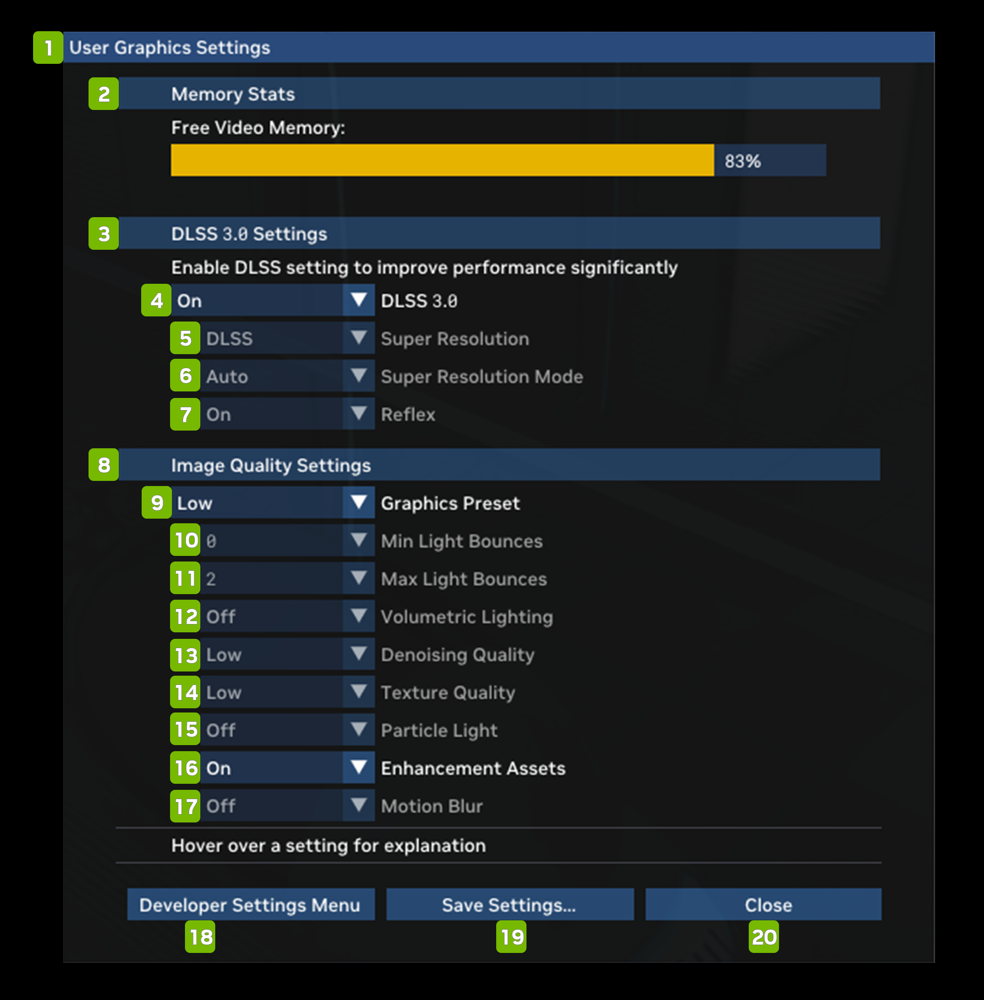

# User Graphic Settings

<table>
  <tr>
   <td><strong>Ref #</strong>
   </td>
   <td><strong>Option</strong>
   </td>
   <td><strong>Description</strong>
   </td>
  </tr>
  <tr>
   <td>1
   </td>
   <td>User Graphic Settings
   </td>
   <td><!--- Needs Description --->
   </td>
  </tr>
  <tr>
   <td>2
   </td>
   <td>Memory Stats
   </td>
   <td><!--- Needs Description --->
   </td>
  </tr>
  <tr>
   <td>3
   </td>
   <td>DLSS 3.0 Settings
   </td>
   <td><!--- Needs Description --->
   </td>
  </tr>
  <tr>
   <td>4
   </td>
   <td>DLSS 3.0 Switch
   </td>
   <td><!--- Needs Description --->
   </td>
  </tr>
  <tr>
   <td>5
   </td>
   <td>Super Resolution
   </td>
   <td><!--- Needs Description --->
   </td>
  </tr>
  <tr>
   <td>6
   </td>
   <td>Super Resolution Mode
   </td>
   <td><!--- Needs Description --->
   </td>
  </tr>
  <tr>
   <td>7
   </td>
   <td>Reflex
   </td>
   <td><!--- Needs Description --->
   </td>
  </tr>
  <tr>
   <td>8
   </td>
   <td>Image Quality Settings
   </td>
   <td><!--- Needs Description --->
   </td>
  </tr>
  <tr>
   <td>9
   </td>
   <td>Graphics Preset
   </td>
   <td><!--- Needs Description --->
   </td>
  </tr>
  <tr>
   <td>10
   </td>
   <td>Min Light Bounces
   </td>
   <td><!--- Needs Description --->
   </td>
  </tr>
  <tr>
   <td>11
   </td>
   <td>Max Light Bounces
   </td>
   <td><!--- Needs Description --->
   </td>
  </tr>
  <tr>
   <td>12
   </td>
   <td>Volumetric Lighting
   </td>
   <td><!--- Needs Description --->
   </td>
  </tr>
  <tr>
   <td>13
   </td>
   <td>Denoising Quality
   </td>
   <td><!--- Needs Description --->
   </td>
  </tr>
  <tr>
   <td>14
   </td>
   <td>Texture Quality
   </td>
   <td><!--- Needs Description --->
   </td>
  </tr>
  <tr>
   <td>15
   </td>
   <td>Particle Light
   </td>
   <td><!--- Needs Description --->
   </td>
  </tr>
  <tr>
   <td>16
   </td>
   <td>Enhancement Assets
   </td>
   <td><!--- Needs Description --->
   </td>
  </tr>
  <tr>
   <td>17
   </td>
   <td>Motion Blur
   </td>
   <td><!--- Needs Description --->
   </td>
  </tr>
  <tr>
   <td>18
   </td>
   <td>Developer Settings Menu
   </td>
   <td><!--- Needs Description --->
   </td>
  </tr>
  <tr>
   <td>19
   </td>
   <td>Save Settings…
   </td>
   <td><!--- Needs Description --->
   </td>
  </tr>
  <tr>
   <td>20
   </td>
   <td>Close
   </td>
   <td><!--- Needs Description --->
   </td>
  </tr>
</table>
