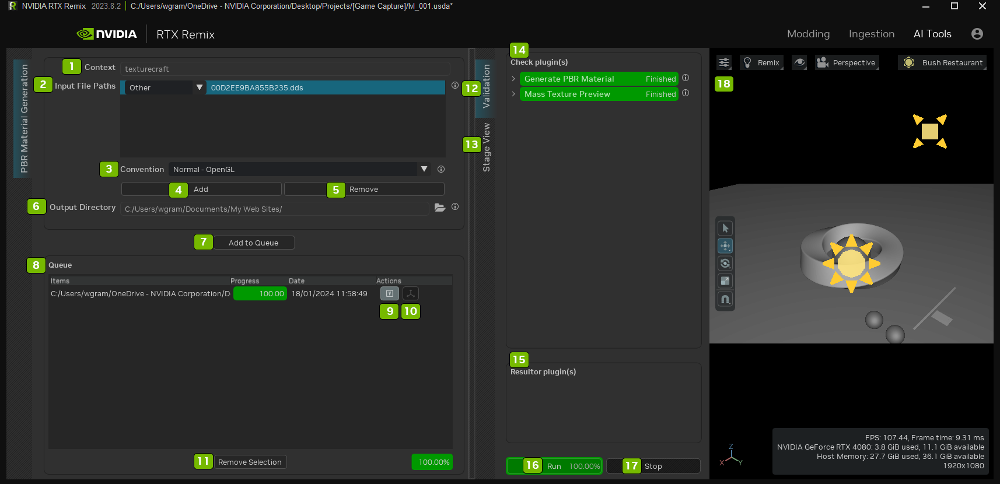

# AI Tools

| Ref   | Option                   | Description |
| :---: | :----------------------- | :----------- |
| 1     | Context                  | texturecraft |
| 2     | Input File Paths         | The list of files to import.  
The texture type is determined by analyzing the name of the texture file.  When there are different possible texture types in one file name, the tool prioritizes the last one it finds.  For instance, if a texture fiel is called 'T_Metal_01_Normal.png', the tool will pick 'Normal' as the texture type, even though there are other options ('Metal') in the name.  If the Tool picks the wrong texture type, you can fix it by choosing the correct texture type from the dropdown corresponding to the given texture file.  To see examples of names the tool looks for each texture type, however your mouse over the texture type dropdowns.  NOTE: There must be at least one file in the list for it to be valid.
 |
| 3     | Convention               | The default type for normals in this texture batch. 
The application creating normal maps usually specifies the convention. Selecting incorrectly may result in indentations instead of bumps on applied meshes.
 
Options Include: Normal - OpenGL, Normal - DirectX, Normal - Octahedral
 |
| 4     | Add                      | Open the File Browser to select Textures to use. |
| 5     | Remove                   | Select Textures in the File Path, then use this Remove button to remove that texture. |
| 6     | Output Directory         | The directory path to the folder where the ouptput textures will be saved. |
| 7     | Add to Queue             | Click this button to add the selected textures to the queue. |
| 8     | Queue                    | The list of textures added to the queue, their progress, when they were processed, and optional actions to take to view the texture. |
| 9     | Toggle on Validation Tab | Opens the Validation Panel |
| 10    | Show in Viewport         | Opens the selected texture in the viewport |
| 11    | Remove Selection         | Remove selected texture from the queue list |
| 12    | Validation Tab           | Validates the AI texture process |
| 13    | Stage View Tab           | Displays a list the files |
| 14    | Check Plugin(s)          | Validate that the textures have successfully processed or if they incurred errors |
| 15    | Resulter Plugin(s)       | Lists the Resulter Plugin(s) |
| 16    | Run                      | Run the selected texture |
| 17    | Stop                     | Stop the selected texture |
| 18    | Viewport                 | View and navigate around the textures in the Viewport |

***
 Need to leave feedback about the RTX Remix Documentation?  [Click here](https://github.com/NVIDIAGameWorks/rtx-remix/issues/new?assignees=nvdamien&labels=documentation%2Cfeedback%2Ctriage&projects=&template=documentation_feedback.yml&title=%5BDocumentation+feedback%5D%3A+) 
