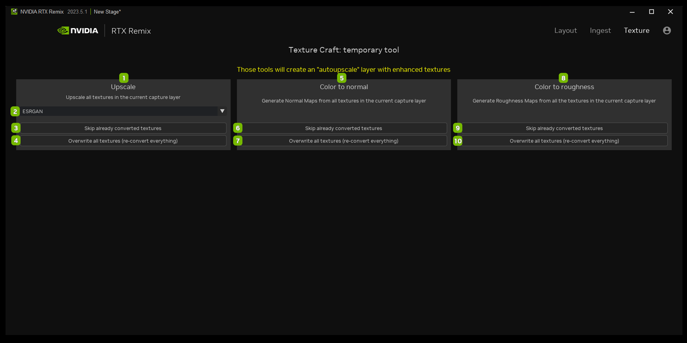

# AI Tools

## Texture Tab

<table>
  <tr>
   <td><strong>Ref</strong>
   </td>
   <td><strong>Option</strong>
   </td>
   <td><strong>Description</strong>
   </td>
  </tr>
  <tr>
   <td>1
   </td>
   <td>Upscale
   </td>
   <td>Upscale all textures in the current capture layer
   </td>
  </tr>
  <tr>
   <td>2
   </td>
   <td><!--- Needs Description --->
   </td>
   <td><!--- Needs Description --->
   </td>
  </tr>
  <tr>
   <td>3
   </td>
   <td>Skip already converted textures
   </td>
   <td><!--- Needs Description --->
   </td>
  </tr>
  <tr>
   <td>4
   </td>
   <td>Overwrite all textures (re-convert everything)
   </td>
   <td><!--- Needs Description --->
   </td>
  </tr>
  <tr>
   <td>5
   </td>
   <td>Color to Normal
   </td>
   <td>Generate Normal Maps from all textures in the current capture layer
   </td>
  </tr>
  <tr>
   <td>6
   </td>
   <td>Skip already converted textures
   </td>
   <td>
   </td>
  </tr>
  <tr>
   <td>7
   </td>
   <td>Overwrite all textures (re-convert everything)
   </td>
   <td><!--- Needs Description --->
   </td>
  </tr>
  <tr>
   <td>8
   </td>
   <td>Color to Roughness
   </td>
   <td>Generate Roughness Maps from all the textures in the current capture layer
   </td>
  </tr>
  <tr>
   <td>9
   </td>
   <td>Skip already converted textures
   </td>
   <td><!--- Needs Description --->
   </td>
  </tr>
  <tr>
   <td>10
   </td>
   <td>Overwrite all textures (re-convert everything)
   </td>
   <td><!--- Needs Description --->
   </td>
  </tr>
</table>

***
 Need to leave feedback about the RTX Remix Documentation?  [Click here](https://github.com/NVIDIAGameWorks/rtx-remix/issues/new?assignees=nvdamien&labels=documentation%2Cfeedback%2Ctriage&projects=&template=documentation_feedback.yml&title=%5BDocumentation+feedback%5D%3A+) 