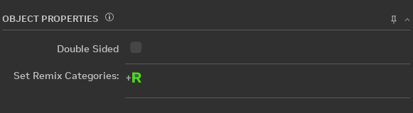
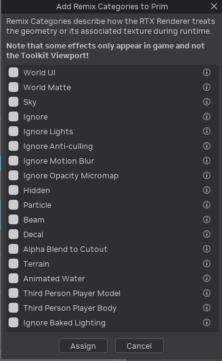
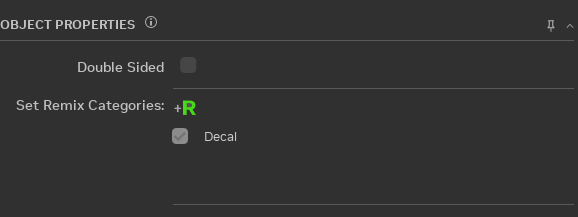

# Remix Categories

If you would like to set a Remix Category from the Toolkit interface, you can find the Set Remix Category button in the
Asset Replacements tab under the Oject Properties section.

To set a Remix Category, use the window that the button opens. You can select multiple categories to assign at a time.
Be aware that not all will behave correctly in the Toolkit viewport because they need the game engine to properly
render. Also note that some categories hide geometry from the viewport, so it will no longer be selectable in the
viewport.

The currently available Remix Categories in the Toolkit and their descriptions:

|       Display Name        | Attribubte Name                          | Description                                                                                                                                                                                                                                                                                                                                                                                                                                                                                               |
|:-------------------------:|:-----------------------------------------|:----------------------------------------------------------------------------------------------------------------------------------------------------------------------------------------------------------------------------------------------------------------------------------------------------------------------------------------------------------------------------------------------------------------------------------------------------------------------------------------------------------|
|         World UI          | remix_category:world_ui                  | Textures on draw calls that should be treated asscreen space UI elements. All exclusively UI-relatedtextures should be classified this way and doing soallows the UI to be rasterized on top of the ray tracedscene like usual. Note that currently the first UI textureencountered triggers RTX injection (though this may changein the future as this does cause issues with games thatdraw UI mid-frame).                                                                                              |
|        World Matte        | remix_category:world_matte               | Textures on draw calls that should be treated asworld space UI elements. Unlike typical UI texturesthis option is useful for improved rendering of UIelements which appear as part of the scene (movingaround in 3D space rather than as a screen space element).                                                                                                                                                                                                                                         |
|            Sky            | remix_category:sky                       | Geometries from draw calls used for the sky orare otherwise intended to be very far away fromthe camera at all times (no parallax). Any drawcalls using a geometry hash in this list will betreated as sky and rendered as such in a mannerdifferent from typical geometry. The geometry hashbeing used for sky detection is based off of the assethash rule.                                                                                                                                             |
|          Ignore           | remix_category:ignore                    | Textures on draw calls that should be ignored. Any drawcall using an ignore texture will be skipped and not raytraced, useful for removing undesirable rasterized effectsor geometry not suitable for ray tracing.                                                                                                                                                                                                                                                                                        |
|       Ignore Lights       | remix_category:ignore_lights             | Lights that should be ignored. Any matching light willbe skipped and not added to be ray traced.                                                                                                                                                                                                                                                                                                                                                                                                          |
|    Ignore Anti-culling    | remix_category:ignore_anti_culling       | Textures that are forced to extend life length whenanti-culling is enabled. Some games use different cullingmethods we can't fully match, use this option to manuallyadd textures to force extend their life when anti-culling fails.                                                                                                                                                                                                                                                                     |
|    Ignore Motion Blur     | remix_category:ignore_motion_blur        | Disable motion blur for meshes with specific texture.                                                                                                                                                                                                                                                                                                                                                                                                                                                     |
|  Ignore Opacity Micromap  | remix_category:ignore_opacity_micromap   | Textures to ignore when generating Opacity Micromaps.This generally does not have to be set and is only usefulfor black listing problematic cases for Opacity Micromapusage.                                                                                                                                                                                                                                                                                                                              |
|          Hidden           | remix_category:hidden                    | Textures on draw calls that should be hidden from rendering,but not totally ignored. This is similar to rtx.ignoreTexturesbut instead of completely ignoring such draw calls they areonly hidden from rendering, allowing for the hidden objects tostill appear in captures. As such, this is mostly only adevelopment tool to hide objects during development untilthey are properly replaced, otherwise the objects should beignored with rtx.ignoreTextures instead for betterperformance.             |
|         Particle          | remix_category:particle                  | Textures on draw calls that should be treatedas particles. When objects are marked as particlesmore approximate rendering methods are leveraged,allowing for more efficient and typically betterlooking particle rendering. Generally anybillboard-like blended particle objects in the originalapplication should be classified this way.                                                                                                                                                                |
|           Beam            | remix_category:beam                      | Textures on draw calls that are already particles oremissively blended and have beam-like geometry.To handle cases where a regular billboard may not apply, adifferent beam mode is used to treat objects as more ofa cylindrical beam and re-orient around its main spanning axis,allowing for better rendering of these beam-like effect objects.                                                                                                                                                       |
|           Decal           | remix_category:decal_Static              | Textures on draw calls used for static geometricdecals or decals with complex topology. These materialswill be blended over the materials underneath them whendecal material blending is enabled. A small configurableoffset is applied to each flat/co-planar part of these decalsto prevent coplanar geometric cases (which poses problemsfor ray tracing).                                                                                                                                             |
|   Alpha Blend to Cutout   | remix_category:alpha_blend_to_cutout     | When an object is added to the cutout textures list itwill have a cutout alpha mode forced on it, using thisvalue for the alpha test. This is meant to improve thelook of some legacy mode materials using low-resolutiontextures and alpha blending in Remix. Such objects aregenerally better handled with actual replacement assetsusing fully opaque geometry replacements or alpha cutoutwith higher resolution textures, so this should only berelied on until proper replacements can be authored. |
|          Terrain          | remix_category:terrain                   | Albedo textures that are baked blended together to forma unified terrain texture used during ray tracing. Putalbedo textures into this category if the game rendersterrain as a blend of multiple textures.                                                                                                                                                                                                                                                                                               |
|      Animated Water       | remix_category:animated_water            | Textures on draw calls to be treated as "animated water".Objects with this flag applied will animate their normalsto fake a basic water effect based on the layered watermaterial parameters, and only whenrtx.opaqueMaterial.layeredWaterNormalEnable is set to true.Should typically be used on static water planes that theoriginal application may have relied on shaders to animatewater on.                                                                                                         |
| Third Person Player Model | remix_category:third_person_player_model | Treated as a third person model to be used forshadows, but not rendered.                                                                                                                                                                                                                                                                                                                                                                                                                                  |
| Third Person Player Body  | remix_category:third_person_player_body  | Treated as a third person model to be used forshadows, but not rendered.                                                                                                                                                                                                                                                                                                                                                                                                                                  |
|   Ignore Baked Lighting   | remix_category:ignore_baked_lighting     | Textures for which to ignore two types of bakedlighting. Texture Factors and Vertex Color. TextureFactor disablement: Using this feature on selectedtextures will eliminate the texture factors.Vertex Color disablement: Using this feature on selectedtextures will eliminate the vertex colors. Note, enablingthis setting will automatically disable multiple-stagetexture factor blendings for the selected textures.                                                                                |

|   Ignore Transparency Layer   | remix_category:ignore_transparency_layer     | Textures on draw calls that should be ignored when rendering transparency layers.                                                                                |

|   Particle Emitter   | remix_category:particle_emitter     | Geometry on draw calls that should be treated as particle emitters.                                                                                |

|   Ignore Alpha Channel   | remix_category:ignore_alpha_channel     | A flag to ignore the alpha channel of the colormap on the opaque material. Should only be used for debugging or development.                                                                                |

Once assigned, the list will be updated in the Object Properties section:

