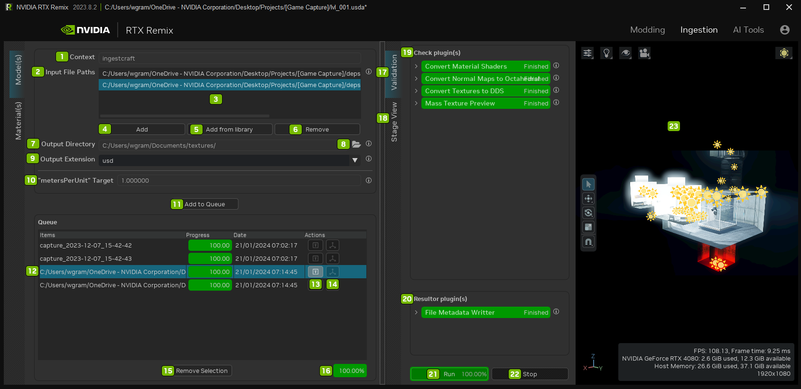
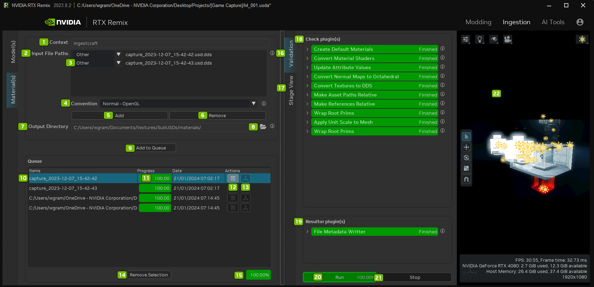

# Ingest Tab

## Model Ingestion

> NOTE: For the Input File Paths to be considered valid during asset import, the list must include at least one file.

| Ref | Option | Description |
|:---:|:---|:---|
| 1 | Context | Ingestcraft |
| 2 | Input File Paths | The list of files to import as USD files |
| 3 | List of Path(s) Field(s) | The list of files to import as USD files |
| 4 | Add | Add Files to the directory path field |
| 5 | Add from Library | Opens the directory of Library Assets |
| 6 | Remove | Remove Files from the directory path field |
| 7 | Output Directory | Directory to import the converted input files to |
| 8 | Opens File Explorer |
| 9 | Output Extension | USD file extension to use for the converted input file |
| 10 | Apply Unit Scale to Mesh | Applies the “metersPerUnit” scaling to a mesh’s XForm scale |
| 11 | Add to Queue | Adds imported assets from the Input File Path and places them in the Output Directory |
| 12 | Selected Asset |
| 13 | Toggle Validation Tab | Opens or Closes the Validation Tab |
| 14 | Show in Viewport | Opens or Closes the Viewport |
| 15 | Remove Selection | Remove selected asset from Queue |
| 16 | Queue Ingestion Progress Bar | Percentage of completion |
| 17 | Validation Tab | Validates the imported Assets |
| 18 | Stage View Tab | Lists the assets in the stage |
| 19 | Check Plugin(s) | Checks the Plugins used during Ingestion |
| 20 | Resulter Plugin(s) | Checks resulter plugins used during Ingestion |
| 21 | Run | Run the Model Ingestion |
| 22 | Stop | Stop the Model Ingestion |
| 23 | Viewport | View the Model Ingestion |

## Material Ingestion

| Ref | Option | Description |
|:---:|:---|:---|
| 1 | Context | Ingestcraft |
| 2 | Input File Paths | The list of files to import as USD files |
| 3 | Material Type Dropdown | Select the material type from the list.  
Options include: Other, Albedo, Emissive Mask, Metallic, Normal - OpenGL, Normal - DirectX, Normal - Octahedral, or Roughness
 |
| 4 | Convention Dropdown | Select the default convention type for 
Normals to use in batch: Normal - OpenGL, Normal - DirectX, or Normal - Octahedral |
| 5 | Add | Add Files to the directory path field |
| 6 | Remove | Remove Files from the directory path field |
| 7 | Output Directory | Directory to import the converted input files to |
| 8 | Opens File Explorer |
| 9 | Add to Queue | Adds imported assets from the Input File Path and places them in the Output Directory |
| 10 | Selected Asset |
| 11 | Queue Asset Ingestion Progress Bar | Percentage of completion |
| 12 | Toggle Validation Tab | Opens or Closes the Validation Tab |
| 13 | Show in Viewport | Opens or Closes the Viewport |
| 14 | Remove Selection | Remove selected asset from Queue |
| 15 | Queue Ingestion Progress Bar | Percentage of completion |
| 16 | Validation Tab | Validates the imported Assets |
| 17 | Stage View Tab | Lists the assets in the stage |
| 18 | Check Plugin(s) | Checks the Plugins used during Ingestion |
| 19 | Resulter Plugin(s) | Checks resulter plugins used during Ingestion |
| 20 | Run | Run the Model Ingestion |
| 21 | Stop | Stop the Model Ingestion |
| 22 | Viewport | View the Model Ingestion |

***
 Need to leave feedback about the RTX Remix Documentation?  [Click here](https://github.com/NVIDIAGameWorks/rtx-remix/issues/new?assignees=nvdamien&labels=documentation%2Cfeedback%2Ctriage&projects=&template=documentation_feedback.yml&title=%5BDocumentation+feedback%5D%3A+) 
