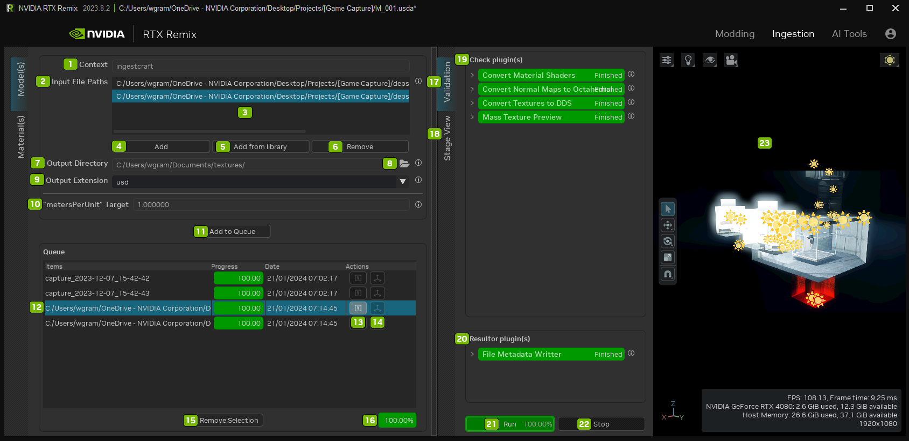
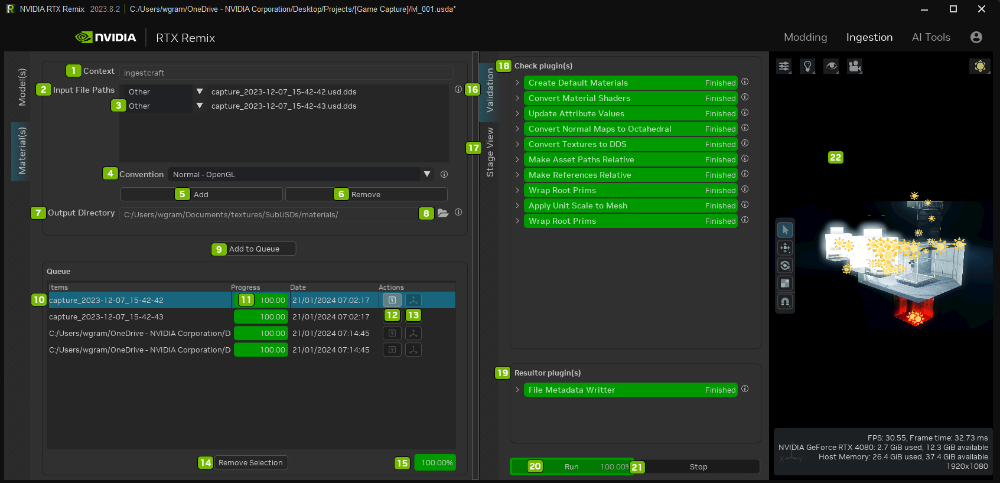

# Ingest Tab

Both ingestion modes include a **Max Concurrent Texture Conversions** field. This shared value limits how many DDS
and octahedral texture conversions can run at the same time. The default is `2`; lower it if ingestion stalls or runs
out of VRAM. Set the value before adding assets to the queue.

In **Model(s)**, the field appears below **Output Extension**. In **Material(s)**, it appears below **Output
Directory**.

## Model Ingestion

The **Normal Map Convention** option appears below **Asset Scale Factor**. Leave it set to **Preserve Imported** to
keep the conventions authored by the model importer, or override the model ingestion batch with **Normal - OpenGL**,
**Normal - DirectX**, or **Normal - Octahedral**. This setting applies to normal-map textures referenced by imported
models, not mesh normals. Changing the convention requires ingesting the models again.

| Ref | Option                       | Description                                                                           |
|:---:|:-----------------------------|:--------------------------------------------------------------------------------------|
|  1  | Context                      | Ingestcraft                                                                           |
|  2  | Input File Paths             | The list of files to import as USD files                                              |
|  3  | List of Path(s) Field(s)     | The list of files to import as USD files                                              |
|  4  | Add                          | Add Files to the directory path field                                                 |
|  5  | Add from Library             | Opens the directory of Library Assets                                                 |
|  6  | Remove                       | Remove Files from the directory path field                                            |
|  7  | Output Directory             | Directory to import the converted input files to                                      |
|  8  | Opens File Explorer          |
|  9  | Output Extension             | USD file extension to use for the converted input file                                |
|  —  | Max Concurrent Texture Conversions | Limits concurrent DDS and octahedral texture conversions to the shared value     |
| 10  | Apply Unit Scale to Mesh     | Applies the “metersPerUnit” scaling to a mesh’s XForm scale                           |
| 11  | Add to Queue                 | Adds imported assets from the Input File Path and places them in the Output Directory |
| 12  | Selected Asset               |
| 13  | Toggle Validation Tab        | Opens or Closes the Validation Tab                                                    |
| 14  | Show in Viewport             | Opens or Closes the Viewport                                                          |
| 15  | Remove Selection             | Remove selected asset from Queue                                                      |
| 16  | Queue Ingestion Progress Bar | Percentage of completion                                                              |
| 17  | Validation Tab               | Validates the imported Assets                                                         |
| 18  | Stage View Tab               | Lists the assets in the stage                                                         |
| 19  | Check Plugin(s)              | Checks the Plugins used during Ingestion                                              |
| 20  | Resulter Plugin(s)           | Checks resulter plugins used during Ingestion                                         |
| 21  | Run                          | Run the Model Ingestion                                                               |
| 22  | Stop                         | Stop the Model Ingestion                                                              |
| 23  | Viewport                     | View the Model Ingestion                                                              |

## Material Ingestion

The **Normal Map Convention** option appears with the material import options below the file-selection and output
controls. It sets the default convention used when normal-map textures are added or discovered in the current batch.
Material ingestion offers **Normal - OpenGL**, **Normal - DirectX**, and **Normal - Octahedral**.

| Ref | Option                             | Description                                                                                                                                                                   |
|:---:|:-----------------------------------|:------------------------------------------------------------------------------------------------------------------------------------------------------------------------------|
|  1  | Context                            | Ingestcraft                                                                                                                                                                   |
|  2  | Input File Paths                   | The list of files to import as USD files                                                                                                                                      |
|  3  | Material Type Dropdown             | Select the material type from the list.  
Options include: Other, Albedo, Emissive Mask, Metallic, Normal - OpenGL, Normal - DirectX, Normal - Octahedral, or Roughness
 |
|  4  | Normal Map Convention              | Select the default convention for normal-map textures in the batch: Normal - OpenGL, Normal - DirectX, or Normal - Octahedral                                                |
|  5  | Add                                | Add Files to the directory path field                                                                                                                                         |
|  6  | Remove                             | Remove Files from the directory path field                                                                                                                                    |
|  7  | Output Directory                   | Directory to import the converted input files to                                                                                                                              |
|  8  | Opens File Explorer                |
|  —  | Max Concurrent Texture Conversions | Limits concurrent DDS and octahedral texture conversions to the shared value                                                                                                  |
|  9  | Add to Queue                       | Adds imported assets from the Input File Path and places them in the Output Directory                                                                                         |
| 10  | Selected Asset                     |
| 11  | Queue Asset Ingestion Progress Bar | Percentage of completion                                                                                                                                                      |
| 12  | Toggle Validation Tab              | Opens or Closes the Validation Tab                                                                                                                                            |
| 13  | Show in Viewport                   | Opens or Closes the Viewport                                                                                                                                                  |
| 14  | Remove Selection                   | Remove selected asset from Queue                                                                                                                                              |
| 15  | Queue Ingestion Progress Bar       | Percentage of completion                                                                                                                                                      |
| 16  | Validation Tab                     | Validates the imported Assets                                                                                                                                                 |
| 17  | Stage View Tab                     | Lists the assets in the stage                                                                                                                                                 |
| 18  | Check Plugin(s)                    | Checks the Plugins used during Ingestion                                                                                                                                      |
| 19  | Resulter Plugin(s)                 | Checks resulter plugins used during Ingestion                                                                                                                                 |
| 20  | Run                                | Run the Model Ingestion                                                                                                                                                       |
| 21  | Stop                               | Stop the Model Ingestion                                                                                                                                                      |
| 22  | Viewport                           | View the Model Ingestion                                                                                                                                                      |

***
 Need to leave feedback about the RTX Remix Documentation?  [Click here](https://github.com/NVIDIAGameWorks/rtx-remix/issues/new?assignees=nvdamien&labels=documentation%2Cfeedback%2Ctriage&projects=&template=documentation_feedback.yml&title=%5BDocumentation+feedback%5D%3A+) 
