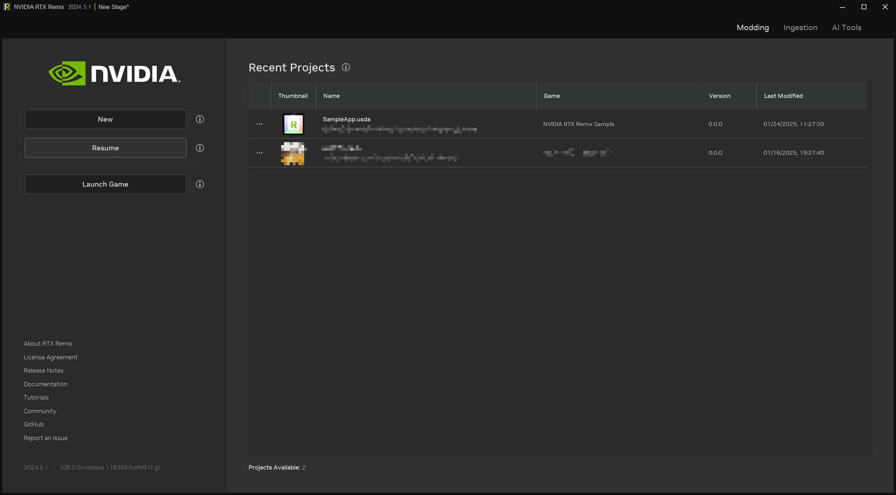

# Remix Toolkit Interface

## Launch Screen

| Option	            | Description                                                                      |
|:-------------------|:---------------------------------------------------------------------------------|
| New	               | Launch the Project Wizard to Create or Open a project                            |
| Resume	            | Open the project your are currently working on                                   |
| Quick Start Guide	 | Open the quick start guide documentation page in your browser                    |
| Recent Projects	   | List of Recently Opened Project(s)                                               |
| Modding	           | Opens the Modding Tab when a project is opened, otherwise the home page is shown |
| Ingest	            | Opens the Ingestion Tab                                                          |
| AI Tools	          | Opens the AI Tools Tab                                                           |

***
 Need to leave feedback about the RTX Remix Documentation?  [Click here](https://github.com/NVIDIAGameWorks/rtx-remix/issues/new?assignees=nvdamien&labels=documentation%2Cfeedback%2Ctriage&projects=&template=documentation_feedback.yml&title=%5BDocumentation+feedback%5D%3A+) 
