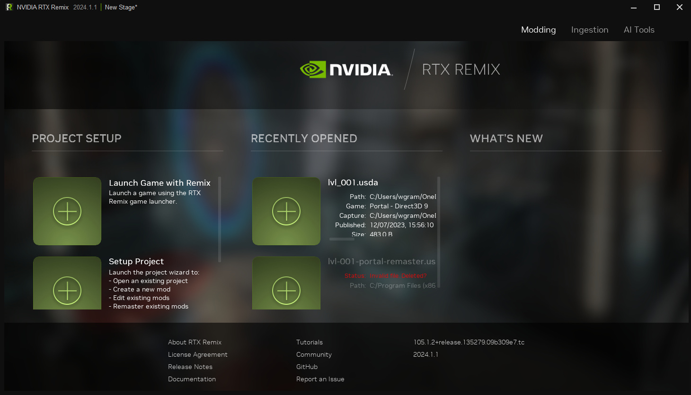

# Remix Toolkit Interface

## Launch Screen

| Option	| Description |
|:------|:------|
| Launch Game with Remix	| Open the file browser to select your game .EXE file |
| Project Setup	| Project Setup Section |
| Setup Project	| Create a project to be remastered |
| Resume Current Project	| Open a project your are currently working on |
| Recently Opened	| List of Recently Opened Project(s) |
| What’s New	| Newest updates to the software |
| Layout	| Opens the Layout Tab |
| Ingest	| Opens the Ingest Tab |
| Texture	| Opens the Texture Tab |
| Profile	| Opens the User Profile |

***
 Need to leave feedback about the RTX Remix Documentation?  [Click here](https://github.com/NVIDIAGameWorks/rtx-remix/issues/new?assignees=nvdamien&labels=documentation%2Cfeedback%2Ctriage&projects=&template=documentation_feedback.yml&title=%5BDocumentation+feedback%5D%3A+) 