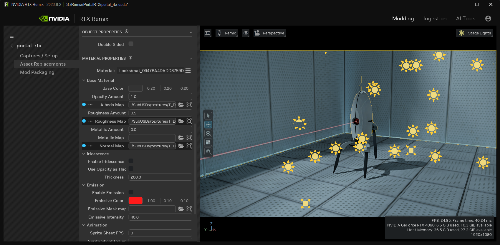

# Layout Tab

## Mod Setup

| Ref | Option                 | Description                                                                                                                                                    |
|:---:|:-----------------------|:---------------------------------------------------------------------------------------------------------------------------------------------------------------|
|  1  | Hamburger Menu         | Unload Stage, Reload Stage, Save (Ctrl + S), Save As (Ctrl + Shift + S), Undo (Ctrl + Z), Redo (Ctrl + Y), Preferences, Feature Flags`*`, Show Logs`**`, About |
|  2  | Project Title          |
|  3  | Mod Setup Tab          | Set the details of your mod project                                                                                                                            |
|  4  | Asset Replacements Tab |
|  5  | Mod Packaging Tab      |
|  7  | Open Project Wizard    | Wizard	Launches the [Project Wizard](remix-toolkitinterface-projectwizard.md) Panel                                                                            |
|  8  | Capture File           | Load the captured game file scene                                                                                                                              |
|  9  | Capture File Location  | Directory location of the captured file                                                                                                                        |
| 10  | Loaded Capture         |
| 11  | Replaces Prims         | Background color indicates the percent of the replacements (Red = 0%, Green = 100%)                                                                            |
| 12  | Total Prims in Capture | Background color indicates the percent of the replacements (Red = 0%, Green = 100%)                                                                            |
| 13  | Capture Details        | Displays details from the captured layer file loaded into the stage                                                                                            |

`*` Feature Flags: Some experimental features can be enabled early by opening the Feature Flags menu and enabling the various features.

    **NOTE:** Experimental features may not be fully stable and may not be completed yet.

`**` Show Logs: If you experience an issue with the Toolkit, the logs most likely contain the information required to diagnose the problem. If you create a GitHub ticket, please attach the related logs to your ticket.

| Ref | Option                     | Description                                                    |
|:---:|:---------------------------|:---------------------------------------------------------------|
|  1  | Mod File                   | Modify the captured file                                       |
|  2  | Load Existing Mod File     | Load an existing mod file                                      |
|  3  | Create a New Mod File      | Create a new mod file                                          |
|  4  | Current Path File Location | Directory location of the current file                         |
|  5  | Mod Details                | Displays details from the mod layer file loaded into the stage |

## Asset Replacement

| Ref | Option                    | Description                                                 |
|:---:|:--------------------------|:------------------------------------------------------------|
|  1  | Layers Panel              | Visual Representation of the USD layers in the mod          |
|  2  | Bookmarks Panel           | A tree of all the bookmark collections and bookmarked items |
|  3  | Selection History Panel   | A list of recent assets that were selected                  |
|  4  | Selection Panel           | Displays the Mesh properties of the selected Mesh           |
|  5  | Object Properties Panel   | Mesh properties of the selected mesh                        |
|  6  | Material Properties Panel | Material properties of the selected mesh                    |

**Layers Panel**

| Ref | Option                   |
|:---:|:-------------------------|
|  1  | Selected Layer           |
|  2  | Delete, Lock, Mute, Save |
|  3  | Create or Insert Layer   |

> Note: USD parent layers combine children layers, giving them more influence.

* You can rearrange layers by dragging and dropping them to change their hierarchy.
* Clicking the layer icon next to a layer allows you to set it as the active edit target.
* To delete a layer, click the Delete button next to it.
* Lock a layer by clicking the lock button next to it.
* Mute a layer by clicking the Mute button next to it.
* Save a layer by clicking the Save button, provided it's not locked or muted.
* Create new layers by clicking the Create button at the bottom of the widget.
* Import existing layers by clicking the Import button at the bottom of the widget.

**Bookmarks Panel**

| Ref | Option                           |
|:---:|:---------------------------------|
|  1  | Selected Bookmark                |
|  2  | Delete, Add, or Empty Collection |

* When you create a bookmark, it will automatically be grouped under the currently selected collection.
* Both Collections and Items are sorted alphabetically for easy organization.
* You can rearrange both items and collections by dragging and dropping them to change their order.
* To rename a collection, just double-click on it.
* Easily manage items in collections by using the add/remove buttons next to the desired collection.
* If you select an item in the viewport, the bookmark selection will change if that item is bookmarked.
* Similarly, selecting an item in the bookmarks will highlight the associated item in the viewport.

**Selection History Panel**

* The history keeps track of your last 200 selections.
* Just click on an item in the history, and it will be selected in the viewport.

**Selection Panel**

| Ref | Option                                                      |
|:---:|:------------------------------------------------------------|
|  1  | Selected Asset                                              |
|  2  | Delete or Duplicate Reference                               |
|  3  | Create a new Reference to another USD file in the same prim |
|  4  | Create a new Stage Light                                    |
|  5  | Focus on the Instance                                       |

* The icons in the selection have the following meanings: Capture Mexh Prim, Reference Mesh USD File, Mesh Definition
* Displays different properties based on what you select in the panel above. If the panel is hidden, nothing will be shown.
* A blue circle indicates that the property has a value different from the default.
* A darker background means the property has override(s) from layer(s).
* You can remove overrides. The list shows overrides from the strongest layer (top) to the weaker layer (bottom).

**Object Properties Panel**

| Ref | Option                            |
|:---:|:----------------------------------|
|  1  | Reference USD file path           |
|  2  | Open the File Explorer            |
|  3  | Referenced Prim                   |
|  4  | Use default Prim instead checkbox |

* Displays different properties based on what you select in the panel above. If the panel is hidden, nothing will be shown.
* A blue circle indicates that the property has a different value than the default.
* A darker background means the property has override(s) from layer(s).
* You can remove overrides. The list shows overrides from the strongest layer (top) to the weaker layer (bottom).

**Material Properties Panel**

* Displays different properties based on what you select in the panel above. If the panel is hidden, nothing will be shown.
* A blue circle indicates that the property has a different value than the default.
* A darker background means the property has override(s) from layer(s).
* You can remove overrides. The list shows overrides from the strongest layer (top) to the weaker layer (bottom).

## Mod Packaging

| Ref | Option                                      | Description                                                                                                                                                                           |
|:---:|:--------------------------------------------|:--------------------------------------------------------------------------------------------------------------------------------------------------------------------------------------|
|  1  | Mod Details Panel                           | The packaged mod name and any additional details about the mod                                                                                                                        |
|  2  | Name                                        | Mod Name                                                                                                                                                                              |
|  3  | Version                                     | Mod Version                                                                                                                                                                           |
|  4  | Details                                     | Information about the Mod                                                                                                                                                             |
|  5  | Output Directory Panel                      | The designated package output directory denotes the precise path to which the amassed assets will be systematically copied                                                            |
|  6  | Override Output Path Checkbox               | This checkbox determines whether to use the default packaging directory or implement a user-specified override                                                                        |
|  7  | Open File Explorer                          | Open the File Directory                                                                                                                                                               |
|  8  | Open in Explorer                            | This option facilitates the opening of the Packaging Directory; however, it may not always be available.                                                                              |
|  9  | Selected Layers Panel                       | This panel provides a comprehensive list of layers that are eligible for packaging                                                                                                    |
| 10  | Checked or Unchecked Layers                 | Be cautious when dealing with unchecked layers, as their exclusion may impact the integrity of the mod. Unchecked layers will not be copied into the package                          |
| 11  | Redirect External Mod Dependencies Checkbox | This checkbox governs the decision to either redirect external mod dependencies or replicate them within the current mod. Careful consideration is advised when making this selection |
| 12  | Package Button                              | Start the Packaging Process                                                                                                                                                           |

**Mod Details Panel**

* **Name:** This identifier will be displayed in the Runtime Mod list, especially when Multi-Mod functionality is supported.
* **Version:** The specified version will be strictly enforced by the Runtime system, particularly for Multi-Mod Dependencies.
* **Details:** In this section, you can provide comprehensive information about the mod you are packaging. This field allows for arbitrary messages, accommodating diverse content as needed.

**Selected Layers Panel**

The panel gathers dependencies of the selected layers for packaging the mod in a complete way.

* Only choose the layers you've edited.
* Dependencies should be packaged separately.

**Redirect External Mod Dependencies Checkbox**

* **Redirect:** This option alters "./deps/mods/<Name>" to "../mods/<Name>."
* **Copy:** When selected, this function copies the symlink as an actual file into the packaging directory.

### Fixing Unresolved Assets

If unresolved assets are detected during the packaging process, the Toolkit will prompt you to resolve them.

| Option          | Description                                                                                                                                                   |
|:----------------|:--------------------------------------------------------------------------------------------------------------------------------------------------------------|
| Prim Path       | The prim path where the unresolved asset was detected                                                                                                         |
| Unresolved Path | The relative path to the unresolved asset. Hover over the path to see the full path.                                                                          |
| Updated Path    | The relative path to the updated (fixed) asset. Hover over the path to see the full path.                                                                     |
| Action          | The action executed to fix the reference (Ignore, Removed Reference, or Replace Asset). Hover over the information icon to get more details about the action. |
| Ignore All      | Set all the unresolved assets to the ignore action.                                                                                                           |
| Remove All      | Set all the unresolved assets to the remove reference action.                                                                                                 |
| Scan Directory  | Open a file picker and select the directory to scan. The unresolved assets found within the scanned directory will be set to replace asset.                   |
| Cancel          | Close the window without applying any actions.                                                                                                                |
| Retry Packaging | Apply the actions and restart the packaging process.                                                                                                          |

***
 Need to leave feedback about the RTX Remix Documentation?  [Click here](https://github.com/NVIDIAGameWorks/rtx-remix/issues/new?assignees=nvdamien&labels=documentation%2Cfeedback%2Ctriage&projects=&template=documentation_feedback.yml&title=%5BDocumentation+feedback%5D%3A+) 
