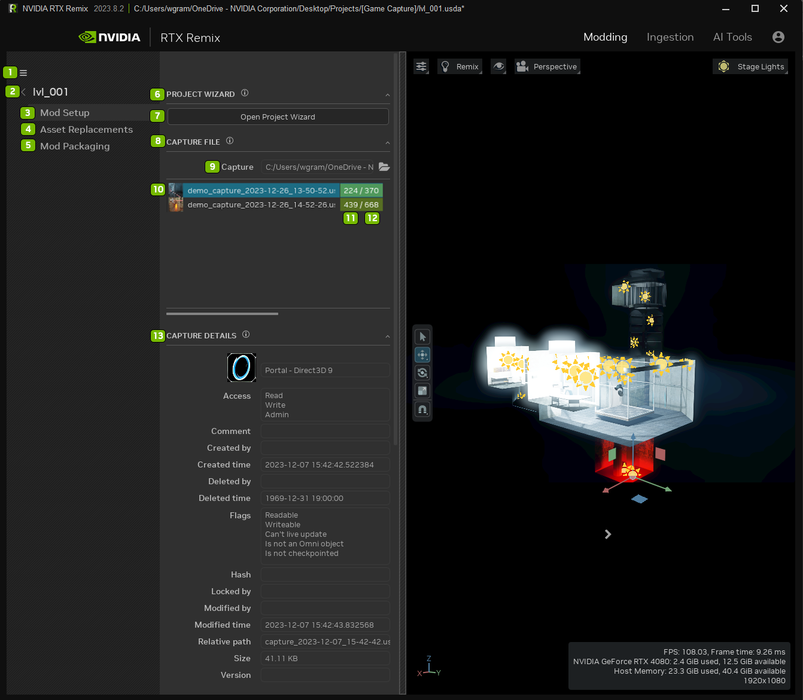
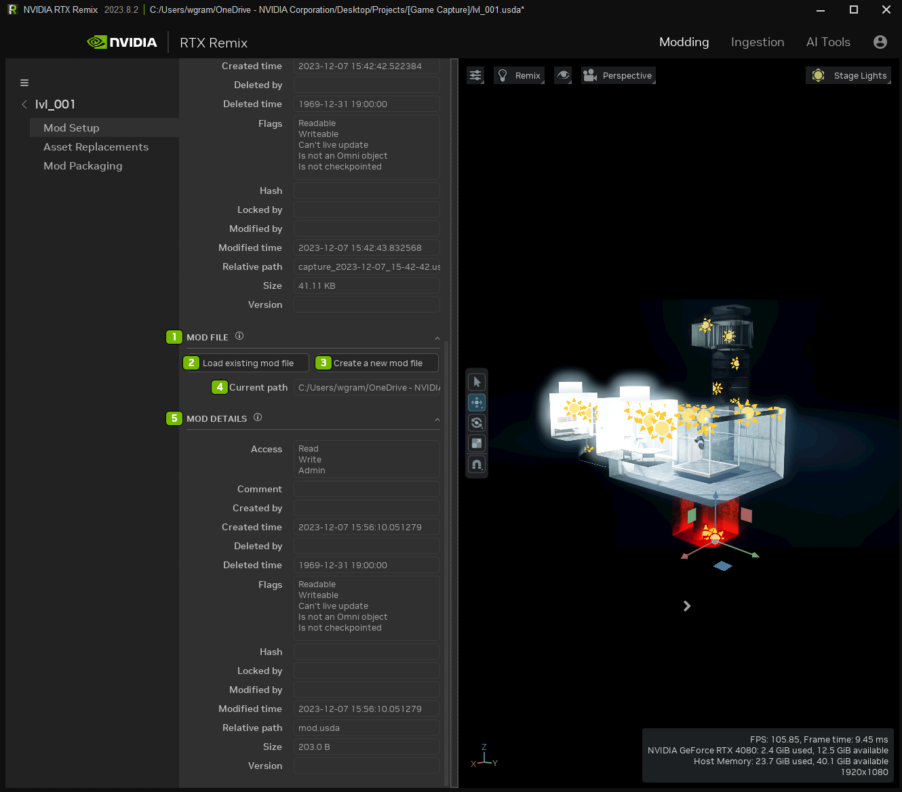
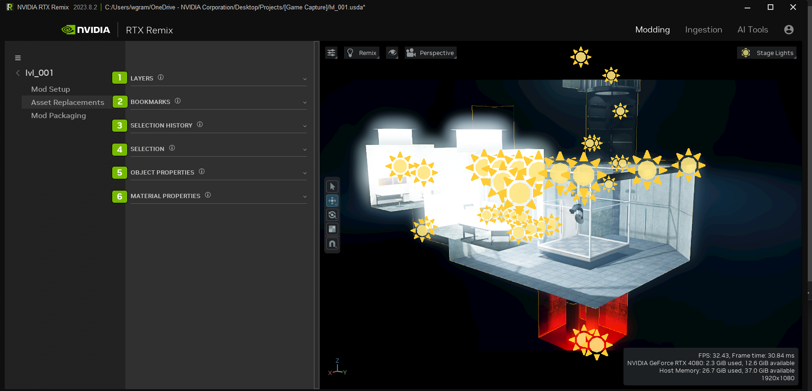
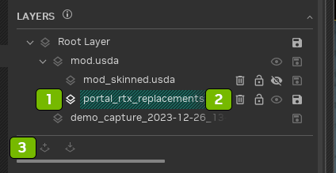
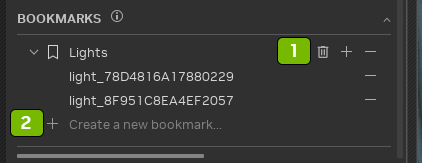
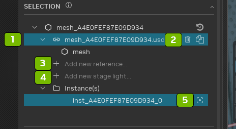
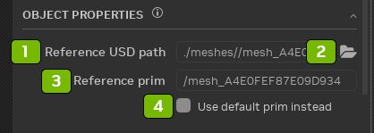
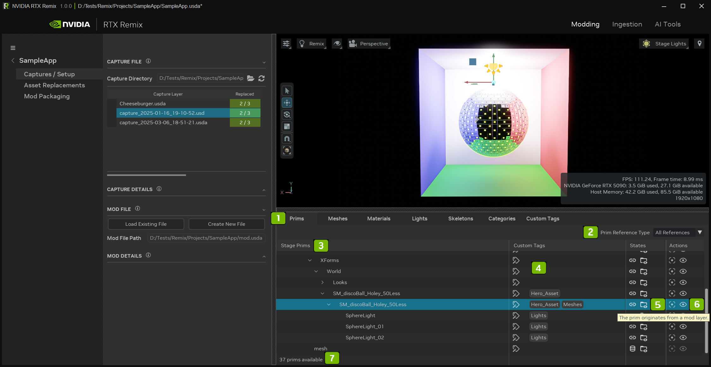
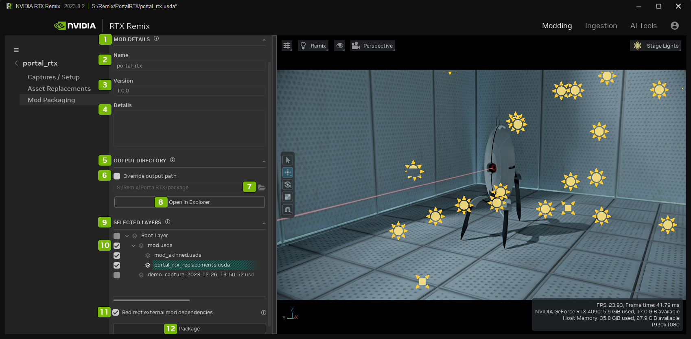
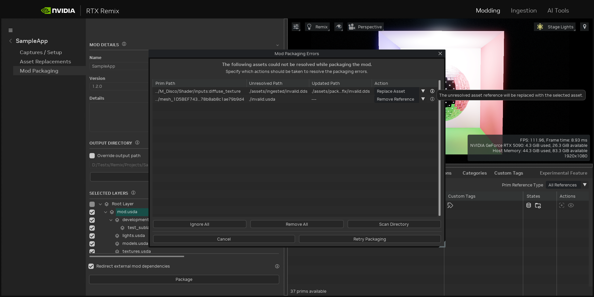

# Layout Tab

## Mod Setup

| Ref | Option                 | Description                                                                                                                                                                        |
|:---:|:-----------------------|:-----------------------------------------------------------------------------------------------------------------------------------------------------------------------------------|
|  1  | Hamburger Menu         | Close Project`*` Save (Ctrl + S) Save As (Ctrl + Shift + S) Undo (Ctrl + Z) Redo (Ctrl + Y) Preferences Optional Features`**` Show Logs`***` About |
|  2  | Project Title          |
|  3  | Mod Setup Tab          | Set the details of your mod project                                                                                                                                                |
|  4  | Asset Replacements Tab |
|  5  | Mod Packaging Tab      |
|  7  | Open Project Wizard    | Wizard Launches the [Project Wizard](remix-toolkitinterface-projectwizard.md) Panel                                                                                                |
|  8  | Capture File           | Load the captured game file scene                                                                                                                                                  |
|  9  | Capture File Location  | Directory location of the captured file                                                                                                                                            |
| 10  | Loaded Capture         |
| 11  | Replaces Prims         | Background color indicates the percent of the replacements (Red = 0%, Green = 100%)                                                                                                |
| 12  | Total Prims in Capture | Background color indicates the percent of the replacements (Red = 0%, Green = 100%)                                                                                                |
| 13  | Capture Details        | Displays details from the captured layer file loaded into the stage                                                                                                                |

**NOTES:**

- `*` **Close Project:** Closing the project will unload the stage and free resources for other tasks such as ingestion
  or AI Tools.
- `**` **Optional Features:** Some features may affect the performance of the RTX Remix Toolkit, so they can be
  selectively disabled using the Optional Features window. Any modifications to the enable-state of feature will persist
  through restarts of the application.
- `***` **Show Logs:** If you experience an issue with the Toolkit, the logs most likely contain the information
  required to diagnose the problem. If you create a GitHub ticket, please attach the related logs to your ticket.

| Ref | Option                     | Description                                                    |
|:---:|:---------------------------|:---------------------------------------------------------------|
|  1  | Mod File                   | Modify the captured file                                       |
|  2  | Load Existing Mod File     | Load an existing mod file                                      |
|  3  | Create a New Mod File      | Create a new mod file                                          |
|  4  | Current Path File Location | Directory location of the current file                         |
|  5  | Mod Details                | Displays details from the mod layer file loaded into the stage |

## Asset Replacement

| Ref | Option                    | Description                                                 |
|:---:|:--------------------------|:------------------------------------------------------------|
|  1  | Layers Panel              | Visual Representation of the USD layers in the mod          |
|  2  | Bookmarks Panel           | A tree of all the bookmark collections and bookmarked items |
|  3  | Selection History Panel   | A list of recent assets that were selected                  |
|  4  | Selection Panel           | Displays the Mesh properties of the selected Mesh           |
|  5  | Object Properties Panel   | Mesh properties of the selected mesh                        |
|  6  | Material Properties Panel | Material properties of the selected mesh                    |

**Layers Panel**

| Ref | Option                   |
|:---:|:-------------------------|
|  1  | Selected Layer           |
|  2  | Delete, Lock, Mute, Save |
|  3  | Create or Insert Layer   |

**Bookmarks Panel**

| Ref | Option                           |
|:---:|:---------------------------------|
|  1  | Selected Bookmark                |
|  2  | Delete, Add, or Empty Collection |

**Selection Panel**

| Ref | Option                                                      |
|:---:|:------------------------------------------------------------|
|  1  | Selected Asset                                              |
|  2  | Delete or Duplicate Reference                               |
|  3  | Create a new Reference to another USD file in the same prim |
|  4  | Create a new Stage Light                                    |
|  5  | Focus on the Instance                                       |

| Ref | Option                            |
|:---:|:----------------------------------|
|  1  | Reference USD file path           |
|  2  | Open the File Explorer            |
|  3  | Referenced Prim                   |
|  4  | Use default Prim instead checkbox |

## Stage Manager

| Ref | Option                   | Description                                                                                                                                                                                                                                    |
|:---:|:-------------------------|:-----------------------------------------------------------------------------------------------------------------------------------------------------------------------------------------------------------------------------------------------|
|  1  | **Tabs**                 | These allow you to switch between different views of your stage data. Each tab presents information in a unique way, helping you focus on specific aspects of your stage. Click any tab to update the Stage Manager's content.                 |
|  2  | **Filters**              | Use these to refine the data displayed in each tab. Filters can vary depending on the tab you're using, giving you more control over what you see. This helps you narrow down the information to what's most relevant.                         |
|  3  | **Columns**              | Each tab may have multiple columns, each serving a different purpose. This helps organize the data in a way that's easy to understand and work with, making it simpler to manage your stage.                                                   |
|  4  | **Widget**               | These are interactive elements that populate the columns. They can display information or trigger actions, making it easier to manage your stage. Widgets are customizable to fit your specific needs.                                         |
|  5  | **State Widget**         | An example of a widget that shows detailed information about a selected prim when you hover over it. This helps you quickly access important details without having to navigate away from your current view.                                   |
|  6  | **Action Widget**        | A clickable widget that performs actions on selected items. Hovering over it provides more information about what it does, ensuring you're always informed before taking action. This streamlines your workflow by reducing unnecessary steps. |
|  7  | **Overview Information** | This provides a summary of the overall state of all visible prims in the tab. It gives you a quick snapshot of your stage's status at a glance, helping you stay on top of everything.                                                         |

## Mod Packaging

| Ref | Option                                      | Description                                                                                                                                                                           |
|:---:|:--------------------------------------------|:--------------------------------------------------------------------------------------------------------------------------------------------------------------------------------------|
|  1  | Mod Details Panel                           | The packaged mod name and any additional details about the mod                                                                                                                        |
|  2  | Name                                        | Mod Name                                                                                                                                                                              |
|  3  | Version                                     | Mod Version                                                                                                                                                                           |
|  4  | Details                                     | Information about the Mod                                                                                                                                                             |
|  5  | Output Directory Panel                      | The designated package output directory denotes the precise path to which the amassed assets will be systematically copied                                                            |
|  6  | Override Output Path Checkbox               | This checkbox determines whether to use the default packaging directory or implement a user-specified override                                                                        |
|  7  | Open File Explorer                          | Open the File Directory                                                                                                                                                               |
|  8  | Open in Explorer                            | This option facilitates the opening of the Packaging Directory; however, it may not always be available.                                                                              |
|  9  | Selected Layers Panel                       | This panel provides a comprehensive list of layers that are eligible for packaging                                                                                                    |
| 10  | Checked or Unchecked Layers                 | Be cautious when dealing with unchecked layers, as their exclusion may impact the integrity of the mod. Unchecked layers will not be copied into the package                          |
| 11  | Redirect External Mod Dependencies Checkbox | This checkbox governs the decision to either redirect external mod dependencies or replicate them within the current mod. Careful consideration is advised when making this selection |
| 12  | Package Button                              | Start the Packaging Process                                                                                                                                                           |

### Fixing Unresolved Assets

| Option          | Description                                                                                                                                                   |
|:----------------|:--------------------------------------------------------------------------------------------------------------------------------------------------------------|
| Prim Path       | The prim path where the unresolved asset was detected                                                                                                         |
| Unresolved Path | The relative path to the unresolved asset. Hover over the path to see the full path.                                                                          |
| Updated Path    | The relative path to the updated (fixed) asset. Hover over the path to see the full path.                                                                     |
| Action          | The action executed to fix the reference (Ignore, Removed Reference, or Replace Asset). Hover over the information icon to get more details about the action. |
| Ignore All      | Set all the unresolved assets to the ignore action.                                                                                                           |
| Remove All      | Set all the unresolved assets to the remove reference action.                                                                                                 |
| Scan Directory  | Open a file picker and select the directory to scan. The unresolved assets found within the scanned directory will be set to replace asset.                   |
| Cancel          | Close the window without applying any actions.                                                                                                                |
| Retry Packaging | Apply the actions and restart the packaging process.                                                                                                          |

***
 Need to leave feedback about the RTX Remix Documentation?  [Click here](https://github.com/NVIDIAGameWorks/rtx-remix/issues/new?assignees=nvdamien&labels=documentation%2Cfeedback%2Ctriage&projects=&template=documentation_feedback.yml&title=%5BDocumentation+feedback%5D%3A+) 
