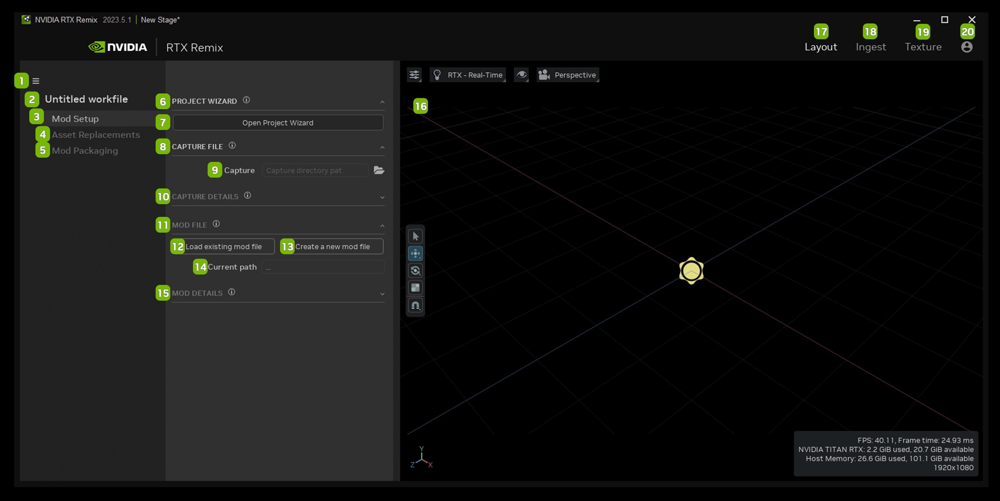
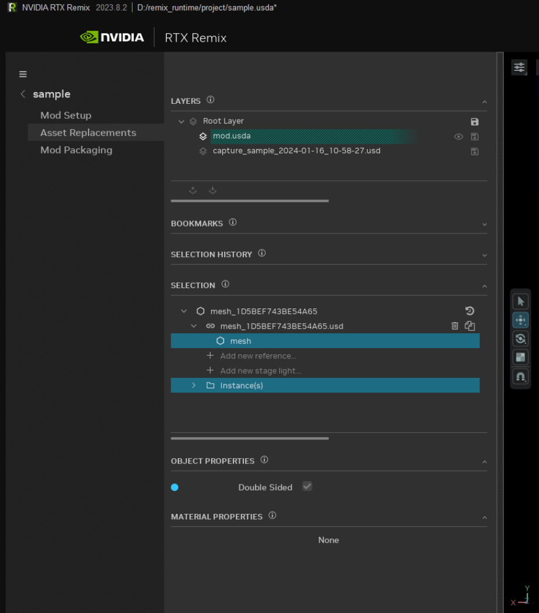

# Layout Tab

<!--- Needs Description --->

## Mod Setup

<table>
  <tr>
   <td><strong>Ref</strong>
   </td>
   <td><strong>Option</strong>
   </td>
   <td><strong>Description</strong>
   </td>
  </tr>
  <tr>
   <td>1
   </td>
   <td>Hamburger Menu
   </td>
   <td>Save (Ctrl + S), Save As (Ctrl + Shift + S), Undo (Ctrl + Z), Redo (Ctrl + Y), About
   </td>
  </tr>
  <tr>
   <td>2
   </td>
   <td>Project Title
   </td>
   <td><!--- Needs Description --->
   </td>
  </tr>
  <tr>
   <td>3
   </td>
   <td>Mod Setup
   </td>
   <td>Set the details of your mod project
   </td>
  </tr>
  <tr>
   <td>4
   </td>
   <td>Asset Replacements
   </td>
   <td><!--- Needs Description --->
   </td>
  </tr>
  <tr>
   <td>5
   </td>
   <td>Mod Packaging
   </td>
   <td><!--- Needs Description --->
   </td>
  </tr>
  <tr>
   <td>6
   </td>
   <td>Project Wizard
   </td>
   <td>Access the Project Wizard Panel
   </td>
  </tr>
  <tr>
   <td>7
   </td>
   <td>Open Project Wizard
   </td>
   <td>Launches the Project Wizard Panel
   </td>
  </tr>
  <tr>
   <td>8
   </td>
   <td>Capture File
   </td>
   <td>Load the captured game file scene
   </td>
  </tr>
  <tr>
   <td>9
   </td>
   <td>Capture File Location
   </td>
   <td>Directory location of the captured file
   </td>
  </tr>
  <tr>
   <td>10
   </td>
   <td>Capture Details
   </td>
   <td>Displays details from the captured layer file loaded into the stage
   </td>
  </tr>
  <tr>
   <td>11
   </td>
   <td>Mod File
   </td>
   <td>Modify the captured file
   </td>
  </tr>
  <tr>
   <td>12
   </td>
   <td>Load Existing Mod File
   </td>
   <td>Load an existing mod file
   </td>
  </tr>
  <tr>
   <td>13
   </td>
   <td>Create a New Mod File
   </td>
   <td>Create a new mod file
   </td>
  </tr>
  <tr>
   <td>14
   </td>
   <td>Current Path File Location
   </td>
   <td>Directory location of the current file
   </td>
  </tr>
  <tr>
   <td>15
   </td>
   <td>Mod Details
   </td>
   <td>Displays details from the mod layer file loaded into the stage
   </td>
  </tr>
  <tr>
   <td>16
   </td>
   <td>Viewport
   </td>
   <td>Staging area for the captured file
   </td>
  </tr>
  <tr>
   <td>17
   </td>
   <td>Layout
   </td>
   <td>Opens the Layout Tab
   </td>
  </tr>
  <tr>
   <td>18
   </td>
   <td>Ingest
   </td>
   <td>Opens the Ingest Tab
   </td>
  </tr>
  <tr>
   <td>19
   </td>
   <td>Texture
   </td>
   <td>Opens the Texture Tab
   </td>
  </tr>
  <tr>
   <td>20
   </td>
   <td>Profile
   </td>
   <td>Opens the User Profile
   </td>
  </tr>
</table>

## Asset Replacement

## Mod Packaging

<!--- Needs Description --->

***
 Need to leave feedback about the RTX Remix Documentation?  [Click here](https://github.com/NVIDIAGameWorks/rtx-remix/issues/new?assignees=nvdamien&labels=documentation%2Cfeedback%2Ctriage&projects=&template=documentation_feedback.yml&title=%5BDocumentation+feedback%5D%3A+) 