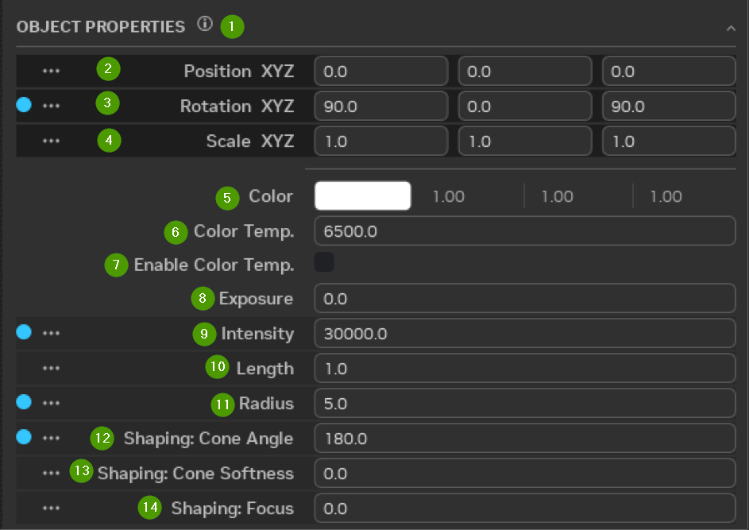
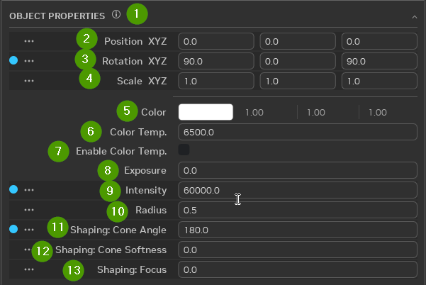
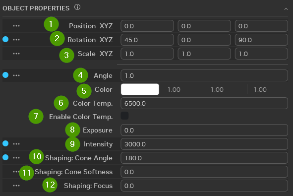
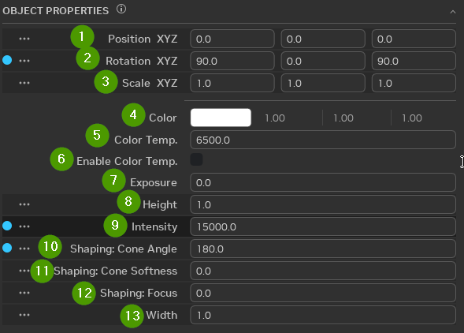
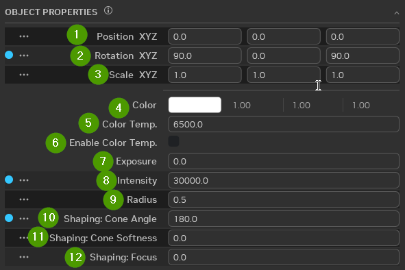

# Lighting

## Light Manipulators

### Showing and Hiding Manipulators

Light manipulators can be toggled on or off from the viewport. Open the **Show by Type** menu in the viewport toolbar
and toggle **Lights > Manipulators** to show or hide the 3D handles for all lights in the scene. The
**Lights > Spotlight Cones** entry independently toggles the green wireframe cone drawn on DiskLight and SphereLight
prims that have a shaping cone authored. Both settings persist across sessions.

### How to Use

Select a light or lights and then drag the manipulator handles to change the shape of the light.

When you hover over the "light beams" they will turn into arrows and you will be able to control the intensity of the
light. Certain light types will have square handles, which will appear when you hover over specific areas of the
manipulator. These allow you to change multiple attributes of the selected light at once by dragging the handles in
different directions.

### Spotlight Cone Visualization

When a DiskLight or SphereLight has **Shaping: Cone Angle** authored to less than 90°, a green wireframe cone is drawn
from the light's emitter surface along its primary axis. The cone shows the lit envelope of the light at the distance
where the on-axis illuminance falls below a configurable threshold, so the wireframe length scales with the light's
intensity, exposure, color, and color temperature.
This visualization does not change USD light attributes, falloff, attenuation, or rendered lighting; it only changes
the viewport wireframe used to inspect the light.

When **Shaping: Cone Softness** is greater than 0, a second cyan wireframe is drawn inside the green outer cone showing
the inner (fully-lit) region of the cone. The annular region between the two wireframes is the penumbra where light
intensity falls off smoothly toward zero.

The threshold, subdivisions, and both cone colors are tunable from the viewport toolbar's Display menu (eye icon) under
**Custom Manipulators > Light Manipulator** (see the
[Viewport reference page](remix-toolkitinterface-viewport.md#light-manipulator-settings)).

## Cylinder Light Values

| Ref | Option                   | Description                                                  |
|:---:|:-------------------------|:-------------------------------------------------------------|
|  1  | Object Properties Tab    |                                                              |
|  2  | Position XYZ             | Position of asset relative to asset origin                   |
|  3  | Rotation XYZ             | Rotation of asset relative to asset origin                   |
|  4  | Scale XYZ                | Scale of asset relative to default scale                     |
|  5  | Color                    | RGB Color Values                                             |
|  6  | Color Temperature        | Units in Kelvins                                             |
|  7  | Enable Color Temperature | Checkbox enabling color temperature modifier                 |
|  8  | Exposure                 | Exposure Value                                               |
|  9  | Intensity                | Value of Light Intensity                                     |
| 10  | Length                   | Light Cast Length                                            |
| 11  | Radius                   | Radius of the Light, Size of light also affects radius value |
| 12  | Shaping: Cone Angle      | Light cone angle to create a wider or smaller cylinder       |
| 13  | Shaping: Cone Softness   | Determines light edging hardness or softness                 |
| 14  | Shaping: Focus           | Determines overall light diffuse or sharpness                |

## Disk Light Values

| Ref | Option                   | Description                                                  |
|:---:|:-------------------------|:-------------------------------------------------------------|
|  1  | Object Properties Tab    |                                                              |
|  2  | Position XYZ             | Position of asset relative to asset origin                   |
|  3  | Rotation XYZ             | Rotation of asset relative to asset origin                   |
|  4  | Scale XYZ                | Scale of asset relative to default scale                     |
|  5  | Color                    | RGB Color Values                                             |
|  6  | Color Temperature        | Units in Kelvins                                             |
|  7  | Enable Color Temperature | Checkbox enabling color temperature modifier                 |
|  8  | Exposure                 | Exposure Value                                               |
|  9  | Intensity                | Value of Light Intensity                                     |
| 10  | Radius                   | Radius of the Light, Size of light also affects radius value |
| 11  | Shaping: Cone Angle      | Light cone angle to create a wider or smaller cylinder       |
| 12  | Shaping: Cone Softness   | Determines light edging hardness or softness                 |
| 13  | Shaping: Focus           | Determines overall light diffuse or sharpness                |

## Distant Light Values

| Ref | Option                   | Description                                            |
|:---:|:-------------------------|:-------------------------------------------------------|
|  1  | Position XYZ             | Position of asset relative to asset origin             |
|  2  | Rotation XYZ             | Rotation of asset relative to asset origin             |
|  3  | Scale XYZ                | Scale of asset relative to default scale               |
|  4  | Angle                    | Angle of light cast relative to world                  |
|  5  | Color                    | RGB Color Values                                       |
|  6  | Color Temperature        | Units in Kelvins                                       |
|  7  | Enable Color Temperature | Checkbox enabling color temperature modifier           |
|  8  | Exposure                 | Exposure Value                                         |
|  9  | Intensity                | Value of Light Intensity                               |
| 10  | Shaping: Cone Angle      | Light cone angle to create a wider or smaller cylinder |
| 11  | Shaping: Cone Softness   | Determines light edging hardness or softness           |
| 12  | Shaping: Focus           | Determines overall light diffuse or sharpness          |

## Rect Light Values

| Ref | Option                   | Description                                            |
|:---:|:-------------------------|:-------------------------------------------------------|
|  1  | Position XYZ             | Position of asset relative to asset origin             |
|  2  | Rotation XYZ             | Rotation of asset relative to asset origin             |
|  3  | Scale XYZ                | Scale of asset relative to default scale               |
|  4  | Color                    | RGB Color Values                                       |
|  5  | Color Temperature        | Units in Kelvins                                       |
|  6  | Enable Color Temperature | Checkbox enabling color temperature modifier           |
|  7  | Exposure                 | Exposure Value                                         |
|  8  | Height                   | Height of the Light Source                             |
|  9  | Intensity                | Value of Light Intensity                               |
| 10  | Shaping: Cone Angle      | Light cone angle to create a wider or smaller cylinder |
| 11  | Shaping: Cone Softness   | Determines light edging hardness or softness           |
| 12  | Shaping: Focus           | Determines overall light diffuse or sharpness          |
| 13  | Width                    | Light Source Width

## Sphere Light Values

| Ref | Option                   | Description                                                  |
|:---:|:-------------------------|:-------------------------------------------------------------|
|  1  | Position XYZ             | Position of asset relative to asset origin                   |
|  2  | Rotation XYZ             | Rotation of asset relative to asset origin                   |
|  3  | Scale XYZ                | Scale of asset relative to default scale                     |
|  4  | Color                    | RGB Color Values                                             |
|  5  | Color Temperature        | Units in Kelvins                                             |
|  6  | Enable Color Temperature | Checkbox enabling color temperature modifier                 |
|  7  | Exposure                 | Exposure Value                                               |
|  8  | Intensity                | Value of Light Intensity                                     |
|  9  | Radius                   | Radius of the Light, Size of light also affects radius value |
| 10  | Shaping: Cone Angle      | Light cone angle to create a wider or smaller cylinder       |
| 11  | Shaping: Cone Softness   | Determines light edging hardness or softness                 |
| 12  | Shaping: Focus           | Determines overall light diffuse or sharpness                |

***
 Need to leave feedback about the RTX Remix Documentation?  [Click here](https://github.com/NVIDIAGameWorks/rtx-remix/issues/new?assignees=nvdamien&labels=documentation%2Cfeedback%2Ctriage&projects=&template=documentation_feedback.yml&title=%5BDocumentation+feedback%5D%3A+) 
