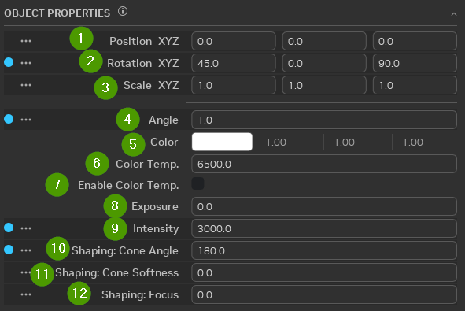

# Lighting

## Light Manipulators

### How to Use
Select a light or lights and then drag the manipulator handles to change the shape of the light.

When you hover over the "light beams" they will turn into arrows and you will be able to control the intensity of the light. Certain light types will have square handles, which will appear when you hover over specific areas of the manipulator. These allow you to change multiple attributes of the selected light at once by dragging the handles in different directions.

## Cylinder Light Values

| Ref | Option | Description |
|:---:|:------|:-------|
| 1 | Object Properties Tab |  |
| 2 | Position XYZ | Position of asset relative to asset origin |
| 3 | Rotation XYZ | Rotation of asset relative to asset origin |
| 4 | Scale XYZ | Scale of asset relative to default scale |
| 5 | Color | RGB Color Values |
| 6 | Color Temperature | Units in Kelvins |
| 7 | Enable Color Temperature | Checkbox enabling color temperature modifier |
| 8 | Exposure | Exposure Value |
| 9 | Intensity | Value of Light Intensity |
| 10 | Length | Light Cast Length |
| 11 | Radius | Radius of the Light, Size of light also affects radius value |
| 12 | Shaping: Cone Angle | Light cone angle to create a wider or smaller cylinder |
| 13 | Shaping: Cone Softness | Determines light edging hardness or softness |
| 14 | Shaping: Focus | Determines overall light diffuse or sharpness |

## Disk Light Values

| Ref | Option | Description |
|:---:|:------|:-------|
| 1 | Object Properties Tab |  |
| 2 | Position XYZ | Position of asset relative to asset origin |
| 3 | Rotation XYZ | Rotation of asset relative to asset origin |
| 4 | Scale XYZ | Scale of asset relative to default scale |
| 5 | Color | RGB Color Values |
| 6 | Color Temperature | Units in Kelvins |
| 7 | Enable Color Temperature | Checkbox enabling color temperature modifier |
| 8 | Exposure | Exposure Value |
| 9 | Intensity | Value of Light Intensity |
| 10 | Radius | Radius of the Light, Size of light also affects radius value |
| 11 | Shaping: Cone Angle | Light cone angle to create a wider or smaller cylinder |
| 12 | Shaping: Cone Softness | Determines light edging hardness or softness |
| 13 | Shaping: Focus | Determines overall light diffuse or sharpness |

## Distant Light Values

| Ref | Option | Description |
|:---:|:------|:-------|
| 1 | Position XYZ | Position of asset relative to asset origin |
| 2 | Rotation XYZ | Rotation of asset relative to asset origin |
| 3 | Scale XYZ | Scale of asset relative to default scale |
| 4 | Angle | Angle of light cast relative to world |
| 5 | Color | RGB Color Values |
| 6 | Color Temperature | Units in Kelvins |
| 7 | Enable Color Temperature | Checkbox enabling color temperature modifier |
| 8 | Exposure | Exposure Value |
| 9 | Intensity | Value of Light Intensity |
| 10 | Shaping: Cone Angle | Light cone angle to create a wider or smaller cylinder |
| 11 | Shaping: Cone Softness | Determines light edging hardness or softness |
| 12 | Shaping: Focus | Determines overall light diffuse or sharpness |

## Rect Light Values

| Ref | Option | Description |
|:---:|:------|:-------|
| 1 | Position XYZ | Position of asset relative to asset origin |
| 2 | Rotation XYZ | Rotation of asset relative to asset origin |
| 3 | Scale XYZ | Scale of asset relative to default scale |
| 4 | Color | RGB Color Values |
| 5 | Color Temperature | Units in Kelvins |
| 6 | Enable Color Temperature | Checkbox enabling color temperature modifier |
| 7 | Exposure | Exposure Value |
| 8 | Height | Height of the Light Source |
| 9 | Intensity | Value of Light Intensity |
| 10 | Shaping: Cone Angle | Light cone angle to create a wider or smaller cylinder |
| 11 | Shaping: Cone Softness | Determines light edging hardness or softness |
| 12 | Shaping: Focus | Determines overall light diffuse or sharpness |
| 13 | Width | Light Source Width

## Sphere Light Values

| Ref | Option | Description |
|:---:|:------|:-------|
| 1 | Position XYZ | Position of asset relative to asset origin |
| 2 | Rotation XYZ | Rotation of asset relative to asset origin |
| 3 | Scale XYZ | Scale of asset relative to default scale |
| 4 | Color | RGB Color Values |
| 5 | Color Temperature | Units in Kelvins |
| 6 | Enable Color Temperature | Checkbox enabling color temperature modifier |
| 7 | Exposure | Exposure Value |
| 8 | Intensity | Value of Light Intensity |
| 9 | Radius | Radius of the Light, Size of light also affects radius value |
| 10 | Shaping: Cone Angle | Light cone angle to create a wider or smaller cylinder |
| 11 | Shaping: Cone Softness | Determines light edging hardness or softness |
| 12 | Shaping: Focus | Determines overall light diffuse or sharpness |

***
 Need to leave feedback about the RTX Remix Documentation?  [Click here](https://github.com/NVIDIAGameWorks/rtx-remix/issues/new?assignees=nvdamien&labels=documentation%2Cfeedback%2Ctriage&projects=&template=documentation_feedback.yml&title=%5BDocumentation+feedback%5D%3A+) 
