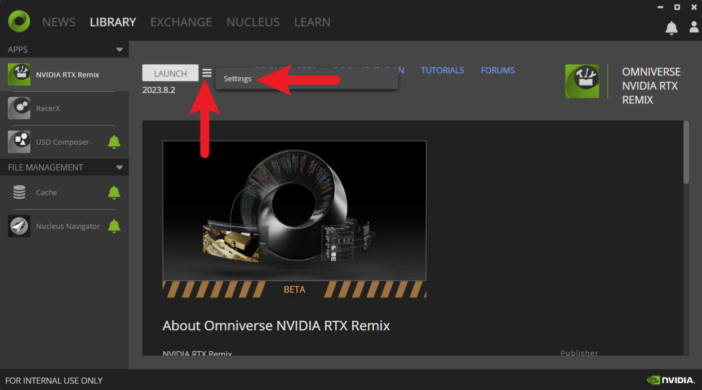
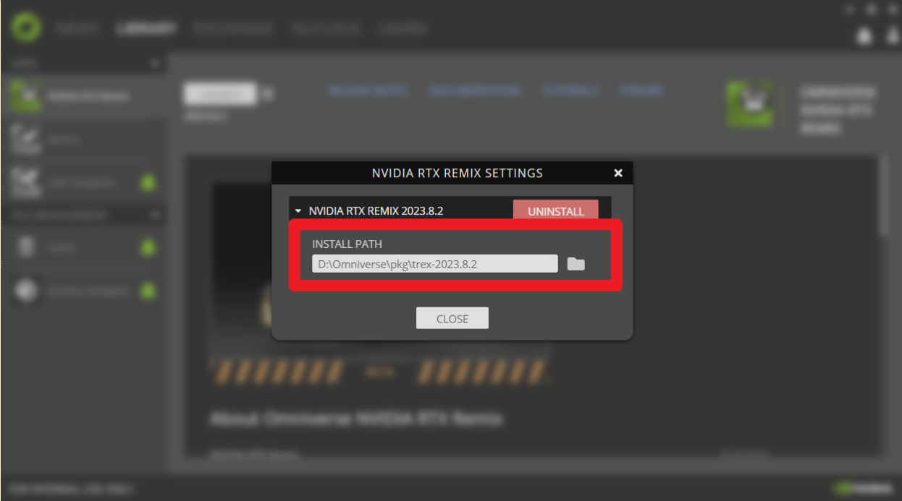

# Data Migrations

The RTX Remix Toolkit offers a data migration tool to ensure compatibility between older projects and the latest runtime
and toolkit versions. This tool is a batch script that allows users to run all available migrations using a consistent
method.

## Finding the Migration Tool

1) Open the Omniverse Launcher
2) Navigate to the Library tab and locate your installation of the NVIDIA RTX Remix Toolkit
3) Copy the installation directory by following the instructions below:
    
    
4) Open your Toolkit installation directory in File Explorer.
5) Locate the `lightspeed.app.trex.migration.cli.bat` script

## Executing the Migration Tool

1) Once in the installation directory, click on the address bar at the top and enter:
    ```
    cmd
    ```
    
2) This command should open a command prompt window
3) Using the command prompt window, execute the `lightspeed.app.trex.migration.cli.bat` script using the following command:
    ```
    lightspeed.app.trex.migration.cli.bat -h
    ```
4) You should now see the available migrations. Follow the instructions given by the tool to execute the desired migrations.

## Performing a Migration

To perform a migration, follow the instruction given by the tool during the previous step.

For example, executing the following command:
```
lightspeed.app.trex.migration.cli.bat distant-lights-z-direction -h
```

Should give you instructions on how to migrate the distant lights in your existing project.

## Available Migrations

### Distant Lights Z Direction

#### Migration Name

`distant-lights-z-direction`

#### Purpose

Migrate distant lights pointing in the wrong direction (Z towards the sun) to point in the correct direction (Z away from the sun).

#### Arguments

| Argument                                   | Description                                                                                        |
|--------------------------------------------|----------------------------------------------------------------------------------------------------|
| `--file FILE`<br/>`-f FILE`                | Path to the USD file to migrate to the updated standard                                            |
| `--directory DIRECTORY`<br/>`-d DIRECTORY` | Path to the directory of USD files to migrate to the updated standard                              |
| `--force`<br/>`-F`                         | Force execute the migration, regardless of if it was already executed or not.                      |
| `--recursive`<br/>`-r`                     | Recursively search for USD files in the given directory.<br/>Will be ignored if `--file` is given. |

#### Example Command

```
lightspeed.app.trex.migration.cli.bat distant-lights-z-direction -d "PROJECT_DIRECTORY_HERE" -r
```
Where `PROJECT_DIRECTORY_HERE` is replaced with the actual project directory where the migration should be applied.

***
<sub> Need to leave feedback about the RTX Remix Documentation?  [Click here](https://github.com/NVIDIAGameWorks/rtx-remix/issues/new?assignees=nvdamien&labels=documentation%2Cfeedback%2Ctriage&projects=&template=documentation_feedback.yml&title=%5BDocumentation+feedback%5D%3A+) </sub>
