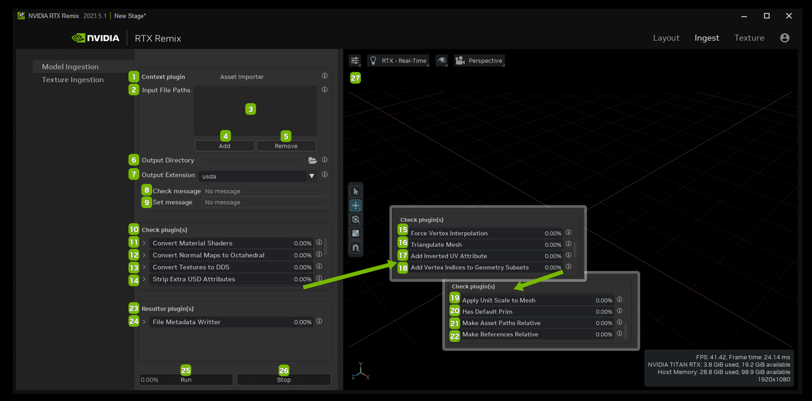
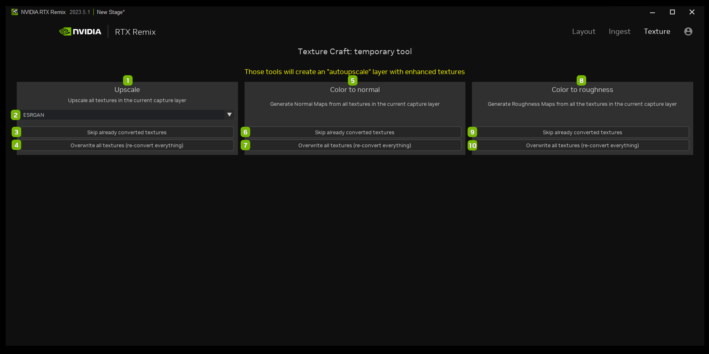

# Mod Setup Screen

## Layout Tab

<table>
  <tr>
   <td><strong>Ref</strong>
   </td>
   <td><strong>Option</strong>
   </td>
   <td><strong>Description</strong>
   </td>
  </tr>
  <tr>
   <td>1
   </td>
   <td>Hamburger Menu
   </td>
   <td>Save (Ctrl + S), Save As (Ctrl + Shift + S), Undo (Ctrl + Z), Redo (Ctrl + Y), About
   </td>
  </tr>
  <tr>
   <td>2
   </td>
   <td>Workfile Title
   </td>
   <td><!--- Needs Description --->
   </td>
  </tr>
  <tr>
   <td>3
   </td>
   <td>Mod Setup
   </td>
   <td>Set the details of your mod project
   </td>
  </tr>
  <tr>
   <td>4
   </td>
   <td>Asset Replacements
   </td>
   <td><!--- Needs Description --->
   </td>
  </tr>
  <tr>
   <td>5
   </td>
   <td>Mod Packaging
   </td>
   <td><!--- Needs Description --->
   </td>
  </tr>
  <tr>
   <td>6
   </td>
   <td>Project Wizard
   </td>
   <td>Access the Project Wizard Panel
   </td>
  </tr>
  <tr>
   <td>7
   </td>
   <td>Open Project Wizard
   </td>
   <td>Launches the Project Wizard Panel
   </td>
  </tr>
  <tr>
   <td>8
   </td>
   <td>Capture File
   </td>
   <td>Load the captured game file scene
   </td>
  </tr>
  <tr>
   <td>9
   </td>
   <td>Capture File Location
   </td>
   <td>Directory location of the captured file
   </td>
  </tr>
  <tr>
   <td>10
   </td>
   <td>Capture Details
   </td>
   <td>Displays details from the captured layer file loaded into the stage
   </td>
  </tr>
  <tr>
   <td>11
   </td>
   <td>Mod File
   </td>
   <td>Modify the captured file
   </td>
  </tr>
  <tr>
   <td>12
   </td>
   <td>Load Existing Mod File
   </td>
   <td>Load an existing mod file
   </td>
  </tr>
  <tr>
   <td>13
   </td>
   <td>Create a New Mod File
   </td>
   <td>Create a new mod file
   </td>
  </tr>
  <tr>
   <td>14
   </td>
   <td>Current Path File Location
   </td>
   <td>Directory location of the current file
   </td>
  </tr>
  <tr>
   <td>15
   </td>
   <td>Mod Details
   </td>
   <td>Displays details from the mod layer file loaded into the stage
   </td>
  </tr>
  <tr>
   <td>16
   </td>
   <td>Viewport
   </td>
   <td>Staging area for the captured file
   </td>
  </tr>
  <tr>
   <td>17
   </td>
   <td>Layout
   </td>
   <td>Opens the Layout Tab
   </td>
  </tr>
  <tr>
   <td>18
   </td>
   <td>Ingest
   </td>
   <td>Opens the Ingest Tab
   </td>
  </tr>
  <tr>
   <td>19
   </td>
   <td>Texture
   </td>
   <td>Opens the Texture Tab
   </td>
  </tr>
  <tr>
   <td>20
   </td>
   <td>Profile
   </td>
   <td>Opens the User Profile
   </td>
  </tr>
</table>

## Ingest Tab

### Model Ingestion

<table>
  <tr>
   <td><strong>Ref</strong>
   </td>
   <td><strong>Option</strong>
   </td>
   <td><strong>Description</strong>
   </td>
  </tr>
  <tr>
   <td>1
   </td>
   <td>Context Plugin: Asset Importer
   </td>
   <td>This plugin will import a list of files and process them sequentially 
   </td>
  </tr>
  <tr>
   <td>2
   </td>
   <td>Input File Paths
   </td>
   <td><!--- Needs Description --->
   </td>
  </tr>
  <tr>
   <td>3
   </td>
   <td>List of Path(s) Field(s)
   </td>
   <td>The list of files to import as USD files
   </td>
  </tr>
  <tr>
   <td>4
   </td>
   <td>Add
   </td>
   <td>Add Files to the directory path field
   </td>
  </tr>
  <tr>
   <td>5
   </td>
   <td>Remove
   </td>
   <td>Remove Files from the directory path field
   </td>
  </tr>
  <tr>
   <td>6
   </td>
   <td>Output Directory
   </td>
   <td>Directory to import the converted input files to
   </td>
  </tr>
  <tr>
   <td>7
   </td>
   <td>Output Extension
   </td>
   <td>USD file extension to use for the converted input files
   </td>
  </tr>
  <tr>
   <td>8
   </td>
   <td>Check Message
   </td>
   <td><!--- Needs Description --->
   </td>
  </tr>
  <tr>
   <td>9
   </td>
   <td>Set Message
   </td>
   <td><!--- Needs Description --->
   </td>
  </tr>
  <tr>
   <td>10
   </td>
   <td>Check Plugin(s)
   </td>
   <td><!--- Needs Description --->
   </td>
  </tr>
  <tr>
   <td>11
   </td>
   <td>Convert Material Shaders
   </td>
   <td>Ensures that all the materials have correct shaders
   </td>
  </tr>
  <tr>
   <td>12
   </td>
   <td>Convert Normal Maps to Octahedral
   </td>
   <td>Ensures that all normal paths are octahedral encoded
   </td>
  </tr>
  <tr>
   <td>13
   </td>
   <td>Convert Textures to DDS
   </td>
   <td>Ensures textures are encoded as DDS
   </td>
  </tr>
  <tr>
   <td>14
   </td>
   <td>Strip Extra USD Attributes
   </td>
   <td>Removes any non-essential properties from a mesh prim
   </td>
  </tr>
  <tr>
   <td>15
   </td>
   <td>Force Vertex Interpolation
   </td>
   <td>Ensures that per-vertex data does not use the “varying” or “faceVarying” interpolation schemes
   </td>
  </tr>
  <tr>
   <td>16
   </td>
   <td>Triangulate Mesh
   </td>
   <td>Triangulates un-triangulated meshes including GeomSubset processing
   </td>
  </tr>
  <tr>
   <td>17
   </td>
   <td>Add Inverted UV Attribute
   </td>
   <td>Ensures that all assets have an “InvertedUvs” property with texCoords containing an inverted y coordinate
   </td>
  </tr>
  <tr>
   <td>18
   </td>
   <td>Add Vertex Indices to Geometry Subsets
   </td>
   <td>Ensures that the properties of triangulated mesh prims with GeomSubsets have up-to-date per-vertex indices
   </td>
  </tr>
  <tr>
   <td>19
   </td>
   <td>Apply Unit Scale to Mesh
   </td>
   <td>Applies the “metersPerUnit” scaling to a mesh’s XForm scale
   </td>
  </tr>
  <tr>
   <td>20
   </td>
   <td>Has Default Prim
   </td>
   <td>Ensures the USD file contains a default prim
   </td>
  </tr>
  <tr>
   <td>21
   </td>
   <td>Make Asset Paths Relative
   </td>
   <td>Replaces absolute asset paths with relative paths
   </td>
  </tr>
  <tr>
   <td>22
   </td>
   <td>Make References Relative
   </td>
   <td>Replace absolute reference paths with relative paths
   </td>
  </tr>
  <tr>
   <td>23
   </td>
   <td>Resulter Plugin(s)
   </td>
   <td><!--- Needs Description --->
   </td>
  </tr>
  <tr>
   <td>24
   </td>
   <td>File Metadata Writer
   </td>
   <td>Writes metadata from the input/output data of the context and check plugins validation result
   </td>
  </tr>
  <tr>
   <td>25
   </td>
   <td>Run
   </td>
   <td>Run the Model Ingestion
   </td>
  </tr>
  <tr>
   <td>26
   </td>
   <td>Stop
   </td>
   <td>Stop the Model Ingestion
   </td>
  </tr>
  <tr>
   <td>27
   </td>
   <td>Viewport
   </td>
   <td>View the Model Ingestion
   </td>
  </tr>
</table>

### Texture Ingestion

<table>
  <tr>
   <td><strong>Ref</strong>
   </td>
   <td><strong>Option</strong>
   </td>
   <td><strong>Description</strong>
   </td>
  </tr>
  <tr>
   <td>1
   </td>
   <td>Context Plugin: Texture Importer
   </td>
   <td>Assigns USD materials with the OmniPBR shader sequentially
   </td>
  </tr>
  <tr>
   <td>2
   </td>
   <td>Input File Paths
   </td>
   <td><!--- Needs Description --->
   </td>
  </tr>
  <tr>
   <td>3
   </td>
   <td>List of Path(s) Field(s)
   </td>
   <td>List of files to import
   </td>
  </tr>
  <tr>
   <td>4
   </td>
   <td>Convention Dropdown
   </td>
   <td>Select the default convention type for Normals to use in batch: 

Normal - OpenGL

Normal - DirectX

Normal - Octahedral
   </td>
  </tr>
  <tr>
   <td>5
   </td>
   <td>Add
   </td>
   <td>Add Files to the directory path field
   </td>
  </tr>
  <tr>
   <td>6
   </td>
   <td>Remove
   </td>
   <td>Remove Files from the directory path field
   </td>
  </tr>
  <tr>
   <td>7
   </td>
   <td>Output Directory
   </td>
   <td>Directory to import the converted input files to
   </td>
  </tr>
  <tr>
   <td>8
   </td>
   <td>Check Message
   </td>
   <td><!--- Needs Description --->
   </td>
  </tr>
  <tr>
   <td>9
   </td>
   <td>Set Message
   </td>
   <td><!--- Needs Description --->
   </td>
  </tr>
  <tr>
   <td>10
   </td>
   <td>Check Plugin(s)
   </td>
   <td><!--- Needs Description --->
   </td>
  </tr>
  <tr>
   <td>11
   </td>
   <td>Convert Material Shaders
   </td>
   <td>Ensures all materials us valid shaders
   </td>
  </tr>
  <tr>
   <td>12
   </td>
   <td>Convert Normal Maps to Octahedral
   </td>
   <td>Ensures that all normal paths are octahedral encoded
   </td>
  </tr>
  <tr>
   <td>13
   </td>
   <td>Convert Textures to DDS
   </td>
   <td>Ensures textures are encoded as DDS
   </td>
  </tr>
  <tr>
   <td>14
   </td>
   <td>Resulter Plugin(s)
   </td>
   <td><!--- Needs Description --->
   </td>
  </tr>
  <tr>
   <td>15
   </td>
   <td>File Metadata Writer
   </td>
   <td>Writes metadata from the input/output data of the context and check plugins validation result
   </td>
  </tr>
  <tr>
   <td>16
   </td>
   <td>Run
   </td>
   <td>Run the Texture Ingestion
   </td>
  </tr>
  <tr>
   <td>17
   </td>
   <td>Stop
   </td>
   <td>Stop the Texture Ingestion
   </td>
  </tr>
  <tr>
   <td>18
   </td>
   <td>Viewport
   </td>
   <td>View the Texture Ingestion
   </td>
  </tr>
</table>

## Texture Tab

<table>
  <tr>
   <td><strong>Ref</strong>
   </td>
   <td><strong>Option</strong>
   </td>
   <td><strong>Description</strong>
   </td>
  </tr>
  <tr>
   <td>1
   </td>
   <td>Upscale
   </td>
   <td>Upscale all textures in the current capture layer
   </td>
  </tr>
  <tr>
   <td>2
   </td>
   <td><!--- Needs Description --->
   </td>
   <td><!--- Needs Description --->
   </td>
  </tr>
  <tr>
   <td>3
   </td>
   <td>Skip already converted textures
   </td>
   <td><!--- Needs Description --->
   </td>
  </tr>
  <tr>
   <td>4
   </td>
   <td>Overwrite all textures (re-convert everything)
   </td>
   <td><!--- Needs Description --->
   </td>
  </tr>
  <tr>
   <td>5
   </td>
   <td>Color to Normal
   </td>
   <td>Generate Normal Maps from all textures in the current capture layer
   </td>
  </tr>
  <tr>
   <td>6
   </td>
   <td>Skip already converted textures
   </td>
   <td>
   </td>
  </tr>
  <tr>
   <td>7
   </td>
   <td>Overwrite all textures (re-convert everything)
   </td>
   <td><!--- Needs Description --->
   </td>
  </tr>
  <tr>
   <td>8
   </td>
   <td>Color to Roughness
   </td>
   <td>Generate Roughness Maps from all the textures in the current capture layer
   </td>
  </tr>
  <tr>
   <td>9
   </td>
   <td>Skip already converted textures
   </td>
   <td><!--- Needs Description --->
   </td>
  </tr>
  <tr>
   <td>10
   </td>
   <td>Overwrite all textures (re-convert everything)
   </td>
   <td><!--- Needs Description --->
   </td>
  </tr>
</table>

***
 Need to leave feedback about the RTX Remix Documentation?  [Click here](https://docs.google.com/forms/d/1vym6SgptS4QJvp6ZKTN8Mu9yfd5yQc76B3KHIl-n4DQ/prefill) 