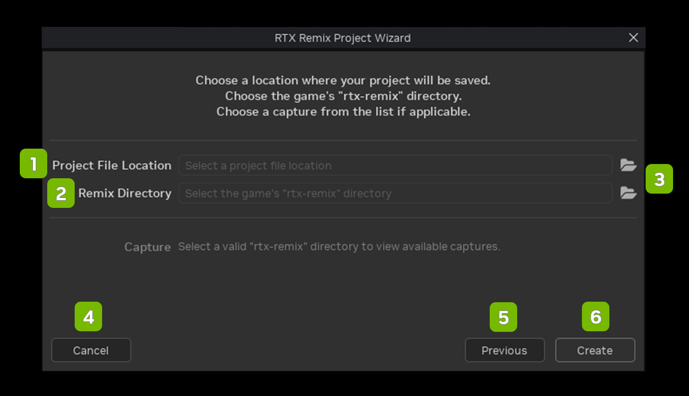

# Project Wizard

<table>
  <tr>
   <td><strong>Ref</strong>
   </td>
   <td><strong>Option</strong>
   </td>
   <td><strong>Description</strong>
   </td>
  </tr>
  <tr>
   <td>1
   </td>
   <td>Open
   </td>
   <td>Open an existing project
   </td>
  </tr>
  <tr>
   <td>2
   </td>
   <td>Create
   </td>
   <td>Create a project to author a new mod
   </td>
  </tr>
  <tr>
   <td>3
   </td>
   <td>Edit
   </td>
   <td>Create a project to edit an existing mod
   </td>
  </tr>
  <tr>
   <td>4
   </td>
   <td>Remaster
   </td>
   <td>Create a project to author and new mod with dependencies
   </td>
  </tr>
</table>

## Capture Scene File Browser

<table>
  <tr>
   <td><strong>Ref</strong>
   </td>
   <td><strong>Option</strong>
   </td>
   <td><strong>Description</strong>
   </td>
  </tr>
  <tr>
   <td>1
   </td>
   <td>Project File Location
   </td>
   <td>Directory path to the USD project file
   </td>
  </tr>
  <tr>
   <td>2
   </td>
   <td>Remix Directory
   </td>
   <td>Directory path to the rtx-remix folder location that contains the captures from the game scene
   </td>
  </tr>
  <tr>
   <td>3
   </td>
   <td>File Browser Icons
   </td>
   <td>Opens the file browser
   </td>
  </tr>
  <tr>
   <td>4
   </td>
   <td>Cancel
   </td>
   <td>Closed the Capture Scene File Browser
   </td>
  </tr>
  <tr>
   <td>5
   </td>
   <td>Previous
   </td>
   <td>Goes to the previous menu screen
   </td>
  </tr>
  <tr>
   <td>6
   </td>
   <td>Create
   </td>
   <td><!--- Needs Description --->
   </td>
  </tr>
</table>

***
 Need to leave feedback about the RTX Remix Documentation?  [Click here](https://github.com/NVIDIAGameWorks/rtx-remix/issues/new?assignees=nvdamien&labels=documentation%2Cfeedback%2Ctriage&projects=&template=documentation_feedback.yml&title=%5BDocumentation+feedback%5D%3A+) 