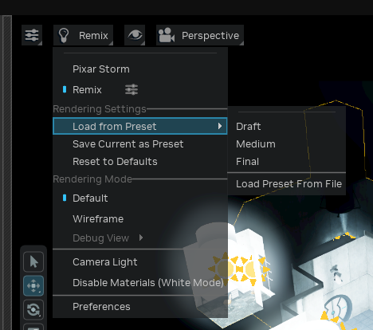

# Viewport

## Viewport Settings

**Navigation**

**Selection**

**Grid**

**Gizmos**

**Viewport**

**Viewport UI**

**Manipulator Transform**

**Reset and Preferences**

## Preferences Panel

**Audio**

**Capture Screenshot**

**Datetime Format**

**Material**

**Rendering**

**Resource Monitor**

**Stage**

**Tagging**

**Template Startup**

**Thumbnail Generation**

**Viewport**

**Reset to Default**

## Render Settings

These settings allow you to chose the type of renderer you want to use, the Rendering Mode, and Renderer specific settings.

**Remix Render Settings**

**Render Settings**

## Viewing Options

**Heads Up Display**

**Show By Type**

**Show By Purpose**

## Camera Settings

> Since the Remix Toolkit is built on Omniverse. More information on camera settings can be found here: https://docs.omniverse.nvidia.com/materials-and-rendering/latest/cameras.html

## Stage Lights

# Keyboard Shortcuts

| Input | Description |
|:----|:----|
| Ctrl + S | Save Project |
| Ctrl + Alt + S | Save Project As |
| Ctrl + Z | Undo |
| Ctrl + Y | Redo |

***
 Need to leave feedback about the RTX Remix Documentation?  [Click here](https://github.com/NVIDIAGameWorks/rtx-remix/issues/new?assignees=nvdamien&labels=documentation%2Cfeedback%2Ctriage&projects=&template=documentation_feedback.yml&title=%5BDocumentation+feedback%5D%3A+) 