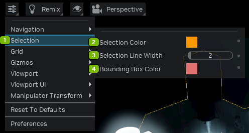
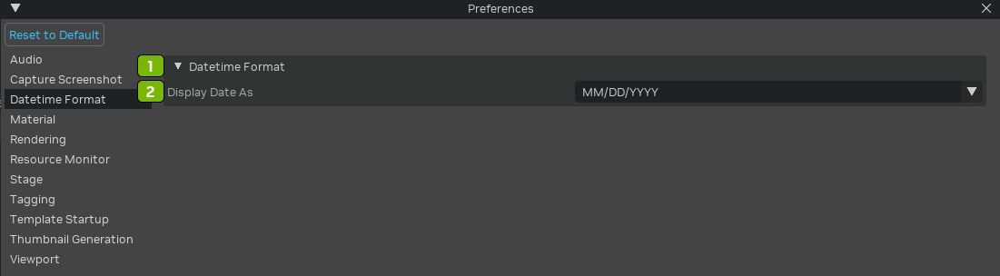
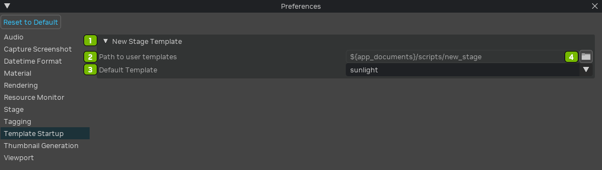
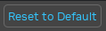
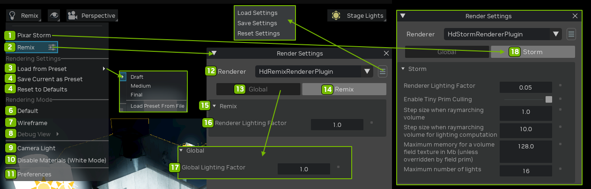
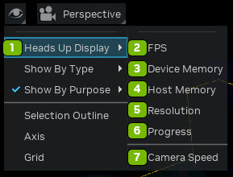

# Viewport

| Ref | Option | Description |
|:---:|:---|:---|
| 1 | Viewport Settings | Opens the Viewport Settings Menu |
| 2 | Render Mode Settings | The availability of these options depends on the renderer you’ve selected. |
| 3 | Interface Visibility Settings | Opens the Interface Visibility Settting Menu |
| 4 | Camera Settings | Opens the Camera Settings Menu |
| 5 | Stage Lighting | Opens the Stage Light Panel |
| 6 | Select (Q) | Press Q on the Keyboard |
| 7 | Move (W) | Move selected object |
| 8 | Rotate (E) | To rotate an object with rotate mode, select the object to rotate and either press E or click the Rotate button |
| 9 | Scale (R) | To change the size of an object using scale mode, select the object to scale and either press R or click the Scale button |
| 10 | Snap (S) | The snap tool is an extension that helps the user position objects by allowing them to “snap” to geometry, prims, the grid or specified increments. To enable or disable the snap tool, left click on the magnet icon either in the toolbar. You can also press the S key to toggle it on and off. |

## Viewport Settings

**Navigation**

| Ref | Option | Description |
|:---:|:---|:---|
| 1 | Navigation Menu | Opens the Navigation Menu |
| 2 | Navigation Speed | Sets the speed of the camera when navigating in the Viewport |
| 3 | Navigation Speed Scalar | Controls navigation speed |
| 4 | Lock Navigation Height | Fixes the observer's height during navigation, ensuring movements in the viewport maintain a constant vertical perspective. |
| 5 | Gamepad Camera Control | Enables viewport camera control with a connected gamepad. |
| 6 | Object Centric Navigation | Centers navigation around the selected object, simplifying precision movements, orbits, and zooms relative to that specific element. |
| 7 | Double Click Sets Interest | Enables users to swiftly set a focal point by double-clicking any element, recentering the camera for efficient navigation. |
| 8 | Inertia Mode | Toggles natural acceleration and deceleration on all camera movements. Different types of inertial motion can be selected with the Inertia Decay dropdown |
| 9 | Lock Speed Horizontal | Lock the Horizontal navigation speed |
| 10 | Lock Speed Vertical | Lock the Vertical navigation speed |
| 11 | Tumble Speed | Adjusts the rotational speed in the viewport, allowing users to customize responsiveness and control during navigation. |
| 12 | Zoom Speed | Increase or Decrease the camera speed as you zoom in and out |
| 13 | Animation Clamp | Sets the maximum animation time limit in seconds |

**Selection**

| Ref | Option | Description |
|:---:|:---|:---|
| 1 | Selection Menu | Opens the Selection Menu |
| 2 | Selection Color | Sets the color for selected entities |
| 3 | Selection Line Width | Sets the size of the selection box |
| 4 | Bounding Box Color | Sets the color of the bounding box |

**Grid**

| Ref | Option | Description |
|:---:|:---|:---|
| 1 | Grid Menu | Opens the Grid Menu |
| 2 | Grid Color | Sets the color of the grid lines |
| 3 | Grid Line Width | Sets the width of the grid lines |
| 4 | Grid Size | Sets the size of the grid cells |
| 5 | Grid Fade | Sets the distance from the camera where the grid lines fade out |

**Gizmos**

| Ref | Option | Description |
|:---:|:---|:---|
| 1 | Gizmos Menu | Opens the Gizmos Menu |
| 2 | Gizmo Line Width | Adjusts the thickness of the outline around the gizmo. |
| 3 | Gizmo Constant Scale Enabled | Turns on the option for consistent scaling of gizmos. |
| 4 | Gizmo Constant Scale | Scales all gizmos uniformly using a constant value. |
| 5 | Gizmo Camera Scale | Scales gizmos based on the position of the camera. |
| 6 | Gizmo Min FadeOut | Determines the distance from the camera where gizmos appear at their full size. Gizmos farther away gradually scale down until reaching the Gizmo Max FadeOut distance, where they become invisible. |
| 7 | Gizmo Max FadeOut | Specifies the distance from the camera at which gizmos completely disappear. |

**Viewport**

| Ref | Option | Description |
|:---:|:---|:---|
| 1 | Viewport Menu | Opens the Viewport Menu |
| 2 | Render Resolution | Defines the base or custom resolution rendered in the Viewport, allowing you to create, save, and delete custom resolutions. Options include: <li>Viewport<li>USD 3840x2160 16:9<li>2048x1080 1.90:1<li>HD1080P 1920x1080 16:9<li>HD720P 1280x720 16:9<li>Square 1024x1024 1:1<li>Icon 512x512 1:1<li>Custom |
| 3 | Ratio Options | Click the disk icon to Save Settings. Options include: <li>16:9<li>4:3<li>1:1  |
| 4 | Custom Resolution | Enables users to set a personalized viewport resolution |
| 5 | Render Scale | Adjusts the Viewport size relative to the specified Render Resolution, either upsampling or downsampling. |
| 6 | Fill Viewport | Occupies the entire viewport with the scene. |

**Viewport UI**

| Ref | Option | Description |
|:---:|:---|:---|
| 1 | UI Background Opacity | Sets the background opacity of the Viewport’s control UI |
| 2 | UI Control Brightness | Sets the brightness of the Viewport’s control UI |

**Manipulator Transform**

| Ref | Option | Description |
|:---:|:---|:---|
| 1 | Manipulator Transform | A tool enabling intuitive and precise movement of objects |
| 2 | Transform Manipulator Scale | Adjusts the size of the transform manipulator for precise control in the viewport |
| 3 | Enable Free Rotation Checkbox | Allows unrestricted rotation of an object when enabled |
| 4 | Free Rotation Type | Defines rotation nature—choose "Clamped" for restricted rotation or "Continuous" for unrestricted rotation |
| 5 | Manipulator Intersection Thickness | Sets handle thickness for easy selection and manipulation of an object components based on user preference |

**Reset and Preferences**

| Ref | Option | Description |
|:---:|:---|:---|
| 1 | Reset To Defaults | Resets all settings to their default values |
| 2 | Preferences | Opens the Preferences panel |

<!---
## Preferences Panel

**Audio**

| Ref | Option | Description |
|:---:|:---|:---|
| 1 | Audio Output | Selects the audio output destination, determining where the audio playback will be directed. |
| 2 | Output Device | Specifies the device used for audio output, allowing users to choose the desired playback hardware |
| 3 | Input Device | Chooses the device for audio input, specifying the source from which audio data is captured. |
| 4 | Speaker Configuration | Defines the arrangement of speakers for audio playback, tailoring the audio experience based on the speaker setup. |
| 5 | Refresh Button | Updates the audio settings in real-time, ensuring changes made to preferences are immediately applied. |
| 6 | Apply Button | Confirms and applies changes to the audio settings, making adjustments effective within the RTX Remix environment. |
| 7 | Audio Parameters | Accesses settings related to audio, providing control over various aspects of the audio playback experience. |
| 8 | Auto Stream Threshold (in Kilobytes) | Sets the threshold for automatic streaming of audio data, managing the streaming behavior based on file size. |
| 9 | Audio Player Parameters | Adjusts parameters related to the audio player, fine-tuning aspects of audio playback within the viewport. |
| 10 | Auto Stream Threshold (in Kilobytes) | Sets the threshold for automatic streaming of audio data, managing the streaming behavior based on file size. |
| 11 | Close Audio Player on Stop Checkbox | Toggles the behavior of closing the audio player automatically when audio playback is stopped. |
| 12 | Volume Levels | Controls the overall volume levels for different audio components within the RTX Remix environment. |
| 13 | Master Volume | Sets the overall master volume for audio playback in the viewport. |
| 14 | USD Volume | Adjusts the volume specifically for Universal Scene Description (USD) audio components. |
| 15 | Spatial Voice Volume | Manages the volume of spatialized voice audio, enhancing the immersive quality of audio within the 3D environment. |
| 16 | Non-Spatial Voice Volume | Controls the volume of non-spatialized voice audio, providing flexibility in managing different audio sources. |
| 17 | UI Audio Volume | Sets the volume level for user interface (UI) audio elements, allowing customization of the interface sound levels. |
| 18 | Debug | Provides access to debugging options and settings related to audio functionality within the RTX Remix environment. |
| 19 | Stream Dump Filename | Specifies the filename for storing streamed audio data, allowing users to save and analyze audio streams. |
| 20 | Enable Stream Dump | Activates the option to capture and save audio stream data for debugging or analysis purposes. |

**Capture Screenshot**

| Ref | Option | Description |
|:---:|:---|:---|
| 1 | Capture Screenshot | Initiates the process of capturing a screenshot of the current view within the viewport in RTX Remix. |
| 2 | Path to Save Screenshots | Specifies the directory or folder where captured screenshots will be saved, allowing users to define the storage location. |
| 3 | Capture Only the 3D Viewport Checkbox | Selectively captures only the 3D viewport area in the screenshot, excluding other interface elements or overlays for a clean output. |
| 4 | Open File Explorer | Opens the file explorer |

**Datetime Format**

| Ref | Option | Description |
|:---:|:---|:---|
| 1 | Datetime Format | Configures the format used to display the date and time information on captured screenshots. |
| 2 | Display Date As | Specifies the arrangement and style for presenting the date on captured screenshots, allowing customization based on user preference. |

**Material**

| Ref | Option | Description |
|:---:|:---|:---|
| 1 | Material | Selects and manages the material used for rendering in the Material viewport of RTX Remix. |
| 2 | Binding Strength | Adjusts the strength or influence of the material binding, controlling how the material is applied to the associated object. |
| 3 | Drag/Drop Path | Specifies the file path or location for dragging and dropping material assets into the Material viewport. |
| 4 | Render Context / Material Network (Requires Stage Reload) | Switches the render context or material network, with changes requiring a stage reload to take effect. |
| 5 | Material Cache | Manages the cache for materials, optimizing performance by storing frequently used material data. |
| 6 | Clear Cache Button | Removes cached material data, providing a way to refresh and update materials in the viewport. |
| 7 | Material Search Path | Defines the directory where the system searches for material assets, aiding in organization and retrieval. |
| 8 | Default Paths | Sets the default paths for materials, establishing a baseline for material asset storage. |
| 9 | Ignore Standard Paths Checkbox | Toggles the option to disregard standard material paths when searching for material assets. |
| 10 | Standard System Paths | Specifies standard system paths for material assets, aiding in locating and utilizing predefined materials. |
| 11 | Standard User Paths | Establishes standard user paths for material assets, facilitating organized storage and retrieval. |
| 12 | Renderer Required | Indicates the renderer required for proper material rendering in the Material viewport. |
| 13 | Renderer Templates | Manages and selects renderer templates for materials, allowing customization based on predefined rendering configurations. |
| 14 | Custom Paths (Requires App Restart) | Defines custom paths for material assets, with changes requiring a restart of the application to take effect. |
| 15 | Add Custom Path | Add a custom path (requires an app restart) |
| 16 | Save Button | Saves changes made to material preferences, ensuring that modifications are retained. |
| 17 | Reset Button | Restores material preferences to their default settings, providing a quick reset option. |

**Rendering**

| Ref | Option | Description |
|:---:|:---|:---|
| 1 | Fabric Scene Delegate | Selects the Fabric Scene Delegate for rendering in the viewport, influencing how scenes are processed and displayed. |
| 2 | Enable Fabric Delegate (Preview Feature Requires Scene Reload) Checkbox | ctivates the Fabric Scene Delegate as a preview feature, with changes requiring a scene reload for implementation. |
| 3 | Fabric Delegate GPU Memory Budget % | Allocates a percentage of GPU memory as a budget for the Fabric Scene Delegate, optimizing performance. |
| 4 | Advanced Fabric Scene Delegate Settings | Accesses advanced settings for fine-tuning and customizing the behavior of the Fabric Scene Delegate. |
| 5 | Enable Geometry Streaming in Fabric Scene Delegate Checkbox | Allows the streaming of geometry data in the Fabric Scene Delegate, optimizing resource usage and performance. |
| 6 | Geo Streaming Minimum Size | Sets the minimum size for geometry streaming, controlling when streaming is activated for specific elements. |
| 7 | Enable Proxy Cubes for Unloaded Prims Checkbox | Activates proxy cubes for unloaded primitives in the scene, enhancing visualization and performance. |
| 8 | Merge Subcomponents Checkbox | Toggles the merging of subcomponents in the Fabric Scene Delegate, optimizing scene complexity. |
| 9 | Merge Instances Checkbox | Combines instances in the Fabric Scene Delegate, reducing redundancy and improving rendering efficiency. |
| 10 | Merge Materials Checkbox | Merges materials in the Fabric Scene Delegate, streamlining material handling and rendering. |
| 11 | Read Materials Checkbox | Enables the reading of material information in the Fabric Scene Delegate for accurate rendering. |
| 12 | Infer DisplayColor from Material Checkbox | Infers display color from materials, ensuring accurate color representation in the Fabric Scene Delegate. |
| 13 | Read Lights Checkbox | Activates the reading of lights in the Fabric Scene Delegate, incorporating lighting information into the rendering. |
| 14 | Read Primvars Checkbox | Enables the reading of primitive variables (primvars) in the Fabric Scene Delegate for enhanced scene detail. |
| 15 | Use Fabric Scene Graph Instancing Checkbox | Utilizes instancing in the Fabric Scene Delegate based on the scene graph structure. |
| 16 | Use Hydra BlendShape Checkbox | Incorporates Hydra BlendShapes in the Fabric Scene Delegate for handling shape variations. |
| 17 | White Mode | Adjusts the rendering mode to display the scene in white, providing an alternative visual representation. |
| 18 | Material | Manages and selects materials for rendering in the viewport. |
| 19 | Exceptions (Requires Scene Reload) | Handles exceptions in the rendering process, with changes requiring a scene reload for implementation. |
| 20 | MDL | Manages and selects materials defined in MDL (Material Definition Language) format for rendering. |
| 21 | Material Distilling (Experimental, Requires App Restart) Checkbox | Activates experimental material distilling, with changes requiring a restart of the application for implementation. |
| 22 | Texture Streaming | Manages and optimizes the streaming of textures for efficient rendering. |
| 23 | Placeholder Texture Color (Requires App Restart) | Sets the color for placeholder textures, with changes requiring a restart of the application to take effect. |
| 24 | Multi-GPU | Enables multi-GPU rendering, distributing rendering tasks across multiple GPUs for improved performance. |
| 25 | Multi-GPU Selection | Selects the GPUs to be utilized for multi-GPU rendering. |
| 26 | Opacity Micromap | Adjusts the micromap for opacity, influencing how opacity is represented in the rendering. |
| 27 | Enable Opacity Micromap Checkbox | Activates the opacity micromap for enhanced transparency representation in the rendering. |

**Resource Monitor**

| Ref | Option | Description |
|:---:|:---|:---|
| 1 | Resource Monitor | Activates the Resource Monitor, providing real-time insights into system resource usage within the viewport. |
| 2 | Time Between Queries | Sets the interval between queries for resource monitoring, regulating the frequency of data updates. |
| 3 | Send Device Memory Warnings Checkbox | Enables the sending of warnings when device memory usage approaches or exceeds specified thresholds. |
| 4 | Device Memory Warning Threshold (MB) | Defines the threshold for device memory usage, triggering warnings when the specified limit is reached in megabytes. |
| 5 | Device Memory Warning Threshold (Fraction) | Sets the threshold for device memory usage as a fraction, triggering warnings based on the specified proportion. |
| 6 | Send Host Memory Warnings Checkbox | Activates the sending of warnings when host (system) memory usage approaches or exceeds specified thresholds. |
| 7 | Host Memory Warning Threshold (MB) | Specifies the threshold for host memory usage, triggering warnings when the specified limit is reached in megabytes. |
| 8 | Host Memory Warning Threshold (Fraction) | Establishes the threshold for host memory usage as a fraction, triggering warnings based on the specified proportion. |

**Stage**

| Ref | Option | Description |
|:---:|:---|:---|
| 1 | New Stage | Initiates the creation of a new stage, providing a starting point for scene development in RTX Remix. |
| 2 | Default Up Axis | Sets the default up axis for the stage, influencing the orientation of the scene. |
| 3 | Default Animation Rate (Timecodes Per Second) | Defines the default animation rate in timecodes per second for animations within the stage. |
| 4 | Default Meters Per Unit | Specifies the default meters per unit for defining the scale of objects in the stage. |
| 5 | Default Time Code Range | Sets the default time code range, determining the temporal scope of the stage's animation. |
| 6 | Default DefaultPrim Name | Defines the default name for the default prim created when starting a new stage. |
| 7 | Interpolation Type | pecifies the default interpolation type for animations within the stage. |
| 8 | Enable Static Material Network Topology | Activates the static material network topology for optimized material handling in the stage |
| 9 | Start With Transform Op on Prim Creation Checkbox | Enables the inclusion of a transform operation by default when creating new primitives in the stage. |
| 10 | Default Transform Op Type | Sets the default type for transform operations applied to primitives in the stage. |
| 11 | Default Camera Rotation Order | Defines the default rotation order for cameras within the stage. |
| 12 | Default Rotation Order | pecifies the default rotation order for objects in the stage. |
| 13 | Default Xform Op Order | Sets the default order of transformation operations applied to objects in the stage. |
| 14 | Default Xform Precision | Specifies the default precision for transformation operations in the stage. |
| 15 | Authoring | Manages preferences related to scene authoring within the stage. |
| 16 | Keep Prim World Transform When Reparenting Checkbox | Preserves the world transform of primitives when reparenting them in the stage. |
| 17 | Set "Instanceable" When Creating Reference Checkbox | Automatically sets the "Instanceable" attribute when creating a reference in the stage. |
| 18 | Transform Gizmo Manipulates Scale/Rotate/Translate Separately (New) Checkbox | Allows the transformation gizmo to manipulate scale, rotation, and translation separately in the stage. |
| 19 | Camera Controller Manipulates Scale/Rotate/Translate Separately (New) Checkbox | Permits the camera controller to manipulate scale, rotation, and translation separately in the stage. |
| 20 | Allow Nested Gprims Authoring Checkbox | Authorizes the creation of nested gprims in the stage, allowing for more complex scene hierarchies. |
| 21 | Import | Manages preferences related to importing assets and elements into the stage. |
| 22 | Drag & Drop USD Material | Enables the drag-and-drop functionality for importing USD materials into the stage. |
| 23 | Logging | Controls preferences related to logging and error reporting within the stage. |
| 24 | Mute USD Coding Error from USD Diagnostic Manager Checkbox | Mutes USD coding errors from the USD Diagnostic Manager, reducing verbosity in error reporting. |
| 25 | Compatibility | Manages preferences related to compatibility with different versions of USD. |
| 26 | Support Unprefixed Usdlux Attributes (USD <= 20.11) Checkbox | Supports unprefixed Usdlux attributes for compatibility with USD versions up to 20.11. |

**Tagging**

| Ref | Option | Description |
|:---:|:---|:---|
| 1 | Tagging | Manages tagging preferences for organizing and categorizing elements within the viewport in RTX Remix. |
| 2 | Allow Advanced Tag View Checkbox | Enables the advanced tag view, providing users with additional options and features for managing tags. |
| 3 | Show Hidden Tags in Advanced View Checkbox | Reveals hidden tags in the advanced tag view, allowing users to access and manipulate tags that are not visible in the standard view. |
| 4 | Allow Adding and Modifying Hidden Tags Directly Checkbox | Permits users to directly add and modify hidden tags, providing a more granular level of control over tagging preferences. |

**Template Startup**

| Ref | Option | Description |
|:---:|:---|:---|
| 1 | New Stage Template | Defines a template for creating new stages, offering a predefined starting point with specific configurations. |
| 2 | Path to User Templates | Specifies the directory or folder where user-created templates are stored, allowing customization and access to personalized templates. |
| 3 | Default Template | Sets the default template to be applied when creating a new stage, streamlining the initial setup based on user preferences. |
| 4 | Open File Browser | Activates the file browser for selecting templates or navigating to the location of user templates in RTX Remix. |

**Thumbnail Generation**

| Ref | Option | Description |
|:---:|:---|:---|
| 1 | MDL Thumbnail Generation Settings | Manages settings for generating thumbnails using MDL (Material Definition Language) in RTX Remix. |
| 2 | Path USD Template to Render MDL Thumbnail | Specifies the USD template path for rendering MDL thumbnails, defining the location and format of the generated thumbnails. |
| 3 | Name of the Standin Prim | Sets the name of the stand-in primitive used in MDL thumbnail generation, providing a reference for rendering. |
| 4 | Renderer Type | Specifies the type of renderer to be used in generating thumbnails, allowing customization based on rendering preferences. |
| 5 | Rendering Samples | Determines the number of samples used in the rendering process for generating high-quality thumbnails. |
| 6 | USD Thumbnail Generation Settings | Manages settings for generating thumbnails in USD (Universal Scene Description) format in RTX Remix. |
| 7 | Renderer Type | Specifies the type of renderer employed in USD thumbnail generation, offering flexibility in rendering options. |
| 8 | Rendering Samples | Defines the number of samples used in the rendering process for generating high-quality USD thumbnails. |
| 9 | Save USD Thumbnail on Save Checkbox | Activates the option to automatically save USD thumbnails when saving the project, ensuring thumbnails are updated and synchronized with the scene. |
| 10 | Open File Browser | Activates the file browser for selecting templates or navigating to the location of user templates in RTX Remix. |

**Viewport**

| Ref | Option | Description |
|:---:|:---|:---|
| 1 | Viewport Toolbar | Manages the visibility and settings of the toolbar within the viewport, providing quick access to various tools and options in RTX Remix. |
| 2 | Settings Checkbox | Toggles the display of settings options on the viewport toolbar, allowing users to customize and control various viewport parameters. |
| 3 | Renderer Checkbox | Controls the visibility of renderer-related options on the toolbar, providing quick access to settings related to rendering. |
| 4 | Display Checkbox | Manages the display of options on the toolbar related to viewport display settings, offering quick adjustments to visual preferences. |
| 5 | Camera Checkbox | Toggles the visibility of camera-related options on the toolbar, allowing users to access and control camera settings within the viewport. |
| 6 | Lighting Checkbox | Controls the display of lighting-related options on the toolbar, providing quick access to settings and controls for scene lighting. |

**Reset to Default**

Restores all viewport preferences in RTX Remix to their default settings, providing a quick and standardized reset for the viewport configuration.

## Render Settings

These settings allow you to chose the type of renderer you want to use, the Rendering Mode, and Renderer specific settings.

**Remix Render Settings**

| Ref | Option | Description |
|:---:|:---|:---|
| 1 | Pixar Storm | Opens Storm renderer settings panel |
| 2 | Remix | Opens renderer settings panel |
| 3 | Load from preset | Apply settings from the in-built Draft, Medium or Final presets, or load your own from a presets file |
| 4 | Save Current as Preset | Saves the current render settings as a new preset. You will be prompted for where to save the settings file. Note that settings that are at their default values are not saved to the settings file. If you wish to include those values in the settings file, modify them slightly then edit the settings file in a text editor to set the desired values. |
| 5 | Reset to Defaults | Reset all render settings to the application default values |
| 6 | Default | Rendering Mode for the Viewport is set to default settings |
| 7 | Wireframe | Rendering Mode for the Viewport is set to wireframe |
| 8 | Debug View | Select one of the renderer-provided debug views to visualize |
| 9 | Camera Light | Replaces the Stage lighting with a light behind the camera. This is useful for inspecting dark areas of your scene |
| 10 | Disable Materials (White Mode) | Uses a simple white material for all opaque objects. This is useful for inspecting that the lighting looks correct |
| 11 | Preferences | Opens the Preferences panel |
| 12 | Renderer | Renderer Selection Options |
| 13 | Global | Opens global light factor settings |
| 14 | Remix | Opens renderer light factor settings |
| 15 | Remix Panel Options | Remix Renderer Lighting Options |
| 16 | Renderer Lighting Factor | Value to set Renderer Lighting |
| 17 | Global Lighting Factor | Value to set Global Lighting |
| 18 | Pixar Storm Rendering Settings | Allows you to adjust the setting of the Storm Renderer. Options Include:<li>Renderer Lighting Factor<li>Enable Tiny Prim Culling<li>Step size when raymarching volume<li>Step size when raymarching volume for lighting computation<li>Maximum memory for a volume field texture in Mb (unless overridden by field prim)<li>Maximum number of lights |

--->

## Viewing Options

There are a few icons that appear on the left side of these menu options as you change them:

* The blue checkmark indicates that the visibility is on.
* The blue “M” indicates that the visibility options are “mixed”; some are visible, and some are invisible.

| Ref | Option | Description |
|:---:|:---|:---|
| 1 | Interface Visibility
| 2 | Selection Outline | Toggles selection highlighting |
| 3 | Axis | Toggles the visibility of axes |
| 4 | Grid | Toggles the visibility of the grid |

**Heads Up Display**

| Ref | Option | Description |
|:---:|:---|:---|
| 1 | Heads Up Display | Toggles the visibility of HUD statistics |
| 2 | FPS | Displays frames per second, indicating real-time performance for smoother navigation in the Heads Up Display (HUD). |
| 3 | Device Memory | Shows the GPU's memory usage, providing insights into the graphical processing resources utilized. |
| 4 | Host Memory | Indicates the system's RAM usage, offering visibility into memory consumption on the host device. |
| 5 | Resolution | Presents the current display resolution information, aiding users in optimizing visual quality. |
| 6 | Progress | Highlights the progress status, keeping users informed about ongoing tasks or processes within the viewport. |
| 7 | Camera Speed | Adjusts the navigation speed of the camera within the viewport, allowing users to control the pace of their exploration. |

**Show By Type**

| Ref | Option | Description |
|:---:|:---|:---|
| 1 | Show By Type | Toggles the visibility of the following elements in the Viewport |
| 2 | Cameras | Filters and displays camera entities, streamlining navigation focus to camera viewpoints within the scene. |
| 3 | Lights | Categorizes and reveals light sources, aiding users in managing and adjusting lighting elements efficiently. |
| 4 | Skeletions | Highlights skeletal structures, making it easier to visualize and manipulate character or object animations. |
| 5 | Audio | Identifies and showcases audio-related components, simplifying the management of sound elements within the scene. |
| 6 | Meshes | Filters and displays 3D meshes, allowing users to selectively view and work with specific geometric entities. |
| 7 | Physics | Reveals objects associated with physics simulations, assisting users in understanding and refining the physical behavior of elements in the scene. |

**Show By Purpose**

| Ref | Option | Description |
|:---:|:---|:---|
| 1 | Show By Purpose | Toggles the visibility of Display Purpose assets |
| 2 | Guide | Filters and displays guide elements, aiding in the visualization and management of guiding components within the scene. |
| 3 | Proxy | Highlights proxy objects, making it easier to identify and work with simplified representations of complex assets for optimized performance. |
| 4 | Render | Focuses on rendering components, allowing users to selectively view and manage elements relevant to the final visual output of the scene. |

## Camera Settings

> Since the Remix Toolkit is built on Omniverse. More information on camera settings can be found here: https://docs.omniverse.nvidia.com/materials-and-rendering/latest/cameras.html

| Ref | Option | Description |
|:---:|:---|:---|
| 1 | Camera Settings | Opens the Camera Settings Menu |
| 2 | Camera Lock | Locks the cameras in the scene
| 3 | Cameras | Provides a view through the selected camera |
| 4 | Perspective | Provides a view through a configured perspective |
| 5 | Top | Provides a view through the origin from the positive side of z-axis |
| 6 | Front | Provides a view through the origin from the positive side of x-axis |
| 7 | Right | Provides a view through the origin from the positive side of y-axis |
| 8 | Create from View | Creates a new camera from the currently configured camera |
| 9 | Camera Properties | Opens the Camera Properties panel |

## Stage Lights

| Ref | Option | Description |
|:---:|:---|:---|
| 1 | Lights Off | Turns off all lights in the Stage Light Viewport, providing a clear view without any illumination |
| 2 | Camera Light | Activates a light source attached to the camera, illuminating the scene from the camera's perspective for enhanced visibility. |
| 3 | Stage Lights | Displays lights specifically set up for the stage, allowing users to focus on and manipulate the lighting elements relevant to the overall stage setup in the viewport |
| 4 | Autoshop | Applies a lighting setup resembling an automotive workshop, providing a predefined lighting environment in the Stage Light Viewport. |
| 5 | Bush Restaurant | Implements a lighting configuration suitable for outdoor restaurant scenes with a natural and ambient feel. |
| 6 | Env Studio08 | Utilizes a lighting rig designed for studio environments, offering controlled and adjustable lighting conditions. |
| 7 | Kloofendal | Applies lighting characteristics inspired by the Kloofendal area, creating a specific ambiance within the Stage Light Viewport. |
| 8 | Old Room | Implements a lighting setup ideal for simulating the ambiance of an older or vintage interior space. |
| 9 | Parking Garage | Utilizes a lighting configuration suitable for simulating the lighting conditions found in a parking garage. |
| 10 | Rectlight | Implements a lighting setup using rectangular lights, offering specific and controlled illumination in the viewport. |
| 11 | Small Workshop | Applies a lighting rig suitable for simulating the lighting conditions within a small workshop environment. |
| 12 | Urban Exploring | Utilizes a lighting configuration inspired by urban exploration settings, offering a distinct atmospheric lighting environment. |
| 13 | Use Auto Light Rig on Startup Checkbox | Enables the automatic application of a default lighting setup when the Stage Light Viewport is initiated. |
| 14 | Add Current Light Rig to Stage | Allows users to save and incorporate the current lighting setup into the Stage, providing flexibility in managing and reusing custom lighting configurations. |

***
 Need to leave feedback about the RTX Remix Documentation?  [Click here](https://github.com/NVIDIAGameWorks/rtx-remix/issues/new?assignees=nvdamien&labels=documentation%2Cfeedback%2Ctriage&projects=&template=documentation_feedback.yml&title=%5BDocumentation+feedback%5D%3A+) 
