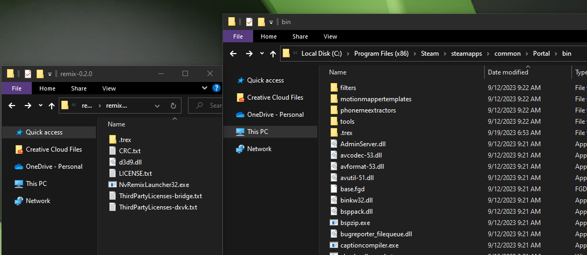
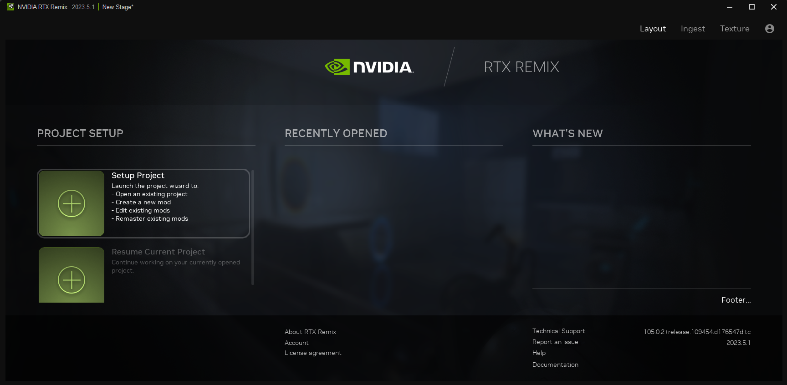

# Learning & Essential Skills

## Requirements

* RTX Remix Runtime & Renderer Applications

> 📝 Refer to our Installation Guidefor both the **RTX Remix Runtime** and the **RTX Remix Renderer**.

### Requirements For Creators

* Windows 10 or 11
* [Python](https://www.python.org/downloads/)
* [NVIDIA Omniverse](https://www.nvidia.com/en-us/omniverse/download/)

### Requirements for Developers

* Windows 10 or 11
* [Visual Studio](https://visualstudio.microsoft.com/vs/older-downloads/) _VS 2019 or newer_
* [Windows SDK and emulator](https://developer.microsoft.com/en-us/windows/downloads/sdk-archive/) _10.0.19041.0 or newer_
*  [Meson](https://mesonbuild.com/) _V0.61.4 or newer_
    * Please Note that v1.2.0 does not work (missing library)
    * Follow these [instructions](https://mesonbuild.com/SimpleStart.html#installing-meson) on how to install and reboot the PC before
* [Vulkan SDK](https://vulkan.lunarg.com/sdk/home#windows) _1.3.211.0 or newer_
    * Please Note that you may need to uninstall previous SDK if you have an old version
* [Python](https://www.python.org/downloads/) _version 3.9 or newer_


# Setup RTX Remix Runtime with your Game

<!--- 📺 _[Work In Progress]_ --->
<!--- #1 PORTAL TUTORIAL EXAMPLE VIDEO HERE: Setup RTX Remix Runtime --->
<!--- Need to add runtime setup documentaiton here for tutorial --->

## Tutorial: Setup RTX Remix Runtime with Portal using Portal RTX
To learn the process of setting up a game, here is an example of how to setup the RTX Remix Runtime for the Portal / Portal RTX.  (These instructions alsow work with HL2.) 

1. **Game Installation:** Make sure you have both Half-Life 2 and PortalRTX installed and fully updated.
2. **Backup CFG Folder:** Go to the cfg folder for Half-Life 2 / Portal (common\Portal\portal\cfg) and rename it to something like "original-cfg." This way, you won't delete any of the existing data.
3. **Copy CFG Contents:** Copy all the files from the cfg folder of PortalRTX (common\PortalRTX\portal_rtx\cfg) and paste them into the cfg folder of Half-Life 2 (common\Half-Life 2\hl2\cfg).
4. **Backup BIN Folder:** Similarly, go to the bin folder for Half-Life 2 (common\Portal\bin) and rename it to something like "original-bin" to preserve the data.
5. **Copy BIN Contents:** Copy all the files from the bin folder of PortalRTX (common\PortalRTX\bin) and paste them into the bin folder of Half-Life 2 (common\Half-Life 2\bin).
6. **Copy Configuration Files:** Copy the files named **rtx.conf** and **dxvk.conf** from "common\PortalRTX" to "common\Half-Life 2."
7. **RTXRemix Application:** Extract the contents of the RTXRemix Application (latest version) to "common\Half-Life 2\bin," and overwrite any existing files if prompted.
8. **Launch the Game:** Launch the game from your Steam library.
9. **Console Variables (if needed):** Depending on your preferences, you may need to set certain console variables. These can also be set via the command line. Here they are:
    1. Set DirectX Level to v.7.0
    2. Set r_3dsky to 0
    3. Set viewmodel_fov to 90
    4. Set cl_first_person_uses_world_model to 0
    5. Steam Launch Options Example: -dxlevel 70 -r_3dsky 0 -viewmodel_fov 90 -cl_first_person_uses_world_model 0

### How to Launch a Steam Game into different levels of DirectX

1. Open Steam
2. Go to the "Library"
3. Right-click the game which needs to be reconfigured
4. Select "Properties..." from the menu
5. Go to the section "Launch Options"
6. Remove any launch options currently shown in the input box
7. Type one of the DirectX level launch options specified below in the box
    1. DirectX Level Launch Options:
        1. “-dxlevel 90” (DirectX v9.0)
        2. “-dxlevel 81” (DirectX v8.1)
        3. “-dxlevel 80” (DirectX v8.0)
        4. “-dxlevel 70” (DirectX v7.0)


When preparing your game, the best place to start is by coping the contents of the remix-0.1.0 directory into the game’s directory, right next to the main executable of the game. You should end up with the d3d9.dll and .trex/ folder sitting right next to the main game executable. 
> ⚠️ Some games will search for d3d9.dll in a different directory other than the directory of the main game executable. For example, Source Engine games will search in the bin directory next to the main game executable for d3d9.dll instead.

Once RTX Remix files are in place, you can start the game normally. You can verify RTX Remix is working by checking for the splash message at the top of the screen when the game starts. It should say: “Welcome to NVIDIA Remix… ” and provide hotkey information to access the Remix menus.

### Support for Other Graphics APIs
While support for D3D9 is included in Remix out of the box, games that use other graphics APIs can also be made to work by utilizing translation layers that target D3D9. You will have to acquire these separately. For example, D3D8 games can be supported through D3D8to9 ([link](https://github.com/crosire/d3d8to9)).

1. Open the folder that contains the source files of the game you wish to mod.
2. Locate where the executible (.exe) file is stored.  This file is usually found inside a folder named "bin".
3. Copy and paste the Contents of the RTX Remix Runtime folder into the folder that contains the executible (.exe) file 



4. Ensure that the d3d9.dll file from the RTX Remix folder copies over the d3d9.dll file in the game folder.
5. Now, run the game.  If you can use  **Alt + X** to open up the user-end **User Graphics Settings** Remix menu, then you've successfully installed the Runtime 


### Performing Per Game Setup
If this is the first time RTX Remix is added for a given game, you may need to do some setup in order to get game menus and the game itself to display properly. You will need to open the RTX Remix developer menu to do this (more detailed documentation on this menu below).

1. Press Alt-X on the keyboard to bring up the User Graphics Settings Menu, and from here select Developer Settings Menu.
2. In Developer Settings, choose the tab for Game Setup, and then go to Step 1 – UI Textures. This section will give you a visual list of textures in the current scene. You need to tag every texture associated with UI components by clicking on them. This will let RTX Remix handle them properly, and not confuse them with in-game textures.
3. Once done, chances are you will be seeing the main menu of the game render correctly, as well as the game world itself.
4. Finally, press Save Settings at the bottom of the menu, to store your texture tagging configuration in a file called rtx.conf, which is generated next to your game executable. This way, you won’t have to go through setup again when restarting the game.
5. You can always return to the UI tagging menu if you encounter new UI textures while exploring the game.

With UI setup out of the way, you can perform an additional test to ensure RTX Remix is functioning correctly.

1. Go to the Enhancements tab in the RTX Remix Developer Menu, and press Capture Frame in USD.
2. This will create your first capture of the game, which you can use to remaster assets, materials and lights. Capture files will be placed in a special folder called rtx-remix/captures – this will be placed next to the game executable, when first created. The rtx_remix folder is also where pre-made RTX Remix mods will go, under folder mods.

> 📝  If you are having trouble, try launching your game in Direct X v.7 or lower
> ⚠️ Per game setup may be different depending on the game you are trying to remaster.  Join the [RTX Discord Community](http://discord.gg/rtxremix) where you can check out the **Remix-Projects** channel for help for the game you wish to remaster!  Check out the


## Take Your First Scene Capture

<!--- 📺 _[Work In Progress]_ --->
<!--- #2 PORTAL TUTORIAL EXAMPLE VIDEO HERE: Take Your First Scene Capture --->

### Introduction to Captures

RTX Remix is capable of creating asset-exact copies of in-game scenes in the Universal Scene Description (USD) format through a process referred to as “capturing”. Captured scenes (“captures”) can be opened and edited in both NVIDIA Omniverse-based applications, as well as most popular public Digital Content Creation (DCC) tools that support the USD file format.   Because the scene is captured into a USD file, all assets will likewise be available in a single common format. Captured assets include: materials, textures, meshes, and skeletal data for skinned assets, in addition to scene-specific instances and lighting.  Meshes and materials are converted into USD format, whereas textures are converted to DDS. These copies are then stored adjacent to the captures in similarly named folders.

#### How to Capture a Scene

1. Launch the game where you installed **RTX Runtime**.
2. Navigate to the first scene in the game and open the **Enhancements** tab of the Developer Settings Menu
    1. Option 1: Press **Alt + X** on your keyboard to open the RTX Runtime interface, click on the **Developer Settings Menu** button, then click on the **Enhancements** tab
    2. Option 2: Press **Ctrl + Shift + Q** on your keyboard to open the **Enhancements** Settings
3. If you don’t see the **Capture Frame in USD** button, uncheck the **Enable Enhanced Assets** checkbox to reveal it.  


4. Click on the **Capture Frame in USD** button to capture the frame.  The file will be saved in the format of (capture)_(year)_(month)_(day)_(hour)_(minutes)_(seconds).  This will also create a DDS thumbnail in a folder adjacent to the capture directory with the same name as the capture including the USD file type. 


## Setup Your First Project in RTX Remix in Omniverse

<!--- 📺 _[Work In Progress]_ --->
<!--- #3 PORTAL TUTORIAL EXAMPLE VIDEO HERE: Setup your first Project --->

Once you've captured your first game scene, you're all set to create a new project in Omniverse using the RTX Renderer. You'll notice that the RTX Runtime has made a folder called **rtx-remix**.  Inside this folder, you'll find all the materials, textures, lights, and meshes for the game scene you captured in USD format.

<!--- Reference anchor link in the note below --->
> ⚠️ Before creating your project file, please see the section on _Renaming Captures_ in the_ Best Practices_ section.

1. First, let's make a project folder to contain the files we well be working on
    1. In your file explorer, locate the **rtx-remix** folder that contains your Remix captures
    2. In the **rtx-remix** folder, you will need to create 2 new folders.  One called “mods” and one to house your project files, for now, we will call that folder “project”
2. Now launch the Omniverse **RTX Remix** Application 

 

3. Select **Setup Project** from the Project Setup panel to open the the **RTX Remix Project Wizard** 


4. Click the Plus Icon labeled **Create** in the Project Wizard
5. In the Project File Directory, navigate to the file path where you created your “project” folder.  Type your file name and select the file type. 


6. In the Remix Directory, navigate to the file path containing your **rtx-remix** folder
7. Select the capture.usd file you wish to remaster and select “**Create**”. 

 to create your project file.

8. You should now see your usd file loaded into the project viewer under the **Layout** tab where you can see the **Mod Setup**, **Asset Replacements**, and **Mod Packaging** details. 


<!--- 9. _[Work In Progress]_   --->


## Introduction to Model Replacement

<!--- 📺 _[Work In Progress]_ --->
<!--- #4 PORTAL TUTORIAL VIDEO: Introduction to Model Replacement (ingesting a model, replacing a model, ingesting model texture, replacing model texture) --->

In Remix, models are a core part of enhancing your game, and they'll make up most of your work.  This tutorial will focus on the workflow for models, but it shares some similarities with replacing world textures.


### Ingesting a Model

The RTX Remix tool takes assets from a game capture and cleans them up by removing certain elements, such as particular shaders and texture formats.

<!--- # 6 below needs anchor reference --->
1. **File Format**: Ensure your model is in an acceptable format (see the _Format_ Section for more details on what is acceptable) and load it into Remix
2. **Access Ingest Tab**: Go to the Remix window, find the **Ingest** tab on the top right, and select the **Model(s)** from the vertical left tabs
3. **Input Model**: Upload your source model file by clicking on the **Add** button under the **Input File Path** panel.  
4. **Mass Model Ingestion (optional):** After adding your models into the Input File Path panel, click the **Add to Queue** button to perform a massive ingestion.
5. **Set Output Directory**: In the Output Directory box, navigate to the file path where your project folder is located
6. **Choose Output Format**: Decide between a .usd, .usdc, or .usda file format (see the _Formats _section for more details)
7. **Run Ingestion**: Select the Validation tab from the vertical right menu tabs and select **Run** to run the ingestion process.

> ⚠️ Issues with Ingestion will be highlighted in red with corresponding error messages.

> 📝 All Ingested files, even textures & models, will have MetaData files.


### Replacing a Model

1. **Access Stage**: Go to the "Stage" tab on the top right.
2. **Select Asset Replacements**: Choose the "Asset Replacements" tab on the left.
3. **Layers**: In the top left, you'll see layers. Select your desired layer as the edit target.
4. **Choose Mesh**: Pick your mesh for replacement.
5. **Selection Tab**: Look at the "Selection" tab, where you'll find the original model hash and the converted/captured USD.
6. **Add New Reference**: Click "Add New Reference" and navigate to the ingested model.
7. **Adjust Position and Properties**: Modify the positioning, orientation, and scale using "Object Properties" until it matches the original. You can then safely delete the original captured asset and save that layer.


## Ingesting Model Textures


1. **Ingest**: Go to the **Ingest** tab and select "Texture Ingestion."
2. **Add Texture**: Click "add" and upload the texture you want (PNG or DDS).
3. **Assign Texture Channel (Optional)**:  You have the flexibility to assign the texture to one of seven channels: Diffuse, Emissive Mask, Metallic, Normal - OpenGL, Normal - DirectX, Roughness, or Other. Choose "Other" if you prefer a standardized ingestion without changing the name. While this step is optional, it's usually automated for your convenience.
4. **Output Directory**: Set an output directory within your project file structure.
5. **Run Ingestion**: Click "run" to export the texture. The output directory will contain additional files, but you only need the converted DDS for in-game use.


### Replacing a Model Texture

1. **Stage**: Access "Stage" and go to the "Asset Replacements" tab.
2. **Layers**: Choose your layer as the edit target.
3. **Select Mesh**: Pick your mesh.
4. **Material Properties**: Look for "Material Properties" at the bottom. Assign textures, adjust settings, and save the layer.


### Translucency

**Convert to Translucent:** Translucency is handled in the Ingestion process.  If a material has the word “translucent” or “glass” or “trans” in the name, it will be converted automatically into a translucent material. 


### Emissive Elements

**Emissive Textures:** To make parts of a model emit light, go to the "emissive" tab, tick "Enable Emission," and assign the Emissive Mask map texture. Adjust the Emissive Intensity value as needed.


### Animated Models

**Animated Models**: Remix can't keep weight data for bones on a replaced mesh, so for animated models, first replace the model in-engine and run a new capture with the replaced model. Then, assign ingested PBR textures via Remix to preserve animations. Keep in mind that game performance will control animated models instead of Remix.

**Animated Models:** If your game uses GPU-based skeleton animation, you can replace a 3D model with a new one that shares the same skeleton. This new model will automatically inherit the animation from the original model's bone transformations.

Here's how it works:

**Skeleton Data in the USD Capture**: If the 3D model you want to replace includes skeleton data, you can create a replacement model that uses the same skeleton. This replacement will also be animated.

However, there are some important things to keep in mind:

1. **Bone Indices and Weights:** The runtime of the game only reads bone indices and weights for each vertex from replacement models.
2. **Skeleton Changes:** Modeling tools sometimes alter the skeleton during import/export, which can break the mapping. The tool supports remapping back to the original vertices, but you may need to specify the mapping manually.
3. **Limited Skeleton Information:** The game's skeleton sent to the GPU contains information only from the bind pose to the current pose. This means we can't reconstruct the bind pose or hierarchy, making skinning more challenging.
4. **Differing Joint Counts:** The game's skeleton often has fewer joints than the higher-poly replacement. In such cases, you'll need to remap the joints.

While these issues can be addressed with potential tool features, for now, skinned replacements may require expertise to handle. We're working on making this process more user-friendly, but until then, it's best suited for experienced users who are comfortable with these intricacies.


### Anchor Models

**Anchor Models**: In Remix, there's a situation where some parts of the game's 3D objects can't be easily replaced with new, stable models. This problem typically occurs in older games, especially when the game decides not to show certain parts of the game world because the player can't see them. When this happens, it messes with the identification codes (hashes) of these objects, as they move in and out of the player's view.

To fix this issue, you can create a kind of "stand-in" model, or as we like to call them, **Anchor Models**, in the game level. Think of it as an "anchor" that keeps track of where the full model replacement should go. You'll have to do this for every occurrence of the object you want to replace. Ideally, you should modify the game's levels to make this work seamlessly. But if that's not possible, you can also use a unique prop (a game object) as long as it's not used anywhere else in the game. This unique prop serves as the anchor for the new model, making sure it appears correctly even when parts of the world are hidden from view.


## Introduction to Material Replacement

<!--- 📺 _[Work In Progress]_ --->
<!--- #5 PORTAL TUTORIAL VIDEO: Introduction to Material Replacement (ingesting a texture, replacing a texture) --->

In Remix, materials on meshes get a PBR (Physically-Based Rendering) makeover, allowing you to use high-quality and more physically accurate textures in your game. In this tutorial, we'll focus on replacing materials for world geometry. If you want to replace materials on models, check out the Model Replacement section of this guide.


### Ingesting a Texture

1. **Texture Format**: Ensure your textures are in an acceptable format (see the _Format_ Section for more details on what is acceptable) and load it into Remix
2. **Access Ingest Tab**: Go to the Remix window, find the **Ingest** tab on the top right, and select the **Material(s)** from the vertical left tabs
3. **Input Texture**: Upload your source texture file by clicking on the **Add** button under the **Input File Path** panel.  
4. **Mass Material Ingestion (optional):** After adding your materials into the Input File Path panel, click the **Add to Queue** button to perform a massive ingestion.
5. **Texture Channels (Optional):** You have the flexibility to assign the texture to one of seven channels: Diffuse, Emissive Mask, Metallic, Normal - OpenGL, Normal - DirectX, Roughness, or Other. Choose "Other" if you prefer a standardized ingestion without changing the name. While this step is optional, it's usually automated for your convenience.
6. **Set Output Directory**: In the Output Directory box, navigate to the file path where your project folder is located
7. **Run Ingestion**: Select the Validation tab from the vertical right menu tabs and select **Run** to run the ingestion process.

> ⚠️ Issues with Ingestion will be highlighted in red with corresponding error messages.

> 📝 All Ingested files, even textures & models, will have MetaData files.


### Replacing a Texture

1. **Access Stage:** Go to the **Layout** tab on the top right.
2. **Select Asset Replacements:** Choose the "Asset Replacements" tab on the left.
3. **Layers:** In the top left, you'll find layers. Mark your desired layer as the edit target.
4. **Choose Mesh:** Select the mesh you want to modify.
5. **Material Properties:** At the bottom of the tab, find "Material Properties." Each tab helps you configure the captured material, including textures and settings like emissive intensity.
6. **Texture Replacement:** Pick the drop-down menu relevant to your texture type, then use the "browse" GUI to apply the ingested texture.
7. **Save Layer:** After applying the texture, save the layer. Your texture will now be visible in the game.


### Checking Hash Stability

World geometry has unstable hashes in many older games due to culling mechanisms. To check hash stability, follow these steps:

1. **In-Game Debugging:** In-game, press Alt+X, scroll down to the "Debug" tab under "Rendering", and enable "Debug View".
2. **Check Hash Stability:** To make sure that everything is working smoothly, switch to "Geometry Hash" in the debug view. If you notice a model, texture, or a part of the game world changing color in this view, that's a sign that the hash isn't stable. In such cases, you might need to use a workaround, and replacing it might not be an option.


### Animated Textures

Dealing with animated textures requires some extra steps:

1. **Capture Each Frame:** Slow down the game's framerate and capture each frame of the animated texture.
2. **Use Anchor Textures:** Create a series of Anchor or stand-in textures for each animation frame and render them into a test level to capture the hashes.


#### Animated Textures using a Sprite Sheet

To bring animations from a sprite sheet into the application, it's a simple process. The user just needs to specify three things: 
1. The number of rows
1. The number of columns
1. The desired frames per second

Once you've set these values, ensure that all your textures are configured to use sprite sheet textures.

A key point to remember is that the spritesheet should be organized from left to right, and from top to bottom, just like the example image presented below:

<!---  --->


> ⚠️ Please be aware that there is a feature gap in the MDL. The runtime will treat all textures as spritesheets, whereas the MDL only treats emissive textures as spritesheets.


## Introduction to Remastering

Now that you've got everything set up, it's time to start remastering your game using Remix. The Remix runtime will automatically inject path tracing into the game, but the main focus of your Remix mod will be on replacing assets and textures. By using higher-poly models and PBR (Physically-Based Rendering) textures, you can significantly enhance the game's visual quality, surpassing what you could achieve with in-engine edits alone.


### Understanding CONF Files

Before we dive into replacing assets, let's take a moment to get familiar with the settings in the **Alt+X** menu, specifically in the "game setup" tab. Here, you'll find functions that allow you to change how certain textures in the game are rendered. Keep in mind that these options can vary depending on the game you're working on, but the tooltips should provide some initial guidance.

For instance, marking a texture as a "sky texture" will automatically make it emissive and ensure it's always visible to the player, even if it's in a separate space like the skybox (this is particularly important in Source Engine games). It's also a good idea to mark UI textures to make sure they aren't affected by the new rendering pipeline. If you want more detailed information on how these settings work, you can refer to the dedicated **RTX.conf** breakdown.


## Best Practices


### Folder Structure

RTX Remix automatically organizes the captures you take within a simple folder structure.

```text
rtx-remix
└ captures
│ └ capture_(year)_(month)_(day)_(hour)_(minutes)_(seconds).usd
│ └ gameicon.exe_icon
│ ├ lights
│ ├ materials
│ ├ meshes
│ ├ textures
│ ├ thumbs
└ mods ← Manually Made
└ project ← Manually Made
│ ├ models
│ ├ materials
```

It might be helpful to create a desktop shortcut to this rtx-remix folder and rename that shortcut to your preferred project name.  You will need to create a “mods” folder inside this rtx-remix folder.  You may also want to create a project folder to contain the files you’ll be working on.


### Organizing Your Captures

During a big mod project, you might take lots of captures to capture everything you want to change in the game. To keep things organized, it's a good idea to give these pictures names that make sense, like naming them based on the part of the game they belong to. For example, you can choose to add a "ch1_" in front of the name for captures you took in chapter one.

> ⚠️ If you want to change the name of a capture, it's best to do it before creating a project in RTX Remix. Once a project with the capture is made, trying to change the capture's name will cause the project to fail when loading the capture. You can only rename the capture if it's not being used in any projects. \

### Layers

When you create your mod, a file called mod.usda serves as the main control center for your project. It's like the top-level manager. Now, while you can put all your replacement work in this mod.usda, you can also use multiple USDAs stacked on top of each other to keep things organized.

As your mod grows, that single mod.usda file can become massive, potentially reaching thousands or even tens of thousands of lines. The advantage of using USDAs is that they're in a format that's easy to read (ASCII), so you can edit them outside of Remix. This comes in handy when you need to fix any issues with your assets or when multiple people are collaborating in Remix. So, keeping your USDAs organized is crucial for your own peace of mind in the long run.

Before you dive into making replacements, it's smart to think about the kinds of assets you'll be working with. For example, if you're adding new 3D models and new materials to the game world, it's a good idea to split these replacements into different layers. And if the game you're remastering is extensive, you might even want to organize things on a chapter-by-chapter basis.

Remember, there can be such a thing as too much organization, but breaking down your mod into component layers will make it way easier to keep track of all your changes in the long haul.


### Storing Files (Source + Ingested)

Remember the project folder you made in the "SETTING UP PROJECT" section? That's where all the in-game files belong, and it's connected to the game's rtx-remix mod folder through a special shortcut called a symlink. This symlink acts like a shortcut, but it's also where the folder is supposed to be.

Now, to keep things neat and tidy, both for yourself and for the people who will use your mod, it's a good idea to make extra folders inside this project folder. These new folders should organize assets in a way that matches the layers we talked about earlier.

Here's another important point: for the files to work properly in Remix, they need to go through a process called **Ingest**. It's smart to set up another folder structure next to your main project folders. This new structure will hold your original assets, like .fbx files (3D models) and png textures, organized in a way that matches your main project folders.

Now, keep in mind that these two sets of folders, the ones for your in-game files and the ones for your source assets, will start taking up quite a bit of space on your computer over time. So, it might be a good idea to consider a versioning system, especially if you're working with a team of people. This helps keep everything organized and makes it easier to collaborate.


### Building a Team

Revamping an entire game is a big challenge, so you might think about forming a team to help out. Remix mods focus a lot on art, and even if your mod involves changing how the game works, it's a good idea to set up a structure that allows multiple artists to collaborate efficiently.

You may want to pick one or two people to handle the Remix setup and asset preparation. This helps avoid confusion and keeps everything consistent. Having too many people involved in this part could lead to mistakes and differences in the project files.