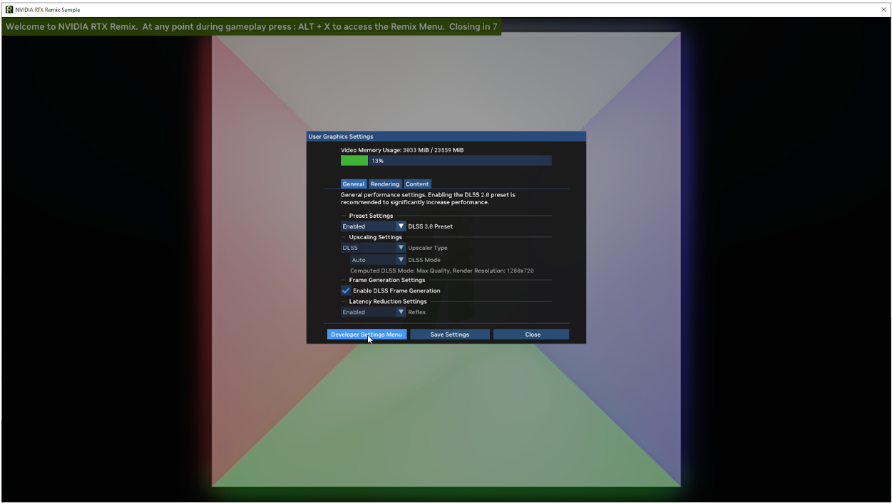
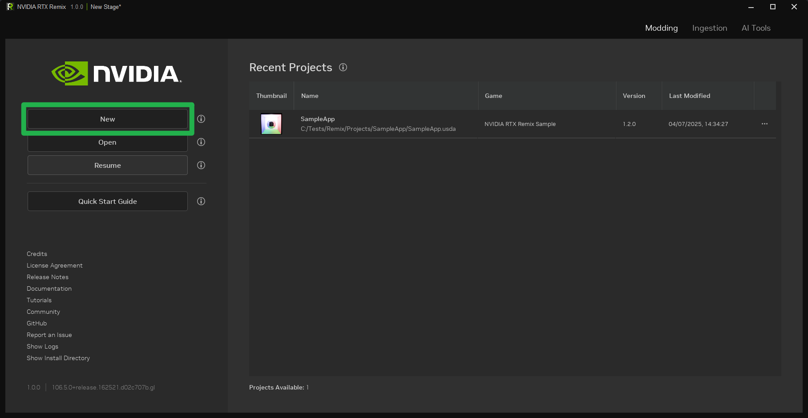
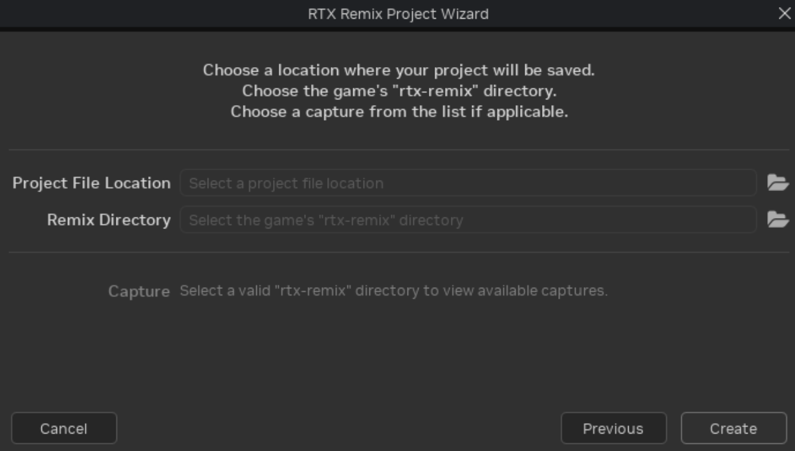

# Building Your First Mod for the RTX Remix Sample

To begin creating your first mod, it is recommended to follow the steps outlined in the documentation.

The recommended steps are:

1. [Install the RTX Remix Runtime](../installation/install-runtime.md)
2. [Install the RTX Remix Toolkit](../installation/install-toolkit.md)
3. [Setup the RTX Remix Runtime for the Sample Application](../gettingstarted/learning-runtimesetup.md)
4. [Create a Project for the Sample Application mod](../gettingstarted/learning-toolkitsetup.md)
5. [Ingest and Replace Assets](../howto/learning-assets.md)

This tutorial provides a practical approach to building a mod for the RTX Remix Sample Application, following the
documented steps.

For detailed information on each step, please refer to the corresponding documentation sections.

## 1. Install the RTX Remix Runtime

For this tutorial, the RTX Remix Runtime bundled with the RTX Remix Toolkit will be used. Therefore, proceed directly to
Step 2.

## 2. Install the RTX Remix Toolkit

The RTX Remix Toolkit can be installed most conveniently by downloading the latest version from
the [NVIDIA App](https://www.nvidia.com/en-us/software/nvidia-app/). Visit the website to download the installer.

After installing the NVIDIA App, launch it and install the `RTX Remix` application.

```{important}
If the RTX Remix application is not available for installation, the system may not meet
the [minimum system requirements](../introduction/intro-requirements.md#requirements-for-modders-and-gamers).

If the hardware meets the requirements but the application is still unavailable, ensure that the latest drivers are
installed.
```

## 3. Setup the RTX Remix Runtime for the Sample Application

With both the RTX Remix Runtime and the RTX Remix Toolkit installed, the RTX Remix Runtime can now be set up for the
Sample Application.

1. [Locate the RTX Remix Toolkit installation directory](../remix-faq.md#how-can-i-locate-the-rtx-remix-toolkit-installation-folder).
   This can be done by opening the RTX Remix Toolkit and clicking the `Show Install Directory` button on the home
   screen.

   

2. Navigate to the
   <code>
   [<INSTALL_DIRECTORY>](../remix-faq.md#how-can-i-locate-the-rtx-remix-toolkit-installation-folder)\deps\remix_runtime
   </code>
   directory. It contains two subdirectories: `runtime` and `sample`.

   

3. Install the RTX Remix Runtime by copying the contents of the `runtime` directory into the `sample` directory.

   

4. The RTX Remix Sample Application can now be launched by double-clicking the `RemixSample.exe` file. The following
   window should appear:

   

5. Since the Sample Application is simple and
   lacks [UI Textures](../gettingstarted/learning-runtimesetup.md#setting-up-ui-textures), that step can be skipped.

   Proceed to capturing the first scene.

   Open the RTX Remix "Graphics Settings Menu" by pressing `Alt+X`. Then, open the `Developer Settings Menu` by clicking
   the button labeled "Developer Settings Menu."

   

6. In the "Developer Settings Menu," click the `Enhancements Tab` to display the "Enhancements" settings, which include
   capture settings.

   

7. **After disabling enhancements**, a name can be specified for the capture. Then, click the `Capture Scene` button.

   This action captures the current frame and saves a USD file containing all data to disk. The progress bar indicates
   the capture progress. Once it reaches 100%, setting up the RTX Remix Toolkit project can begin.

   

## Create a Project for the Sample Application Mod

With the Sample Application captured, a project for the Sample Application mod can be created.

1. Launch the RTX Remix Toolkit from the NVIDIA App. After the app starts, click the `New` button to open the Project
   Creation Wizard.

   

2. In the "RTX Remix Project Wizard," select the `Create` button to begin creating a new project.

   

3. Click the
   {.svg-icon} button for the
   `Project File Location` field to select a file path for the mod.

   

4. In the file browser, **create a new directory** for the project using the context menu (right-click menu). Then,
   **define a file name** for the project layer and select the USDA file type.

   Saving the project layer as a USDA file is recommended, as file readability is more important than performance in
   this scenario.

   Any errors detected in the selected file path will be displayed in the dialog box.

   ```{seealso}
   Now would be a good time to read through the Best Practices section of the documentation.

   The [Choosing Project Directories](../howto/learning-bestpractices.md#choosing-project-directories) section contains
   valuable information about where to place project directory created in this step.
   ```

   

5. Next, click the 
   {.svg-icon} button for the `Remix Directory` field.

   Select the `rtx-remix` directory created earlier during the Sample Application capture.

   Refer back to [step 3](#3-setup-the-rtx-remix-runtime-for-the-sample-application) to locate the Sample Application
   directory. The `rtx-remix` directory is located inside the `sample` directory.

6. With the project file location and remix directory configured, select the previously captured scene and click the
   `Create` button.

   ```{note}
   A prompt will appear, requesting permission for the RTX Remix Toolkit to perform an action as administrator. This
   permission is necessary to symlink the project into the game.

   For more information on why this permission is required, refer to the
   following [article](https://learn.microsoft.com/en-us/windows/security/threat-protection/security-policy-settings/create-symbolic-links)
   from Microsoft.
   ```

7. An RTX Remix Project is now created and ready for authoring.

   

## Ingest and Replace Assets

With a project created, asset replacement in the mod can begin.

Let's replace the {.svg-icon}
mesh with an updated asset.

The following disco ball asset can be used for testing:
[SM_Prop_Discoball](https://d4i3qtqj3r0z5.cloudfront.net/SM_Prop_DiscoBall%402.zip)

1. Before the asset can be used in the mod, it must be ingested. Navigate to the `Ingest` tab.

   

2. Drag and drop the downloaded asset (or any other desired asset) into the `Input File Paths` area.

3. Click the `Add to Queue` button to add the asset to the ingestion queue. The process is complete when the asset has a
   progress of 100% and the progress bar turns green.

   ```{tip}
   The ingested asset output directory can be configured. However, a default output directory is provided.

   If the output directory is not configured manually, the ingested asset is placed in the following directory:
   `<PROJECT_DIRECTORY>\assets\ingested`.
   ```

4. With the asset ingested, it's time to replace the captured asset. Return to the `Modding` tab.

5. Select the asset to be replaced. In this case, select
   the {.svg-icon} mesh in
   the viewport.

   After selecting the asset, ensure that the reference is selected in
   the ["Selection" panel](../howto/learning-toolkit.md#selection-panel). Then, click
   the {.svg-icon} button in
   the `Object Properties` panel to select the newly ingested asset.

   

6. After replacing the asset, transform it (translate, rotate, and scale) as needed to match the original asset. Use the
   `Object Properties` panel to perform these transformations.

   The new asset should now be visible in the viewport.

   

7. To view the changes in-game, save the mod (`CTRL+S`) and launch the `RemixSample.exe` executable.

   The updated asset should now appear in the game.

   

Congratulations! Your first RTX Remix mod was successfully created.

***
<sub> Need to leave feedback about the RTX Remix Documentation?  [Click here](https://github.com/NVIDIAGameWorks/rtx-remix/issues/new?assignees=nvdamien&labels=documentation%2Cfeedback%2Ctriage&projects=&template=documentation_feedback.yml&title=%5BDocumentation+feedback%5D%3A+) </sub>
