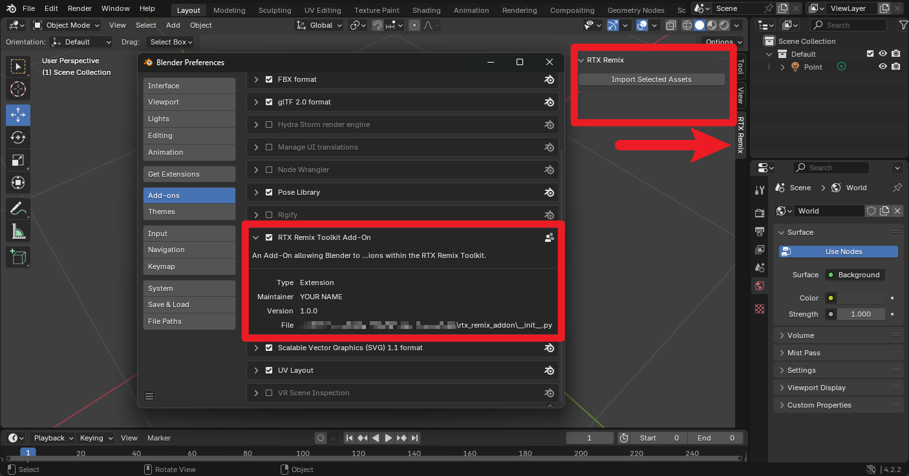
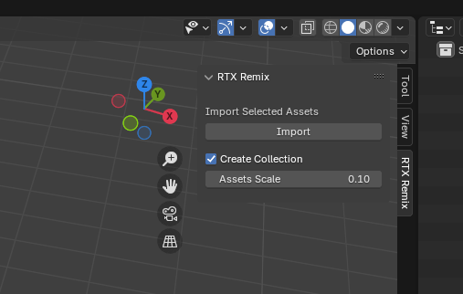
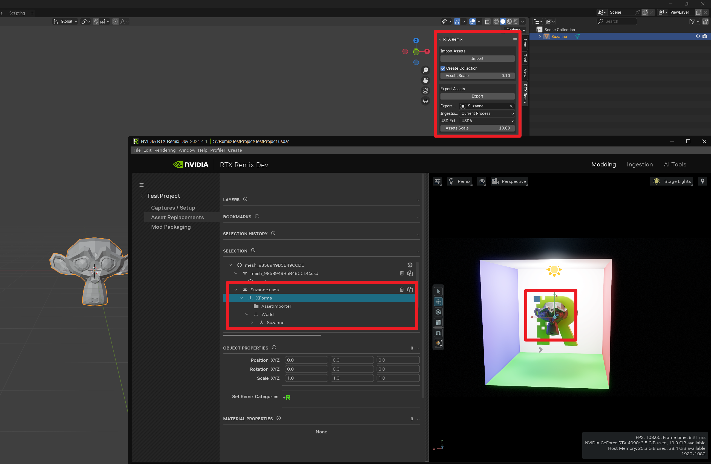

# Create a Blender Add-On using the REST API

This tutorial will guide you through building a Blender add-on that communicates with an external application using REST
APIs.

A Blender add-on consists of code that adds new functionality to the Blender software. It can be used to extend the
capabilities of Blender or to integrate it with other software.

We will specifically focus on the RTX Remix REST API, but the process should be the same for any other REST API.

To follow this tutorial, you should have a basic understanding of the Python programming language and Blender.

---

## Requirements

Before you start building a Blender Add-On, you will need to make sure the following requirements are installed:

- [Blender](https://www.blender.org/)
- [Python](https://www.python.org/downloads/) ([version 3.11 or greater](https://studio.blender.org/pipeline/td-guide/python))
- [RTX Remix Toolkit](https://docs.omniverse.nvidia.com/kit/docs/rtx_remix/2024.4.1/docs/remix-installation.html#install-the-rtx-remix-toolkit) (
  version 2024.4.0 or greater)

**Optional:**

- A code editor of your choice may work better than Blender's built-in Scripting window:
    - [Visual Studio Code](https://code.visualstudio.com/)
        - [Python Setup](https://code.visualstudio.com/docs/python/python-tutorial)
    - [JetBrains PyCharm](https://www.jetbrains.com/pycharm/)

- Version-controlling your code using a tool like Git is a good idea.
    - [Git](https://git-scm.com/)
    - [A GitHub Account](https://github.com/)

---

## Completed Tutorial Code

If you need to access the code produced in this tutorial, you can download it by clicking on the following
link: <a class="reference external" href="../zips/rtx_remix_addon.zip" target="_blank">Download Code</a>.

---

## Understanding the Architecture

At a very high level, the architecture of an RTX Remix Blender Add-On will be as follows:

- The Add-On will be built using the [Blender Python API](https://docs.blender.org/api/current/)
    - Blender Add-Ons are created using Python scripts.
    - The Add-On's script defines the behavior of the Add-On, including the creation of UI, communication with the
      REST API, and more.
        - Panels are the UI components that are displayed in the Blender interface.
        - Operators are the actions that are triggered when a user interacts with a panel.


- The Add-On will communicate with the RTX Remix Toolkit using
  the [REST API](https://docs.omniverse.nvidia.com/kit/docs/rtx_remix/latest/docs/toolkitinterface/remix-toolkitinterface-restapi.html)
    - A [REST API](https://www.geeksforgeeks.org/rest-api-introduction/) is a way for different programs to communicate
      with each-other without requiring explicit connections between them. Think of it like a set of rules for how to
      request and send information.
    - The RTX Remix
      Toolkit [REST API](https://docs.omniverse.nvidia.com/kit/docs/rtx_remix/latest/docs/toolkitinterface/remix-toolkitinterface-restapi.html)
      allows any external application to get the selected assets or textures, start an ingestion process, replace a
      reference, and more.
        - All of these actions are defined in the REST API as `endpoints`.


- Using the RTX API, the Add-On will be able to execute any of the functions, and get information from any
  of [the endpoints](https://docs.omniverse.nvidia.com/kit/docs/rtx_remix/latest/docs/toolkitinterface/remix-toolkitinterface-restapi-docs.html)
  defined in the REST API

**NOTE:** The Add-On will require the RTX Remix Toolkit to be open for the Add-On to be able to send HTTP requests to
the REST API server that is created when the Toolkit starts up.

---

## Getting Started

### Setting up your Code Editor

1. Open your preferred Code Editor
2. Create a new Project/Directory for your Add-On
3. Create a new Python script called `rtx_remix_addon.py`

### [OPTIONAL] Opening/Closing the Blender Console Window

Since we will be building a Blender Add-On, opening the Blender console could give us a better idea of what is going on
during our script's execution.

1. Select the `Window` menu
2. Click the `Toggle System Console` entry

That will open the console in a separate window, making it easier to see what is going on.

To close the console, simply repeat the same steps.

---

## Blender Add-On File Structure

In order to keep the code organized and make sure the Add-On can be extended easily, we will separate the code
into multiple modules.

To read more about Python modules packages, see [this article](https://www.geeksforgeeks.org/python-packages/).

Even though we only plan on building a single panel with multiple operators, we will use the following file structure to
ensure the Add-On is well organized and extendable:

```
rtx_remix_addon/
    blender_manifest.toml
    __init__.py
    operators/
        __init__.py
        operator1.py
        operator2.py
        ...
    panels/
        __init__.py
        panel1.py
        panel2.py
        ...
    properties/
        __init__.py
        property1.py
        property2.py
        ...
    utils/
        __init__.py
        utils1.py
        utils2.py
        ...
```

Given the Add-On we want to start building, and the file structure described above, we should have the following file
structure:

```
rtx_remix_addon/
    blender_manifest.toml
    __init__.py
    operators/
        __init__.py
        import_assets_operator.py
    panels/
        __init__.py
        viewport_panel.py
```

**If not done already, you should create this file structure in your Code Editor.**

---

## Building a Blender Add-On

The best starting point to build a Blender Add-On is to start
with [Blender's own tutorial](https://docs.blender.org/manual/en/latest/advanced/scripting/addon_tutorial.html).

This tutorial will be focused on an Add-On that works with the RTX Remix Toolkit.

### `rtx_remix_addon/blender_manifest.py`

Since Blender 4.2, Add-Ons need to define a `blender_manifest.toml` file in the same directory as the Add-On in order
to be recognized by the Add-On manager.

```toml
id = "rtx_remix_addon"

name = "RTX Remix Toolkit Add-On"
maintainer = "YOUR NAME <you@email.com>"

type = "Add-On"

version = "1.0.0"
schema_version = "1.0.0"
blender_version_min = "4.2.0"

tagline = "An Add-On allowing Blender to perform actions within the RTX Remix Toolkit"

license = ["SPDX:GPL-3.0-or-later"]
```

### `rtx_remix_addon/__init__.py`

The top-level `__init__.py` file will import the submodules and ensure they are registered when the Add-On is
enabled.

Don't worry if some methods are undefined at this moment, we will be defining them in the following steps.

```python
from .operators import register as register_operators
from .operators import unregister as unregister_operators
from .panels import register as register_panels
from .panels import unregister as unregister_panels


def register():
    register_operators()
    register_panels()


def unregister():
    unregister_panels()
    unregister_operators()


if __name__ == "__main__":
    register()
```

### `rtx_remix_addon/operators/__init__.py`

`__init__.py` files within the sub-folders will import the various panels, operators, or other classes defined within
their package. This will make sure that the module is available to the top-level `__init__.py` file.

Furthermore, the `register` and `unregister` functions should register the various classes defined in the package in
Blender using the Blender Python API module.

Once again, don't worry if some classes are undefined at this moment, we will be defining them in the following steps.

```python
import bpy

from .import_assets_operator import REMIX_OT_ImportAssets


def register():
    bpy.utils.register_class(REMIX_OT_ImportAssets)


def unregister():
    bpy.utils.unregister_class(REMIX_OT_ImportAssets)


if __name__ == "__main__":
    register()
```

### `rtx_remix_addon/operators/import_assets_operator.py`

This class defines a basic operator which is a function that can be called from Blender's interface. The `execute`
method defines what happens when the operator is called. In this case, it just reports a message and signals to Blender
that its job is done.

```python
import bpy


class REMIX_OT_ImportAssets(bpy.types.Operator):
    bl_idname = "rtx_remix.import_selected_assets"
    bl_label = "Import Selected Assets"
    bl_description = "Import the assets selected in the RTX Remix Toolkit"
    bl_options = {"REGISTER", "UNDO"}  # Enable undo for the operator.

    def execute(self, context):
        self.report({"INFO"}, "Operator executed")
        return {"FINISHED"}
```

### `rtx_remix_addon/panels/__init__.py`

The `__init__.py` files within this package will have the same purpose as the `__init__.py` files within the `operators`
package.

```python
import bpy

from .viewport_panel import REMIX_PT_ViewportPanel


def register():
    bpy.utils.register_class(REMIX_PT_ViewportPanel)


def unregister():
    bpy.utils.unregister_class(REMIX_PT_ViewportPanel)


if __name__ == "__main__":
    register()
```

### `rtx_remix_addon/panels/viewport_panel.py`

This class defines a panel in Blender's interface. The `draw` method defines what appears in the panel. Here, it adds a
button to call our Import Assets operator.

```python
import bpy

from ..operators import REMIX_OT_ImportAssets


class REMIX_PT_ViewportPanel(bpy.types.Panel):
    bl_label = "RTX Remix"
    bl_idname = "REMIX_PT_ViewportPanel"
    bl_space_type = "VIEW_3D"
    bl_region_type = "UI"
    bl_category = "RTX Remix"

    def draw(self, context):
        self.layout.operator(REMIX_OT_ImportAssets.bl_idname)
```

### We have a basic Add-On!

At this point, you could skip ahead to the [Installing the Blender Add-On](#installing-the-blender-add-on) section and
start testing your Add-On in Blender.

However, the Add-On is currently quite limited in its capabilities, so the next section of this tutorial will focus on
expanding its functionality by utilizing the RTX Remix Toolkit REST API.

### [OPTIONAL] Git Repository Structure

If you are using Git, the `rtx_remix_addon` folder should be a subdirectory in your Git repository like such:

```
Blender-RTX-Remix/
    .gitignore
    LICENSE.md
    README.md
    rtx_remix_addon/
        blender_manifest.toml
        __init__.py
        operators/
            __init__.py
            import_assets_operator.py
        panels/
            __init__.py
            viewport_panel.py
```

---

## Adding Remix Functionality using the REST API

Now that we have a well organized Add-On with the necessary files, let's add some actual functionality using the
RTX Remix Toolkit REST API.

As described in the [Understanding the Architecture](#understanding-the-architecture) section, we now need the Add-On to
send HTTP requests to the REST API

To begin, we will start by writing a simple wrapper around the `requests` module to send the HTTP requests to the REST
API.

### Prim Utils

Although used later in this tutorial, we will now create a utility class to work with prims, or more specifically, prim
paths in this instance.

Create a `rtx_remix_addon/utils/prims.py` file and start by importing the required modules.

#### Import the required modules

```python
import re
```

The `re` module will be used to execute [regular expressions](https://www.geeksforgeeks.org/python-regex/) on prim paths
received from the REST API.

#### Create the utility class

```python
class PrimsUtils:
```

Since the `PrimsUtils` doesn't need any attributes, we will leave it empty.

#### Create a utility method to get a root mesh path from a referenced mesh

```python
@staticmethod
def get_mesh_path(prim_path: str) -> str | None:
    """
    Get the root mesh path from a refrence prim path using regular expressions.

    Examples:
        /RootNode/meshes/mesh_HASH/mesh -> /RootNode/meshes/mesh_HASH

    Args:
        prim_path: The prim path to get the mesh path from

    Returns:
        The mesh path if the prim path matches the pattern, otherwise None
    """
    mesh_pattern = r"^(.*mesh_[A-Z0-9]{16}(?:_[0-9])*)\/.*$"
    pattern_match = re.match(mesh_pattern, prim_path)
    if pattern_match:
        return pattern_match.group(1)
    return None
```

The `get_mesh_path` method defined above will take a prim path as an argument. It will return the base mesh path if the
prim path matches a specific pattern. Otherwise, it will return `None`. For more details, refer to the example in the
docstring.

That's the only prim utility method we need for now.

### REST API Utils

We will now write a utility class to wrap HTTP requests into easy-to-use Python methods.

To create the various utility methods,
the [RTX Remix REST API documentation](https://docs.omniverse.nvidia.com/kit/docs/rtx_remix/latest/docs/toolkitinterface/remix-toolkitinterface-restapi-docs.html)
can be used to get information on the possible query parameters, body contents, return values, etc.

Create a `rtx_remix_addon/utils/api.py` file and start by importing the required modules.

#### Import the required modules

```python
import requests
import json
from http import HTTPMethod
from pathlib import Path
```

The `requests` module will be used to send HTTP requests to the REST API. The `json` module will be used to convert
data to JSON format. The `http` module will be used to define the HTTP method to use for the request. Lastly, the
`pathlib` module will be used to manipulate file paths.

#### Create the utility class

```python
class APIUtils:
    def __init__(self, base_url: str = "http://127.0.0.1:8011"):
        self.base_url = base_url
```

The RTX Remix REST API is available at `http://127.0.0.1:8011` by default but can be changed. The `base_url`
variable will therefore be used to define the base URL of the REST API and make sure the code doesn't break if the URL
changes.

If the URL changing is a problem, it could even be exposed as a parameter in the Blender Add-On UI for the user to set.

#### Create a method to send the request

```python
def _send_request(
    self,
    method: HTTPMethod,
    endpoint: str,
    data: dict = None,
    params: dict = None,
    version: str = "1.0"
) -> dict:
    """
    Sends a request to the RTX Remix REST API and returns the response as a dictionary.

    Args:
        method: The HTTP method to use for the request (e.g. GET, POST, PUT, DELETE).
        endpoint: The endpoint to send the request to.
        data: The data to send in the request body.
        params: The query parameters to send with the request.
        version: The version of the API to use.
    """

    url = f"{self.base_url}{endpoint}"
    headers = {
        "Content-Type": "application/json",
        "Accept": f"application/lightspeed.remix.service+json; version={version}",
    }

    response = requests.request(
        method, url, headers=headers, data=json.dumps(data), params=params
    )
    response.raise_for_status()

    return response.json()
```

Here we defined
a [protected method](https://www.geeksforgeeks.org/access-modifiers-in-python-public-private-and-protected/)
that will send the HTTP request to the REST API and return the response as a dictionary.

If an error occurs ([the response code is not 2XX](https://restfulapi.net/http-status-codes/)), it will also raise an
exception.

#### Create a utility method to encode strings to URLs

```python
def _encode_string(self, string: str) -> str:
    """
    Encode a string to be used in a URL.
    """
    return requests.utils.quote(string, safe='')
```

Since we might need to build URLs dynamically in the future, we will create a utility method to encode strings in a way
that is safe for use in URLs. This will make it easier to generate URLs and keep the URL-building logic in one place.

#### Create a utility method to get the status of the RTX Remix API

```python
def get_status(self) -> bool:
    """
    Get the status of the RTX Remix API.
    """
    try:
        self._send_request(HTTPMethod.GET, "/status")
        return True
    except Exception:
        return False
```

This simple method will send a GET request to the `/status` endpoint of the RTX Remix API and return True if the
request is successful and False if it is not.

We need to catch any exceptions that might occur during the request, since if the API is not available, we will most
likely encounter a connection error, whereas if the API is in a non-functional state but available, we may simply get a
non-2XX response.

#### Create a utility method to get the opened project

```python
def get_opened_project(self) -> str | None:
    """
    Get the currently opened project. Will return None if no project is opened.
    """
    try:
        response = self._send_request(HTTPMethod.GET, "/stagecraft/project")
        return response.get("layer_id")
    except requests.exceptions.HTTPError as e:
        # The REST API is expected to return a 404 if no project is opened
        if e.response.status_code == 404:
            return None
        else:
            raise
```

This method will send a GET request to the `/stagecraft/project` endpoint of the RTX Remix API and return the project
data if the request is successful and None if it is not.

The endpoint in question is expected to return a 404 response if no project is opened, so we need to handle that case.

Lastly, for any other error, we will re-raise the exception since we don't want to handle it here.

#### Create a utility method to get assets from the currently opened project

```python
def get_assets(self, **kwargs) -> list[str]:
    """
    Get the assets in the currently opened project.

    Args:
        **kwargs: Additional query parameters to send with the request.

    Possible Query Parameters:
    - asset_hashes: list[str] - A list of specific asset hashes to get
    - asset_types: list[str] - A list of specific asset types to get
    - selection: bool - Whether to return only selected assets or all assets
    - filter_session_assets: bool - Whether to filter out assets defined on the session layer or not
    - layer_identifier: str - Look for assets that exists or not on a given layer
    - exists: bool - Whether to look for assets that exists or not on `layer_identifier`
    """
    params = {k: v for k, v in kwargs.items() if v is not None}
    response = self._send_request(HTTPMethod.GET, "/stagecraft/assets", params=params)

    return response.get("asset_paths")
```

This method will send a GET request to the `/stagecraft/assets` endpoint of the RTX Remix API and return the assets
data (a list of [Prim Paths](https://openusd.org/dev/api/class_sdf_path.html)).

This method also allows you to add extra query parameters to the request. These parameters are passed in the `kwargs`
argument. We don't define all the individual query parameters in this method because we only want to send the parameters
that you set when calling the method.

The downside of this approach is that invalid query parameters could be passed to the method. Luckily for us, invalid
query parameters will be silently ignored.

#### Create a utility method to get referenced file paths for a given asset

```python
def get_file_paths(self, asset_path: str) -> list[str]:
    """
    Get the referenced absolute file paths for the given asset path.

    Args:
        asset_path: The asset path to get the referenced file paths for
    """
    encoded_path = self._encode_string(asset_path)
    response = self._send_request(HTTPMethod.GET, f"/stagecraft/assets/{encoded_path}/file-paths")
    reference_paths = response.get("reference_paths")

    # Build absolute paths from the reference paths
    file_paths = []
    for _, path in reference_paths:
        asset_path, layer_id = path
        file_paths.append(str(Path(layer_id).parent / asset_path))

    return file_paths
```

This method will do a bit more than the previous utility method. It will send a GET request to the
`/stagecraft/assets/{asset_path}/file-paths` endpoint of the RTX Remix API, where `{asset_path}` is one `asset_path`
received from the `get_assets` method.

The method will then process the response received from the REST API and return a list of absolute file paths for the
asset references.

### Importing the Selected Assets

Now that we have a utility method to get information from the RTX Remix REST API, let's write a proper `execute` method
for the `REMIX_OT_ImportSelectedAssets` operator defined in the `rtx_remix_addon/operators/import_assets_operator.py`
file.

This will be a multi-step process. We will need to:

1. Make sure the REST API is available
2. Make sure a project is opened
3. Get the assets selected in the viewport
4. Get the referenced file paths for the selected assets
5. Import the references in the Blender scene

#### Import the required modules

```python
import re

from ..utils.api import APIUtils
```

The `APIUtils` class will be used to send HTTP requests to the REST API in an easy-to-use way. The `re` module will
be used to extract the base mesh Prim Path using [regular expressions](https://www.geeksforgeeks.org/python-regex/)
later on.

#### Initialize the utility class

```python
def __init__(self):
    self._api = APIUtils()


def __del__(self):
    self._api = None
```

When the Operator class is initialized (`__init__`), we will create an instance of the `APIUtils` class and store it
in the `_api` attribute. This will allow us to use the same instance throughout the class.

We will also delete the `_api` attribute when the Operator class is deleted (`__del__`).

#### Implement the `execute` method

```python
def execute(self, context):
    ASSETS_SCALE = 0.1
    CREATE_COLLECTION = True

    # Make sure the API is running
    if not self._api.get_status():
        self.report({"ERROR"}, "The REST API is not running")
        return {"CANCELLED"}

    # Make sure a project is opened
    if not self._api.get_opened_project():
        self.report({"ERROR"}, "No project is opened")
        return {"CANCELLED"}

    try:
        # Get the assets selected in the RTX Remix viewport
        assets = self._api.get_assets(selection=True, asset_types="models")

        # Get the mesh paths for the selected assets
        meshes = [PrimsUtils.get_mesh_path(asset) for asset in assets if PrimsUtils.get_mesh_path(asset)]

        # Get the referenced file paths for the selected assets
        file_paths = set()
        for mesh in meshes:
            file_paths = file_paths.union(self._api.get_file_paths(mesh))

        # Import the selected assets
        for file_path in file_paths:
            # Assets coming from Remix are always in USD format
            bpy.ops.wm.usd_import(
                filepath=file_path,
                create_collection=CREATE_COLLECTION,
                scale=ASSETS_SCALE,
                import_visible_only=False,
                relative_path=False,
            )
    except Exception as e:
        self.report({"ERROR"}, str(e))
        return {"CANCELLED"}

    return {"FINISHED"}
```

**NOTE: You will need to import the PrimsUtils in order for the contents of the method to be executed correctly:**

```python
from ..utils.prims import PrimsUtils
```

Going back to the steps previously described:

1. Make sure the REST API is available
    ```python
    if not self._api.get_status():
        self.report({"ERROR"}, "The REST API is not running")
        return {"CANCELLED"}
    ```
   Here we ensure that the REST API is running. If not, we will display an error message and cancel the operation.

2. Make sure a project is opened
    ```python
    if not self._api.get_opened_project():
        self.report({"ERROR"}, "No project is opened")
        return {"CANCELLED"}
    ```
   Here we ensure that a project is opened. If not, we will display an error message and cancel the operation.

3. Get the assets selected in the viewport
    ```python
    assets = self._api.get_assets(selection=True, asset_types="models")

    # /RootNode/meshes/mesh_HASH/mesh -> /RootNode/meshes/mesh_HASH
    mesh_pattern = r"^(.*mesh_[A-Z0-9]{16}(?:_[0-9])*)\/.*$"
    meshes = []
    for asset in assets:
        pattern_match = re.match(mesh_pattern, asset)
        if pattern_match:
            meshes.append(pattern_match.group(1))
    ```
   Here we get the model assets selected in the viewport and store them in the `assets` variable. Note that we are using
   the `selection=True` and `asset_types="models"` kwargs to specify that we only want to get selected model assets.

   We then use the `re` module to extract the base mesh Prim Path from the asset path. For example, if the asset path
   is `/RootNode/meshes/mesh_HASH/mesh`, the base mesh Prim Path will be `/RootNode/meshes/mesh_HASH`. Note that we only
   add the mesh when a match is found. Meshes should always match, but it in the case they don't, we want to avoid
   raising an error.

   To learn more about regular expressions and the `re` module, refer
   to [this tutorial](https://www.geeksforgeeks.org/python-regex/).

4. Get the referenced file paths for the selected assets
    ```python
    file_paths = set()
    for mesh in meshes:
        file_paths = file_paths.union(self._api.get_file_paths(mesh))
    ```
   Here we get the referenced file paths for the selected assets and store them in the `file_paths` variable. Note that
   we are using the [`set` data structure](https://www.geeksforgeeks.org/python-sets/) to remove duplicate file paths.

5. Import the references in the Blender scene
    ```python
    for file_path in file_paths:
        # Assets coming from Remix are always in USD format
        bpy.ops.wm.usd_import(
            filepath=file_path,
            create_collection=CREATE_COLLECTION,
            scale=ASSETS_SCALE,
            import_visible_only=False,
            relative_path=False,
        )
    ```
   Here we import the referenced mesh files in the Blender scene. We set `import_visible_only` to `False` to make sure
   that all meshes, not just the visible ones, are imported.

---

## Installing the Blender Add-On

1. Zip up the Add-On's content (`rtx_remix_addon` in this case)
2. In Blender, select the `Edit` menu
3. Click the `Preferences` entry
4. In the preferences window, click the `Add-ons` tab
5. Click the `⌄` button at the top right of the panel
6. Click the `Install from Disk` entry
7. Select the zip you created in step 1

The Add-On is now enabled and should be visible in Blender's Viewport Sidebar!



### Updating the Blender Add-On

If you have made changes to the Add-On, update it in Blender by simply following
the [same installation steps](#installing-the-blender-add-on) again.

Installing the Add-On on top of the existing Add-On will simply update it in Blender.

---

## Conclusion

Congratulations! You have successfully created a Blender Add-On that sends HTTP requests to the RTX Remix REST API.
You can modify this code to suit your specific needs, such as changing the URLs or adding additional functionality.

---

## Bonus Features

Now that you have a functional Blender Add-On that can import assets from the RTX Remix REST API, you can add
additional functionality to it.

The following sections won't be as detailed as the rest of the tutorial, but they will help you to add more
functionality to the Add-On.

### Adding parameters to the Blender Add-On

Notice how in the [Implement the `execute` method](#implement-the-execute-method) section there are two variables
at the top of the method:

```python
ASSETS_SCALE = 0.1
CREATE_COLLECTION = True
```

Exposing those to the user is a great way to add more functionality to the Add-On.

To do so, we will need to do 2 things:

1. Define a property variable that can be set by the user
2. Display the properties in the UI

#### Defining a Blender Property

Referring back to the [Blender Add-On File Structure](#blender-add-on-file-structure) section, we will now add a
property class to the Add-On.

Create a `rtx_remix_addon/properties/import_assets_properties.py` file and start by importing the required modules.

```python
import bpy
```

We can then create some [typed](https://www.geeksforgeeks.org/type-hints-in-python/)
[class variables](https://www.geeksforgeeks.org/python-classes-and-objects/) to define our properties.

```python
assets_scale: bpy.props.FloatProperty(
    name="Assets Scale",
    description="Scale factor for imported assets",
    default=1.0,
    min=0.0001,
    max=10000.0
)

create_collection: bpy.props.BoolProperty(
    name="Create Collection",
    description="Create a new collection for imported assets",
    default=True
)
```

We will also need to register the properties just like we registered the panel and operator in the
[`rtx_remix_addon/operators/__init__.py`](#rtx_remix_addonoperators__init__py) file.

Create a `rtx_remix_addon/properties/__init__.py` file and register the modules.

```python
import bpy

from .import_assets_properties import REMIX_PG_ImportAssetsProperties


def register():
    bpy.utils.register_class(REMIX_PG_ImportAssetsProperties)

    bpy.types.Scene.remix_import_props = bpy.props.PointerProperty(type=REMIX_PG_ImportAssetsProperties)


def unregister():
    del bpy.types.Scene.remix_import_props

    bpy.utils.unregister_class(REMIX_PG_ImportAssetsProperties)


if __name__ == "__main__":
    register()
```

**Note that we also update the scene's custom properties when we register and unregister the properties.**

We can now use the properties in place of [the values we previously defined](#implement-the-execute-method) like so:

```python
props = context.scene.remix_import_props

bpy.ops.wm.usd_import(
    filepath=file_path,
    create_collection=props.create_collection,
    scale=props.assets_scale,
    import_visible_only=False,
    relative_path=False,
)
```

#### Displaying the properties in the UI

Since the operator is only responsible for defining an action, we need to display the properties in the panel.

To do so we will modify the `draw` method of the `REMIX_PT_ViewportPanel` (`rtx_remix_addon/panels/viewport_panel.py`)
class we defined earlier.

After slightly refactoring the existing code, we will get the following methods:

```python
def draw(self, context):
    layout = self.layout

    # Create a column to organize the layout
    col = layout.column()

    # Setup the Import Assets operator
    self._setup_import_assets(context, col)


def _setup_import_assets(self, context, col):
    box = col.box()
    box_col = box.column()

    # Add a label
    box_col.label(text="Import Assets")

    # Add the operator button
    box_col.operator(REMIX_OT_ImportAssets.bl_idname, text="Import")

    # Add a separator
    box_col.separator()

    # Add the operator properties
    props = context.scene.remix_import_props
    box_col.prop(props, "create_collection")
    box_col.prop(props, "assets_scale")
```

The `draw` method now calls a protected method we defined below called `__setup_import_assets`. This newly
defined method will display the operator we previously built as well as the properties we just defined.

You may also notice that some boxes and separators were added and the operator button's display text was changed.

For more information on how to build layouts in Blender, refer to
the [Blender API Documentation](https://docs.blender.org/api/current/bpy.types.UILayout.html)

#### The result

We now have a couple of parameters displayed in the UI that affect the behavior of the Import Selected Assets
operator.



### Appending an asset in the RTX Remix Toolkit from Blender

To replace an asset in the RTX Remix Toolkit from Blender, you will need to add a new operator
`REMIX_OT_ExportAssets` and add it to your existing panel `REMIX_PT_ViewportPanel`. You can use the
[Building a Blender Add-On](#building-a-blender-add-on) instructions as a baseline to create this new operator.

From there, you will need to implement the `execute` method of the operator, but the method will need to call some
utility methods to carry out its functionality, so you can start adding the required utility methods in the `APIUtils`
class (`rtx_remix_addon/utils/api.py`).

#### Building the utility methods

You will need the following utility methods:

- `get_output_path` - To get the current project's default output path for ingested assets
- `ingest_models` - To ingest the Blender assets into the RTX Remix Toolkit
- `replace_file_path` - To replace the file path of an asset in the RTX Remix Toolkit with the newly ingested asset

Starting with the `get_output_path` method, all we need is to request the path from the REST API and return it.

```python
def get_output_path(self) -> str:
    """
    Get the default ingested assets output path for the currently opened project.
    """
    response = self._send_request(HTTPMethod.GET, "/stagecraft/assets/default-directory")
    return response.get("asset_path")
```

The `ingest_models` method is slightly more complex. It will get a list of input paths and an output path as arguments
and return the output paths of the ingested assets when the ingestion is complete.

We also added optional arguments to set the executor and usd extension. Note that the arguments are not required to
ingest the assets.

The complexity of the method comes from the data built and received. Whilst a lot of options are available, we only
need to send the input files and the output directory for the ingestion to succeed.

We will also utilize the ingestion dataflows to get the output paths when the ingestion is complete.

```python
def ingest_models(
    self, input_paths: list[str], output_path: str, executor: int = 1, usd_extension: str = "usd"
) -> list[str]:
    """
    Ingest a Blender mesh.

    Args:
        input_paths: A list of absolute file paths to the meshes to ingest
        output_path: The output path where the ingested assets will be stored

    Returns:
        A list of absolute file paths to the ingested assets
    """

    if executor not in [0, 1]:
        raise ValueError(f"Unsupported executor: {executor}.")

    if usd_extension not in ["usd", "usda", "usdc"]:
        raise ValueError(f"Unsupported USD extension: {usd_extension}.")

    # Prepare the data for the API request
    data = {
        "executor": executor,
        "context_plugin": {
            "data": {
                "input_files": input_paths,
                "output_directory": output_path,
                "output_usd_extension": usd_extension,
            },
        }
    }

    # Send the request
    response = self._send_request(HTTPMethod.POST, "/ingestcraft/mass-validator/queue/model", data=data)

    # Get the output paths when the ingestion is complete
    output_paths = []
    for completed_task in response.get("completed_schemas"):
        dataflows = completed_task.get("context_plugin").get("data").get("data_flows")
        for dataflow in dataflows:
            if dataflow.get("channel") != "ingestion_output":
                continue
            output_paths.extend(dataflow.get("output_data"))

    return output_paths
```

Lastly, we need to build the `append_file_path` method. This method will take a Prim Path, and an Asset File Path, and
will append the asset file path to the asset in the RTX Remix Toolkit.

```python
def append_file_path(self, prim_path: str, asset_file_path: str):
    """
    Replace an asset reference file path with a new one.
    """
    encoded_path = self._encode_string(prim_path)
    data = {
        "asset_file_path": asset_file_path
    }
    self._send_request(HTTPMethod.POST, f"/stagecraft/assets/{encoded_path}/file-paths", data=data)
```

#### Creating the properties

Since we want the Export Assets operator to have the same level of functionality as the other operators, we will
create some properties for it too.

Create a `rtx_remix_addon/properties/export_assets_properties.py` and add the following properties:

```python
import bpy


class REMIX_PG_ExportAssetsProperties(bpy.types.PropertyGroup):
    assets_scale: bpy.props.FloatProperty(
        name="Assets Scale",
        description="Scale factor for exported assets",
        default=1.0,
        min=0.0001,
        max=10000.0
    )

    export_target: bpy.props.PointerProperty(
        type=bpy.types.Object,
        name="Export Target",
        description="The target object to export",
    )

    ingestion_executor: bpy.props.EnumProperty(
        name="Ingestion Executor",
        description="Choose the RTX Remix ingestion executor",
        items=[
            ("0", "Current Process", "Execute ingestion in the current process"),
            ("1", "External Process", "Execute ingestion in an external process")
        ],
        default="1"
    )

    usd_extension: bpy.props.EnumProperty(
        name="USD Extension",
        description="Choose the USD file extension",
        items=[
            ("usd", "USD", "Universal Scene Description"),
            ("usda", "USDA", "USD ASCII"),
            ("usdc", "USDC", "USD Crate (binary)")
        ],
        default="usd"
    )
```

The assets scale property will be used to scale the assets when exporting them using Blender. The export target property
will be used to specify the target object to export.

The ingestion executor property will be used to specify the ingestion executor during the ingestion. The USD extension
property will be used to specify the file extension for the ingested assets.

We will also need to make sure the Property Group is registered in the `rtx_remix_addon/properties/__init__.py` file.

```python
import bpy

from .export_assets_properties import REMIX_PG_ExportAssetsProperties
from .import_assets_properties import REMIX_PG_ImportAssetsProperties


def register():
    bpy.utils.register_class(REMIX_PG_ExportAssetsProperties)
    bpy.utils.register_class(REMIX_PG_ImportAssetsProperties)

    bpy.types.Scene.remix_export_props = bpy.props.PointerProperty(type=REMIX_PG_ExportAssetsProperties)
    bpy.types.Scene.remix_import_props = bpy.props.PointerProperty(type=REMIX_PG_ImportAssetsProperties)


def unregister():
    del bpy.types.Scene.remix_export_props
    del bpy.types.Scene.remix_import_props

    bpy.utils.unregister_class(REMIX_PG_ExportAssetsProperties)
    bpy.utils.unregister_class(REMIX_PG_ImportAssetsProperties)


if __name__ == "__main__":
    register()
```

#### Creating the operator

Now that we have all the utility methods, we can create the operator. Following the same steps we followed in the
previous section, we will create a `rtx_remix_addon/operators/export_assets_operator.py` file, and start implementing
its content.

We will start by importing the required dependencies.

The `pathlib` and `tempfile` modules will be used to create temporary directories and files, while the `APIUtils` and
`PrimsUtils` modules will be used to interact with the RTX Remix Toolkit and the prim paths returned by the REST API.

```python
import bpy
from pathlib import Path
from tempfile import TemporaryDirectory

from ..utils.api import APIUtils
from ..utils.prims import PrimsUtils
```

We can then define our `REMIX_OT_ExportAssets` operator class.

```python
class REMIX_OT_ExportAssets(bpy.types.Operator):
    bl_idname = "rtx_remix.export_assets"
    bl_label = "Export Assets"
    bl_description = (
        "Export the selected assets to the RTX Remix Toolkit and append the reference to the "
        "selected meshes"
    )

    def __init__(self):
        self._api = APIUtils()

    def __del__(self):
        self._api = None
```

Just like we did with the `REMIX_OT_ImportAssets` operator, we will now implement the `execute` method.

The method may look daunting but the comments should make it easier to understand.

- Similarly to the `execute` method of the `REMIX_OT_ImportAssets` operator, we start by validating the inputs and the
  state the of the API.
- We then get the RTX Remix Toolkit selection and make sure we have a target asset to append our exported assets to.
- The next step is then to get the output path for the ingestion process.
- After that's done, we select the export target in Blender to make sure we export the correct assets.
- We then use the `bpy.ops.file.pack_all()` operator to collect all the textures for the exported asset.
- Once that's done, we setup a temporary directory and use the the export target's name to create a temporary file path.
- Next, we export the target object to an OBJ file in the temporary directory, and ingest it using the `APIUtils`'s
  `ingest_models` method.
- Finally, we append the absolute file paths of the ingested assets to the target mesh using `APIUtils`'s
  `append_file_path` method.

```python
def execute(self, context):
    props = context.scene.remix_export_props

    # Make sure an export target is selected
    if not props.export_target:
        self.report({"ERROR"}, "An export target must be selected")
        return {"CANCELLED"}

    # Make sure the API is running
    if not self._api.get_status():
        self.report({"ERROR"}, "The REST API is not running")
        return {"CANCELLED"}

    # Make sure a project is opened
    if not self._api.get_opened_project():
        self.report({"ERROR"}, "No project is opened")
        return {"CANCELLED"}

    try:
        # Get the assets selected in the RTX Remix viewport
        assets = self._api.get_assets(selection=True, asset_types="models")

        # Get the mesh paths for the selected assets
        meshes = [PrimsUtils.get_mesh_path(asset) for asset in assets if PrimsUtils.get_mesh_path(asset)]

        if not meshes:
            self.report({"ERROR"}, "No asset selected in RTX Remix")
            return {"CANCELLED"}

        # If multiple meshes are selected in Remix, use the first one
        target_mesh = meshes[0]

        # Get the ingestion output path
        output_path = self._api.get_output_path()

        # Selected the Export Target
        bpy.ops.object.select_all(action="DESELECT")
        props.export_target.select_set(True)
        context.view_layer.objects.active = props.export_target

        # Pack all textures
        bpy.ops.file.pack_all()

        # Setup a temporarary directory
        with TemporaryDirectory() as temp_dir:
            # Build a temporary file path
            temp_file = str((Path(temp_dir) / props.export_target.name).with_suffix(".obj"))

            # Export the target Object
            bpy.ops.wm.obj_export(
                filepath=temp_file,
                global_scale=props.assets_scale,
                export_pbr_extensions=True,
                path_mode="COPY",
                export_triangulated_mesh=True,
            )

            # Ingest the exported model
            ingested_paths = self._api.ingest_models(
                [temp_file],
                output_path,
                executor=int(props.ingestion_executor),
                usd_extension=props.usd_extension
            )

        # Append the references to the target mesh
        for ingested_path in ingested_paths:
            self._api.append_file_path(target_mesh, ingested_path)

    except Exception as e:
        self.report({"ERROR"}, str(e))
        return {"CANCELLED"}

    return {"FINISHED"}
```

The last step before the add-on is completed is to register the newly added operator
(in `rtx_remix_addon/operators/__init__.py`) and to add it to our panel (in `rtx_remix_addon/panels/viewport_panel.py`).

```python
import bpy

from .export_assets_operator import REMIX_OT_ExportAssets
from .import_assets_operator import REMIX_OT_ImportAssets


def register():
    bpy.utils.register_class(REMIX_OT_ExportAssets)
    bpy.utils.register_class(REMIX_OT_ImportAssets)


def unregister():
    bpy.utils.unregister_class(REMIX_OT_ExportAssets)
    bpy.utils.unregister_class(REMIX_OT_ImportAssets)


if __name__ == "__main__":
    register()
```

#### Adding the operator and properties to the panel

The final panel implementation should look like so:

```python
import bpy

from ..operators import REMIX_OT_ExportAssets
from ..operators import REMIX_OT_ImportAssets


class REMIX_PT_ViewportPanel(bpy.types.Panel):
    bl_label = "RTX Remix"
    bl_idname = "REMIX_PT_ViewportPanel"
    bl_space_type = "VIEW_3D"
    bl_region_type = "UI"
    bl_category = "RTX Remix"

    def draw(self, context):
        layout = self.layout

        # Create a column to organize the layout
        col = layout.column()

        # Setup the Import Assets operator
        self._setup_import_assets(context, col)

        # Add a separator
        col.separator()

        # Setup the Export operator
        self._setup_export_assets(context, col)

    def _setup_import_assets(self, context, col):
        box = col.box()
        box_col = box.column()

        # Add a label
        box_col.label(text="Import Assets")

        # Add the operator button
        box_col.operator(REMIX_OT_ImportAssets.bl_idname, text="Import")

        # Add a separator
        box_col.separator()

        # Add the operator properties
        props = context.scene.remix_import_props
        box_col.prop(props, "create_collection")
        box_col.prop(props, "assets_scale")

    def _setup_export_assets(self, context, col):
        box = col.box()
        box_col = box.column()

        # Add a label
        box_col.label(text="Export Assets")

        # Add the operator button
        box_col.operator(REMIX_OT_ExportAssets.bl_idname, text="Export")

        # Add a separator
        box_col.separator()

        # Add the operator properties
        props = context.scene.remix_export_props
        box_col.prop(props, "export_target")
        box_col.prop(props, "ingestion_executor")
        box_col.prop(props, "usd_extension")
        box_col.prop(props, "assets_scale")
```

#### The result

You should now see your assets in the RTX Remix Toolkit!



***
<sub> Need to leave feedback about the RTX Remix Documentation?  [Click here](https://github.com/NVIDIAGameWorks/rtx-remix/issues/new?assignees=nvdamien&labels=documentation%2Cfeedback%2Ctriage&projects=&template=documentation_feedback.yml&title=%5BDocumentation+feedback%5D%3A+) </sub>
