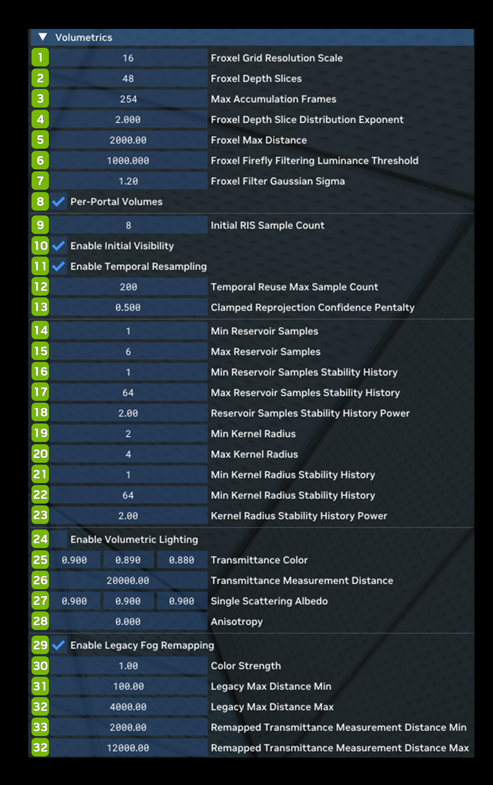
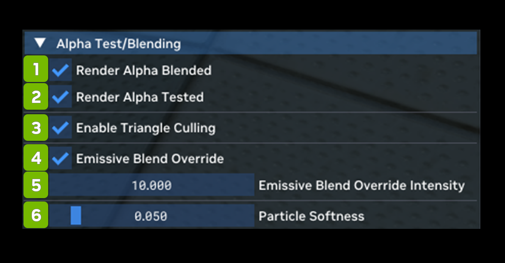
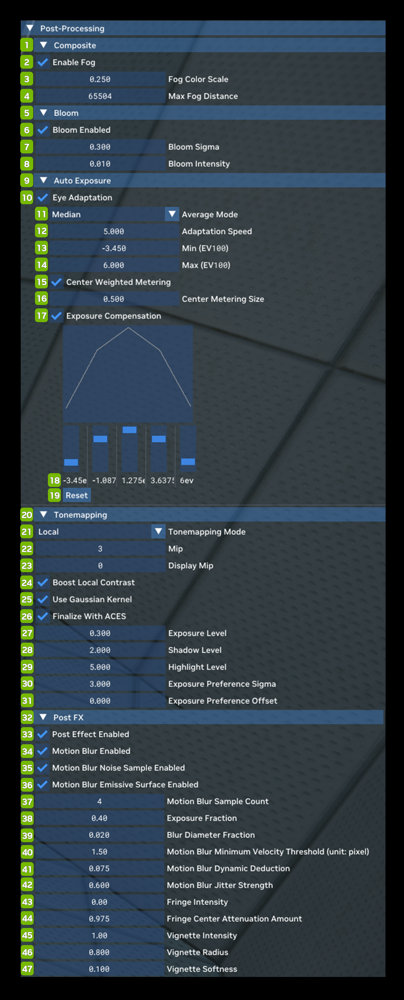
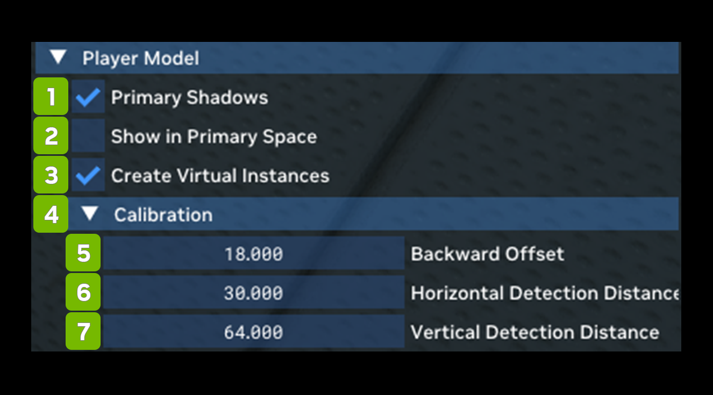
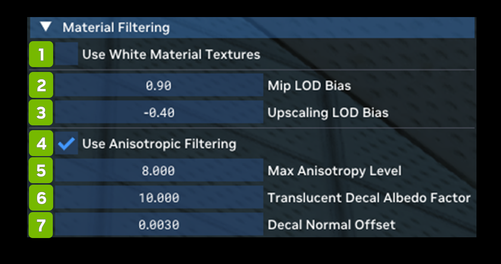
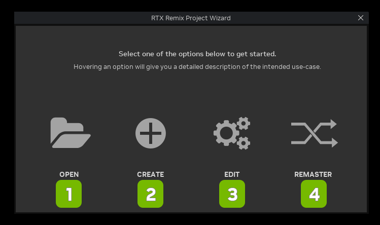
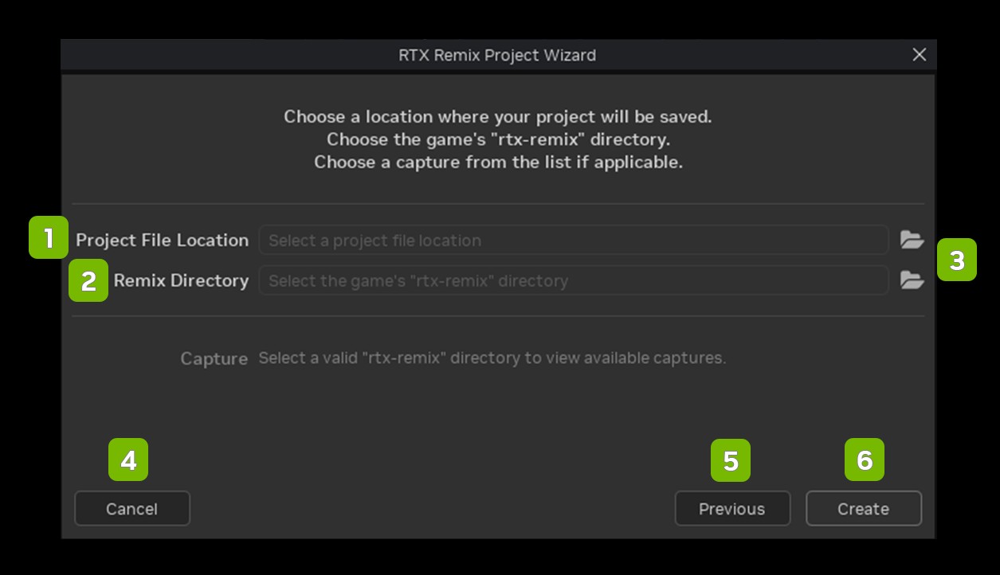
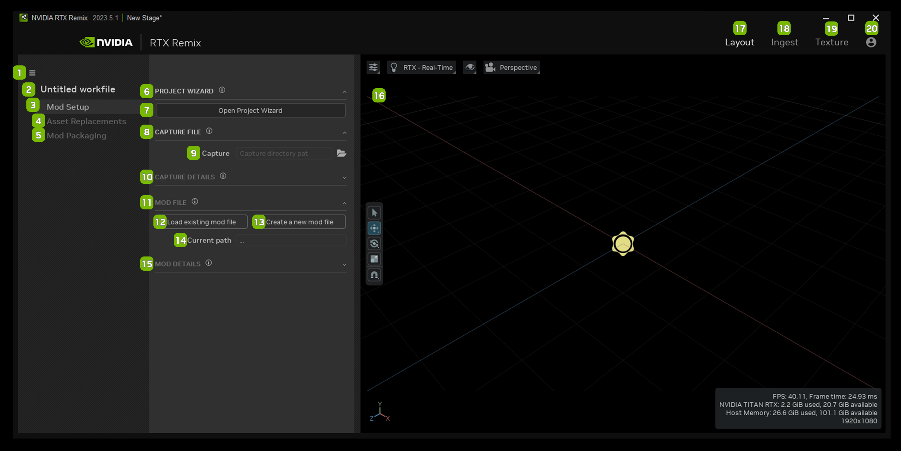
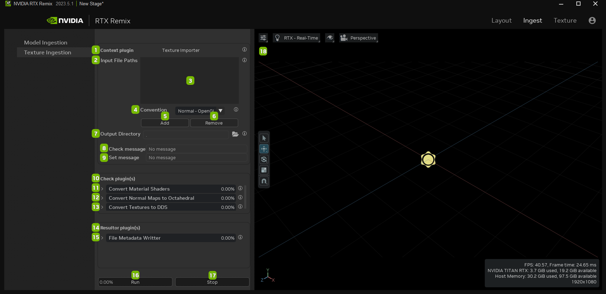

# Runtime User Guide

RTX Remix comes with a runtime overlay menu containing detailed settings for all the major functions: Rendering, Asset Replacement, and Capture. You can access this menu by pressing **Alt + X** once in game (this hotkey can also be customized using the rtx.conf config file).

When pressing **Alt + X**, you will first be taken to the User Graphics Settings menu. This menu has various high-level settings intended for end users of RTX Remix mods to quickly customize their experience. There are three tabs: General, Rendering and Content. All the settings are described with a tooltip when you hover over them.

The General settings deal mostly with performance and include various upscaling and latency reduction options.

The Rendering settings contain high level image quality settings for the RTX Remix Path Tracing renderer. You can select one of the provided presets or customize each individual setting.

The Content settings allow you to turn off and on each of the three types of replacements supported by RTX Remix: Material, Mesh and Light replacements. These settings can be of interest when you want to evaluate the impact of each type of replacement on the mod project. Note however, that turning all the replacements off does not mean reverting to the original rendering that the underlying game uses. You are still Path Tracing, just with global defaults in place for materials and lights, and without any replacement meshes.

At the bottom of the User Graphics Settings menu, you should see a button for Developer Settings Menu. This will take you to a deeper and more detailed RTX Remix Developer Menu. It contains three main tabs. 
1. The **Rendering tab** is intended mostly for mod authors and runtime developers who need the ultimate control of renderer internals to achieve compatibility or the intended look for a mod or game. 
1. The **Game Setup tab** contains the key capture and tagging workflow that will be needed to make a game moddable and compatible with RTX Remix. 
1. The **Enhancements tab** allows for toggling various types of replacements on and off, as well as highlighting unreplaced assets, all useful for testing and validating mod content.

> 📝 There is a checkbox at the top of the Developer Settings Menu that says "Always Developer Menu." Turning this checkbox on (and saving settings) will take you directly to the Developer menu when pressing **Alt + X**, saving you a click!

The **Rendering tab** in the Developer Settings Menu allows you to customize the Remix Path Tracing renderer. You can change options for upscaling, path tracing and lighting. Every option here has a corresponding setting in the **rtx.conf** file. You can view detailed documentation on all these options in the section on config files below.

Any settings you change in the menus can be saved as new defaults. They will be stored in a file named **rtx.conf** placed next to the **.trex/ runtime** folder. This file will be created if it does not already exist. The next time you start the game with RTX Remix, settings will be read from this file, and applied automatically.

> 📝 You can extend or shrink the Menu panel by holding your mouse cursor over the edge of the panels until the icon changes to the double arrow icon, then drag the edge of the panel to the size you prefer.

## RTX Runtime Interface

RTX Remix makes it easy to adjust how your game looks and runs. To access these settings while playing the game, press **Alt + X** (you can also change this shortcut in the rtx.conf config file).

When you press **Alt + X**, you'll see the User Graphics Settings menu. This menu is designed for regular players who want to quickly change how their RTX Remix mods appear. It has three tabs: General, Rendering, and Content. If you're not sure what a setting does, just hover your mouse over it, and a tooltip will explain.

At the bottom of the User Graphics Settings menu, there's a button for the Developer Settings Menu. This takes you to an even more detailed menu for advanced users. It has three main tabs: Rendering (for mod creators and developers who want full control), Game Setup (important for making games work with RTX Remix), and Enhancements (for testing and improving mod content).

Any changes you make in these menus can be saved as new defaults. They're stored in a file called rtx.conf, which goes in the same folder as the runtime. If this file doesn't exist, RTX Remix will create it. Next time you play with RTX Remix, it will use these saved settings automatically.
 
> ⚠️ **Coders** Check out our RTX Options Documentation on GitHub [here](https://github.com/NVIDIAGameWorks/dxvk-remix/blob/main/RtxOptions.md).

<table>
  <tr>
   <td><strong>Ref #</strong>
   </td>
   <td><strong>Option</strong>
   </td>
   <td><strong>Description</strong>
   </td>
  </tr>
  <tr>
   <td>1
   </td>
   <td>User Graphic Settings
   </td>
   <td><!--- Needs Description --->
   </td>
  </tr>
  <tr>
   <td>2
   </td>
   <td>Memory Stats
   </td>
   <td><!--- Needs Description --->
   </td>
  </tr>
  <tr>
   <td>3
   </td>
   <td>DLSS 3.0 Settings
   </td>
   <td><!--- Needs Description --->
   </td>
  </tr>
  <tr>
   <td>4
   </td>
   <td>DLSS 3.0 Switch
   </td>
   <td><!--- Needs Description --->
   </td>
  </tr>
  <tr>
   <td>5
   </td>
   <td>Super Resolution
   </td>
   <td><!--- Needs Description --->
   </td>
  </tr>
  <tr>
   <td>6
   </td>
   <td>Super Resolution Mode
   </td>
   <td><!--- Needs Description --->
   </td>
  </tr>
  <tr>
   <td>7
   </td>
   <td>Reflex
   </td>
   <td><!--- Needs Description --->
   </td>
  </tr>
  <tr>
   <td>8
   </td>
   <td>Image Quality Settings
   </td>
   <td><!--- Needs Description --->
   </td>
  </tr>
  <tr>
   <td>9
   </td>
   <td>Graphics Preset
   </td>
   <td><!--- Needs Description --->
   </td>
  </tr>
  <tr>
   <td>10
   </td>
   <td>Min Light Bounces
   </td>
   <td><!--- Needs Description --->
   </td>
  </tr>
  <tr>
   <td>11
   </td>
   <td>Max Light Bounces
   </td>
   <td><!--- Needs Description --->
   </td>
  </tr>
  <tr>
   <td>12
   </td>
   <td>Volumetric Lighting
   </td>
   <td><!--- Needs Description --->
   </td>
  </tr>
  <tr>
   <td>13
   </td>
   <td>Denoising Quality
   </td>
   <td><!--- Needs Description --->
   </td>
  </tr>
  <tr>
   <td>14
   </td>
   <td>Texture Quality
   </td>
   <td><!--- Needs Description --->
   </td>
  </tr>
  <tr>
   <td>15
   </td>
   <td>Particle Light
   </td>
   <td><!--- Needs Description --->
   </td>
  </tr>
  <tr>
   <td>16
   </td>
   <td>Enhancement Assets
   </td>
   <td><!--- Needs Description --->
   </td>
  </tr>
  <tr>
   <td>17
   </td>
   <td>Motion Blur
   </td>
   <td><!--- Needs Description --->
   </td>
  </tr>
  <tr>
   <td>18
   </td>
   <td>Developer Settings Menu
   </td>
   <td><!--- Needs Description --->
   </td>
  </tr>
  <tr>
   <td>19
   </td>
   <td>Save Settings…
   </td>
   <td><!--- Needs Description --->
   </td>
  </tr>
  <tr>
   <td>20
   </td>
   <td>Close
   </td>
   <td><!--- Needs Description --->
   </td>
  </tr>
</table>

### Developer Menu 

#### Keyboard Shortcuts 

<table>
  <tr>
   <td><strong>Input</strong>
   </td>
   <td><strong>Description</strong>
   </td>
  </tr>
  <tr>
   <td><strong>Alt + X</strong>
   </td>
   <td>Open the RTX Runtime Developer Settings Menu
   </td>
  </tr>
  <tr>
   <td><strong>Alt + Delete</strong>
   </td>
   <td>Toggle Cursor
   </td>
  </tr>
  <tr>
   <td><strong>Alt + Backspace</strong>
   </td>
   <td>Toggle Game Input
   </td>
  </tr>
  <tr>
   <td><strong>CTRL + SHIFT + Q</strong>
   </td>
   <td>Open the <strong>Enhancements </strong>Developer Menu
   </td>
  </tr>
</table>

### Rendering Tab 

The Rendering settings contain high level image quality settings for the RTX Remix Path Tracing renderer. You can select one of the provided presets or customize each individual setting.  Every option here corresponds with the **rtx.conf** file.

> ⚠️ We’ve included all the options available, however, please note that some of these options may not be available for your specific game. 

#### Main 

<table>
  <tr>
   <td><strong>Ref</strong>
   </td>
   <td><strong>Option</strong>
   </td>
   <td><strong>Description</strong>
   </td>
  </tr>
  <tr>
   <td>1
   </td>
   <td>RTX Remix Developer Menu
   </td>
   <td>The Remix Developer Menu
   </td>
  </tr>
  <tr>
   <td>2
   </td>
   <td>Graphics Settings Menu
   </td>
   <td>Open the Graphics Settings Menu
   </td>
  </tr>
  <tr>
   <td>3
   </td>
   <td>Always Developer Menu Checkbox
   </td>
   <td>(Default: Unchecked)
   </td>
  </tr>
  <tr>
   <td>4
   </td>
   <td>Rendering Tab
   </td>
   <td>Allows you to set Rendering Parameters
   </td>
  </tr>
  <tr>
   <td>5
   </td>
   <td>Game Setup Tab
   </td>
   <td><!--- Needs Description --->
   </td>
  </tr>
  <tr>
   <td>6
   </td>
   <td>Enhancements Tab
   </td>
   <td><!--- Needs Description --->
   </td>
  </tr>
  <tr>
   <td>7
   </td>
   <td>About Tab
   </td>
   <td>Displays information about the Remix Application
   </td>
  </tr>
  <tr>
   <td>8
   </td>
   <td>Panel Switch
   </td>
   <td>Switch Between Left Side or Right Side Panel Menu
   </td>
  </tr>
  <tr>
   <td>9
   </td>
   <td>Memory Stats
   </td>
   <td>Displays the amount of memory available
   </td>
  </tr>
  <tr>
   <td>10
   </td>
   <td>General
   </td>
   <td>The General settings deal mostly with performance and include various upscaling and latency reduction options.
   </td>
  </tr>
  <tr>
   <td>11
   </td>
   <td>Allow Full Screen Exclusive? Checkbox
   </td>
   <td><!--- Needs Description --->
   </td>
  </tr>
  <tr>
   <td>12
   </td>
   <td>Pathtracing
   </td>
   <td>Pathtracing allows you to tweak the behavior of the Path Tracer in both subtle and profound ways. The technical details go deep into Ray Tracing theory
   </td>
  </tr>
  <tr>
   <td>13
   </td>
   <td>Lighting
   </td>
   <td>Lighting allows you to adjust global lighting intensity and other parameters, as well as go deep under the hood of two of the core lighting algorithms used by the Remix Path Tracing renderer: RTXDI and ReSTIR GI. You can read more about each technology. 
   </td>
  </tr>
  <tr>
   <td>14
   </td>
   <td>Volumetrics
   </td>
   <td>Volumetrics allows you to adjust everything related to the volumetric fog in Remix. You can also turn the volumetric fog off or on via the Enable Volumetric Lighting Checkbox. Turning on “Enable Legacy Fog Remapping” will allow the volumetric fog to take in information from the legacy fog in the game and attempt to match its look. 
   </td>
  </tr>
  <tr>
   <td>15
   </td>
   <td>Alpha Test / Blending
   </td>
   <td>Alpha Test / Blending allows you to toggle alpha testing and blending in the Remix renderer. 
   </td>
  </tr>
  <tr>
   <td>16
   </td>
   <td>Denoising
   </td>
   <td>Denoising allows you to toggle denoising on and off, as well as tune denoising parameters in detail. Denoising is a critical part of modern Path Tracing renderers and turning it off entirely has mainly educational value. Adjusting the individual settings may be beneficial for image quality or compatibility, depending on the game and mod in question.
   </td>
  </tr>
  <tr>
   <td>17
   </td>
   <td>Post-Processing
   </td>
   <td>Post-Processing allows you to toggle on and off, as well as tune the look of each of the supported post-processing effects in Remix.
   </td>
  </tr>
  <tr>
   <td>18
   </td>
   <td>Debug
   </td>
   <td>Debug allows you to access a large variety of debug views in order to troubleshoot compatibility, content or rendering issues in a game or mod. Please refer to this document for an in depth guide to the Debug Display modes. 
   </td>
  </tr>
  <tr>
   <td>19
   </td>
   <td>Geometry
   </td>
   <td>Various compatibility options for geometry handling.
   </td>
  </tr>
  <tr>
   <td>20
   </td>
   <td>Player Model
   </td>
   <td>Player Model allows you to toggle compatibility options related to first person character rendering here, as well as toggle first person character shadows.
   </td>
  </tr>
  <tr>
   <td>21
   </td>
   <td>Light Conversion
   </td>
   <td>Light Conversion allows you to control how game lights are translated into Path Tracing compatible physical light sources in the Remix renderer.
   </td>
  </tr>
  <tr>
   <td>22
   </td>
   <td>Material Filtering
   </td>
   <td>Material Filtering allows you to adjust material filtering options or render all white materials for an easier time when tuning lighting. 
   </td>
  </tr>
  <tr>
   <td>23
   </td>
   <td>Save Changed Settings Only Checkbox
   </td>
   <td>(Default : Checked)
   </td>
  </tr>
  <tr>
   <td>24
   </td>
   <td>Save Settings
   </td>
   <td>Save settings parameters
   </td>
  </tr>
  <tr>
   <td>25
   </td>
   <td>Reset Settings
   </td>
   <td>Reset all parameters to default values
   </td>
  </tr>
  <tr>
   <td>26
   </td>
   <td>Hide UI
   </td>
   <td>Close the RTX Remix UI
   </td>
  </tr>
</table>

#### General

The General settings deal mostly with performance and include various upscaling and latency reduction options.

<table>
  <tr>
   <td><strong>Ref</strong>
   </td>
   <td><strong>Option</strong>
   </td>
   <td><strong>RTX Option</strong>
   </td>
   <td><strong>Default Value</strong>
   </td>
   <td><strong>Description</strong>
   </td>
  </tr>
  <tr>
   <td><strong>1</strong>
   </td>
   <td colspan="3" ><strong>General</strong>
   </td>
   <td><!--- Needs Description --->
   </td>
  </tr>
  <tr>
   <td>2
   </td>
   <td>Reflex Dropdown
   </td>
   <td>rtx.reflexMode
   </td>
   <td>On
   </td>
   <td>Reflex mode selection, enabling it to minimize input latency, boost mode may further reduce latency by boosting GPU clocks in CPU-bound cases.  Choices: On, Off, Boost

<strong>NOTE:</strong> The “Off” setting will still attempt to initialize.  Please use the RTX call <strong>rtx.isReflexEnabled</strong> to fully disable.
   </td>
  </tr>
  <tr>
   <td>3
   </td>
   <td>Super Resolution Dropdown
   </td>
   <td><!--- Needs Description --->
   </td>
   <td>DLSS
   </td>
   <td>Choices: None, DLSS, NIS, TAA-U
   </td>
  </tr>
  <tr>
   <td>4
   </td>
   <td>DLSS Mode Dropdown
   </td>
   <td><!--- Needs Description --->
   </td>
   <td>Auto
   </td>
   <td>Choices: Ultra Performance, Performance, Balance

Quality, Auto, Full Resolution
   </td>
  </tr>
  <tr>
   <td>5
   </td>
   <td>Anti-Ghost Checkbox
   </td>
   <td><!--- Needs Description --->
   </td>
   <td>Checked
   </td>
   <td><!--- Needs Description --->
   </td>
  </tr>
</table>

#### Pathtracing

Pathtracing allows you to tweak the behavior of the Path Tracer in both subtle and profound ways. The technical details go deep into Ray Tracing theory.

<table>
  <tr>
   <td><strong>Ref</strong>
   </td>
   <td><strong>Option</strong>
   </td>
   <td><strong>RTX Option</strong>
   </td>
   <td><strong>Default Value</strong>
   </td>
   <td><strong>Description</strong>
   </td>
  </tr>
  <tr>
   <td>1
   </td>
   <td>RNG: Seed with Frame Index Checkbox
   </td>
   <td>rtx.rngSeedWithFrameIndex
   </td>
   <td>Checked
   </td>
   <td>Indicates that pseudo-random number generator should be seeded with the frame number of the application every frame, otherwise seed with 0.

This should generally always be enabled as without the frame index each frame will typically be identical in the random values that are produced which will result in incorrect rendering. Only meant as a debugging tool.
   </td>
  </tr>
  <tr>
   <td><strong>2</strong>
   </td>
   <td colspan="3" ><strong>Resolver</strong>
   </td>
   <td>
   </td>
  </tr>
  <tr>
   <td>3
   </td>
   <td>Max Primary Interactions
   </td>
   <td>rtx.primaryRayMaxInteractions
   </td>
   <td>32
   </td>
   <td>The maximum number of resolver interactions to use for primary (initial G-Buffer) rays.

This affects how many Decals, Ray Portals and potentially particles (if unordered approximations are not enabled) may be interacted with along a ray at the cost of performance for higher amounts of interactions.
   </td>
  </tr>
  <tr>
   <td>4
   </td>
   <td>Max PSR Interactions
   </td>
   <td>rtx.psrRayMaxInteractions
   </td>
   <td>32
   </td>
   <td>The maximum number of resolver interactions to use for PSR (primary surface replacement G-Buffer) rays.  This affects how many Decals, Ray Portals and potentially particles (if unordered approximations are not enabled) may be interacted with along a ray at the cost of performance for higher amounts of interactions. 
   </td>
  </tr>
  <tr>
   <td>5
   </td>
   <td>Max Secondary Interactions
   </td>
   <td>rtx.secondaryRayMaxInteractions
   </td>
   <td>8
   </td>
   <td>The maximum number of resolver interactions to use for primary (initial G-Buffer) rays.

This affects how many Decals, Ray Portals and potentially particles (if unordered approximations are not enabled) may be interacted with along a ray at the cost of performance for higher amounts of interactions.
   </td>
  </tr>
  <tr>
   <td>6
   </td>
   <td>Separate Unordered Approximations Checkbox
   </td>
   <td>rtx.enableSeparateUnorderedApproximations
   </td>
   <td>Checked
   </td>
   <td>Use a separate loop during resolving for surfaces which can have lighting evaluated in an approximate unordered way on each path segment (such as particles).

This improves performance typically in how particles or decals are rendered and should usually always be enabled.

Do note however the unordered nature of this resolving method may result in visual artifacts with large numbers of stacked particles due to difficulty in determining the intended order.

Additionally, unordered approximations will only be done on the first indirect ray bounce (as particles matter less in higher bounces), and only if enabled by its corresponding setting.
   </td>
  </tr>
  <tr>
   <td>7
   </td>
   <td>Direct Translucent Shadows Checkbox
   </td>
   <td>rtx.enableDirectTranslucentShadows
   </td>
   <td>Unchecked
   </td>
   <td>Include OBJECT_MASK_TRANSLUCENT into primary visibility rays.
   </td>
  </tr>
  <tr>
   <td>8
   </td>
   <td>Indirect Translucent Shadows Checkbox
   </td>
   <td>rtx.enableIndirectTranslucentShadows
   </td>
   <td>Unchecked
   </td>
   <td>Include OBJECT_MASK_TRANSLUCENT into secondary visibility rays.
   </td>
  </tr>
  <tr>
   <td>9
   </td>
   <td>Decal Material Blending Checkbox
   </td>
   <td>rtx.enableDecalMaterialBlending
   </td>
   <td>Checked
   </td>
   <td>A flag to enable or disable material blending on decals.

This should generally always be enabled when decals are in use as this allows decals to be blended down onto the surface they sit slightly above which results in more convincing decals rendering.
   </td>
  </tr>
  <tr>
   <td>10
   </td>
   <td>Billboard Orientation Correction Checkbox
   </td>
   <td>rtx.enableBillboardOrientationCorrection
   </td>
   <td>Checked
   </td>
   <td>
   </td>
  </tr>
  <tr>
   <td>11
   </td>
   <td>Dev: Use I-Prims on Primary Rays Checkbox
   </td>
   <td>
   </td>
   <td>Unchecked
   </td>
   <td>
   </td>
  </tr>
  <tr>
   <td>12
   </td>
   <td>Resolve Transparency Threshold
   </td>
   <td>rtx.resolveTransparencyThreshold
   </td>
   <td>0.00392157
   </td>
   <td>A threshold for which any opacity value below is considered totally transparent and may be safely skipped without as significant of a performance cost.
   </td>
  </tr>
  <tr>
   <td>13
   </td>
   <td>Resolve Opaqueness Threshold
   </td>
   <td>rtx.resolveOpaquenessThreshold
   </td>
   <td>0.996078
   </td>
   <td>A threshold for which any opacity value above is considered totally opaque.
   </td>
  </tr>
  <tr>
   <td><strong>14</strong>
   </td>
   <td colspan="3" ><strong>PSR</strong>
   </td>
   <td>
   </td>
  </tr>
  <tr>
   <td>15
   </td>
   <td>Reflection PSR Enabled Checkbox
   </td>
   <td>rtx.enablePSRR
   </td>
   <td>Checked
   </td>
   <td>A flag to enable or disable reflection PSR (Primary Surface Replacement).

When enabled this feature allows higher quality mirror-like reflections in special cases by replacing the G-Buffer's surface with the reflected surface.

Should usually be enabled for the sake of quality as almost all applications will utilize it in the form of glass or mirrors.
   </td>
  </tr>
  <tr>
   <td>16
   </td>
   <td>Transmission PSR Enabled
   </td>
   <td>rtx.enablePSTR
   </td>
   <td>Checked
   </td>
   <td>A flag to enable or disable transmission PSR (Primary Surface Replacement).

When enabled this feature allows higher quality glass-like refraction in special cases by replacing the G-Buffer's surface with the refracted surface.

Should usually be enabled for the sake of quality as almost all applications will utilize it in the form of glass.
   </td>
  </tr>
  <tr>
   <td>17
   </td>
   <td>Max Reflection PSR Bounces
   </td>
   <td>rtx.psrrMaxBounces
   </td>
   <td>10
   </td>
   <td>The maximum number of Reflection PSR bounces to traverse. Must be 15 or less due to payload encoding.

Should be set higher when many mirror-like reflection bounces may be needed, though more bounces may come at a higher performance cost.
   </td>
  </tr>
  <tr>
   <td>18
   </td>
   <td>Max Transmission PSR Bounces
   </td>
   <td>rtx.pstrMaxBounces
   </td>
   <td>10
   </td>
   <td>The maximum number of Transmission PSR bounces to traverse. Must be 15 or less due to payload encoding.

Should be set higher when refraction through many layers of glass may be needed, though more bounces may come at a higher performance cost.
   </td>
  </tr>
  <tr>
   <td>19
   </td>
   <td>Outgoing Transmission Approx Enabled Checkbox
   </td>
   <td>rtx.enablePSTROutgoingSplitApproximation
   </td>
   <td>Checked
   </td>
   <td>Enable transmission PSR on outgoing transmission events such as leaving translucent materials (rather than respecting no-split path PSR rule).

Typically this results in better looking glass when enabled (at the cost of accuracy due to ignoring non-TIR inter-reflections within the glass itself).
   </td>
  </tr>
  <tr>
   <td>20
   </td>
   <td>Incident Transmission Approx Enabled Checkbox
   </td>
   <td>
   </td>
   <td>Checked
   </td>
   <td>
   </td>
  </tr>
  <tr>
   <td>21
   </td>
   <td>Reflection PSR Normal Detail Threshold
   </td>
   <td>rtx.psrrNormalDetailThreshold
   </td>
   <td>0.000
   </td>
   <td>A threshold value to indicate that the denoiser's alternate disocclusion threshold should be used when normal map "detail" on a reflection PSR surface exceeds a desired amount.

Normal detail is defined as 1-dot(tangent_normal, vec3(0, 0, 1)), or in other words it is 0 when no normal mapping is used, and 1 when the normal mapped normal is perpendicular to the underlying normal.

This is typically used to reduce flickering artifacts resulting from reflection on surfaces like glass leveraging normal maps as often the denoiser is too aggressive with disocclusion checks frame to frame when DLSS or other camera jittering is in use.
   </td>
  </tr>
  <tr>
   <td>22
   </td>
   <td>Transmission PSR Normal Detail Threshold
   </td>
   <td>rtx.pstrNormalDetailThreshold
   </td>
   <td>0.000
   </td>
   <td>A threshold value to indicate that the denoiser's alternate disocclusion threshold should be used when normal map "detail" on a transmission PSR surface exceeds a desired amount.

Normal detail is defined as 1-dot(tangent_normal, vec3(0, 0, 1)), or in other words it is 0 when no normal mapping is used, and 1 when the normal mapped normal is perpendicular to the underlying normal.

This is typically used to reduce flickering artifacts resulting from refraction on surfaces like glass leveraging normal maps as often the denoiser is too aggressive with disocclusion checks frame to frame when DLSS or other camera jittering is in use.
   </td>
  </tr>
  <tr>
   <td><strong>23</strong>
   </td>
   <td colspan="3" ><strong>Integrator</strong>
   </td>
   <td>
   </td>
  </tr>
  <tr>
   <td>24
   </td>
   <td>Enable Secondary Bounces Checkbox
   </td>
   <td>rtx.enableSecondaryBounces
   </td>
   <td>Checked
   </td>
   <td>Enables indirect lighting (lighting from diffuse/specular bounces to one or more other surfaces) on surfaces when set to true, otherwise disables it.
   </td>
  </tr>
  <tr>
   <td>25
   </td>
   <td>Enable Russian Roulette Checkbox
   </td>
   <td>rtx.enableRussianRoulette
   </td>
   <td>Checked
   </td>
   <td>A flag to enable or disable Russian Roulette, a rendering technique to give paths a chance of terminating randomly with each bounce based on their importance.

This is usually useful to have enabled as it will ensure useless paths are terminated earlier while more important paths are allowed to accumulate more bounces.

Furthermore this allows for the renderer to remain unbiased whereas a hard clamp on the number of bounces will introduce bias (though this is also done in Remix for the sake of performance).

On the other hand, randomly terminating paths too aggressively may leave threads in GPU warps without work which may hurt thread occupancy when not used with a thread-reordering technique like SER.
   </td>
  </tr>
  <tr>
   <td>26
   </td>
   <td>Enable Probability Dithering Filtering for Primary Bounch Checkbox
   </td>
   <td>rtx.enableFirstBounceLobeProbabilityDithering
   </td>
   <td>Checked
   </td>
   <td>A flag to enable or disable screen-space probability dithering on the first indirect lobe sampled.

Generally sampling a diffuse, specular or other lobe relies on a random number generated against the probability of sampling each lobe, effectively focusing more rays/paths on lobes which matter more.

This can cause issues however with denoisers which do not handle sparse stochastic signals (like those from path tracing) well as they may be expecting a more "complete" signal like those used in simpler branching ray tracing setups.

To help solve this issue this option uses a temporal screen space dithering based on the probability rather than a purely random choice to determine which lobe to sample from on the first indirect bounce.

This as a result helps ensure there will always be a diffuse or specular sample within the dithering pattern's area and should help the denoising resolve a more stable result.
   </td>
  </tr>
  <tr>
   <td>27
   </td>
   <td>Unordered Resolve in Indirect Rays Checkbox
   </td>
   <td>rtx.enableUnorderedResolveInIndirectRays
   </td>
   <td>Checked
   </td>
   <td>A flag to enable or disable unordered resolve approximations in indirect rays.

This allows for the presence of unordered approximations in resolving to be overridden in indirect rays and as such requires separate unordered approximations to be enabled to have any effect.

This option should be enabled if objects which can be resolvered in an unordered way in indirect rays are expected for higher quality in reflections, but may come at a performance cost.

Note that even with this option enabled, unordered resolve approximations are only done on the first indirect bounce for the sake of performance overall.
   </td>
  </tr>
  <tr>
   <td>28
   </td>
   <td>Emissive Particles in Indirect Rays Checkbox
   </td>
   <td>rtx.beamTextures
   </td>
   <td>Unchecked
   </td>
   <td>Textures on draw calls that are already particles or emissivity blended and have beam-like geometry.

Typically objects marked as particles or objects using emissive blending will be rendered with a special method which allows re-orientation of the billboard geometry assumed to make up the draw call in indirect rays (reflections for example).

This method works fine for typical particles, but some (e.g. a laser beam) may not be well-represented with the typical billboard assumption of simply needing to rotate around its centroid to face the view direction.

To handle such cases a different beam mode is used to treat objects as more of a cylindrical beam and re-orient around its main spanning axis, allowing for better rendering of these beam-like effect objects.
   </td>
  </tr>
  <tr>
   <td>29
   </td>
   <td>Minimum Path Bounces
   </td>
   <td>rtx.pathMinBounces
   </td>
   <td>1
   </td>
   <td>The minimum number of indirect bounces the path must complete before Russian Roulette can be used. Must be &lt; 16.

This value is recommended to stay fairly low (1 for example) as forcing longer paths when they carry little contribution quickly becomes detrimental to performance.
   </td>
  </tr>
  <tr>
   <td>30
   </td>
   <td>Maximum Path Bounces
   </td>
   <td>rtx.pathMaxBounces
   </td>
   <td>4
   </td>
   <td>The maximum number of indirect bounces the path will be allowed to complete. Must be &lt; 16.

Higher values result in better indirect lighting quality due to biasing the signal less, lower values result in better performance.

Very high values are not recommended however as while long paths may be technically needed for unbiased rendering, in practice the contributions from higher bounces have diminishing returns.
   </td>
  </tr>
  <tr>
   <td>31
   </td>
   <td>Firefly Filtering Luminance Threshold
   </td>
   <td>rtx.fireflyFilteringLuminanceThreshold
   </td>
   <td>1000.000
   </td>
   <td>Maximum luminance threshold for the firefly filtering to clamp to.
   </td>
  </tr>
  <tr>
   <td>32
   </td>
   <td>Opaque Diffuse Lobe Probability Zero Threshold
   </td>
   <td>rtx.opaqueDiffuseLobeSamplingProbabilityZeroThreshold
   </td>
   <td>0.010
   </td>
   <td>The threshold for which to zero opaque diffuse probability weight values.
   </td>
  </tr>
  <tr>
   <td>33
   </td>
   <td>Min Opaque Diffuse Lobe Probability
   </td>
   <td>rtx.minOpaqueDiffuseLobeSamplingProbability
   </td>
   <td>0.250
   </td>
   <td>The minimum allowed non-zero value for opaque diffuse probability weights.
   </td>
  </tr>
  <tr>
   <td>34
   </td>
   <td>Opaque Specular Lobe Probability Zero Threshold
   </td>
   <td>rtx.opaqueSpecularLobeSamplingProbabilityZeroThreshold
   </td>
   <td>0.010
   </td>
   <td>The threshold for which to zero opaque specular probability weight values.
   </td>
  </tr>
  <tr>
   <td>35
   </td>
   <td>Min Opaque Specular Lobe Probability
   </td>
   <td>rtx.minOpaqueSpecularLobeSamplingProbability
   </td>
   <td>0.250
   </td>
   <td>The minimum allowed non-zero value for opaque specular probability weights.
   </td>
  </tr>
  <tr>
   <td>36
   </td>
   <td>Opaque Opacity Transmission Lobe Probability Zero Threshold
   </td>
   <td>rtx.opaqueOpacityTransmissionLobeSamplingProbabilityZeroThreshold
   </td>
   <td>0.010
   </td>
   <td>The threshold for which to zero opaque opacity probability weight values.
   </td>
  </tr>
  <tr>
   <td>37
   </td>
   <td>Min Opaque Opacity Transmission Lobe Probability
   </td>
   <td>rtx.minOpaqueOpacityTransmissionLobeSamplingProbability
   </td>
   <td>0.250
   </td>
   <td>The minimum allowed non-zero value for opaque opacity probability weights.
   </td>
  </tr>
  <tr>
   <td>38
   </td>
   <td>Translucent Specular Lobe Probability Zero Threshold
   </td>
   <td>rtx.translucentSpecularLobeSamplingProbabilityZeroThreshold
   </td>
   <td>0.010
   </td>
   <td>The threshold for which to zero translucent specular probability weight values.
   </td>
  </tr>
  <tr>
   <td>39
   </td>
   <td>Min Translucent Specular Lobe Probability
   </td>
   <td>rtx.minTranslucentSpecularLobeSamplingProbability
   </td>
   <td>0.300
   </td>
   <td>The minimum allowed non-zero value for translucent specular probability weights.
   </td>
  </tr>
  <tr>
   <td>40
   </td>
   <td>Translucent Transmission Lobe Probability Zero Threshold
   </td>
   <td>rtx.translucentTransmissionLobeSamplingProbabilityZeroThreshold
   </td>
   <td>0.010
   </td>
   <td>The threshold for which to zero translucent transmission probability weight values.
   </td>
  </tr>
  <tr>
   <td>41
   </td>
   <td>Min Translucent Transmission Lobe Probability
   </td>
   <td>rtx.minTranslucentTransmissionLobeSamplingProbability
   </td>
   <td>0.250
   </td>
   <td>The minimum allowed non-zero value for translucent transmission probability weights.
   </td>
  </tr>
  <tr>
   <td>42
   </td>
   <td>Indirect Ray Spread Angle Factor
   </td>
   <td>rtx.indirectRaySpreadAngleFactor
   </td>
   <td>0.050
   </td>
   <td>A tuning factor applied to the spread angle calculated from the sampled lobe solid angle PDF. Should be 0-1.

This scaled spread angle is used to widen a ray's cone angle after indirect lighting BRDF samples to essentially prefilter the effects of the BRDF lobe's spread which potentially may reduce noise from indirect rays (e.g. reflections).

Prefiltering will overblur detail however compared to the ground truth of casting multiple samples especially given this calculated spread angle is a basic approximation and ray cones to begin with are a simple approximation for ray pixel footprint.

As such rather than using the spread angle fully this spread angle factor allows it to be scaled down to something more narrow so that overblurring can be minimized. Similarly, setting this factor to 0 disables this cone angle widening feature.
   </td>
  </tr>
  <tr>
   <td><strong>43</strong>
   </td>
   <td colspan="3" ><strong>Russian Roulette</strong>
   </td>
   <td><!--- Needs Description --->
   </td>
  </tr>
  <tr>
   <td>44
   </td>
   <td>1st Bounce: Min Continue Probability
   </td>
   <td>rtx.russianRoulette1stBounceMinContinueProbability
   </td>
   <td>0.600
   </td>
   <td>The minimum probability of continuing a path when Russian Roulette is being used on the first bounce.

This ensures that on the first bounce rays are not terminated too aggressively as it may be useful for some denoisers to have a contribution even if it is a relatively unimportant one rather than a missing indirect sample.
   </td>
  </tr>
  <tr>
   <td>45
   </td>
   <td>1st Bounce: Max Continue Probability
   </td>
   <td>rtx.russianRoulette1stBounceMaxContinueProbability
   </td>
   <td>1.000
   </td>
   <td>The maximum probability of continuing a path when Russian Roulette is being used on the first bounce.

This is similar to the usual max continuation probability for Russian Roulette, but specifically only for the first bounce.
   </td>
  </tr>
  <tr>
   <td>46
   </td>
   <td>2nd+ Bounce: Max Continue Probability
   </td>
   <td>rtx.russianRouletteMaxContinueProbability
   </td>
   <td>0.900
   </td>
   <td>"The maximum probability of continuing a path when Russian Roulette is being used.

This ensures all rays have a small probability of terminating each bounce, mostly to prevent infinite paths in perfectly reflective mirror rooms (though the maximum path bounce count will also ensure this)."
   </td>
  </tr>
  <tr>
   <td><strong>47</strong>
   </td>
   <td colspan="3" ><strong>Opacity Micromap</strong>
   </td>
   <td><!--- Needs Description --->
   </td>
  </tr>
  <tr>
   <td>48
   </td>
   <td>Enable Opacity Micromap Checkbox
   </td>
   <td>rtx.opacityMicromap.enable
   </td>
   <td>Unchecked
   </td>
   <td>Enables Opacity Micromaps for geometries with textures that have alpha cutouts.

This is generally the case for geometries such as fences, foliage, particles, etc. .

Opacity Micromaps greatly speed up raytracing of partially opaque triangles.

Examples of scenes that benefit a lot: multiple trees with a lot of foliage,

a ground densely covered with grass blades or steam consisting of many particles.
   </td>
  </tr>
  <tr>
   <td>49
   </td>
   <td>Show Advanced Settings Checkbox
   </td>
   <td>rtx.opacityMicromap.showAdvancedOptions
   </td>
   <td>Unchecked
   </td>
   <td>Shows advanced options.
   </td>
  </tr>
  <tr>
   <td>50
   </td>
   <td>Enable Binding Checkbox
   </td>
   <td>rtx.opacityMicromap.enableBinding
   </td>
   <td>Checked
   </td>
   <td>Enables binding of built Opacity Micromaps to bottom level acceleration structures.
   </td>
  </tr>
  <tr>
   <td>51
   </td>
   <td>Enable Baking Arrays Checkbox
   </td>
   <td>rtx.opacityMicromap.enableBakingArrays
   </td>
   <td>Checked
   </td>
   <td>Enables baking of opacity textures into Opacity Micromap arrays per triangle.
   </td>
  </tr>
  <tr>
   <td>52
   </td>
   <td>Enable Building Checkbox
   </td>
   <td>rtx.opacityMicromap.enableBuilding
   </td>
   <td>Checked
   </td>
   <td>Enables building of Opacity Micromap arrays.
   </td>
  </tr>
  <tr>
   <td>53
   </td>
   <td>Reset Every Frame Checkbox
   </td>
   <td>rtx.opacityMicromap.enableResetEveryFrame
   </td>
   <td>Unchecked
   </td>
   <td>Debug: resets Opacity Micromap runtime data every frame.
   </td>
  </tr>
  <tr>
   <td><strong>54</strong>
   </td>
   <td colspan="3" ><strong>Statistics</strong>
   </td>
   <td>View Scene Statistics
   </td>
  </tr>
  <tr>
   <td><strong>55</strong>
   </td>
   <td colspan="3" ><strong>Scene</strong>
   </td>
   <td><!--- Needs Description --->
   </td>
  </tr>
  <tr>
   <td>56
   </td>
   <td>Split Billboard Geometry Checkbox
   </td>
   <td>rtx.opacityMicromap.building.splitBillboardGeometry
   </td>
   <td>Checked
   </td>
   <td>Splits billboard geometry and corresponding Opacity Micromaps to quads for higher reuse.

Games often batch instanced geometry that reuses the same geometry and textures, such as for particles.

Splitting such batches into unique subgeometries then allows higher reuse of build Opacity Micromaps.
   </td>
  </tr>
  <tr>
   <td>57
   </td>
   <td>Max Allowed Billboards Per Instance To Split
   </td>
   <td>rtx.opacityMicromap.building.maxAllowedBillboardsPerInstanceToSplit
   </td>
   <td>16
   </td>
   <td>Max billboards per instance to consider for splitting (large value results in increased CPU costs on BLAS builds).
   </td>
  </tr>
  <tr>
   <td><strong>58</strong>
   </td>
   <td colspan="3" ><strong>Cache</strong>
   </td>
   <td><!--- Needs Description --->
   </td>
  </tr>
  <tr>
   <td>59
   </td>
   <td>Budget: Max Vidmem Size %
   </td>
   <td>rtx.opacityMicromap.cache.maxVidmemSizePercentage
   </td>
   <td>0.015
   </td>
   <td>Budget: Max Video Memory Size %.
   </td>
  </tr>
  <tr>
   <td>60
   </td>
   <td>Budget: MIn Required Size [MB]
   </td>
   <td>rtx.opacityMicromap.cache.minBudgetSizeMB
   </td>
   <td>512
   </td>
   <td>Budget: Min Video Memory [MB] required.

If the min amount is not available, then the budget will be set to 0.
   </td>
  </tr>
  <tr>
   <td>61
   </td>
   <td>Budget: Max Allowed Size [MB]
   </td>
   <td>rtx.opacityMicromap.cache.maxBudgetSizeMB
   </td>
   <td>1536
   </td>
   <td>Budget: Max Allowed Size [MB]
   </td>
  </tr>
  <tr>
   <td>62
   </td>
   <td>Budget: Min Vidmem Free to Not Allocate [MB]
   </td>
   <td>rtx.opacityMicromap.cache.minFreeVidmemMBToNotAllocate
   </td>
   <td>2560
   </td>
   <td>Min Video Memory [MB] to keep free before allocating any for Opacity Micromaps.
   </td>
  </tr>
  <tr>
   <td>63
   </td>
   <td>Budget: Min Vidmem Free To Not Allocate [MB]
   </td>
   <td><!--- Needs Description --->
   </td>
   <td>900
   </td>
   <td><!--- Needs Description --->
   </td>
  </tr>
  <tr>
   <td><strong>64</strong>
   </td>
   <td colspan="3" ><strong>Request Filter</strong>
   </td>
   <td><!--- Needs Description --->
   </td>
  </tr>
  <tr>
   <td>65
   </td>
   <td>Animated Instances Checkbox
   </td>
   <td>rtx.opacityMicromap.buildRequests.enableAnimatedInstances
   </td>
   <td>Unchecked
   </td>
   <td>Enables Opacity Micromaps for animated instances.
   </td>
  </tr>
  <tr>
   <td>66
   </td>
   <td>Particles Checkbox
   </td>
   <td>rtx.opacityMicromap.buildRequests.enableParticles
   </td>
   <td>Checked
   </td>
   <td>Enables Opacity Micromaps for particles.
   </td>
  </tr>
  <tr>
   <td>67
   </td>
   <td>Custom Filters for Billboards Checkbox
   </td>
   <td>rtx.opacityMicromap.buildRequests.customFiltersForBillboards
   </td>
   <td>Checked
   </td>
   <td>Applies custom filters for staged Billboard requests.
   </td>
  </tr>
  <tr>
   <td>68
   </td>
   <td>Max Staged Requests
   </td>
   <td>rtx.opacityMicromap.buildRequests.maxRequests
   </td>
   <td>5000
   </td>
   <td>Max number of staged unique Opacity Micromap build requests.

Any further requests will simply be discarded until the number of staged requests decreases below this threshold.

Once a staged request passes filters for building, it is removed from the staging list.
   </td>
  </tr>
  <tr>
   <td>69
   </td>
   <td>MIn Instance Frame Age
   </td>
   <td>rtx.opacityMicromap.buildRequests.minInstanceFrameAge
   </td>
   <td>1
   </td>
   <td>Min instance's frame age which allows building Opacity Micromaps for.
   </td>
  </tr>
  <tr>
   <td>70
   </td>
   <td>Min Num Frames Requested
   </td>
   <td>rtx.opacityMicromap.buildRequests.minNumFramesRequested
   </td>
   <td>5
   </td>
   <td>Min number of frames for a staged Opacity Micromap request before it is allowed to be built.
   </td>
  </tr>
  <tr>
   <td>71
   </td>
   <td>Max Request Frame Age
   </td>
   <td>rtx.opacityMicromap.buildRequests.maxRequestFrameAge
   </td>
   <td>300
   </td>
   <td>Max requested frame age to allow building Opacity Micromaps for. Any requests older than this are purged.
   </td>
  </tr>
  <tr>
   <td>72
   </td>
   <td>Min Num Requests
   </td>
   <td>rtx.opacityMicromap.buildRequests.minNumRequests
   </td>
   <td>10
   </td>
   <td>Min number of Opacity Micromap usage requests for a staged Opacity Micromap request before it is allowed to be built.
   </td>
  </tr>
  <tr>
   <td><strong>73</strong>
   </td>
   <td colspan="3" ><strong>Building</strong>
   </td>
   <td>
   </td>
  </tr>
  <tr>
   <td>74
   </td>
   <td>Subdivision Level
   </td>
   <td>rtx.opacityMicromap.building.subdivisionLevel
   </td>
   <td>8
   </td>
   <td>Opacity Micromap subdivision level per triangle.
   </td>
  </tr>
  <tr>
   <td>75
   </td>
   <td>Vertex, Texture Ops & Emissive Blending Checkbox
   </td>
   <td>rtx.opacityMicromap.building.enableVertexAndTextureOperations
   </td>
   <td>Checked
   </td>
   <td>Applies vertex and texture operations during baking.
   </td>
  </tr>
  <tr>
   <td>76
   </td>
   <td>Allow 2 State Opacity Micromaps Checkbox
   </td>
   <td>rtx.opacityMicromap.building.allow2StateOpacityMicromaps
   </td>
   <td>Checked
   </td>
   <td>Allows generation of two state Opacity Micromaps.
   </td>
  </tr>
  <tr>
   <td>77
   </td>
   <td>Force 2 State Opacity Micromaps Checkbox
   </td>
   <td>rtx.opacityMicromap.building.force2StateOpacityMicromaps
   </td>
   <td>Unchecked
   </td>
   <td>Forces generation of two state Opacity Micromaps.
   </td>
  </tr>
  <tr>
   <td>78
   </td>
   <td>Decals: Min Resolve Transparency Threshold
   </td>
   <td>rtx.opacityMicromap.building.decalsMinResolveTransparencyThreshold
   </td>
   <td>0.0
   </td>
   <td>Min resolve transparency threshold for decals.
   </td>
  </tr>
  <tr>
   <td>79
   </td>
   <td>Max # of uTriangles to Bake [Million per Second]
   </td>
   <td>rtx.opacityMicromap.building.maxMicroTrianglesToBakeMillionPerSecond
   </td>
   <td>60
   </td>
   <td>Max Micro Triangles to bake [Million/Second].
   </td>
  </tr>
  <tr>
   <td>80
   </td>
   <td>Max # of uTriangles to Build [Million per Second]
   </td>
   <td>rtx.opacityMicromap.building.maxMicroTrianglesToBuildMillionPerSecond
   </td>
   <td>300
   </td>
   <td>Max Micro Triangles to build [Million/Second].
   </td>
  </tr>
  <tr>
   <td>81
   </td>
   <td># Frames with High Workload Multiplier at Start
   </td>
   <td>rtx.opacityMicromap.building.numFramesAtStartToBuildWithHighWorkload
   </td>
   <td>0
   </td>
   <td>Number of frames to bake and build Opacity Micromaps with high workload multipliers.

This is used for testing to decrease frame latency for Opacity Micromaps being ready.
   </td>
  </tr>
  <tr>
   <td>82
   </td>
   <td>High Workload Multiplier
   </td>
   <td>rtx.opacityMicromap.building.highWorkloadMultiplier
   </td>
   <td>20
   </td>
   <td>High workload multiplier that is applied to the number of Opacity Micromaps to bake and build per frame.

This is used for testing to decrease frame latency for Opacity Micromaps being ready.
   </td>
  </tr>
  <tr>
   <td><strong>83</strong>
   </td>
   <td colspan="3" ><strong>Conservative Estimation</strong>
   </td>
   <td><!--- Needs Description --->
   </td>
  </tr>
  <tr>
   <td>84
   </td>
   <td>Enable Checkbox
   </td>
   <td>rtx.opacityMicromap.building.conservativeEstimation.enable
   </td>
   <td>Checked
   </td>
   <td>Enables Conservative Estimation of micro triangle opacities.
   </td>
  </tr>
  <tr>
   <td>85
   </td>
   <td>Max Texel Taps Per uTriangle
   </td>
   <td>rtx.opacityMicromap.building.conservativeEstimation.maxTexelTapsPerMicroTriangle
   </td>
   <td>64
   </td>
   <td>Max number of texel taps per micro triangle when Conservative Estimation is enabled.

Set to 64 as a safer cap. 512 has been found to cause a timeout.

Any micro triangles requiring more texel taps will be tagged as Opaque Unknown.
   </td>
  </tr>
</table>

#### Lighting

Lighting allows you to adjust global lighting intensity and other parameters, as well as go deep under the hood of two of the core lighting algorithms used by the Remix Path Tracing renderer: RTXDI and Restir GI. You can read more about each technology.  

<table>
  <tr>
   <td><strong>Ref</strong>
   </td>
   <td><strong>Option</strong>
   </td>
   <td><strong>RTX Option</strong>
   </td>
   <td><strong>Default Value</strong>
   </td>
   <td><strong>Description</strong>
   </td>
  </tr>
  <tr>
   <td>1
   </td>
   <td>Froxel Grid Resolution Scale
   </td>
   <td>rtx.froxelGridResolutionScale
   </td>
   <td>16
   </td>
   <td>The scale factor to divide the x and y render resolution by to determine the x and y dimensions of the froxel grid.
   </td>
  </tr>
  <tr>
   <td>2
   </td>
   <td>Froxel Depth Slices
   </td>
   <td>rtx.froxelDepthSlices
   </td>
   <td>48
   </td>
   <td>The z dimension of the froxel grid. Must be constant after initialization.
   </td>
  </tr>
  <tr>
   <td>3
   </td>
   <td>Max Accumulation Frames
   </td>
   <td>rtx.maxAccumulationFrames
   </td>
   <td>254
   </td>
   <td>The number of frames to accumulate volume lighting samples over, maximum of 254.

Large values result in greater image stability at the cost of potentially more temporal lag.Should generally be set to as large a value as is viable as the froxel radiance cache is assumed to be fairly noise-free and stable which temporal accumulation helps with.
   </td>
  </tr>
  <tr>
   <td>4
   </td>
   <td>Froxel Depth Slice Distribution Exponent
   </td>
   <td>rtx.froxelDepthSliceDistributionExponent
   </td>
   <td>2.000
   </td>
   <td>The exponent to use on depth values to nonlinearly distribute froxels away from the camera. Higher values bias more froxels closer to the camera with 1 being linear.
   </td>
  </tr>
  <tr>
   <td>5
   </td>
   <td>Froxel Max Distance
   </td>
   <td>rtx.froxelMaxDistance
   </td>
   <td>2000.00
   </td>
   <td>The maximum distance in world units to allocate the froxel grid out to. Should be less than the distance between the camera's near and far plane, as the froxel grid will clip to the far plane otherwise.
   </td>
  </tr>
  <tr>
   <td>6
   </td>
   <td>Froxel Firefly Filtering Luminance Threshold
   </td>
   <td>rtx.froxelFireflyFilteringLuminanceThreshold
   </td>
   <td>1000.000
   </td>
   <td>Sets the maximum luminance threshold for the volumetric firefly filtering to clamp to.
   </td>
  </tr>
  <tr>
   <td>7
   </td>
   <td>Froxel Filter Gaussian Sigma
   </td>
   <td>rtx.froxelFilterGaussianSigma
   </td>
   <td>1.20
   </td>
   <td>The sigma value of the gaussian function used to filter volumetric radiance values. Larger values cause a smoother filter to be used.
   </td>
  </tr>
  <tr>
   <td>8
   </td>
   <td>Per-Portal Volumes Checkbox
   </td>
   <td>rtx.enableVolumetricsInPortals
   </td>
   <td>Checked
   </td>
   <td>Enables using extra frustum-aligned volumes for lighting in portals.

Note that enabling this option will require 3x the memory of the typical froxel grid as well as degrade performance in some cases.

This option should be enabled always in games using ray portals for proper looking volumetrics through them, but should be disabled on any game not using ray portals.

Additionally, this setting must be set at startup and changing it will not take effect at runtime.
   </td>
  </tr>
  <tr>
   <td>9
   </td>
   <td>Initial RIS Sample Count
   </td>
   <td>rtx.volumetricInitialRISSampleCount
   </td>
   <td>8
   </td>
   <td>The number of RIS samples to select from the global pool of lights when constructing a Reservoir sample.

Higher values generally increase the quality of the selected light sample, though similar to the general RIS light sample count has diminishing returns.
   </td>
  </tr>
  <tr>
   <td>10
   </td>
   <td>Enable Initial Visibility Checkbox
   </td>
   <td>rtx.volumetricEnableInitialVisibility
   </td>
   <td>Checked
   </td>
   <td>Determines whether to trace a visibility ray for Reservoir samples.

Results in slightly higher quality froxel grid light samples at the cost of a ray per froxel cell each frame and should generally be enabled.
   </td>
  </tr>
  <tr>
   <td>11
   </td>
   <td>Enable Temporal Resampling Checkbox
   </td>
   <td>rtx.volumetricEnableTemporalResampling
   </td>
   <td>Checked
   </td>
   <td>Indicates if temporal resampling should be used for volume integration.

Temporal resampling allows for reuse of temporal information when picking froxel grid light samples similar to how ReSTIR works, providing higher quality light samples.

This should generally be enabled but currently due to the lack of temporal bias correction this option will slightly bias the lighting result.
   </td>
  </tr>
  <tr>
   <td>12
   </td>
   <td>Temporal Reuse Max Sample Count
   </td>
   <td>rtx.volumetricTemporalReuseMaxSampleCount
   </td>
   <td>200
   </td>
   <td>The number of samples to clamp temporal reservoirs to, should usually be around the value: desired_max_history_frames * average_reservoir_samples.
   </td>
  </tr>
  <tr>
   <td>13
   </td>
   <td>Clamped Reprojection Confidence Penalty
   </td>
   <td>rtx.volumetricClampedReprojectionConfidencePenalty
   </td>
   <td>0.500
   </td>
   <td>The penalty from [0, 1] to apply to the sample count of temporally reprojected reservoirs when reprojection is clamped to the fustrum (indicating lower quality reprojection).
   </td>
  </tr>
  <tr>
   <td>14
   </td>
   <td>Min Reservoir Samples
   </td>
   <td>rtx.froxelMinReservoirSamples
   </td>
   <td>1
   </td>
   <td>The minimum number of Reservoir samples to do for each froxel cell when stability is at its maximum, should be at least 1.
   </td>
  </tr>
  <tr>
   <td>15
   </td>
   <td>Max Reservoir Samples
   </td>
   <td>rtx.froxelMaxReservoirSamples
   </td>
   <td>6
   </td>
   <td>The maximum number of Reservoir samples to do for each froxel cell when stability is at its minimum, should be at least 1 and greater than or equal to the minimum.
   </td>
  </tr>
  <tr>
   <td>16
   </td>
   <td>Min Reservoir Samples Stability History
   </td>
   <td>rtx.froxelMinReservoirSamplesStabilityHistory
   </td>
   <td>1
   </td>
   <td>The minimum history to consider history at minimum stability for Reservoir samples.
   </td>
  </tr>
  <tr>
   <td>17
   </td>
   <td>Max Reservoir Samples Stability History
   </td>
   <td>rtx.froxelMaxReservoirSamplesStabilityHistory
   </td>
   <td>64
   </td>
   <td>The maximum history to consider history at maximum stability for Reservoir samples.
   </td>
  </tr>
  <tr>
   <td>18
   </td>
   <td>Reservoir Samples Stability History Power
   </td>
   <td>rtx.froxelReservoirSamplesStabilityHistoryPower
   </td>
   <td>2.00
   </td>
   <td>The power to apply to the Reservoir sample stability history weight.
   </td>
  </tr>
  <tr>
   <td>19
   </td>
   <td>Min Kernel Radius
   </td>
   <td>rtx.froxelMinKernelRadius
   </td>
   <td>2
   </td>
   <td>The minimum filtering kernel radius to use when stability is at its maximum, should be at least 1.
   </td>
  </tr>
  <tr>
   <td>20
   </td>
   <td>Max Kernel Radius
   </td>
   <td>rtx.froxelMaxKernelRadius
   </td>
   <td>4
   </td>
   <td>The maximum filtering kernel radius to use when stability is at its minimum, should be at least 1 and greater than or equal to the minimum.
   </td>
  </tr>
  <tr>
   <td>21
   </td>
   <td>Min Kernel Radius Stability History
   </td>
   <td>rtx.froxelMinKernelRadiusStabilityHistory
   </td>
   <td>1
   </td>
   <td>The minimum history to consider history at minimum stability for filtering.
   </td>
  </tr>
  <tr>
   <td>22
   </td>
   <td>Max Kernel Radius Stability History
   </td>
   <td>rtx.froxelMaxKernelRadiusStabilityHistory
   </td>
   <td>64
   </td>
   <td>The maximum history to consider history at maximum stability for filtering.
   </td>
  </tr>
  <tr>
   <td>23
   </td>
   <td>Kernel Radius Stability History Power
   </td>
   <td>rtx.froxelKernelRadiusStabilityHistoryPower
   </td>
   <td>2.00
   </td>
   <td>The power to apply to the kernel radius stability history weight.
   </td>
  </tr>
  <tr>
   <td>24
   </td>
   <td>Enable Volumetric Lighting Checkbox
   </td>
   <td>rtx.enableVolumetricLighting
   </td>
   <td>Unchecked
   </td>
   <td>Enabling volumetric lighting provides higher quality ray traced physical volumetrics, disabling falls back to cheaper depth based fog.

Note that disabling this option does not disable the froxel radiance cache as a whole as it is still needed for other non-volumetric lighting approximations.
   </td>
  </tr>
  <tr>
   <td>25
   </td>
   <td>Transmittance Color
   </td>
   <td>rtx.volumetricTransmittanceColor
   </td>
   <td>0.953237, 0.92879, 0.903545
   </td>
   <td>The color to use for calculating transmittance measured at a specific distance.

Note that this color is assumed to be in sRGB space and gamma encoded as it will be converted to linear for use in volumetrics.
   </td>
  </tr>
  <tr>
   <td>26
   </td>
   <td>Transmittance Measurement Distance
   </td>
   <td>rtx.volumetricTransmittanceMeasurementDistance
   </td>
   <td>10000
   </td>
   <td>The distance the specified transmittance color was measured at. Lower distances indicate a denser medium.
   </td>
  </tr>
  <tr>
   <td>27
   </td>
   <td>Single Scattering Albedo
   </td>
   <td>rtx.volumetricSingleScatteringAlbedo
   </td>
   <td>0.900, 0.900, 0.900
   </td>
   <td>The single scattering albedo (otherwise known as the particle albedo) represents the ratio of scattering to absorption.

While color-like in many ways this value is assumed to be more of a mathematical albedo (unlike material albedo which is treated more as a color), and is therefore treated as linearly encoded data (not gamma).
   </td>
  </tr>
  <tr>
   <td>28
   </td>
   <td>Anisotropy
   </td>
   <td>rtx.volumetricAnisotropy
   </td>
   <td>0.000
   </td>
   <td>The anisotropy of the scattering phase function (-1 being backscattering, 0 being isotropic, 1 being forward scattering).
   </td>
  </tr>
  <tr>
   <td>29
   </td>
   <td>Enable Legacy Fog Remapping Checkbox
   </td>
   <td>rtx.enableFogRemap
   </td>
   <td>Unchecked
   </td>
   <td>A flag to enable or disable fixed function fog remapping. Only takes effect when volumetrics are enabled.

Typically many old games used fixed function fog for various effects and while sometimes this fog can be replaced with proper volumetrics globally, other times require some amount of dynamic behavior controlled by the game.

When enabled this option allows for remapping of fixed function fog parameters from the game to volumetric parameters to accommodate this dynamic need.
   </td>
  </tr>
  <tr>
   <td>30
   </td>
   <td>Color Strength
   </td>
   <td>rtx.vertexColorStrength
   </td>
   <td>0.6
   </td>
   <td>A scalar to apply to how strong vertex color influence should be on materials.

A value of 1 indicates that it should be fully considered (though do note the texture operation and relevant parameters still control how much it should be blended with the actual albedo color), a value of 0 indicates that it should be fully ignored.
   </td>
  </tr>
  <tr>
   <td>31
   </td>
   <td>Legacy Max Distance Min
   </td>
   <td>rtx.fogRemapMaxDistanceMin
   </td>
   <td>100.00
   </td>
   <td>A value controlling the "max distance" fixed function fog parameter's minimum remapping bound.

Note that fog remapping and fog max distance remapping must be enabled for this setting to have any effect.
   </td>
  </tr>
  <tr>
   <td>32
   </td>
   <td>Legacy Max Distance Max
   </td>
   <td>rtx.fogRemapMaxDistanceMax
   </td>
   <td>4000.00
   </td>
   <td>A value controlling the "max distance" fixed function fog parameter's maximum remapping bound.

Note that fog remapping and fog max distance remapping must be enabled for this setting to have any effect.
   </td>
  </tr>
  <tr>
   <td>33
   </td>
   <td>Remapped Transmittance Measurement Distance Min
   </td>
   <td>rtx.fogRemapTransmittanceMeasurementDistanceMin
   </td>
   <td>2000.00
   </td>
   <td>A value representing the transmittance measurement distance's minimum remapping bound.

When the fixed function fog's "max distance" parameter is at or below its specified minimum the volumetric system's transmittance measurement distance will be set to this value and interpolated upwards.

Note that fog remapping and fog max distance remapping must be enabled for this setting to have any effect.
   </td>
  </tr>
  <tr>
   <td>34
   </td>
   <td>Remapped Transmittance Measurement Distance Max
   </td>
   <td>rtx.fogRemapTransmittanceMeasurementDistanceMax
   </td>
   <td>12000.00
   </td>
   <td>A value representing the transmittance measurement distance's maximum remapping bound.

When the fixed function fog's "max distance" parameter is at or above its specified maximum the volumetric system's transmittance measurement distance will be set to this value and interpolated upwards.

Note that fog remapping and fog max distance remapping must be enabled for this setting to have any effect.
   </td>
  </tr>
</table>

#### Volumetrics

Volumetrics allows you to adjust everything related to the volumetric fog in Remix. You can also turn the volumetric fog off or on via the Enable Volumetric Lighting Checkbox. Turning on “Enable Legacy Fog Remapping” will allow the volumetric fog to take in information from the legacy fog in the game and attempt to match its look.

<table>
  <tr>
   <td><strong>Ref</strong>
   </td>
   <td><strong>Option</strong>
   </td>
   <td><strong>RTX Option</strong>
   </td>
   <td><strong>Default Value</strong>
   </td>
   <td><strong>Description</strong>
   </td>
  </tr>
  <tr>
   <td>1
   </td>
   <td>Froxel Grid Resolution Scale
   </td>
   <td>rtx.froxelGridResolutionScale
   </td>
   <td>16
   </td>
   <td>The scale factor to divide the x and y render resolution by to determine the x and y dimensions of the froxel grid.
   </td>
  </tr>
  <tr>
   <td>2
   </td>
   <td>Froxel Depth Slices
   </td>
   <td>rtx.froxelDepthSlices
   </td>
   <td>48
   </td>
   <td>The z dimension of the froxel grid. Must be constant after initialization.
   </td>
  </tr>
  <tr>
   <td>3
   </td>
   <td>Max Accumulation Frames
   </td>
   <td>rtx.maxAccumulationFrames
   </td>
   <td>254
   </td>
   <td>The number of frames to accumulate volume lighting samples over, maximum of 254.

Large values result in greater image stability at the cost of potentially more temporal lag.Should generally be set to as large a value as is viable as the froxel radiance cache is assumed to be fairly noise-free and stable which temporal accumulation helps with.
   </td>
  </tr>
  <tr>
   <td>4
   </td>
   <td>Froxel Depth Slice Distribution Exponent
   </td>
   <td>rtx.froxelDepthSliceDistributionExponent
   </td>
   <td>2.000
   </td>
   <td>The exponent to use on depth values to nonlinearly distribute froxels away from the camera. Higher values bias more froxels closer to the camera with 1 being linear.
   </td>
  </tr>
  <tr>
   <td>5
   </td>
   <td>Froxel Max Distance
   </td>
   <td>rtx.froxelMaxDistance
   </td>
   <td>2000.00
   </td>
   <td>The maximum distance in world units to allocate the froxel grid out to. Should be less than the distance between the camera's near and far plane, as the froxel grid will clip to the far plane otherwise.
   </td>
  </tr>
  <tr>
   <td>6
   </td>
   <td>Froxel Firefly Filtering Luminance Threshold
   </td>
   <td>rtx.froxelFireflyFilteringLuminanceThreshold
   </td>
   <td>1000.000
   </td>
   <td>Sets the maximum luminance threshold for the volumetric firefly filtering to clamp to.
   </td>
  </tr>
  <tr>
   <td>7
   </td>
   <td>Froxel Filter Gaussian Sigma
   </td>
   <td>rtx.froxelFilterGaussianSigma
   </td>
   <td>1.20
   </td>
   <td>The sigma value of the gaussian function used to filter volumetric radiance values. Larger values cause a smoother filter to be used.
   </td>
  </tr>
  <tr>
   <td>8
   </td>
   <td>Per-Portal Volumes Checkbox
   </td>
   <td>rtx.enableVolumetricsInPortals
   </td>
   <td>Checked
   </td>
   <td>Enables using extra frustum-aligned volumes for lighting in portals.

Note that enabling this option will require 3x the memory of the typical froxel grid as well as degrade performance in some cases.

This option should be enabled always in games using ray portals for proper looking volumetrics through them, but should be disabled on any game not using ray portals.

Additionally, this setting must be set at startup and changing it will not take effect at runtime.
   </td>
  </tr>
  <tr>
   <td>9
   </td>
   <td>Initial RIS Sample Count
   </td>
   <td>rtx.volumetricInitialRISSampleCount
   </td>
   <td>8
   </td>
   <td>The number of RIS samples to select from the global pool of lights when constructing a Reservoir sample.

Higher values generally increase the quality of the selected light sample, though similar to the general RIS light sample count has diminishing returns.
   </td>
  </tr>
  <tr>
   <td>10
   </td>
   <td>Enable Initial Visibility Checkbox
   </td>
   <td>rtx.volumetricEnableInitialVisibility
   </td>
   <td>Checked
   </td>
   <td>Determines whether to trace a visibility ray for Reservoir samples.

Results in slightly higher quality froxel grid light samples at the cost of a ray per froxel cell each frame and should generally be enabled.
   </td>
  </tr>
  <tr>
   <td>11
   </td>
   <td>Enable Temporal Resampling Checkbox
   </td>
   <td>rtx.volumetricEnableTemporalResampling
   </td>
   <td>Checked
   </td>
   <td>Indicates if temporal resampling should be used for volume integration.

Temporal resampling allows for reuse of temporal information when picking froxel grid light samples similar to how ReSTIR works, providing higher quality light samples.

This should generally be enabled but currently due to the lack of temporal bias correction this option will slightly bias the lighting result.
   </td>
  </tr>
  <tr>
   <td>12
   </td>
   <td>Temporal Reuse Max Sample Count
   </td>
   <td>rtx.volumetricTemporalReuseMaxSampleCount
   </td>
   <td>200
   </td>
   <td>The number of samples to clamp temporal reservoirs to, should usually be around the value: desired_max_history_frames * average_reservoir_samples.
   </td>
  </tr>
  <tr>
   <td>13
   </td>
   <td>Clamped Reprojection Confidence Penalty
   </td>
   <td>rtx.volumetricClampedReprojectionConfidencePenalty
   </td>
   <td>0.500
   </td>
   <td>The penalty from [0, 1] to apply to the sample count of temporally reprojected reservoirs when reprojection is clamped to the fustrum (indicating lower quality reprojection).
   </td>
  </tr>
  <tr>
   <td>14
   </td>
   <td>Min Reservoir Samples
   </td>
   <td>rtx.froxelMinReservoirSamples
   </td>
   <td>1
   </td>
   <td>The minimum number of Reservoir samples to do for each froxel cell when stability is at its maximum, should be at least 1.
   </td>
  </tr>
  <tr>
   <td>15
   </td>
   <td>Max Reservoir Samples
   </td>
   <td>rtx.froxelMaxReservoirSamples
   </td>
   <td>6
   </td>
   <td>The maximum number of Reservoir samples to do for each froxel cell when stability is at its minimum, should be at least 1 and greater than or equal to the minimum.
   </td>
  </tr>
  <tr>
   <td>16
   </td>
   <td>Min Reservoir Samples Stability History
   </td>
   <td>rtx.froxelMinReservoirSamplesStabilityHistory
   </td>
   <td>1
   </td>
   <td>The minimum history to consider history at minimum stability for Reservoir samples.
   </td>
  </tr>
  <tr>
   <td>17
   </td>
   <td>Max Reservoir Samples Stability History
   </td>
   <td>rtx.froxelMaxReservoirSamplesStabilityHistory
   </td>
   <td>64
   </td>
   <td>The maximum history to consider history at maximum stability for Reservoir samples.
   </td>
  </tr>
  <tr>
   <td>18
   </td>
   <td>Reservoir Samples Stability History Power
   </td>
   <td>rtx.froxelReservoirSamplesStabilityHistoryPower
   </td>
   <td>2.00
   </td>
   <td>The power to apply to the Reservoir sample stability history weight.
   </td>
  </tr>
  <tr>
   <td>19
   </td>
   <td>Min Kernel Radius
   </td>
   <td>rtx.froxelMinKernelRadius
   </td>
   <td>2
   </td>
   <td>The minimum filtering kernel radius to use when stability is at its maximum, should be at least 1.
   </td>
  </tr>
  <tr>
   <td>20
   </td>
   <td>Max Kernel Radius
   </td>
   <td>rtx.froxelMaxKernelRadius
   </td>
   <td>4
   </td>
   <td>The maximum filtering kernel radius to use when stability is at its minimum, should be at least 1 and greater than or equal to the minimum.
   </td>
  </tr>
  <tr>
   <td>21
   </td>
   <td>Min Kernel Radius Stability History
   </td>
   <td>rtx.froxelMinKernelRadiusStabilityHistory
   </td>
   <td>1
   </td>
   <td>The minimum history to consider history at minimum stability for filtering.
   </td>
  </tr>
  <tr>
   <td>22
   </td>
   <td>Max Kernel Radius Stability History
   </td>
   <td>rtx.froxelMaxKernelRadiusStabilityHistory
   </td>
   <td>64
   </td>
   <td>The maximum history to consider history at maximum stability for filtering.
   </td>
  </tr>
  <tr>
   <td>23
   </td>
   <td>Kernel Radius Stability History Power
   </td>
   <td>rtx.froxelKernelRadiusStabilityHistoryPower
   </td>
   <td>2.00
   </td>
   <td>The power to apply to the kernel radius stability history weight.
   </td>
  </tr>
  <tr>
   <td>24
   </td>
   <td>Enable Volumetric Lighting Checkbox
   </td>
   <td>rtx.enableVolumetricLighting
   </td>
   <td>Unchecked
   </td>
   <td>Enabling volumetric lighting provides higher quality ray traced physical volumetrics, disabling falls back to cheaper depth based fog.

Note that disabling this option does not disable the froxel radiance cache as a whole as it is still needed for other non-volumetric lighting approximations.
   </td>
  </tr>
  <tr>
   <td>25
   </td>
   <td>Transmittance Color
   </td>
   <td>rtx.volumetricTransmittanceColor
   </td>
   <td>0.953237, 0.92879, 0.903545
   </td>
   <td>The color to use for calculating transmittance measured at a specific distance.

Note that this color is assumed to be in sRGB space and gamma encoded as it will be converted to linear for use in volumetrics.
   </td>
  </tr>
  <tr>
   <td>26
   </td>
   <td>Transmittance Measurement Distance
   </td>
   <td>rtx.volumetricTransmittanceMeasurementDistance
   </td>
   <td>10000
   </td>
   <td>The distance the specified transmittance color was measured at. Lower distances indicate a denser medium.
   </td>
  </tr>
  <tr>
   <td>27
   </td>
   <td>Single Scattering Albedo
   </td>
   <td>rtx.volumetricSingleScatteringAlbedo
   </td>
   <td>0.900, 0.900, 0.900
   </td>
   <td>The single scattering albedo (otherwise known as the particle albedo) represents the ratio of scattering to absorption.

While color-like in many ways this value is assumed to be more of a mathematical albedo (unlike material albedo which is treated more as a color), and is therefore treated as linearly encoded data (not gamma).
   </td>
  </tr>
  <tr>
   <td>28
   </td>
   <td>Anisotropy
   </td>
   <td>rtx.volumetricAnisotropy
   </td>
   <td>0.000
   </td>
   <td>The anisotropy of the scattering phase function (-1 being backscattering, 0 being isotropic, 1 being forward scattering).
   </td>
  </tr>
  <tr>
   <td>29
   </td>
   <td>Enable Legacy Fog Remapping Checkbox
   </td>
   <td>rtx.enableFogRemap
   </td>
   <td>Unchecked
   </td>
   <td>A flag to enable or disable fixed function fog remapping. Only takes effect when volumetrics are enabled.

Typically many old games used fixed function fog for various effects and while sometimes this fog can be replaced with proper volumetrics globally, other times require some amount of dynamic behavior controlled by the game.

When enabled this option allows for remapping of fixed function fog parameters from the game to volumetric parameters to accommodate this dynamic need.
   </td>
  </tr>
  <tr>
   <td>30
   </td>
   <td>Color Strength
   </td>
   <td><!--- Needs Description --->
   </td>
   <td>1.00
   </td>
   <td><!--- Needs Description --->
   </td>
  </tr>
  <tr>
   <td>31
   </td>
   <td>Legacy Max Distance Min
   </td>
   <td>rtx.fogRemapMaxDistanceMin
   </td>
   <td>100.00
   </td>
   <td>A value controlling the "max distance" fixed function fog parameter's minimum remapping bound.

Note that fog remapping and fog max distance remapping must be enabled for this setting to have any effect.
   </td>
  </tr>
  <tr>
   <td>32
   </td>
   <td>Legacy Max Distance Max
   </td>
   <td>rtx.fogRemapMaxDistanceMax
   </td>
   <td>4000.00
   </td>
   <td>A value controlling the "max distance" fixed function fog parameter's maximum remapping bound.

Note that fog remapping and fog max distance remapping must be enabled for this setting to have any effect.
   </td>
  </tr>
  <tr>
   <td>33
   </td>
   <td>Remapped Transmittance Measurement Distance Min
   </td>
   <td>rtx.fogRemapTransmittanceMeasurementDistanceMin
   </td>
   <td>2000.00
   </td>
   <td>A value representing the transmittance measurement distance's minimum remapping bound.

When the fixed function fog's "max distance" parameter is at or below its specified minimum the volumetric system's transmittance measurement distance will be set to this value and interpolated upwards.

Note that fog remapping and fog max distance remapping must be enabled for this setting to have any effect.
   </td>
  </tr>
  <tr>
   <td>34
   </td>
   <td>Remapped Transmittance Measurement Distance Max
   </td>
   <td>rtx.fogRemapTransmittanceMeasurementDistanceMax
   </td>
   <td>12000.00
   </td>
   <td>A value representing the transmittance measurement distance's maximum remapping bound.

When the fixed function fog's "max distance" parameter is at or above its specified maximum the volumetric system's transmittance measurement distance will be set to this value and interpolated upwards.

Note that fog remapping and fog max distance remapping must be enabled for this setting to have any effect.
   </td>
  </tr>
</table>

#### Alpha Test / Blending

Alpha Test / Blending allows you to toggle alpha testing and blending in the Remix renderer.

<table>
  <tr>
   <td><strong>Ref</strong>
   </td>
   <td><strong>Option</strong>
   </td>
   <td><strong>RTX Option</strong>
   </td>
   <td><strong>Default Value</strong>
   </td>
   <td><strong>Description</strong>
   </td>
  </tr>
  <tr>
   <td>1
   </td>
   <td>Render Alpha Blended Checkbox
   </td>
   <td>rtx.enableAlphaBlend
   </td>
   <td>Checked
   </td>
   <td>Enable rendering alpha blended geometry, used for partial opacity and other blending effects on various surfaces in many games.
   </td>
  </tr>
  <tr>
   <td>2
   </td>
   <td>Render Alpha Tested Checkbox
   </td>
   <td>rtx.enableAlphaTest
   </td>
   <td>Checked
   </td>
   <td>Enable rendering alpha tested geometry, used for cutout style opacity in some games.
   </td>
  </tr>
  <tr>
   <td>3
   </td>
   <td>Enable Triangle Culling Checkbox
   </td>
   <td>
   </td>
   <td>Checked
   </td>
   <td><!--- Needs Description --->
   </td>
  </tr>
  <tr>
   <td>4
   </td>
   <td>Emissive Blend Override Checkbox
   </td>
   <td>rtx.enableEmissiveBlendEmissiveOverride
   </td>
   <td>Checked
   </td>
   <td>Override typical material emissive information on draw calls with any emissive blending modes to emulate their original look more accurately.
   </td>
  </tr>
  <tr>
   <td>5
   </td>
   <td>Emissibe Blend Override Intensity
   </td>
   <td>rtx.emissiveBlendOverrideEmissiveIntensity
   </td>
   <td>0.2
   </td>
   <td>The emissive intensity to use when the emissive blend override is enabled. Adjust this if particles for example look overly bright globally.
   </td>
  </tr>
  <tr>
   <td>6
   </td>
   <td>Particle Softness
   </td>
   <td>rtx.particleSoftnessFactor
   </td>
   <td>0.050
   </td>
   <td>Multiplier for the view distance that is used to calculate the particle blending range.
   </td>
  </tr>
</table>

#### Denoising

Denoising allows you to toggle denoising on and off, as well as tune denoising parameters in detail. Denoising is a critical part of modern Path Tracing renderers and turning it off entirely has mainly educational value. Adjusting the individual settings may be beneficial for image quality or compatibility, depending on the game and mod in question.

<table>
  <tr>
   <td><strong>Ref</strong>
   </td>
   <td><strong>Option</strong>
   </td>
   <td><strong>RTX Option</strong>
   </td>
   <td><strong>Default Value</strong>
   </td>
   <td><strong>Description</strong>
   </td>
  </tr>
  <tr>
   <td>1
   </td>
   <td>Denoising Enabled Checkbox
   </td>
   <td>rtx.useDenoiser
   </td>
   <td>Checked
   </td>
   <td>Enables usage of denoiser(s) when set to true, otherwise disables denoising when set to false.

Denoising is important for filtering the raw noisy ray traced signal into a smoother and more stable result at the cost of some potential spatial/temporal artifacts (ghosting, boiling, blurring, etc).

Generally should remain enabled except when debugging behavior which requires investigating the output directly, or diagnosing denoising-related issues.
   </td>
  </tr>
  <tr>
   <td>2
   </td>
   <td>Reference Mode Checkbox
   </td>
   <td>rtx.useDenoiserReferenceMode
   </td>
   <td>Unchecked
   </td>
   <td>Enables the reference "denoiser" when set to true, otherwise uses the standard denoiser when set to false. Note this requires the denoiser to be enabled to function.

The reference denoiser allows for a reference multi-sample per pixel contribution to accumulate which should converge slowly to the ideal result the renderer is working towards.

Useful for analyzing quality differences in various denoising methods, post-processing filters, or for more accurately comparing subtle effects of potentially biased rendering techniques which may be hard to see through usual noise and filtering.

Also useful for higher quality artistic renders of a scene beyond what is possible in real time.
   </td>
  </tr>
  <tr>
   <td><strong>3</strong>
   </td>
   <td colspan="3" ><strong>Settings</strong>
   </td>
   <td><!--- Needs Description --->
   </td>
  </tr>
  <tr>
   <td>4
   </td>
   <td>Separate Primary Direct/Indirect Denoiser Checkbox
   </td>
   <td>
   </td>
   <td>Unchecked
   </td>
   <td>Seperatethe Primary Direct and Indirect layers into their own individual option levels
   </td>
  </tr>
  <tr>
   <td>5
   </td>
   <td>Reset History on Setting Change Checkbox
   </td>
   <td>rtx.resetDenoiserHistoryOnSettingsChange
   </td>
   <td>Unchecked
   </td>
   <td><!--- Needs Description --->
   </td>
  </tr>
  <tr>
   <td>6
   </td>
   <td>Replace Direct Specular HitT with Indirect Specular HitT Checkbox
   </td>
   <td>rtx.replaceDirectSpecularHitTWithIndirectSpecularHitT
   </td>
   <td>Checked
   </td>
   <td><!--- Needs Description --->
   </td>
  </tr>
  <tr>
   <td>7
   </td>
   <td>Pre-NRD Filter HitT Signal Checkbox
   </td>
   <td><!--- Needs Description --->
   </td>
   <td>Unchecked
   </td>
   <td><!--- Needs Description --->
   </td>
  </tr>
  <tr>
   <td>8
   </td>
   <td>Filter Fireflies in Disocclusion Checkbox
   </td>
   <td>
   </td>
   <td>Unchecked
   </td>
   <td><!--- Needs Description --->
   </td>
  </tr>
  <tr>
   <td>9
   </td>
   <td>Use Virtual Shading Normals Checkbox
   </td>
   <td>rtx.useVirtualShadingNormalsForDenoising
   </td>
   <td>Checked
   </td>
   <td>A flag to enable or disable the usage of virtual shading normals for denoising passes.

This is primarily important for anything that modifies the direction of a primary ray, so mainly PSR and ray portals as both of these will view a surface from an angle different from the "virtual" viewing direction perceived by the camera.

This can cause some issues with denoising due to the normals not matching the expected perception of what the normals should be, for example normals facing away from the camera direction due to being viewed from a different angle via refraction or portal teleportation.

To correct this, virtual normals are calculated such that they always are oriented relative to the primary camera ray as if its direction was never altered, matching the virtual perception of the surface from the camera's point of view.

As an aside, virtual normals themselves can cause issues with denoising due to the normals suddenly changing from virtual to "real" normals upon traveling through a portal, causing surface consistency failures in the denoiser, but this is accounted for via a special transform given to the denoiser on camera ray portal teleportation events.

As such, this option should generally always be enabled when rendering with ray portals in the scene to have good denoising quality.
   </td>
  </tr>
  <tr>
   <td>10
   </td>
   <td>Adaptive Resolution Denoising Checkbox
   </td>
   <td>rtx.adaptiveResolutionDenoising
   </td>
   <td>Checked
   </td>
   <td><!--- Needs Description --->
   </td>
  </tr>
  <tr>
   <td>11
   </td>
   <td>Adaptive Accumulation Checkbox
   </td>
   <td>rtx.adaptiveAccumulation
   </td>
   <td>Checked
   </td>
   <td><!--- Needs Description --->
   </td>
  </tr>
  <tr>
   <td>12
   </td>
   <td>Demodulate Roughness Checkbox
   </td>
   <td>rtx.demodulate.demodulateRoughness
   </td>
   <td>Checked
   </td>
   <td>Demodulate roughness to improve specular details.
   </td>
  </tr>
  <tr>
   <td>13
   </td>
   <td>Roughness sensitivity
   </td>
   <td>rtx.demodulate.demodulateRoughnessOffset
   </td>
   <td>0.100
   </td>
   <td>Strength of roughness demodulation, lower values are stronger.
   </td>
  </tr>
  <tr>
   <td>14
   </td>
   <td>Direct Light Boiling Filter Checkbox
   </td>
   <td>rtx.demodulate.enableDirectLightBoilingFilter
   </td>
   <td>Checked
   </td>
   <td>Boiling filter removes direct light samples when its luminance is too high.
   </td>
  </tr>
  <tr>
   <td>15
   </td>
   <td>Direct Light Boiling Threshold
   </td>
   <td>rtx.demodulate.directLightBoilingThreshold
   </td>
   <td>5.0
   </td>
   <td>Remove direct light samples when its luminance is higher than the average one multiplied by this threshold .
   </td>
  </tr>
  <tr>
   <td>16
   </td>
   <td>Enhance BSDF Detail Under DLSS Checkbox
   </td>
   <td><!--- Needs Description --->
   </td>
   <td>Checked
   </td>
   <td><!--- Needs Description --->
   </td>
  </tr>
  <tr>
   <td>17
   </td>
   <td>Indirect Light Enhancement Mode Dropdown
   </td>
   <td><!--- Needs Description --->
   </td>
   <td>Normal Difference
   </td>
   <td>Choices: Laplacian & Normal Difference
   </td>
  </tr>
  <tr>
   <td>18
   </td>
   <td>Direct/Indirect Light Sharpness
   </td>
   <td><!--- Needs Description --->
   </td>
   <td>0.70, 1.00
   </td>
   <td><!--- Needs Description --->
   </td>
  </tr>
  <tr>
   <td>19
   </td>
   <td>Direct/Indirect Light Max Strength
   </td>
   <td><!--- Needs Description --->
   </td>
   <td>10.00, 1.50
   </td>
   <td><!--- Needs Description --->
   </td>
  </tr>
  <tr>
   <td>20
   </td>
   <td>Pixel Highlight Reuse Strength
   </td>
   <td>rtx.pixelHighlightReuseStrength
   </td>
   <td>0.500
   </td>
   <td>The specular portion when we reuse the last frame's pixel value.
   </td>
  </tr>
  <tr>
   <td>21
   </td>
   <td>Indirect Light Min Sharpen Roughness
   </td>
   <td><!--- Needs Description --->
   </td>
   <td>0.300
   </td>
   <td><!--- Needs Description --->
   </td>
  </tr>
  <tr>
   <td>22
   </td>
   <td>Use Post Filter Checkbox
   </td>
   <td>rtx.postfx.enable
   </td>
   <td>Checked
   </td>
   <td>Enables post-processing effects.
   </td>
  </tr>
  <tr>
   <td>23
   </td>
   <td>Post Filter Threshold
   </td>
   <td>rtx.postFilterThreshold
   </td>
   <td>0.300
   </td>
   <td>Clamps a pixel when its luminance exceeds x times of the average.
   </td>
  </tr>
  <tr>
   <td><strong>24</strong>
   </td>
   <td colspan="3" ><strong>Noise Mix</strong>
   </td>
   <td><!--- Needs Description --->
   </td>
  </tr>
  <tr>
   <td>25
   </td>
   <td>Noise Mix Ratio Slider
   </td>
   <td><!--- Needs Description --->
   </td>
   <td>0.200
   </td>
   <td><!--- Needs Description --->
   </td>
  </tr>
  <tr>
   <td>26
   </td>
   <td>Noise NdotV Power Slider
   </td>
   <td><!--- Needs Description --->
   </td>
   <td>0.500
   </td>
   <td><!--- Needs Description --->
   </td>
  </tr>
  <tr>
   <td>27
   </td>
   <td>Noise Clamp Low Slider
   </td>
   <td><!--- Needs Description --->
   </td>
   <td>0.500
   </td>
   <td><!--- Needs Description --->
   </td>
  </tr>
  <tr>
   <td>28
   </td>
   <td>Noise Clamp High Slider
   </td>
   <td><!--- Needs Description --->
   </td>
   <td>2.000
   </td>
   <td><!--- Needs Description --->
   </td>
  </tr>
  <tr>
   <td><strong>29</strong>
   </td>
   <td colspan="3" ><strong>Primary Direct/Indirect Light Denoiser</strong>
   </td>
   <td><!--- Needs Description --->
   </td>
  </tr>
  <tr>
   <td>30
   </td>
   <td>NRD Version
   </td>
   <td><!--- Needs Description --->
   </td>
   <td><!--- Needs Description --->
   </td>
   <td><!--- Needs Description --->
   </td>
  </tr>
  <tr>
   <td>31
   </td>
   <td>Denoiser Dropdown
   </td>
   <td>
   </td>
   <td>ReLAX
   </td>
   <td>Choices: ReBLUR & ReLAX
   </td>
  </tr>
  <tr>
   <td>32
   </td>
   <td>Reset History
   </td>
   <td><!--- Needs Description --->
   </td>
   <td><!--- Needs Description --->
   </td>
   <td><!--- Needs Description --->
   </td>
  </tr>
  <tr>
   <td>33
   </td>
   <td>Advanced Settings Checkbox
   </td>
   <td><!--- Needs Description --->
   </td>
   <td>Unchecked
   </td>
   <td>Reveals the <strong>Reprojection Test Skipping without motion</strong> checkbox
   </td>
  </tr>
  <tr>
   <td><strong>34</strong>
   </td>
   <td colspan="3" ><strong>Integrator Settings</strong>
   </td>
   <td><!--- Needs Description --->
   </td>
  </tr>
  <tr>
   <td><strong>35</strong>
   </td>
   <td colspan="3" ><strong>Diffuse</strong>
   </td>
   <td><!--- Needs Description --->
   </td>
  </tr>
  <tr>
   <td>36
   </td>
   <td>Max Direct HitT % Slider
   </td>
   <td>rtx.denoiser.maxDirectHitTContribution
   </td>
   <td>-1
   </td>
   <td><!--- Needs Description --->
   </td>
  </tr>
  <tr>
   <td><strong>37</strong>
   </td>
   <td colspan="3" ><strong>Specular</strong>
   </td>
   <td><!--- Needs Description --->
   </td>
  </tr>
  <tr>
   <td>38
   </td>
   <td>Lobe Trimming: Main Level Slider
   </td>
   <td><!--- Needs Description --->
   </td>
   <td>1.000
   </td>
   <td><!--- Needs Description --->
   </td>
  </tr>
  <tr>
   <td>39
   </td>
   <td>Lobe Trimming: Low Roughness Slider
   </td>
   <td><!--- Needs Description --->
   </td>
   <td>1.000
   </td>
   <td><!--- Needs Description --->
   </td>
  </tr>
  <tr>
   <td>40
   </td>
   <td>Lobe Trimming: High Roughness Slider
   </td>
   <td><!--- Needs Description --->
   </td>
   <td>0.000
   </td>
   <td><!--- Needs Description --->
   </td>
  </tr>
  <tr>
   <td><strong>41</strong>
   </td>
   <td colspan="3" ><strong>Common Settings</strong>
   </td>
   <td><!--- Needs Description --->
   </td>
  </tr>
  <tr>
   <td>42
   </td>
   <td>Frame Time Delta [ms]
   </td>
   <td>rtx.timeDeltaBetweenFrames
   </td>
   <td>0.0
   </td>
   <td>Frame time delta to use during scene processing. Setting this to 0 will use actual frame time delta for a given frame. Non-zero value is primarily used for automation to ensure determinism run to run.
   </td>
  </tr>
  <tr>
   <td>43
   </td>
   <td>Debug
   </td>
   <td><!--- Needs Description --->
   </td>
   <td>0.000
   </td>
   <td><!--- Needs Description --->
   </td>
  </tr>
  <tr>
   <td>44
   </td>
   <td>Denoising Range
   </td>
   <td><!--- Needs Description --->
   </td>
   <td>65400.0
   </td>
   <td><!--- Needs Description --->
   </td>
  </tr>
  <tr>
   <td>45
   </td>
   <td>Disocclusion Threshold
   </td>
   <td><!--- Needs Description --->
   </td>
   <td>0.010
   </td>
   <td><!--- Needs Description --->
   </td>
  </tr>
  <tr>
   <td>46
   </td>
   <td>Disocclusion Threshold Alt.
   </td>
   <td><!--- Needs Description --->
   </td>
   <td>0.100
   </td>
   <td><!--- Needs Description --->
   </td>
  </tr>
  <tr>
   <td>47
   </td>
   <td>Split screen: Noisy | Denoised Output
   </td>
   <td><!--- Needs Description --->
   </td>
   <td>0.000
   </td>
   <td><!--- Needs Description --->
   </td>
  </tr>
  <tr>
   <td><strong>48</strong>
   </td>
   <td colspan="3" ><strong>ReLAX Settings</strong>
   </td>
   <td><!--- Needs Description --->
   </td>
  </tr>
  <tr>
   <td>49
   </td>
   <td>Preset Dropdown
   </td>
   <td><!--- Needs Description --->
   </td>
   <td>Finetuned (More Stable)
   </td>
   <td>Choices: Finetuned. Finetuned (More Stable), & RTXDI Sample
   </td>
  </tr>
  <tr>
   <td>50
   </td>
   <td>History Length (ms) Slider
   </td>
   <td><!--- Needs Description --->
   </td>
   <td>500.0
   </td>
   <td><!--- Needs Description --->
   </td>
  </tr>
  <tr>
   <td>51
   </td>
   <td>Min History Length (frames) Slider
   </td>
   <td><!--- Needs Description --->
   </td>
   <td>15
   </td>
   <td><!--- Needs Description --->
   </td>
  </tr>
  <tr>
   <td>52
   </td>
   <td>Diff fast history length (frames) Slider
   </td>
   <td><!--- Needs Description --->
   </td>
   <td>2
   </td>
   <td><!--- Needs Description --->
   </td>
  </tr>
  <tr>
   <td>53
   </td>
   <td>Spec fast history length (frames) Slider
   </td>
   <td><!--- Needs Description --->
   </td>
   <td>6
   </td>
   <td><!--- Needs Description --->
   </td>
  </tr>
  <tr>
   <td>54
   </td>
   <td>Anti-firefly Checkbox
   </td>
   <td>
   </td>
   <td>Checked
   </td>
   <td><!--- Needs Description --->
   </td>
  </tr>
  <tr>
   <td>55
   </td>
   <td>Roughness edge stopping Checkbox
   </td>
   <td>
   </td>
   <td>Checked
   </td>
   <td><!--- Needs Description --->
   </td>
  </tr>
  <tr>
   <td>56
   </td>
   <td>Virtual history clamping Checkbox
   </td>
   <td>
   </td>
   <td>Checked
   </td>
   <td><!--- Needs Description --->
   </td>
  </tr>
  <tr>
   <td>57
   </td>
   <td>HitT Reconstruction Mode Dropdown
   </td>
   <td>
   </td>
   <td>Area 3x3
   </td>
   <td>Choices: Off, Area 3x3, & Area 5x5
   </td>
  </tr>
  <tr>
   <td><strong>58</strong>
   </td>
   <td colspan="3" ><strong>PRE-PASS:</strong>
   </td>
   <td><!--- Needs Description --->
   </td>
  </tr>
  <tr>
   <td>59
   </td>
   <td>Diff preblur radius Slider
   </td>
   <td><!--- Needs Description --->
   </td>
   <td>50.0
   </td>
   <td><!--- Needs Description --->
   </td>
  </tr>
  <tr>
   <td>60
   </td>
   <td>Spec preblur radius Slider
   </td>
   <td><!--- Needs Description --->
   </td>
   <td>50.0
   </td>
   <td><!--- Needs Description --->
   </td>
  </tr>
  <tr>
   <td><strong>61</strong>
   </td>
   <td colspan="3" ><strong>REPROJECTION:</strong>
   </td>
   <td><!--- Needs Description --->
   </td>
  </tr>
  <tr>
   <td>62
   </td>
   <td>Spec variance boost Slider
   </td>
   <td><!--- Needs Description --->
   </td>
   <td>0.00
   </td>
   <td><!--- Needs Description --->
   </td>
  </tr>
  <tr>
   <td>63
   </td>
   <td>Clamping sigma scale Slider
   </td>
   <td><!--- Needs Description --->
   </td>
   <td>2.0
   </td>
   <td><!--- Needs Description --->
   </td>
  </tr>
  <tr>
   <td><strong>64</strong>
   </td>
   <td colspan="3" ><strong>SPATIAL FILTERING:</strong>
   </td>
   <td><!--- Needs Description --->
   </td>
  </tr>
  <tr>
   <td>65
   </td>
   <td>A-trous iterations Slider
   </td>
   <td><!--- Needs Description --->
   </td>
   <td>5
   </td>
   <td><!--- Needs Description --->
   </td>
  </tr>
  <tr>
   <td>66
   </td>
   <td>Diff-Spec luma Weight Sliders
   </td>
   <td><!--- Needs Description --->
   </td>
   <td>1.0, 1.0
   </td>
   <td><!--- Needs Description --->
   </td>
  </tr>
  <tr>
   <td>67
   </td>
   <td>Diff-Spec-Rough fraction Sliders
   </td>
   <td><!--- Needs Description --->
   </td>
   <td>0.90, 0.55, 0.45
   </td>
   <td><!--- Needs Description --->
   </td>
  </tr>
  <tr>
   <td>68
   </td>
   <td>Luma-Normal-Rough relaxation Sliders
   </td>
   <td><!--- Needs Description --->
   </td>
   <td>0.65, 0.80, 0.50
   </td>
   <td><!--- Needs Description --->
   </td>
  </tr>
  <tr>
   <td>69
   </td>
   <td>Spec lobe angle slack Slider
   </td>
   <td><!--- Needs Description --->
   </td>
   <td>12.500
   </td>
   <td><!--- Needs Description --->
   </td>
  </tr>
  <tr>
   <td>70
   </td>
   <td>Diff-Spec min luma weight Sliders
   </td>
   <td><!--- Needs Description --->
   </td>
   <td>0.050, 0.000
   </td>
   <td><!--- Needs Description --->
   </td>
  </tr>
  <tr>
   <td>71
   </td>
   <td>Depth threshold Slider
   </td>
   <td><!--- Needs Description --->
   </td>
   <td>0.010
   </td>
   <td><!--- Needs Description --->
   </td>
  </tr>
  <tr>
   <td>72
   </td>
   <td>Confidence Driven Relaxation Multiplier Slider
   </td>
   <td><!--- Needs Description --->
   </td>
   <td>0.700
   </td>
   <td><!--- Needs Description --->
   </td>
  </tr>
  <tr>
   <td>73
   </td>
   <td>Confidence Drive Luminance Edge Stopping Relaxation Slider
   </td>
   <td><!--- Needs Description --->
   </td>
   <td>1.500
   </td>
   <td><!--- Needs Description --->
   </td>
  </tr>
  <tr>
   <td>74
   </td>
   <td>Confidence Driven Normal Edge Stopping Relaxation Slider
   </td>
   <td><!--- Needs Description --->
   </td>
   <td>0.600
   </td>
   <td><!--- Needs Description --->
   </td>
  </tr>
  <tr>
   <td><strong>75</strong>
   </td>
   <td colspan="3" ><strong>DISOCCLUSION FIX:</strong>
   </td>
   <td><!--- Needs Description --->
   </td>
  </tr>
  <tr>
   <td>76
   </td>
   <td>Edge-stop normal power Slider
   </td>
   <td><!--- Needs Description --->
   </td>
   <td>8.0
   </td>
   <td><!--- Needs Description --->
   </td>
  </tr>
  <tr>
   <td>77
   </td>
   <td>History Fix Stride Between Samples Slider
   </td>
   <td><!--- Needs Description --->
   </td>
   <td>32.0
   </td>
   <td><!--- Needs Description --->
   </td>
  </tr>
  <tr>
   <td>78
   </td>
   <td>Frames to fix Slider
   </td>
   <td><!--- Needs Description --->
   </td>
   <td>2
   </td>
   <td><!--- Needs Description --->
   </td>
  </tr>
  <tr>
   <td><strong>79</strong>
   </td>
   <td colspan="3" ><strong>SPATIAL VARIANCE ESTIMATION:</strong>
   </td>
   <td><!--- Needs Description --->
   </td>
  </tr>
  <tr>
   <td>80
   </td>
   <td>History threshold Slider
   </td>
   <td><!--- Needs Description --->
   </td>
   <td>2
   </td>
   <td><!--- Needs Description --->
   </td>
  </tr>
  <tr>
   <td><strong>81</strong>
   </td>
   <td colspan="3" ><strong>Secondary Direct/Indirect Light Denoiser</strong>
   </td>
   <td><em>(Please review Reference’s 29 - 80 for descriptions for all secondary settings)</em>
   </td>
  </tr>
</table>

#### Post-Processing

Post-Processing allows you to toggle on and off, as well as tune the look of each of the supported post-processing effects in Remix.

<table>
  <tr>
   <td><strong>Ref</strong>
   </td>
   <td><strong>Option</strong>
   </td>
   <td><strong>RTX Option</strong>
   </td>
   <td><strong>Default Value</strong>
   </td>
   <td><strong>Description</strong>
   </td>
  </tr>
  <tr>
   <td><strong>1</strong>
   </td>
   <td colspan="3" ><strong>Composite</strong>
   </td>
   <td><!--- Needs Description --->
   </td>
  </tr>
  <tr>
   <td>2
   </td>
   <td>Enable Fog Checkbox
   </td>
   <td>rtx.enableFog
   </td>
   <td>Checked
   </td>
   <td><!--- Needs Description --->
   </td>
  </tr>
  <tr>
   <td>3
   </td>
   <td>Fog Color Scale
   </td>
   <td>rtx.fogColorScale
   </td>
   <td>0.250
   </td>
   <td><!--- Needs Description --->
   </td>
  </tr>
  <tr>
   <td>4
   </td>
   <td>Max Fog Distance
   </td>
   <td>rtx.maxFogDistance
   </td>
   <td>65504
   </td>
   <td><!--- Needs Description --->
   </td>
  </tr>
  <tr>
   <td><strong>5</strong>
   </td>
   <td colspan="3" ><strong>Bloom</strong>
   </td>
   <td><!--- Needs Description --->
   </td>
  </tr>
  <tr>
   <td>6
   </td>
   <td>Bloom Enabled Checkbox
   </td>
   <td>rtx.bloom.enable
   </td>
   <td>Checked
   </td>
   <td><!--- Needs Description --->
   </td>
  </tr>
  <tr>
   <td>7
   </td>
   <td>Bloom Sigma
   </td>
   <td>rtx.bloom.sigma
   </td>
   <td>0.100
   </td>
   <td><!--- Needs Description --->
   </td>
  </tr>
  <tr>
   <td>8
   </td>
   <td>Bloom Intensity
   </td>
   <td>rtx.bloom.intensity
   </td>
   <td>0.06
   </td>
   <td><!--- Needs Description --->
   </td>
  </tr>
  <tr>
   <td><strong>9</strong>
   </td>
   <td colspan="3" ><strong>Auto Exposure</strong>
   </td>
   <td><!--- Needs Description --->
   </td>
  </tr>
  <tr>
   <td>10
   </td>
   <td>Eye Adaptation Checkbox
   </td>
   <td>rtx.autoExposure.enabled
   </td>
   <td>Checked
   </td>
   <td>Automatically adjusts exposure so that the image won't be too bright or too dark.
   </td>
  </tr>
  <tr>
   <td>11
   </td>
   <td>Average Mode Dropdown
   </td>
   <td>rtx.autoExposure.exposureAverageMode
   </td>
   <td>Median
   </td>
   <td>Average mode. The mean mode averages exposures across pixels. The median mode is more stable for extreme pixel values.  Choices: Mean & Median
   </td>
  </tr>
  <tr>
   <td>12
   </td>
   <td>Adaptation Speed
   </td>
   <td>rtx.autoExposure.autoExposureSpeed
   </td>
   <td>5.000
   </td>
   <td>Average exposure changing speed when the image changes.
   </td>
  </tr>
  <tr>
   <td>13
   </td>
   <td>Min (EV100)
   </td>
   <td>rtx.autoExposure.evMinValue
   </td>
   <td>-2.000
   </td>
   <td>Min/Max values are tuned by moving from bright/dark locations in game, and adjusting until they look correct.
   </td>
  </tr>
  <tr>
   <td>14
   </td>
   <td>Max (EV100)
   </td>
   <td>rtx.autoExposure.evMaxValue
   </td>
   <td>5
   </td>
   <td>Min/Max values are tuned by moving from bright/dark locations in game, and adjusting until they look correct.
   </td>
  </tr>
  <tr>
   <td>15
   </td>
   <td>Center Weighted Metering Checkbox
   </td>
   <td>rtx.autoExposure.exposureCenterMeteringEnabled
   </td>
   <td>Unchecked
   </td>
   <td>Gives higher weight to pixels around the screen center.
   </td>
  </tr>
  <tr>
   <td>16
   </td>
   <td>Center Metering Size
   </td>
   <td>rtx.autoExposure.centerMeteringSize
   </td>
   <td>0.500
   </td>
   <td>The importance of pixels around the screen center.
   </td>
  </tr>
  <tr>
   <td>17
   </td>
   <td>Exposure Compensation Checkbox
   </td>
   <td>rtx.autoExposure.useExposureCompensation
   </td>
   <td>Unchecked
   </td>
   <td>Uses a curve to determine the importance of different exposure levels when calculating average exposure.
   </td>
  </tr>
  <tr>
   <td>18
   </td>
   <td>Exposure Compensation Graph Values
   </td>
   <td>rtx.autoExposure.useExposureCompensation
   </td>
   <td>1 (for all Curve Values)
   </td>
   <td>Curve Values for Exposure Compensation
   </td>
  </tr>
  <tr>
   <td>19
   </td>
   <td>Reset
   </td>
   <td><!--- Needs Description --->
   </td>
   <td><!--- Needs Description --->
   </td>
   <td>Reset Curve values for Exposure Compensation to default
   </td>
  </tr>
  <tr>
   <td><strong>20</strong>
   </td>
   <td colspan="3" ><strong>Tonemapping</strong>
   </td>
   <td><!--- Needs Description --->
   </td>
  </tr>
  <tr>
   <td>21
   </td>
   <td>Tonemapping Mode Dropdown
   </td>
   <td>rtx.tonemappingMode
   </td>
   <td>Local
   </td>
   <td>Global tonemapping tonemaps the image with respect to global parameters, usually based on statistics about the rendered image as a whole.

Local tonemapping on the other hand uses more spatially-local parameters determined by regions of the rendered image rather than the whole image.

Local tonemapping can result in better preservation of highlights and shadows in scenes with high amounts of dynamic range whereas global tonemapping may have to compromise between over or underexposure.  Choices: Global & Local
   </td>
  </tr>
  <tr>
   <td>22
   </td>
   <td>Mip
   </td>
   <td>rtx.localtonemap.mip
   </td>
   <td>3
   </td>
   <td>Top mip level of tone map pyramid.
   </td>
  </tr>
  <tr>
   <td>23
   </td>
   <td>Display Mip
   </td>
   <td>rtx.localtonemap.displayMip
   </td>
   <td>0
   </td>
   <td>Bottom mip level of tone map pyramid.
   </td>
  </tr>
  <tr>
   <td>24
   </td>
   <td>Boot Local Contrast Checkbox
   </td>
   <td>rtx.localtonemap.boostLocalContrast
   </td>
   <td>Unchecked
   </td>
   <td>Boosts contrast on local features.
   </td>
  </tr>
  <tr>
   <td>25
   </td>
   <td>Use Gaussian Kernel Checkbox
   </td>
   <td>rtx.localtonemap.useGaussian
   </td>
   <td>Checked
   </td>
   <td>Uses a gaussian kernel to generate a tone map pyramid.
   </td>
  </tr>
  <tr>
   <td>26
   </td>
   <td>Finalize with ACES Checkbox
   </td>
   <td>rtx.tonemap.finalizeWithACES
   </td>
   <td>Checked
   </td>
   <td>Applies ACES tone mapping on final result.
   </td>
  </tr>
  <tr>
   <td>27
   </td>
   <td>Exposure Level
   </td>
   <td>rtx.localtonemap.exposure
   </td>
   <td>0.750
   </td>
   <td>Exposure factor applied on average exposure.
   </td>
  </tr>
  <tr>
   <td>28
   </td>
   <td>Shadow Level
   </td>
   <td>rtx.localtonemap.shadows
   </td>
   <td>2.000
   </td>
   <td>Shadow area strength. Higher values cause brighter shadows.
   </td>
  </tr>
  <tr>
   <td>29
   </td>
   <td>Highlight Level
   </td>
   <td>rtx.localtonemap.highlights
   </td>
   <td>4.000
   </td>
   <td>Highlight area strength. Higher values cause darker highlights.
   </td>
  </tr>
  <tr>
   <td>30
   </td>
   <td>Exposure Preference Sigma
   </td>
   <td>rtx.localtonemap.exposurePreferenceSigma
   </td>
   <td>4
   </td>
   <td>Transition sharpness between different areas of exposure. Smaller values result in sharper transitions.
   </td>
  </tr>
  <tr>
   <td>31
   </td>
   <td>Exposure Preference Offset
   </td>
   <td>rtx.localtonemap.exposurePreferenceOffset
   </td>
   <td>0
   </td>
   <td>Offset to reference luminance when calculating the weights a pixel belongs to shadow/normal/highlight areas.
   </td>
  </tr>
  <tr>
   <td><strong>32</strong>
   </td>
   <td colspan="3" ><strong>Post FX</strong>
   </td>
   <td>
   </td>
  </tr>
  <tr>
   <td>33
   </td>
   <td>Post Effect Enabled Checkbox
   </td>
   <td>rtx.postfx.enable
   </td>
   <td>Checked
   </td>
   <td>Enables post-processing effects
   </td>
  </tr>
  <tr>
   <td>34
   </td>
   <td>Motion Blur Enabled
   </td>
   <td>rtx.postfx.enableMotionBlur
   </td>
   <td>Checked
   </td>
   <td>Enables motion blur post-processing effect.
   </td>
  </tr>
  <tr>
   <td>35
   </td>
   <td>Motion Blur Noise Sample Enabled
   </td>
   <td>rtx.postfx.enableMotionBlurNoiseSample
   </td>
   <td>Checked
   </td>
   <td>Enable random distance sampling for every step along the motion vector. The random pattern is generated with interleaved gradient noise.
   </td>
  </tr>
  <tr>
   <td>36
   </td>
   <td>Motion Blur Emissive Surface Enabled
   </td>
   <td>rtx.postfx.enableMotionBlurEmissive
   </td>
   <td>Checked
   </td>
   <td>Enable Motion Blur for Emissive surfaces. Disable this when the motion blur on emissive surfaces cause severe artifacts.
   </td>
  </tr>
  <tr>
   <td>37
   </td>
   <td>Motion Blur Sample Count
   </td>
   <td>rtx.postfx.motionBlurSampleCount
   </td>
   <td>4
   </td>
   <td>The number of samples along the motion vector. More samples could help to reduce motion blur noise.
   </td>
  </tr>
  <tr>
   <td>38
   </td>
   <td>Exposure Fraction
   </td>
   <td>rtx.postfx.exposureFraction
   </td>
   <td>0.4
   </td>
   <td>Simulate the camera exposure, the longer exposure will cause stronger motion blur.
   </td>
  </tr>
  <tr>
   <td>39
   </td>
   <td>Blur Diameter Fraction
   </td>
   <td>rtx.postfx.blurDiameterFraction
   </td>
   <td>0.02
   </td>
   <td>The diameter of the circle that motion blur samplings occur. Motion vectors beyond this circle will be clamped.
   </td>
  </tr>
  <tr>
   <td>40
   </td>
   <td>Motion Blur Minimum Velocity Threshold (unit:pixel)
   </td>
   <td>rtx.postfx.motionBlurMinimumVelocityThresholdInPixel
   </td>
   <td>1
   </td>
   <td>The minimum motion vector distance that enables the motion blur. The unit is pixel size.
   </td>
  </tr>
  <tr>
   <td>41
   </td>
   <td>Motion Blur Dynamic Deduction
   </td>
   <td>rtx.postfx.motionBlurDynamicDeduction
   </td>
   <td>1
   </td>
   <td>The deduction of motion blur for dynamic objects.
   </td>
  </tr>
  <tr>
   <td>42
   </td>
   <td>Motion Blur Jitter Strength
   </td>
   <td>rtx.postfx.motionBlurJitterStrength
   </td>
   <td>0.6
   </td>
   <td>The jitter strength of every sample along the motion vector.
   </td>
  </tr>
  <tr>
   <td>43
   </td>
   <td>Fringe Intensity
   </td>
   <td>rtx.postfx.chromaticAberrationAmount
   </td>
   <td>0.02
   </td>
   <td>The strength of chromatic aberration.
   </td>
  </tr>
  <tr>
   <td>44
   </td>
   <td>Fringe Center Attenuation Amount
   </td>
   <td>rtx.postfx.chromaticCenterAttenuationAmount
   </td>
   <td>0.975
   </td>
   <td>Control the amount of chromatic aberration effect that attenuated when close to the center of screen.
   </td>
  </tr>
  <tr>
   <td>45
   </td>
   <td>Vignette Intensity
   </td>
   <td>rtx.postfx.vignetteIntensity
   </td>
   <td>0.8
   </td>
   <td>The darkness of the vignette effect.
   </td>
  </tr>
  <tr>
   <td>46
   </td>
   <td>Vignette Radius
   </td>
   <td>rtx.postfx.vignetteRadius
   </td>
   <td>0.8
   </td>
   <td>The radius of the vignette effect starts. The unit is normalized screen space, 0 represents the center, 1 means the edge of the short edge of the rendering window. So, this setting can be larger than 1 until it reaches the long edge of the rendering window.
   </td>
  </tr>
  <tr>
   <td>47
   </td>
   <td>Vignette Softness
   </td>
   <td>rtx.postfx.vignetteSoftness
   </td>
   <td>0.2
   </td>
   <td>The gradient that the color drops to black from the vignetteRadius to the edge of the rendering window.
   </td>
  </tr>
</table>

#### Debug

Debug allows you to access a large variety of debug views in order to troubleshoot compatibility, content or rendering issues in a game or mod. Please refer to this document for an in depth guide to the Debug Display modes.

**Debug Search Menu**

You can use the Debug Search Menu to type in the Debug setting that you would like to test.

<table>
  <tr>
   <td><strong>Ref</strong>
   </td>
   <td><strong>Option</strong>
   </td>
   <td><strong>RTX Option</strong>
   </td>
   <td><strong>Default Value</strong>
   </td>
   <td><strong>Description</strong>
   </td>
  </tr>
  <tr>
   <td>1
   </td>
   <td>Cache Current Image Button
   </td>
   <td><!--- Needs Description --->
   </td>
   <td><!--- Needs Description --->
   </td>
   <td><!--- Needs Description --->
   </td>
  </tr>
  <tr>
   <td>2
   </td>
   <td>Show Cached Image Checkbox
   </td>
   <td>
   </td>
   <td>Unchecked
   </td>
   <td><!--- Needs Description --->
   </td>
  </tr>
  <tr>
   <td>3
   </td>
   <td>Enable Debug View Checkbox
   </td>
   <td>
   </td>
   <td>Unchecked
   </td>
   <td><!--- Needs Description --->
   </td>
  </tr>
  <tr>
   <td>4
   </td>
   <td>Debug View
   </td>
   <td>
   </td>
   <td>Primitive Index
   </td>
   <td><em>(See <strong>Debug View Chart </strong>Below)</em>
   </td>
  </tr>
  <tr>
   <td>5
   </td>
   <td>Debug Knob
   </td>
   <td>
   </td>
   <td>0.000 (for each value)
   </td>
   <td><!--- Needs Description --->
   </td>
  </tr>
  <tr>
   <td>6
   </td>
   <td>Display Type Dropdown
   </td>
   <td>rtx.debugView.displayType
   </td>
   <td>Standard
   </td>
   <td><!--- Needs Description --->Choices: Standard, BGR Exclusive Color, Exposure Value (EV100), & HDR Waveform
   </td>
  </tr>
  <tr>
   <td>8
   </td>
   <td>Sampler Type
   </td>
   <td>rtx.debugView.samplerType
   </td>
   <td>Normalized Linear
   </td>
   <td>Sampler type for debug views that sample from a texture (applies only to a subset of debug views).  Choices: Nearest, Normalized Nearest, & Normalized Linear
   </td>
  </tr>
  <tr>
   <td><strong>8</strong>
   </td>
   <td colspan="3" ><strong>Display Settings</strong>
   </td>
   <td><!--- Needs Description --->
   </td>
  </tr>
  <tr>
   <td><!--- Needs Description --->
   </td>
   <td colspan="3" ><strong>Common:</strong>
   </td>
   <td><!--- Needs Description --->
   </td>
  </tr>
  <tr>
   <td>9
   </td>
   <td>Color NaN/Inf Red Checkbox
   </td>
   <td><!--- Needs Description --->
   </td>
   <td>Checked
   </td>
   <td><!--- Needs Description --->
   </td>
  </tr>
  <tr>
   <td>10
   </td>
   <td>Color Code Pixel Radius
   </td>
   <td><!--- Needs Description --->
   </td>
   <td>4
   </td>
   <td><!--- Needs Description --->
   </td>
  </tr>
  <tr>
   <td><!--- Needs Description --->
   </td>
   <td colspan="3" ><strong>Standard:</strong>
   </td>
   <td><!--- Needs Description --->
   </td>
  </tr>
  <tr>
   <td>11
   </td>
   <td>Alpha Channel Checkbox
   </td>
   <td><!--- Needs Description --->
   </td>
   <td>Unchecked
   </td>
   <td><!--- Needs Description --->
   </td>
  </tr>
  <tr>
   <td>12
   </td>
   <td>Pseudo Color Mode Checkbox
   </td>
   <td>rtx.debugView.enablePseudoColor
   </td>
   <td>Unchecked
   </td>
   <td>Enables RGB color coding of a scalar debug view value.
   </td>
  </tr>
  <tr>
   <td>13
   </td>
   <td>Scale
   </td>
   <td><!--- Needs Description --->
   </td>
   <td>1.000
   </td>
   <td><!--- Needs Description --->
   </td>
  </tr>
  <tr>
   <td>14
   </td>
   <td>Min Value
   </td>
   <td>rtx.debugView.evMinValue
   </td>
   <td>-4
   </td>
   <td><!--- Needs Description --->
   </td>
  </tr>
  <tr>
   <td>15
   </td>
   <td>Max Value
   </td>
   <td>rtx.debugView.evMaxValue
   </td>
   <td>4
   </td>
   <td><!--- Needs Description --->
   </td>
  </tr>
</table>

**Debug View Chart**

<table>
  <tr>
   <td><strong>Debug View</strong>
   </td>
   <td><strong>Description</strong>
   </td>
  </tr>
  <tr>
   <td>Primitive Index
   </td>
   <td>Refers to a unique identifier or index associated with a primitive in a rendering or graphics pipeline. Primitives are fundamental geometric shapes or elements used in computer graphics to construct more complex scenes and objects. These primitives can include points, lines, triangles, and more.  Each primitive is assigned a unique index that allows the GPU to process them individually or in specific groups as required by the rendering algorithm.
   </td>
  </tr>
  <tr>
   <td>Geometry Hash
   </td>
   <td><!--- Needs Description --->
   </td>
  </tr>
  <tr>
   <td>Custom Index
   </td>
   <td><!--- Needs Description --->
   </td>
  </tr>
  <tr>
   <td>Barycentric Coordinates
   </td>
   <td>A set of coordinates used to describe the position of a point within a triangle or other convex polygon. These coordinates are defined relative to the vertices of the polygon and are useful for various operations in graphics rendering, including interpolation and texture mapping. Barycentric coordinates are represented as a set of weights for each vertex of the polygon.
   </td>
  </tr>
  <tr>
   <td>Is Front Hit
   </td>
   <td><!--- Needs Description --->
   </td>
  </tr>
  <tr>
   <td>Is Static
   </td>
   <td><!--- Needs Description --->
   </td>
  </tr>
  <tr>
   <td>Is Opaque
   </td>
   <td><!--- Needs Description --->
   </td>
  </tr>
  <tr>
   <td>Is Direction Altered
   </td>
   <td><!--- Needs Description --->
   </td>
  </tr>
  <tr>
   <td>Is Emissive Blend
   </td>
   <td><!--- Needs Description --->
   </td>
  </tr>
  <tr>
   <td>View Direction
   </td>
   <td><!--- Needs Description --->
   </td>
  </tr>
  <tr>
   <td>Cone Radius
   </td>
   <td>The path of a ray of light as it extends from the camera into the scene and helps determine which objects or surfaces in the 3D environment the ray intersects with. 
   </td>
  </tr>
  <tr>
   <td>Position
   </td>
   <td><!--- Needs Description --->
   </td>
  </tr>
  <tr>
   <td>Texture Coordinates
   </td>
   <td>Texture coordinates specify which part of a 2D texture map should be applied to each point on the 3D model's surface. This mapping allows for realistic and detailed texturing of 3D objects, enabling the application of textures like color, bump maps, normal maps, and more. By specifying texture coordinates for each vertex, the graphics hardware can interpolate and apply the corresponding texture data smoothly across the entire surface, creating the illusion of complex surface properties and details on the 3D object when rendered.
   </td>
  </tr>
  <tr>
   <td>Virtual Motion Vector
   </td>
   <td>The motion of objects between frames. These motion vectors help reduce data redundancy and improve compression efficiency by describing how objects move from one frame to another.
   </td>
  </tr>
  <tr>
   <td>Screen-Space Motion Vector
   </td>
   <td>(SSMV) is a data representation that captures the motion of objects or pixels between consecutive frames within the screen space. SSMVs are used in various rendering techniques, such as motion blur and temporal anti-aliasing, to simulate realistic motion effects.
   </td>
  </tr>
  <tr>
   <td>Triangle Normal
   </td>
   <td>These normals help determine how light rays are reflected or refracted off the triangle's surface, affecting the appearance of the triangle in the rendered image. 
   </td>
  </tr>
  <tr>
   <td>Interpolated Normal
   </td>
   <td>A normal vector calculated for a specific point on a 3D surface by interpolating or blending the normals of nearby vertices. These interpolated normals are used to determine how light interacts with the surface and are crucial for achieving smooth shading and realistic lighting effects.
   </td>
  </tr>
  <tr>
   <td>Tangent
   </td>
   <td>Refers to a vector that lies in the plane of a 3D surface and is perpendicular to the surface's normal vector. Tangent vectors are used in techniques like normal mapping and bump mapping to simulate fine surface details and enhance the realism.
   </td>
  </tr>
  <tr>
   <td>Bitangent
   </td>
   <td>A vector that is perpendicular to both the surface normal and the tangent vector of a 3D surface at a particular point. The bitangent vector is typically used in advanced shading techniques, such as normal mapping and bump mapping, to complete a local coordinate system known as the tangent space.
   </td>
  </tr>
  <tr>
   <td>Shading Normal
   </td>
   <td>Often referred to as a "Geometric Normal," is a vector that represents the orientation or facing direction of a surface at a particular point on a 3D object. This vector is used in shading calculations to determine how light interacts with the surface and how the surface should be illuminated or shaded.
   </td>
  </tr>
  <tr>
   <td>Virtual Shading Normal
   </td>
   <td><!--- Needs Description --->
   </td>
  </tr>
  <tr>
   <td>Vertex Color
   </td>
   <td>Refers to color information associated with individual vertices (corner points) of a 3D model or object. Each vertex can have a specific color value assigned to it, which is typically represented as a combination of red, green, and blue (RGB) values.
   </td>
  </tr>
  <tr>
   <td>Portal Space
   </td>
   <td><!--- Needs Description --->
   </td>
  </tr>
  <tr>
   <td>Material Type
   </td>
   <td>refers to a classification or categorization of the physical properties and visual characteristics of surfaces or materials used in 3D scenes. Material types are used to describe how light interacts with a particular surface and how it should be shaded and rendered.  Common material types might include: Diffuse Materials, Specular Materials, Translucent Materials, and Emissive Materials.
   </td>
  </tr>
  <tr>
   <td>Diffuse Albedo
   </td>
   <td>Refers to the inherent color or reflectance of a surface when it interacts with and scatters incoming light uniformly in all directions. It represents the base color or the color of a surface under diffuse lighting conditions, meaning when there are no specular highlights or reflections.
   </td>
  </tr>
  <tr>
   <td>Base Reflectivity
   </td>
   <td><!--- Needs Description --->
   </td>
  </tr>
  <tr>
   <td>Isotropic Roughness
   </td>
   <td>Refers to a property that describes the degree of micro-surface irregularities or roughness on a 3D object's surface in a uniform and non-directional manner. This roughness affects how light scatters and interacts with the surface, leading to diffuse reflections.
   </td>
  </tr>
  <tr>
   <td>Perceptual Roughness
   </td>
   <td><!--- Needs Description --->
   </td>
  </tr>
  <tr>
   <td>Anisotropy
   </td>
   <td>Refers to a property of materials or surfaces that causes them to exhibit different reflective or shading characteristics in different directions. Anisotropic materials have a direction-dependent behavior, meaning they can appear shinier or more reflective in one direction while exhibiting different properties in other directions.
   </td>
  </tr>
  <tr>
   <td>Anisotropic Roughness
   </td>
   <td>Refers to a property that describes surface roughness in a way that varies based on the direction of measurement. Unlike isotropic roughness, which is uniform in all directions, anisotropic roughness implies that the micro-surface irregularities on an object's surface have a directional preference.
   </td>
  </tr>
  <tr>
   <td>Opacity
   </td>
   <td>Refers to the degree to which an object or part of an object is transparent or allows light to pass through. It is a fundamental property used to control the visibility and transparency of 3D objects and their components within a rendered scene.
   </td>
  </tr>
  <tr>
   <td>Emissive Radiance
   </td>
   <td>Refers to the radiant energy emitted or radiated from a surface or object in a 3D scene. It represents the light or color that a surface emits as opposed to reflecting or scattering light like most materials.
   </td>
  </tr>
  <tr>
   <td>Thin Film Thickness
   </td>
   <td>Refers to the measurement of the thickness of a thin film or layer of material that is applied to a surface. This concept is often used in computer graphics and rendering to simulate the interaction of light with thin layers of materials, such as oil films on water or soap bubbles.
   </td>
  </tr>
  <tr>
   <td>Virtual Hit Distance
   </td>
   <td><!--- Needs Description --->
   </td>
  </tr>
  <tr>
   <td>Primary Depth
   </td>
   <td>Refers to the depth information associated with the primary rays in a ray tracing pipeline.
   </td>
  </tr>
  <tr>
   <td>Blue Noise
   </td>
   <td>Refers to a type of noise pattern that has unique properties, making it particularly useful for various applications, including texture mapping, sampling, and anti-aliasing. Blue noise is characterized by a distribution of points or values in such a way that they are more evenly spaced and have a more perceptually uniform distribution of energy in the high-frequency spectrum, especially in the blue part of the spectrum.
   </td>
  </tr>
  <tr>
   <td>Pixel Checkerboard
   </td>
   <td>A technique used to analyze and visualize the distribution of pixel shading workloads across the screen or image. It involves rendering a checkerboard pattern over a scene, where each square of the checkerboard represents a pixel. The color of each square can indicate the complexity or computational workload of the corresponding pixel.
   </td>
  </tr>
  <tr>
   <td>Volume Radiance Depth Layers
   </td>
   <td><!--- Needs Description --->
   </td>
  </tr>
  <tr>
   <td>Surface Volume Radiance
   </td>
   <td><!--- Needs Description --->
   </td>
  </tr>
  <tr>
   <td>Composite Output
   </td>
   <td>Refers to the final image that is generated by combining and blending various graphical elements or layers together. This process typically involves taking multiple rendered images, often with transparency information, and compositing them into a single cohesive image that represents the final scene as it will be displayed to the viewer.
   </td>
  </tr>
  <tr>
   <td>Local Tonemapper Luminance Output
   </td>
   <td>Refers to the output of a local tonemapping process that adjusts the brightness and contrast of an image on a pixel-by-pixel basis. This adjustment is based on the luminance or brightness values of the pixels in the image.
   </td>
  </tr>
  <tr>
   <td>Local Tonemapper Blend Weight
   </td>
   <td><!--- Needs Description --->
   </td>
  </tr>
  <tr>
   <td>Local Tonemapper Assembled Exposure
   </td>
   <td><!--- Needs Description --->
   </td>
  </tr>
  <tr>
   <td>Local Tonemapper Final Multiplier
   </td>
   <td><!--- Needs Description --->
   </td>
  </tr>
  <tr>
   <td>Final Output
   </td>
   <td><!--- Needs Description --->
   </td>
  </tr>
  <tr>
   <td>Final Output (pre-tonemap)
   </td>
   <td><!--- Needs Description --->
   </td>
  </tr>
  <tr>
   <td>Exposure Histogram
   </td>
   <td>A graphical representation that provides a visual summary of the distribution of pixel brightness or luminance values in an image. It shows how many pixels fall into different brightness or exposure levels, typically displayed as a histogram chart.
   </td>
  </tr>
  <tr>
   <td>View Model: Final Output
   </td>
   <td><!--- Needs Description --->
   </td>
  </tr>
  <tr>
   <td>ReSTIR GI Initial Sample
   </td>
   <td><!--- Needs Description --->
   </td>
  </tr>
  <tr>
   <td>ReSTIR GI Temporal Reprojection
   </td>
   <td><!--- Needs Description --->
   </td>
  </tr>
  <tr>
   <td>ReSTIR GI Spatial Reuse
   </td>
   <td><!--- Needs Description --->
   </td>
  </tr>
  <tr>
   <td>ReSTIR GI Final Shading MIS Weight
   </td>
   <td><!--- Needs Description --->
   </td>
  </tr>
  <tr>
   <td>ReSTIR GI Virtual Hit Distance
   </td>
   <td><!--- Needs Description --->
   </td>
  </tr>
  <tr>
   <td>ReSTIR GI Gradients
   </td>
   <td><!--- Needs Description --->
   </td>
  </tr>
  <tr>
   <td>ReSTIR GI Confidence
   </td>
   <td><!--- Needs Description --->
   </td>
  </tr>
  <tr>
   <td>Stochastic Alpha Blend Color
   </td>
   <td><!--- Needs Description --->
   </td>
  </tr>
  <tr>
   <td>Stochastic Alpha Blend Normal
   </td>
   <td><!--- Needs Description --->
   </td>
  </tr>
  <tr>
   <td>Stochastic Alpha Blend Geometry Hash
   </td>
   <td><!--- Needs Description --->
   </td>
  </tr>
  <tr>
   <td>Stochastic Alpha Blend Background Transparency
   </td>
   <td><!--- Needs Description --->
   </td>
  </tr>
  <tr>
   <td>Geometry Flags: First Sampled Lobe is Specular
   </td>
   <td><!--- Needs Description --->
   </td>
  </tr>
  <tr>
   <td>Indirect First Ray Throughput
   </td>
   <td><!--- Needs Description --->
   </td>
  </tr>
  <tr>
   <td>Indirect First Sampled Lobe PDF
   </td>
   <td><!--- Needs Description --->
   </td>
  </tr>
  <tr>
   <td>Indirect First Sampled Solid Angle PDF
   </td>
   <td><!--- Needs Description --->
   </td>
  </tr>
  <tr>
   <td>Primary Ray Interactions (RTS TR Only)
   </td>
   <td><!--- Needs Description --->
   </td>
  </tr>
  <tr>
   <td>Secondary Ray Interactions (RGX TR Only)
   </td>
   <td><!--- Needs Description --->
   </td>
  </tr>
  <tr>
   <td>Primary Ray Bounces
   </td>
   <td>Refers to the first set of rays cast from the camera or viewer into a 3D scene during the ray tracing process. These primary rays are used to determine which objects or surfaces in the scene are visible from the camera's perspective.
   </td>
  </tr>
  <tr>
   <td>Secondary Ray Bounces
   </td>
   <td>Refers to the rays that are cast after the primary rays during the ray tracing process. Primary rays are initially shot from the camera or viewer into the 3D scene to determine which objects or surfaces are visible. When these primary rays hit a reflective or refractive surface, secondary rays are generated to simulate additional lighting effects, such as reflections and refractions.
   </td>
  </tr>
  <tr>
   <td>Primary Unordered Ray Interactions
   </td>
   <td><!--- Needs Description --->
   </td>
  </tr>
  <tr>
   <td>Secondary Unordered Ray Interactions
   </td>
   <td><!--- Needs Description --->
   </td>
  </tr>
  <tr>
   <td>Primary Ray Interactions (+Unordered) (RGS TR Only)
   </td>
   <td><!--- Needs Description --->
   </td>
  </tr>
  <tr>
   <td>Secondary Ray Interactions (+Unordered) (RGS TR Only)
   </td>
   <td><!--- Needs Description --->
   </td>
  </tr>
  <tr>
   <td>PSR Primary Secondary Surface Mask
   </td>
   <td><!--- Needs Description --->
   </td>
  </tr>
  <tr>
   <td>PSR Selected Integration Surface PDF
   </td>
   <td><!--- Needs Description --->
   </td>
  </tr>
  <tr>
   <td>Primary Use Alternative Disocclusion Threshold
   </td>
   <td><!--- Needs Description --->
   </td>
  </tr>
  <tr>
   <td>Primary Specular Albedo
   </td>
   <td>Refers to the albedo or reflectance value that represents the color and intensity of the specular reflections on a surface when using ray tracing or other rendering techniques. It specifically relates to how a surface reflects light from direct light sources, such as point lights or directional lights.
   </td>
  </tr>
  <tr>
   <td>Secondary Specular Albedo
   </td>
   <td>Refers to the albedo or reflectance value that represents the color and intensity of the secondary, or indirect, specular reflections on a surface when using ray tracing or other advanced rendering techniques.
   </td>
  </tr>
  <tr>
   <td>Primary Direct Diffuse: Noisy Color
   </td>
   <td><!--- Needs Description --->
   </td>
  </tr>
  <tr>
   <td>Primary Direct Diffuse: Noisy HitT
   </td>
   <td><!--- Needs Description --->
   </td>
  </tr>
  <tr>
   <td>Primary Direct Diffuse: Demodulated Noisy Color
   </td>
   <td><!--- Needs Description --->
   </td>
  </tr>
  <tr>
   <td>Primary Direct Diffuse: Denoised Color
   </td>
   <td><!--- Needs Description --->
   </td>
  </tr>
  <tr>
   <td>Primary Direct Diffuse: Denoised HitT (ReBLUR) | Variance (ReLAX)
   </td>
   <td><!--- Needs Description --->
   </td>
  </tr>
  <tr>
   <td>Primary Direct Diffuse: NRD Normalized HitT
   </td>
   <td><!--- Needs Description --->
   </td>
  </tr>
  <tr>
   <td>Primary Direct Specular: Noisy Color
   </td>
   <td><!--- Needs Description --->
   </td>
  </tr>
  <tr>
   <td>Primary Direct Specular: Noisy Color
   </td>
   <td><!--- Needs Description --->
   </td>
  </tr>
  <tr>
   <td>Primary Direct Specular: Noisy HitT
   </td>
   <td><!--- Needs Description --->
   </td>
  </tr>
  <tr>
   <td>Primary Direct Specular: Demodulated Noisy Color
   </td>
   <td><!--- Needs Description --->
   </td>
  </tr>
  <tr>
   <td>Primary Direct Specular: Denoised Color
   </td>
   <td><!--- Needs Description --->
   </td>
  </tr>
  <tr>
   <td>Primary Direct Specular: Denoised HitT (ReBLUR) | Variance (ReLAX)
   </td>
   <td><!--- Needs Description --->
   </td>
  </tr>
  <tr>
   <td>Primary Direct Specular: NRD Normalized HitT
   </td>
   <td><!--- Needs Description --->
   </td>
  </tr>
  <tr>
   <td>Primary Indirect Diffuse: Noisy Color
   </td>
   <td><!--- Needs Description --->
   </td>
  </tr>
  <tr>
   <td>Primary Indirect Diffuse: Noisy Color
   </td>
   <td><!--- Needs Description --->
   </td>
  </tr>
  <tr>
   <td>Primary Indirect Diffuse: Noisy HitT
   </td>
   <td><!--- Needs Description --->
   </td>
  </tr>
  <tr>
   <td>Primary Indirect Diffuse: Demodulated Noisy Color
   </td>
   <td><!--- Needs Description --->
   </td>
  </tr>
  <tr>
   <td>Primary Indirect Diffuse: Denoised Color
   </td>
   <td><!--- Needs Description --->
   </td>
  </tr>
  <tr>
   <td>Primary Indirect Diffuse: Denoised HitT (ReBLUR) | Variance (ReLAX)
   </td>
   <td><!--- Needs Description --->
   </td>
  </tr>
  <tr>
   <td>Primary Indirect Diffuse: NRD Normalized HitT
   </td>
   <td><!--- Needs Description --->
   </td>
  </tr>
  <tr>
   <td>Primary Indirect Specular: Noisy Color
   </td>
   <td><!--- Needs Description --->
   </td>
  </tr>
  <tr>
   <td>Primary Indirect Specular: Diffuse: Noisy Color
   </td>
   <td><!--- Needs Description --->
   </td>
  </tr>
  <tr>
   <td>Primary Indirect Specular: Diffuse: Noisy HitT
   </td>
   <td><!--- Needs Description --->
   </td>
  </tr>
  <tr>
   <td>Primary Indirect Specular: Demodulated Noisy Color
   </td>
   <td><!--- Needs Description --->
   </td>
  </tr>
  <tr>
   <td>Primary Indirect Specular: Denoised Color
   </td>
   <td><!--- Needs Description --->
   </td>
  </tr>
  <tr>
   <td>Primary Indirect Specular: Denoised HitT (ReBLUR) | Variance (ReLAX)
   </td>
   <td><!--- Needs Description --->
   </td>
  </tr>
  <tr>
   <td>Primary Indirect Specular: NRD Normalized HitT
   </td>
   <td><!--- Needs Description --->
   </td>
  </tr>
  <tr>
   <td>Secondary Direct Diffuse: Noisy Color
   </td>
   <td><!--- Needs Description --->
   </td>
  </tr>
  <tr>
   <td>Secondary Indirect Diffuse: Noisy Color
   </td>
   <td><!--- Needs Description --->
   </td>
  </tr>
  <tr>
   <td>Secondary Combined Diffuse: Noisy Color
   </td>
   <td><!--- Needs Description --->
   </td>
  </tr>
  <tr>
   <td>Secondary Combined Diffuse: Demodulated Noisy Color
   </td>
   <td><!--- Needs Description --->
   </td>
  </tr>
  <tr>
   <td>Secondary Combined Diffuse: Denoised Color
   </td>
   <td><!--- Needs Description --->
   </td>
  </tr>
  <tr>
   <td>Secondary Direct Speculary: Noisy Color
   </td>
   <td><!--- Needs Description --->
   </td>
  </tr>
  <tr>
   <td>Secondary Indirect Specular: Noisy Color
   </td>
   <td><!--- Needs Description --->
   </td>
  </tr>
  <tr>
   <td>Secondary Combined Specular: Noisy Color
   </td>
   <td><!--- Needs Description --->
   </td>
  </tr>
  <tr>
   <td>Secondary Combined Specular: Demodulated Noisy Color
   </td>
   <td><!--- Needs Description --->
   </td>
  </tr>
  <tr>
   <td>Secondary Combined Specular: Denoised Color
   </td>
   <td><!--- Needs Description --->
   </td>
  </tr>
  <tr>
   <td>Thread Divergence (Debug Knob.x)
   </td>
   <td><!--- Needs Description --->
   </td>
  </tr>
  <tr>
   <td>Inf/Nan Check
   </td>
   <td>Refers to a process or technique used to identify and handle numerical values that are either infinite (Inf) or not-a-number (NaN) during rendering or computation.
   </td>
  </tr>
  <tr>
   <td>Surface / Lobe Consistency Check
   </td>
   <td><!--- Needs Description --->
   </td>
  </tr>
  <tr>
   <td>Scrolling Line
   </td>
   <td><!--- Needs Description --->
   </td>
  </tr>
</table>

#### Geometry

Various compatibility options for geometry handling.

<table>
  <tr>
   <td><strong>Ref</strong>
   </td>
   <td><strong>Option</strong>
   </td>
   <td><strong>RTX Option</strong>
   </td>
   <td><strong>Default Value</strong>
   </td>
   <td><strong>Description</strong>
   </td>
  </tr>
  <tr>
   <td>1
   </td>
   <td>Enable Triangle Culling (Globally)
   </td>
   <td>
   </td>
   <td><!--- Needs Description --->
   </td>
   <td><!--- Needs Description --->
   </td>
  </tr>
  <tr>
   <td>2
   </td>
   <td>Enable Triangle Culling (Override Secondary Rays)
   </td>
   <td>
   </td>
   <td><!--- Needs Description --->
   </td>
   <td><!--- Needs Description --->
   </td>
  </tr>
  <tr>
   <td>3
   </td>
   <td>Min Prims in Static BLAS
   </td>
   <td>
   </td>
   <td>1000
   </td>
   <td><!--- Needs Description --->
   </td>
  </tr>
  <tr>
   <td>4
   </td>
   <td>Portals: Virtual Instance Matching Checkbox
   </td>
   <td>rtx.useRayPortalVirtualInstanceMatching
   </td>
   <td>Checked
   </td>
   <td><!--- Needs Description --->
   </td>
  </tr>
  <tr>
   <td>5
   </td>
   <td>Portals: Fade in Effect Checkbox
   </td>
   <td>rtx.enablePortalFadeInEffect
   </td>
   <td>Unchecked
   </td>
   <td><!--- Needs Description --->
   </td>
  </tr>
  <tr>
   <td>6
   </td>
   <td>Reset Buffer Cache Every Frame Checkbox
   </td>
   <td>
   </td>
   <td><!--- Needs Description --->
   </td>
   <td><!--- Needs Description --->
   </td>
  </tr>
  <tr>
   <td><strong>7</strong>
   </td>
   <td colspan="3" ><strong>Experimental Geometry Features</strong>
   </td>
   <td>
   </td>
  </tr>
  <tr>
   <td>8
   </td>
   <td>Anti-Culling Checkbox
   </td>
   <td>rtx.antiCulling.object.enable
   </td>
   <td>Unchecked
   </td>
   <td>Extends lifetime of objects that go outside the camera frustum (anti-culling frustum).
   </td>
  </tr>
  <tr>
   <td>9
   </td>
   <td>Instance Max Size
   </td>
   <td>rtx.antiCulling.object.numObjectsToKeep
   </td>
   <td>1000
   </td>
   <td>The maximum number of RayTracing instances to keep when Anti-Culling is enabled.
   </td>
  </tr>
  <tr>
   <td>10
   </td>
   <td>Anti-Culling FoV Scale
   </td>
   <td>rtx.antiCulling.object.fovScale
   </td>
   <td>1.000
   </td>
   <td>Scalar of the FOV of Anti-Culling Frustum.
   </td>
  </tr>
</table>

#### Player Model

Player Model allows you to toggle compatibility options related to first person character rendering here, as well as toggle first person character shadows.

<table>
  <tr>
   <td><strong>Ref</strong>
   </td>
   <td><strong>Option</strong>
   </td>
   <td><strong>RTX Option</strong>
   </td>
   <td><strong>Default Value</strong>
   </td>
   <td><strong>Description</strong>
   </td>
  </tr>
  <tr>
   <td>1
   </td>
   <td>Primary Shadows Checkbox
   </td>
   <td>rtx.playerModel.enablePrimaryShadows
   </td>
   <td>Checked
   </td>
   <td><!--- Needs Description --->
   </td>
  </tr>
  <tr>
   <td>2
   </td>
   <td>Show in Primary Space Checkbox
   </td>
   <td>rtx.playerModel.enableInPrimarySpace
   </td>
   <td>Unchecked
   </td>
   <td><!--- Needs Description --->
   </td>
  </tr>
  <tr>
   <td>3
   </td>
   <td>Create Virtual Instances Checkbox
   </td>
   <td>rtx.playerModel.enableVirtualInstances
   </td>
   <td>Checked
   </td>
   <td><!--- Needs Description --->
   </td>
  </tr>
  <tr>
   <td><strong>4</strong>
   </td>
   <td colspan="3" ><strong>Calibration</strong>
   </td>
   <td><!--- Needs Description --->
   </td>
  </tr>
  <tr>
   <td>5
   </td>
   <td>Backward Offset
   </td>
   <td>rtx.playerModel.backwardOffset
   </td>
   <td>18
   </td>
   <td><!--- Needs Description --->
   </td>
  </tr>
  <tr>
   <td>6
   </td>
   <td>Horizontal Detection Distance
   </td>
   <td>rtx.playerModel.horizontalDetectionDistance
   </td>
   <td>34
   </td>
   <td><!--- Needs Description --->
   </td>
  </tr>
  <tr>
   <td>7
   </td>
   <td>Vertical Detection Distance
   </td>
   <td>rtx.playerModel.verticalDetectionDistance
   </td>
   <td>64
   </td>
   <td><!--- Needs Description --->
   </td>
  </tr>
</table>

#### Light Conversion

Light Conversion allows you to control how game lights are translated into Path Tracing compatible physical light sources in the Remix renderer.

<table>
  <tr>
   <td><strong>Ref</strong>
   </td>
   <td><strong>Option</strong>
   </td>
   <td><strong>RTX Option</strong>
   </td>
   <td><strong>Default Value</strong>
   </td>
   <td><strong>Description</strong>
   </td>
  </tr>
  <tr>
   <td>1
   </td>
   <td>Least Squares Intensity Calculation Checkbox
   </td>
   <td>rtx.calculateLightIntensityUsingLeastSquares
   </td>
   <td>Checked
   </td>
   <td>Enable usage of least squares for approximating a light's falloff curve rather than a more basic single point approach. This will generally result in more accurate matching of the original application's custom light attenuation curves, especially with non physically based linear-style attenuation.
   </td>
  </tr>
  <tr>
   <td>2
   </td>
   <td>Sphere Light Fixed Radius
   </td>
   <td>rtx.lightConversionSphereLightFixedRadius
   </td>
   <td>4
   </td>
   <td>The fixed radius in world units to use for legacy lights converted to sphere lights (currently point and spot lights will convert to sphere lights). Use caution with large light radii as many legacy lights will be placed close to geometry and intersect it, causing suboptimal light sampling performance or other visual artifacts (lights clipping through walls, etc).
   </td>
  </tr>
  <tr>
   <td>3
   </td>
   <td>Distant Light Fixed Intensity
   </td>
   <td>rtx.lightConversionDistantLightFixedIntensity
   </td>
   <td>1
   </td>
   <td>The fixed intensity (in W/sr) to use for legacy lights converted to distant lights (currently directional lights will convert to distant lights).
   </td>
  </tr>
  <tr>
   <td>4
   </td>
   <td>Distant Light Fixed Angle
   </td>
   <td>rtx.lightConversionDistantLightFixedAngle
   </td>
   <td>0.0349
   </td>
   <td>The angular size in radiance of the distant light source for legacy lights converted to distant lights. Set to ~2 degrees in radians by default.
   </td>
  </tr>
  <tr>
   <td>5
   </td>
   <td>Equality Distance Threshold
   </td>
   <td>rtx.lightConversionEqualityDistanceThreshold
   </td>
   <td>0.05
   </td>
   <td>The upper distance threshold between two positions is used to determine if two positional lights are the same light when uniquely identifying legacy lights for conversion.
   </td>
  </tr>
  <tr>
   <td>6
   </td>
   <td>Equality Direction Threshold
   </td>
   <td>rtx.lightConversionEqualityDirectionThreshold
   </td>
   <td>0.99
   </td>
   <td>The lower cosine angle threshold between two directions is used to determine if two directional lights are the same light when uniquely identifying legacy lights for conversion.
   </td>
  </tr>
</table>

#### Material Filtering

Material Filtering allows you to adjust material filtering options or render all white materials for an easier time when tuning lighting.

<table>
  <tr>
   <td><strong>Ref</strong>
   </td>
   <td><strong>Option</strong>
   </td>
   <td><strong>RTX Option</strong>
   </td>
   <td><strong>Default Value</strong>
   </td>
   <td><strong>Description</strong>
   </td>
  </tr>
  <tr>
   <td>1
   </td>
   <td>Use White Material Textures Checkbox
   </td>
   <td>rtx.useWhiteMaterialMode
   </td>
   <td>Unchecked
   </td>
   <td><!--- Needs Description --->
   </td>
  </tr>
  <tr>
   <td>2
   </td>
   <td>Mip LOD Bias
   </td>
   <td>
   </td>
   <td>0.90
   </td>
   <td><!--- Needs Description --->
   </td>
  </tr>
  <tr>
   <td>3
   </td>
   <td>Upscaling LOD Bias
   </td>
   <td>
   </td>
   <td>-0.4
   </td>
   <td><!--- Needs Description --->
   </td>
  </tr>
  <tr>
   <td>4
   </td>
   <td>Use Anisotropic Filtering Checkbox
   </td>
   <td>rtx.useAnisotropicFiltering
   </td>
   <td>Checked
   </td>
   <td>A flag to indicate if anisotropic filtering should be used on material textures, otherwise typical trilinear filtering will be used.

This should generally be enabled as anisotropic filtering allows for less blurring on textures at grazing angles than typical trilinear filtering with only usually minor performance impact (depending on the max anisotropy samples).
   </td>
  </tr>
  <tr>
   <td>5
   </td>
   <td>Max Anisotropy Level
   </td>
   <td>rtx.maxAnisotropySamples
   </td>
   <td>8.000
   </td>
   <td>The maximum number of samples to use when anisotropic filtering is enabled.

The actual max anisotropy used will be the minimum between this value and the hardware's maximum. Higher values increase quality but will likely reduce performance.
   </td>
  </tr>
  <tr>
   <td>6
   </td>
   <td>Translucent Decal Albedo Factor
   </td>
   <td>rtx.translucentDecalAlbedoFactor
   </td>
   <td>10
   </td>
   <td>A global scale factor applied to the albedo of decals that are applied to a translucent base material, to make the decals more visible.

This is generally needed as albedo values for decals may be fairly low when dealing with opaque surfaces, but the translucent diffuse layer requires a fairly high albedo value to result in an expected look.

The need for this option could be avoided by simply authoring decals applied to translucent materials with a higher albedo to begin with, but sometimes applications may share decals between different material types.
   </td>
  </tr>
  <tr>
   <td>7
   </td>
   <td>Decal Normal Offset
   </td>
   <td><!--- Needs Description --->
   </td>
   <td>0.0030
   </td>
   <td><!--- Needs Description --->
   </td>
  </tr>
</table>

### Game Setup Tab

<table>
  <tr>
   <td><strong>Ref</strong>
   </td>
   <td><strong>Option</strong>
   </td>
   <td><strong>Description</strong>
   </td>
  </tr>
  <tr>
   <td>1
   </td>
   <td>Step 1: UI Textures
   </td>
   <td>This feature allows you to tag all textures known to be part of the UI. This will enable Remix to skip them when Path Tracing and render a complete UI view on top.
   </td>
  </tr>
  <tr>
   <td>2
   </td>
   <td>Step 1.2: Worldspace UI Textures (optional)
   </td>
   <td>Like Step 1, this section allows you to tag UI textures, but this time for world-space rendering (as opposed to screen-space) – think user interface elements that exist in the 3D game world with the characters, not as a flat overlay on the screen.
   </td>
  </tr>
  <tr>
   <td>3
   </td>
   <td>Step 2: Parameter Tuning
   </td>
   <td>This feature allows you to specify the coordinate system used in the game, to help ensure Remix can match the rendering correctly, and that captures look correct with the proper up direction in the Remix App. You can also enable shader-based vertex capture here and adjust its parameters.  <em>(See the Parameter Tuning Chart Below)</em>
   </td>
  </tr>
  <tr>
   <td>4
   </td>
   <td>Step 3: Sky Textures (optional)
   </td>
   <td>This feature allows you to adjust the look of the Path Traced sky, as well as tune compatibility parameters to allow for better sky detection.
   </td>
  </tr>
  <tr>
   <td>5
   </td>
   <td>Step 4: Ignore Textures (optional)
   </td>
   <td>This feature allows you to ignore certain objects by texture entirely.
   </td>
  </tr>
  <tr>
   <td>6
   </td>
   <td>Step 5: Ignore Lights (optional)
   </td>
   <td>This feature allows you to ignore certain lights by texture entirely.
   </td>
  </tr>
  <tr>
   <td>7
   </td>
   <td>Step 6: Particle Textures (optional)
   </td>
   <td>This feature allows you to tag certain textures as belonging to particles. This enables Remix to detect these particles properly and render them correctly in Path Tracing.
   </td>
  </tr>
  <tr>
   <td>8
   </td>
   <td>Step 7: Decal Textures (optional)
   </td>
   <td>Like Step 7, but for dynamic decals. Dynamic decals are used for effects like bullet holes that appear during gameplay. Static decals are parts of the map.
   </td>
  </tr>
  <tr>
   <td>9
   </td>
   <td>Step 7.1: Dynamic Decal Textures
   </td>
   <td>Like Step 7, but for dynamic decals. Dynamic decals are used for effects like bullet holes that appear during gameplay. Static decals are parts of the map.
   </td>
  </tr>
  <tr>
   <td>10
   </td>
   <td>Step 8.1: Legacy Cutout Textures
   </td>
   <td>This feature allows you to tag certain textures as alpha tested (“cutout”) even if the original game used alpha blending to represent surfaces with “holes.” For a Path Tracing renderer there is a big difference in whether alpha testing or blending is used, so this tagging can help these surfaces render correctly.
   </td>
  </tr>
  <tr>
   <td>11
   </td>
   <td>Step 8.2: Water Textures
   </td>
   <td>Like Decals, tagging Terrain textures can help Remix render terrain correctly.
   </td>
  </tr>
  <tr>
   <td>12
   </td>
   <td>Step 8.3: Water Textures (optional)
   </td>
   <td>Like Decals and Terrain, tagging water textures can help Remix render water correctly.
   </td>
  </tr>
  <tr>
   <td>13
   </td>
   <td>Step 9: Material Options (optional)
   </td>
   <td>This feature allows you to adjust the properties of the Remix default Path Tracing material. This material gets used if there is no material replacement found for a given mesh or texture in the game (this happens when you have no mod loaded for example or decide to turn replacements off). You can also set modifiers for PBR materials in general – whether default or loaded from a Mod – that can adjust their general properties like roughness or color scale.  <em>(See the Material Options Chart Below)</em>
   </td>
  </tr>
</table>

#### Parameter Tuning Options

<table>
  <tr>
   <td><strong>Ref</strong>
   </td>
   <td><strong>Option</strong>
   </td>
   <td><strong>RTX Option</strong>
   </td>
   <td><strong>Default Value</strong>
   </td>
   <td><strong>Description</strong>
   </td>
  </tr>
  <tr>
   <td>1
   </td>
   <td>Scene Unit Scale
   </td>
   <td>rtx.sceneScale
   </td>
   <td>1.000
   </td>
   <td>Defines the ratio of rendering unit (1cm) to game unit, i.e. sceneScale = 1cm / GameUnit.
   </td>
  </tr>
  <tr>
   <td>2
   </td>
   <td>Scene Z-Up Checkbox
   </td>
   <td><!--- Needs Description --->
   </td>
   <td>Checked
   </td>
   <td><!--- Needs Description --->
   </td>
  </tr>
  <tr>
   <td>3
   </td>
   <td>Scene Left-Handed Checkbox
   </td>
   <td><!--- Needs Description --->
   </td>
   <td>Unchecked
   </td>
   <td><!--- Needs Description --->
   </td>
  </tr>
  <tr>
   <td>4
   </td>
   <td>Unique Object search Distance
   </td>
   <td>rtx.uniqueObjectDistance
   </td>
   <td>300.000
   </td>
   <td><!--- Needs Description --->[cm]
   </td>
  </tr>
  <tr>
   <td>5
   </td>
   <td>Skybox Transformer Enabled Checkbox
   </td>
   <td><!--- Needs Description --->
   </td>
   <td>1.000
   </td>
   <td><!--- Needs Description --->
   </td>
  </tr>
  <tr>
   <td>6
   </td>
   <td>Skybox Transformer Scale
   </td>
   <td><!--- Needs Description --->
   </td>
   <td>Checked
   </td>
   <td><!--- Needs Description --->
   </td>
  </tr>
  <tr>
   <td>7
   </td>
   <td>Shader-based Vertex Capture Checkbox
   </td>
   <td>rtx.useVertexCapture
   </td>
   <td>Unchecked
   </td>
   <td>When enabled, it injects code into the original vertex shader to capture final shaded vertex positions. Is useful for games using simple vertex shaders, that still also set the fixed function transform matrices.
   </td>
  </tr>
  <tr>
   <td>8
   </td>
   <td>Vertex Color Strength
   </td>
   <td>rtx.vertexColorStrength
   </td>
   <td>0.6
   </td>
   <td>A scalar to apply to how strong vertex color influence should be on materials.

A value of 1 indicates that it should be fully considered (though do note the texture operation and relevant parameters still control how much it should be blended with the actual albedo color), a value of 0 indicates that it should be fully ignored.
   </td>
  </tr>
</table>

#### Material Options (optional)

<table>
  <tr>
   <td><strong>Ref</strong>
   </td>
   <td><strong>Option</strong>
   </td>
   <td><strong>RTX Option</strong>
   </td>
   <td><strong>Default Value</strong>
   </td>
   <td><strong>Description</strong>
   </td>
  </tr>
  <tr>
   <td>1
   </td>
   <td colspan="3" ><strong>Legacy Material Defaults</strong>
   </td>
   <td><!--- Needs Description --->
   </td>
  </tr>
  <tr>
   <td>2
   </td>
   <td>Use Albedo/Opacity Texture (if present) Checkbox
   </td>
   <td>rtx.legacyMaterial.useAlbedoTextureIfPresent
   </td>
   <td>Checked
   </td>
   <td>A flag to determine if an "albedo" texture (a qualifying color texture) from the original application should be used if present on non-replaced "legacy" materials.
   </td>
  </tr>
  <tr>
   <td>3
   </td>
   <td>Albedo
   </td>
   <td>rtx.legacyMaterial.albedoConstant
   </td>
   <td>R: 255 G: 255 B: 255
   </td>
   <td>The default albedo constant to use for non-replaced "legacy" materials. Should be a color in sRGB colorspace with gamma encoding.
   </td>
  </tr>
  <tr>
   <td>4
   </td>
   <td>Opacity
   </td>
   <td>rtx.legacyMaterial.opacityConstant
   </td>
   <td>1.0
   </td>
   <td>The default opacity constant to use for non-replaced "legacy" materials. Should be in the range 0 to 1.
   </td>
  </tr>
  <tr>
   <td>5
   </td>
   <td>Emissive Color
   </td>
   <td>rtx.legacyMaterial.emissiveColorConstant
   </td>
   <td>R: 0, G: 0, B: 0
   </td>
   <td>The default emissive color constant to use for non-replaced "legacy" materials. Should be a color in sRGB colorspace with gamma encoding.
   </td>
  </tr>
  <tr>
   <td>6
   </td>
   <td>Emissive Intensity
   </td>
   <td>rtx.legacyMaterial.emissiveIntensity
   </td>
   <td>0.0
   </td>
   <td>The default emissive intensity to use for non-replaced "legacy" materials.
   </td>
  </tr>
  <tr>
   <td>7
   </td>
   <td>Roughness
   </td>
   <td>rtx.legacyMaterial.roughnessConstant
   </td>
   <td>0.7
   </td>
   <td>The default perceptual roughness constant to use for non-replaced "legacy" materials. Should be in the range 0 to 1.
   </td>
  </tr>
  <tr>
   <td>8
   </td>
   <td>Metallic
   </td>
   <td>rtx.legacyMaterial.metallicConstant
   </td>
   <td>0.1
   </td>
   <td>The default metallic constant to use for non-replaced "legacy" materials. Should be in the range 0 to 1.
   </td>
  </tr>
  <tr>
   <td>9
   </td>
   <td>Anisotropy
   </td>
   <td>rtx.legacyMaterial.anisotropy
   </td>
   <td>0.0
   </td>
   <td>The default roughness anisotropy to use for non-replaced "legacy" materials. Should be in the range -1 to 1, where 0 is isotropic.
   </td>
  </tr>
  <tr>
   <td>10
   </td>
   <td colspan="3" ><strong>PBR Material Modifiers</strong>
   </td>
   <td><!--- Needs Description --->
   </td>
  </tr>
  <tr>
   <td>11
   </td>
   <td colspan="3" ><strong>Opaque</strong>
   </td>
   <td><!--- Needs Description --->
   </td>
  </tr>
  <tr>
   <td>12
   </td>
   <td>Albedo Scale Slider
   </td>
   <td>rtx.opaqueMaterial.albedoScale
   </td>
   <td>1.0
   </td>
   <td>A scale factor to apply to all albedo values in the opaque material. Should only be used for debugging or development.
   </td>
  </tr>
  <tr>
   <td>13
   </td>
   <td>Albedo Bias Slider
   </td>
   <td>rtx.opaqueMaterial.albedoBias
   </td>
   <td>0.0
   </td>
   <td>A bias factor to add to all albedo values in the opaque material. Should only be used for debugging or development.
   </td>
  </tr>
  <tr>
   <td>14
   </td>
   <td>Roughness Scale Slider
   </td>
   <td>rtx.opaqueMaterial.roughnessScale
   </td>
   <td>1.0
   </td>
   <td>A scale factor to apply to all roughness values in the opaque material. Should only be used for debugging or development.
   </td>
  </tr>
  <tr>
   <td>15
   </td>
   <td>Roughness Bias Slider
   </td>
   <td>rtx.opaqueMaterial.roughnessBias
   </td>
   <td>0.0
   </td>
   <td>A bias factor to add to all roughness values in the opaque material. Should only be used for debugging or development.
   </td>
  </tr>
  <tr>
   <td>16
   </td>
   <td>Normal Strength Slider
   </td>
   <td>rtx.translucentMaterial.normalIntensity
   </td>
   <td>1.0
   </td>
   <td>An arbitrary strength scale factor to apply when decoding normals in the translucent material. Should only be used for debugging or development.
   </td>
  </tr>
  <tr>
   <td>17
   </td>
   <td>Enable dual-layer animated water normal Checkbox
   </td>
   <td>rtx.opaqueMaterial.layeredWaterNormalEnable
   </td>
   <td>Checked
   </td>
   <td>A flag indicating if layered water normal should be enabled or disabled.

Note that objects must be properly classified as animated water to be rendered with this mode.
   </td>
  </tr>
  <tr>
   <td>18
   </td>
   <td>Layered Motion Direction Sliders
   </td>
   <td>rtx.opaqueMaterial.layeredWaterNormalMotion
   </td>
   <td>-0.250, 0.0
   </td>
   <td>A vector describing the motion in the U and V axes across a texture to apply for layered water.

Only takes effect when layered water normals are enabled (and an object is properly classified as animated water).
   </td>
  </tr>
  <tr>
   <td>19
   </td>
   <td>Layered Motion Scale  Slider
   </td>
   <td>rtx.opaqueMaterial.layeredWaterNormalMotionScale
   </td>
   <td>9.000
   </td>
   <td>A scale factor applied to the layered water normal motion vector.

Only takes effect when layered water normals are enabled (and an object is properly classified as animated water).
   </td>
  </tr>
  <tr>
   <td>20
   </td>
   <td>LOD bias  Slider
   </td>
   <td>rtx.opaqueMaterial.layeredWaterNormalLodBias
   </td>
   <td>5.000
   </td>
   <td>The LoD bias to use when sampling from the normal map on layered water for the second layer of detail.

This value typically should be greater than 0 to allow for a more blurry mip to be selected as this allows for a low frequency variation of normals to be applied to the higher frequency variation from the typical normal map.

Only takes effect when layered water normals are enabled (and an object is properly classified as animated water).
   </td>
  </tr>
  <tr>
   <td><strong>21</strong>
   </td>
   <td colspan="3" ><strong>Translucent</strong>
   </td>
   <td><!--- Needs Description --->
   </td>
  </tr>
  <tr>
   <td>22
   </td>
   <td>Transmit. Color Scale Slider
   </td>
   <td>rtx.translucentMaterial.transmittanceColorScale
   </td>
   <td>1.0
   </td>
   <td>A scale factor to apply to all transmittance color values in the translucent material. Should only be used for debugging or development.
   </td>
  </tr>
  <tr>
   <td>23
   </td>
   <td>Transmit. Color Bias Slider
   </td>
   <td>rtx.translucentMaterial.transmittanceColorBias
   </td>
   <td>0.0
   </td>
   <td>A bias factor to add to all transmittance color values in the opaque material. Should only be used for debugging or development.
   </td>
  </tr>
  <tr>
   <td>24
   </td>
   <td>Normal Strength Slider
   </td>
   <td>rtx.opaqueMaterial.normalIntensity
   </td>
   <td>1.0
   </td>
   <td>An arbitrary strength scale factor to apply when decoding normals in the opaque material. Should only be used for debugging or development.
   </td>
  </tr>
  <tr>
   <td><strong>25</strong>
   </td>
   <td colspan="3" ><strong>PBR Material Overrides</strong>
   </td>
   <td><!--- Needs Description --->
   </td>
  </tr>
  <tr>
   <td><strong>26</strong>
   </td>
   <td colspan="3" ><strong>Opaque</strong>
   </td>
   <td><!--- Needs Description --->
   </td>
  </tr>
  <tr>
   <td>27
   </td>
   <td>Enable Thin-Film Layer Checkbox
   </td>
   <td>rtx.legacyMaterial.alphaIsThinFilmThickness
   </td>
   <td>Unchecked
   </td>
   <td>A flag to determine if the alpha channel from the albedo source should be treated as thin film thickness on non-replaced "legacy" materials.
   </td>
  </tr>
  <tr>
   <td><strong>28</strong>
   </td>
   <td colspan="3" ><strong>Translucent</strong>
   </td>
   <td><!--- Needs Description --->
   </td>
  </tr>
  <tr>
   <td>29
   </td>
   <td>Enable Diffuse Layer Checkbox
   </td>
   <td>rtx.translucentMaterial.enableDiffuseLayerOverride
   </td>
   <td>Unchecked
   </td>
   <td>A flag to force the diffuse layer on the translucent material to be enabled. Should only be used for debugging or development.
   </td>
  </tr>
</table>

### Enhancements Tab

The Enhancements tab allows you to review the impact and extent of replacements in the active mod. Remix mods can replace virtually any mesh, texture or light in the modded game, and this menu allows you to toggle these enhancements on and off at will to help compare with unmodded assets.

The Enhancements tab also contains the all-important Capture Frame in USD button, at the top. Clicking on this button will create a capture of the game world in that location and point of time and store it in USD format on disk. These captures are the basis of all remastering work in the Remix App, where you can replace materials, meshes and lights with physically correct modern equivalents.

<table>
  <tr>
   <td><strong>Ref</strong>
   </td>
   <td><strong>Option</strong>
   </td>
   <td><strong>RTX Option</strong>
   </td>
   <td><strong>Default Value</strong>
   </td>
   <td><strong>Description</strong>
   </td>
  </tr>
  <tr>
   <td>1
   </td>
   <td>Enable Enhanced Assets Checkbox
   </td>
   <td>rtx.enableReplacementAssets
   </td>
   <td>Checked
   </td>
   <td>Globally enables or disables all enhanced asset replacement (materials, meshes, lights) functionality.
   </td>
  </tr>
  <tr>
   <td>2
   </td>
   <td>Enable Enhanced Materials Checkbox
   </td>
   <td>rtx.enableReplacementMeshes
   </td>
   <td>Checked
   </td>
   <td>Enables or disables enhanced mesh replacements.

Requires replacement assets in general to be enabled to have any effect.
   </td>
  </tr>
  <tr>
   <td>3
   </td>
   <td>Enable Adaptive Texture Resolution Checkbox
   </td>
   <td>rtx.enableAdaptiveResolutionReplacementTextures
   </td>
   <td>Checked
   </td>
   <td>A flag to enable or disable adaptive resolution replacement textures.

When enabled, this mode allows replacement textures to load in only up to an adaptive minimum mip level to cut down on memory usage, but only when forced high resolution replacement textures is disabled.

This should generally always be enabled to ensure Remix does not starve the system of CPU or GPU memory while loading textures.

Additionally, this setting must be set at startup and changing it will not take effect at runtime.
   </td>
  </tr>
  <tr>
   <td>4
   </td>
   <td>Skip Texture Mip Map Levels
   </td>
   <td>rtx.minReplacementTextureMipMapLevel
   </td>
   <td>0
   </td>
   <td>A parameter controlling the minimum replacement texture mipmap level to use, higher values will lower texture quality, 0 for default behavior of effectively not enforcing a minimum.

This minimum will always be considered as long as force high resolution replacement textures is not enabled, meaning that with or without adaptive resolution replacement textures enabled this setting will always enforce a minimum mipmap restriction.

Generally this should be changed to reduce the texture quality globally if desired to reduce CPU and GPU memory usage and typically should be controlled by some sort of texture quality setting.

Additionally, this setting must be set at startup and changing it will not take effect at runtime.
   </td>
  </tr>
  <tr>
   <td>5
   </td>
   <td>Force High Resolution Textures Checkbox
   </td>
   <td>rtx.forceHighResolutionReplacementTextures
   </td>
   <td>Unchecked
   </td>
   <td>A flag to enable or disable forcing high resolution replacement textures.

When enabled this mode overrides all other methods of mip calculation (adaptive resolution and the minimum mipmap level) and forces it to be 0 to always load in the highest quality of textures.

This generally should not be used other than for various forms of debugging or visual comparisons as this mode will ignore any constraints on CPU or GPU memory which may starve the system or Remix of memory.

Additionally, this setting must be set at startup and changing it will not take effect at runtime.
   </td>
  </tr>
  <tr>
   <td>6
   </td>
   <td>Enable Enhanced Meshes Checkbox
   </td>
   <td>rtx.enableReplacementMaterials
   </td>
   <td>Checked
   </td>
   <td>Enables or disables enhanced material replacements.

Requires replacement assets in general to be enabled to have any effect.
   </td>
  </tr>
  <tr>
   <td>7
   </td>
   <td>Enable Enhanced Lights Checkbox
   </td>
   <td>rtx.enableReplacementLights
   </td>
   <td>Checked
   </td>
   <td>Enables or disables enhanced light replacements.

Requires replacement assets in general to be enabled to have any effect.
   </td>
  </tr>
  <tr>
   <td>8
   </td>
   <td>Highlight Legacy Materials (flash red) Checkbox
   </td>
   <td><!--- Needs Description --->
   </td>
   <td>Unchecked
   </td>
   <td><!--- Needs Description --->
   </td>
  </tr>
  <tr>
   <td>9
   </td>
   <td>Highlight Legacy Meshes with Shared Vertex Buffers (dull purple) Checkbox
   </td>
   <td><!--- Needs Description --->
   </td>
   <td>Unchecked
   </td>
   <td><!--- Needs Description --->
   </td>
  </tr>
  <tr>
   <td>10
   </td>
   <td>Highlight Replacements with Unstable Anchors (flash red) Checkbox
   </td>
   <td>rtx.useHighlightUnsafeAnchorMode
   </td>
   <td>Unchecked
   </td>
   <td><!--- Needs Description --->
   </td>
  </tr>
</table>

### About

<table>
  <tr>
   <td><strong>Ref</strong>
   </td>
   <td><strong>Option</strong>
   </td>
   <td><strong>Description</strong>
   </td>
  </tr>
  <tr>
   <td>1
   </td>
   <td>Credits
   </td>
   <td><!--- Needs Description --->
   </td>
  </tr>
  <tr>
   <td>2
   </td>
   <td>Secrets
   </td>
   <td><!--- Needs Description --->
   </td>
  </tr>
</table>

# RTX Renderer Interface

## Launch Screen

<table>
  <tr>
   <td><strong>Ref</strong>
   </td>
   <td><strong>Option</strong>
   </td>
   <td><strong>Description</strong>
   </td>
  </tr>
  <tr>
   <td>1
   </td>
   <td>Project Setup
   </td>
   <td>Project Setup Section
   </td>
  </tr>
  <tr>
   <td>2
   </td>
   <td>Setup Project
   </td>
   <td>Create a projecte to be remastered
   </td>
  </tr>
   <td>3
   </td>
   <td>Resume Current Project
   </td>
   <td>Open a project your are currently working on
   </td>
  </tr>
   <td>4
   </td>
   <td>Recently Opened
   </td>
   <td>List of Recently Opened Project(s)
   </td>
  </tr>
   <td>5
   </td>
   <td>What’s New
   </td>
   <td>Newest updates to the software
   </td>
  </tr>
   <td>6
   </td>
   <td>Layout
   </td>
   <td>Opens the Layout Tab
   </td>
  </tr>
   <td>7
   </td>
   <td>Ingest
   </td>
   <td>Opens the Ingest Tab
   </td>
  </tr>
   <td>8
   </td>
   <td>Texture
   </td>
   <td>Opens the Texture Tab
   </td>
  </tr>
   <td>9
   </td>
   <td>Profile
   </td>
   <td>Opens the User Profile
   </td>
  </tr>
</table>

  

## Project Wizard

<table>
  <tr>
   <td><strong>Ref</strong>
   </td>
   <td><strong>Option</strong>
   </td>
   <td><strong>Description</strong>
   </td>
  </tr>
  <tr>
   <td>1
   </td>
   <td>Open
   </td>
   <td>Open an existing project
   </td>
  </tr>
  <tr>
   <td>2
   </td>
   <td>Create
   </td>
   <td>Create a project to author a new mod
   </td>
  </tr>
  <tr>
   <td>3
   </td>
   <td>Edit
   </td>
   <td>Create a project to edit an existing mod
   </td>
  </tr>
  <tr>
   <td>4
   </td>
   <td>Remaster
   </td>
   <td>Create a project to author and new mod with dependencies
   </td>
  </tr>
</table>

### Capture Scene File Browser

<table>
  <tr>
   <td><strong>Ref</strong>
   </td>
   <td><strong>Option</strong>
   </td>
   <td><strong>Description</strong>
   </td>
  </tr>
  <tr>
   <td>1
   </td>
   <td>Project File Location
   </td>
   <td>Directory path to the USD project file
   </td>
  </tr>
  <tr>
   <td>2
   </td>
   <td>Remix Directory
   </td>
   <td>Directory path to the rtx-remix folder location that contains the captures from the game scene
   </td>
  </tr>
  <tr>
   <td>3
   </td>
   <td>File Browser Icons
   </td>
   <td>Opens the file browser
   </td>
  </tr>
  <tr>
   <td>4
   </td>
   <td>Cancel
   </td>
   <td>Closed the Capture Scene File Browser
   </td>
  </tr>
  <tr>
   <td>5
   </td>
   <td>Previous
   </td>
   <td>Goes to the previous menu screen
   </td>
  </tr>
  <tr>
   <td>6
   </td>
   <td>Create
   </td>
   <td><!--- Needs Description --->
   </td>
  </tr>
</table>

## Mod Setup Screen

### Layout Tab

<table>
  <tr>
   <td><strong>Ref</strong>
   </td>
   <td><strong>Option</strong>
   </td>
   <td><strong>Description</strong>
   </td>
  </tr>
  <tr>
   <td>1
   </td>
   <td>Hamburger Menu
   </td>
   <td>Save (Ctrl + S), Save As (Ctrl + Shift + S), Undo (Ctrl + Z), Redo (Ctrl + Y), About
   </td>
  </tr>
  <tr>
   <td>2
   </td>
   <td>Workfile Title
   </td>
   <td><!--- Needs Description --->
   </td>
  </tr>
  <tr>
   <td>3
   </td>
   <td>Mod Setup
   </td>
   <td>Set the details of your mod project
   </td>
  </tr>
  <tr>
   <td>4
   </td>
   <td>Asset Replacements
   </td>
   <td><!--- Needs Description --->
   </td>
  </tr>
  <tr>
   <td>5
   </td>
   <td>Mod Packaging
   </td>
   <td><!--- Needs Description --->
   </td>
  </tr>
  <tr>
   <td>6
   </td>
   <td>Project Wizard
   </td>
   <td>Access the Project Wizard Panel
   </td>
  </tr>
  <tr>
   <td>7
   </td>
   <td>Open Project Wizard
   </td>
   <td>Launches the Project Wizard Panel
   </td>
  </tr>
  <tr>
   <td>8
   </td>
   <td>Capture File
   </td>
   <td>Load the captured game file scene
   </td>
  </tr>
  <tr>
   <td>9
   </td>
   <td>Capture File Location
   </td>
   <td>Directory location of the captured file
   </td>
  </tr>
  <tr>
   <td>10
   </td>
   <td>Capture Details
   </td>
   <td>Displays details from the captured layer file loaded into the stage
   </td>
  </tr>
  <tr>
   <td>11
   </td>
   <td>Mod File
   </td>
   <td>Modify the captured file
   </td>
  </tr>
  <tr>
   <td>12
   </td>
   <td>Load Existing Mod File
   </td>
   <td>Load an existing mod file
   </td>
  </tr>
  <tr>
   <td>13
   </td>
   <td>Create a New Mod File
   </td>
   <td>Create a new mod file
   </td>
  </tr>
  <tr>
   <td>14
   </td>
   <td>Current Path File Location
   </td>
   <td>Directory location of the current file
   </td>
  </tr>
  <tr>
   <td>15
   </td>
   <td>Mod Details
   </td>
   <td>Displays details from the mod layer file loaded into the stage
   </td>
  </tr>
  <tr>
   <td>16
   </td>
   <td>Viewport
   </td>
   <td>Staging area for the captured file
   </td>
  </tr>
  <tr>
   <td>17
   </td>
   <td>Layout
   </td>
   <td>Opens the Layout Tab
   </td>
  </tr>
  <tr>
   <td>18
   </td>
   <td>Ingest
   </td>
   <td>Opens the Ingest Tab
   </td>
  </tr>
  <tr>
   <td>19
   </td>
   <td>Texture
   </td>
   <td>Opens the Texture Tab
   </td>
  </tr>
  <tr>
   <td>20
   </td>
   <td>Profile
   </td>
   <td>Opens the User Profile
   </td>
  </tr>
</table>

### Ingest Tab

#### Model Ingestion

<table>
  <tr>
   <td><strong>Ref</strong>
   </td>
   <td><strong>Option</strong>
   </td>
   <td><strong>Description</strong>
   </td>
  </tr>
  <tr>
   <td>1
   </td>
   <td>Context Plugin: Asset Importer
   </td>
   <td>This plugin will import a list of files and process them sequentially 
   </td>
  </tr>
  <tr>
   <td>2
   </td>
   <td>Input File Paths
   </td>
   <td><!--- Needs Description --->
   </td>
  </tr>
  <tr>
   <td>3
   </td>
   <td>List of Path(s) Field(s)
   </td>
   <td>The list of files to import as USD files
   </td>
  </tr>
  <tr>
   <td>4
   </td>
   <td>Add
   </td>
   <td>Add Files to the directory path field
   </td>
  </tr>
  <tr>
   <td>5
   </td>
   <td>Remove
   </td>
   <td>Remove Files from the directory path field
   </td>
  </tr>
  <tr>
   <td>6
   </td>
   <td>Output Directory
   </td>
   <td>Directory to import the converted input files to
   </td>
  </tr>
  <tr>
   <td>7
   </td>
   <td>Output Extension
   </td>
   <td>USD file extension to use for the converted input files
   </td>
  </tr>
  <tr>
   <td>8
   </td>
   <td>Check Message
   </td>
   <td><!--- Needs Description --->
   </td>
  </tr>
  <tr>
   <td>9
   </td>
   <td>Set Message
   </td>
   <td><!--- Needs Description --->
   </td>
  </tr>
  <tr>
   <td>10
   </td>
   <td>Check Plugin(s)
   </td>
   <td><!--- Needs Description --->
   </td>
  </tr>
  <tr>
   <td>11
   </td>
   <td>Convert Material Shaders
   </td>
   <td>Ensures that all the materials have correct shaders
   </td>
  </tr>
  <tr>
   <td>12
   </td>
   <td>Convert Normal Maps to Octahedral
   </td>
   <td>Ensures that all normal paths are octahedral encoded
   </td>
  </tr>
  <tr>
   <td>13
   </td>
   <td>Convert Textures to DDS
   </td>
   <td>Ensures textures are encoded as DDS
   </td>
  </tr>
  <tr>
   <td>14
   </td>
   <td>Strip Extra USD Attributes
   </td>
   <td>Removes any non-essential properties from a mesh prim
   </td>
  </tr>
  <tr>
   <td>15
   </td>
   <td>Force Vertex Interpolation
   </td>
   <td>Ensures that per-vertex data does not use the “varying” or “faceVarying” interpolation schemes
   </td>
  </tr>
  <tr>
   <td>16
   </td>
   <td>Triangulate Mesh
   </td>
   <td>Triangulates un-triangulated meshes including GeomSubset processing
   </td>
  </tr>
  <tr>
   <td>17
   </td>
   <td>Add Inverted UV Attribute
   </td>
   <td>Ensures that all assets have an “InvertedUvs” property with texCoords containing an inverted y coordinate
   </td>
  </tr>
  <tr>
   <td>18
   </td>
   <td>Add Vertex Indices to Geometry Subsets
   </td>
   <td>Ensures that the properties of triangulated mesh prims with GeomSubsets have up-to-date per-vertex indices
   </td>
  </tr>
  <tr>
   <td>19
   </td>
   <td>Apply Unit Scale to Mesh
   </td>
   <td>Applies the “metersPerUnit” scaling to a mesh’s XForm scale
   </td>
  </tr>
  <tr>
   <td>20
   </td>
   <td>Has Default Prim
   </td>
   <td>Ensures the USD file contains a default prim
   </td>
  </tr>
  <tr>
   <td>21
   </td>
   <td>Make Asset Paths Relative
   </td>
   <td>Replaces absolute asset paths with relative paths
   </td>
  </tr>
  <tr>
   <td>22
   </td>
   <td>Make References Relative
   </td>
   <td>Replace absolute reference paths with relative paths
   </td>
  </tr>
  <tr>
   <td>23
   </td>
   <td>Resulter Plugin(s)
   </td>
   <td><!--- Needs Description --->
   </td>
  </tr>
  <tr>
   <td>24
   </td>
   <td>File Metadata Writer
   </td>
   <td>Writes metadata from the input/output data of the context and check plugins validation result
   </td>
  </tr>
  <tr>
   <td>25
   </td>
   <td>Run
   </td>
   <td>Run the Model Ingestion
   </td>
  </tr>
  <tr>
   <td>26
   </td>
   <td>Stop
   </td>
   <td>Stop the Model Ingestion
   </td>
  </tr>
  <tr>
   <td>27
   </td>
   <td>Viewport
   </td>
   <td>View the Model Ingestion
   </td>
  </tr>
</table>

#### Texture Ingestion

<table>
  <tr>
   <td><strong>Ref</strong>
   </td>
   <td><strong>Option</strong>
   </td>
   <td><strong>Description</strong>
   </td>
  </tr>
  <tr>
   <td>1
   </td>
   <td>Context Plugin: Texture Importer
   </td>
   <td>Assigns USD materials with the OmniPBR shader sequentially
   </td>
  </tr>
  <tr>
   <td>2
   </td>
   <td>Input File Paths
   </td>
   <td><!--- Needs Description --->
   </td>
  </tr>
  <tr>
   <td>3
   </td>
   <td>List of Path(s) Field(s)
   </td>
   <td>List of files to import
   </td>
  </tr>
  <tr>
   <td>4
   </td>
   <td>Convention Dropdown
   </td>
   <td>Select the default convention type for Normals to use in batch: 

Normal - OpenGL

Normal - DirectX

Normal - Octahedral
   </td>
  </tr>
  <tr>
   <td>5
   </td>
   <td>Add
   </td>
   <td>Add Files to the directory path field
   </td>
  </tr>
  <tr>
   <td>6
   </td>
   <td>Remove
   </td>
   <td>Remove Files from the directory path field
   </td>
  </tr>
  <tr>
   <td>7
   </td>
   <td>Output Directory
   </td>
   <td>Directory to import the converted input files to
   </td>
  </tr>
  <tr>
   <td>8
   </td>
   <td>Check Message
   </td>
   <td><!--- Needs Description --->
   </td>
  </tr>
  <tr>
   <td>9
   </td>
   <td>Set Message
   </td>
   <td><!--- Needs Description --->
   </td>
  </tr>
  <tr>
   <td>10
   </td>
   <td>Check Plugin(s)
   </td>
   <td><!--- Needs Description --->
   </td>
  </tr>
  <tr>
   <td>11
   </td>
   <td>Convert Material Shaders
   </td>
   <td>Ensures all materials us valid shaders
   </td>
  </tr>
  <tr>
   <td>12
   </td>
   <td>Convert Normal Maps to Octahedral
   </td>
   <td>Ensures that all normal paths are octahedral encoded
   </td>
  </tr>
  <tr>
   <td>13
   </td>
   <td>Convert Textures to DDS
   </td>
   <td>Ensures textures are encoded as DDS
   </td>
  </tr>
  <tr>
   <td>14
   </td>
   <td>Resulter Plugin(s)
   </td>
   <td><!--- Needs Description --->
   </td>
  </tr>
  <tr>
   <td>15
   </td>
   <td>File Metadata Writer
   </td>
   <td>Writes metadata from the input/output data of the context and check plugins validation result
   </td>
  </tr>
  <tr>
   <td>16
   </td>
   <td>Run
   </td>
   <td>Run the Texture Ingestion
   </td>
  </tr>
  <tr>
   <td>17
   </td>
   <td>Stop
   </td>
   <td>Stop the Texture Ingestion
   </td>
  </tr>
  <tr>
   <td>18
   </td>
   <td>Viewport
   </td>
   <td>View the Texture Ingestion
   </td>
  </tr>
</table>

### Texture Tab

<table>
  <tr>
   <td><strong>Ref</strong>
   </td>
   <td><strong>Option</strong>
   </td>
   <td><strong>Description</strong>
   </td>
  </tr>
  <tr>
   <td>1
   </td>
   <td>Upscale
   </td>
   <td>Upscale all textures in the current capture layer
   </td>
  </tr>
  <tr>
   <td>2
   </td>
   <td><!--- Needs Description --->
   </td>
   <td><!--- Needs Description --->
   </td>
  </tr>
  <tr>
   <td>3
   </td>
   <td>Skip already converted textures
   </td>
   <td><!--- Needs Description --->
   </td>
  </tr>
  <tr>
   <td>4
   </td>
   <td>Overwrite all textures (re-convert everything)
   </td>
   <td><!--- Needs Description --->
   </td>
  </tr>
  <tr>
   <td>5
   </td>
   <td>Color to Normal
   </td>
   <td>Generate Normal Maps from all textures in the current capture layer
   </td>
  </tr>
  <tr>
   <td>6
   </td>
   <td>Skip already converted textures
   </td>
   <td>
   </td>
  </tr>
  <tr>
   <td>7
   </td>
   <td>Overwrite all textures (re-convert everything)
   </td>
   <td><!--- Needs Description --->
   </td>
  </tr>
  <tr>
   <td>8
   </td>
   <td>Color to Roughness
   </td>
   <td>Generate Roughness Maps from all the textures in the current capture layer
   </td>
  </tr>
  <tr>
   <td>9
   </td>
   <td>Skip already converted textures
   </td>
   <td><!--- Needs Description --->
   </td>
  </tr>
  <tr>
   <td>10
   </td>
   <td>Overwrite all textures (re-convert everything)
   </td>
   <td><!--- Needs Description --->
   </td>
  </tr>
</table>

