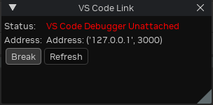

# RTX Remix Toolkit Debugging Guide

Debugging a Kit application can be challenging since its not just a simple Python app that you can create a virtual env, install libs from a requirements.txt and be good to go. The interpreter, libraries and the extensions are located in many directories including outside the project, and it is all put together at runtime by the main process: `kit.exe`.
- Our own `flux` and `lightspeed` extensions each reside inside a subdir in `source/extensions`.
- Omniverse extensions are located in many directories and only available when the app is built, such as `_build/windows-x86_64/release/extscache` or `kit/extscore`.

Also the "real" application will be inside the `_build` directory, such as `_build/windows-x86_64/release/*`, where the extensions will be cross-referenced/symlinked back to the actual `source/extensions` directories for live editing and hot reloading.

**In a nutshell**: All that goes to say that we can't simply run a python interpreter in debug mode from an IDE, we must instead start a Debug Server inside the app and attach the beloved IDE to it.

## So how do we debug?
There are 2 recommended ways:

1. **Omniverse debugpy based extension**: Omniverse provides a handy `omni.kit.debug.python` extension which builds on top of the [debugpy](https://github.com/microsoft/debugpy/) library, with controls to start debug servers, wait for attach on startup, programatically trigger breakpoints on code, logging and more, and is IDE agnostic.
   - **[Optional] Omniverse VSCode debug extension**: Omniverse also provides a `omni.kit.debug.vscode` extension which extends `omni.kit.debug.python` to show an ui window + a few features that could be handy.
2. **Our Pycharm Professional debug extension**: If you own Pycharm Professional (required since Community doesn't allow remote attaching), it can attach to Pycharm debug servers running inside your app, and such a server is opened by our `omni.flux.debug.pycharm` extension.
   -  **[Alternative] LSP4IJ + debugpy**: *There is an extension for Pycharm, [LSP4IJ](https://plugins.jetbrains.com/plugin/23257-lsp4ij/reviews), that allows the Community version to attach to debugpy servers, but it hasn't been tested successfully yet. From the latest attempts, it attaches and stops on breakpoints but Pycharm can't see the variables and app state.*


### 1. Debugging with `omni.kit.debug.python`

To enable the `omni.kit.debug.python` extension, you must run the app with a `--enable omni.kit.debug.python` argument, such as:
```
.\_build\windows-x86_64\release\lightspeed.app.trex.bat --enable omni.kit.debug.python
```
The app will boot up as usual and a debugpy server will be listening on port `3000`.

If you prefer, enable the `omni.kit.debug.vscode` extension instead and it will do the same but with a VS Code Link window like this on startup:



Now just attach your IDE on `127.0.0.1:3000` and happy debugging!

For example for VSCode or Cursor, we already have setup `.vscode/launch.json`, otherwise you can create your own with a`
`Python: Remote Attach` config like this and run it to attach to the server:

```json
// .vscode/launch.json
{
    "version": "0.2.0",
    "configurations": [
        {
            "name": "Python: Remote Attach",
            "type": "debugpy",
            "request": "attach",
            "connect": {
                "host": "localhost",
                "port": 3000
            }
        }
    ]
}
```
*The window will change its Status to `...Attached` when you press Refresh, letting you know it worked.*


### 2. Debugging with Pycharm Professional

We already have Pycharm configs setup on `.idea` and `.run` so just open the project with Pycharm and you should be able to run the configs from the play button up top:
- **Run Remix (Release)**: Just runs the release version of the app without the debug server.
- **Run Remix (Dev)**: Runs the developer version of the toolkit without the debug server.
- **Debug Remix (Release)**: Runs the release version of the app with the debug server enabled + Attaches pycharm to it.
- **Debug Remix (Dev)**: Same, but for the developer version of the toolkit.

But if you're still curious on how it works, its very similar to the debugpy method:
- Run the app enabling `omni.flux.debug.pycharm` and add an ext config to set your Pycharm location:
```
.\_build\windows-x86_64\release\lightspeed.app.trex.bat --enable omni.flux.debug.pycharm --/exts/omni.flux.debug.pycharm/pycharm_location="%LOCALAPPDATA%\Programs\PyCharm Professional"
```
- Then run the `Attach to Debugger` config that attaches to our pycharm debug server running on port `33100`


## Debugging Tests and Startup Logic
Tests are particularly tricky to attach a debugger since they run very fast, rebooting the whole app including the debug server for each test case. Same applies if you need to debug code that runs very fast on startup before you can attach the IDE.

For that the `omni.kit.debug.python` extension provides a `break` option that will force the app to wait for you to attach the debugger before continuing.
```
.\_build\windows-x86_64\release\tests-omni.flux.property_widget_builder.widget.bat -- --enable omni.kit.debug.python --/exts/omni.kit.debug.python/break=1
```
Note though that this time we're passing the arguments after a lone `--`, so the args are forwarded from the `.bat` and `kit.exe` to the test subprocess. Breakpoints won't work otherwise.
