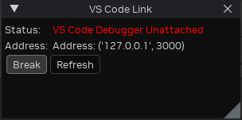

# RTX Remix Toolkit Debugging Guide

Debugging a Kit application can be challenging since it's not just a simple Python app that you can create a virtual
env, install libs from a requirements.txt and be good to go. The interpreter, libraries and the extensions are located
in many directories including outside the project, and it is all put together at runtime by the main process: `kit.exe`.

- Our own `flux` and `lightspeed` extensions each reside inside a subdir in `source/extensions`.
- Omniverse extensions are located in many directories and only available when the app is built, such as
  `_build/windows-x86_64/release/extscache` or `kit/extscore`.

Also the "real" application will be inside the `_build` directory, such as `_build/windows-x86_64/release/*`, where the
extensions will be cross-referenced/symlinked back to the actual `source/extensions` directories for live editing and
hot reloading.

**In a nutshell**: All that goes to say that we can't simply run a python interpreter in debug mode from an IDE, we must
instead start a Debug Server inside the app and attach the beloved IDE to it.

## So how do we debug?

There are 2 recommended ways:

1. **Omniverse debugpy based extension**: Omniverse provides a handy `omni.kit.debug.python` extension which builds on
   top of the [debugpy](https://github.com/microsoft/debugpy/) library, with controls to start debug servers, wait for
   attach on startup, programatically trigger breakpoints on code, logging and more, and is IDE-agnostic.
    - **[Optional] Omniverse VSCode debug extension**: Omniverse also provides a `omni.kit.debug.vscode` extension which
      extends `omni.kit.debug.python` to show an ui window + a few features that could be handy.
2. **Our Pycharm Professional debug extension**: If you own Pycharm Professional (required since Community doesn't allow
   remote attaching), it can attach to Pycharm debug servers running inside your app, and such a server is opened by our
   `omni.flux.debug.pycharm` extension.
    - **[Alternative] LSP4IJ + debugpy**: *There is an extension for
      Pycharm, [LSP4IJ](https://plugins.jetbrains.com/plugin/23257-lsp4ij/reviews), that allows the Community version to
      attach to debugpy servers, but it hasn't been tested successfully yet. From the latest attempts, it attaches and
      stops on breakpoints but Pycharm can't see the variables and app state.*

### 1. Debugging with `omni.kit.debug.python`

To enable the `omni.kit.debug.python` extension, run the app with `--enable omni.kit.debug.python`:

```batch
.\_build\windows-x86_64\release\lightspeed.app.trex.bat --enable omni.kit.debug.python
```

The app boots as usual and a debugpy server listens on port `3000`. Attach your IDE to `127.0.0.1:3000`.

There is also an `omni.kit.debug.vscode` extension that adds a VS Code Link UI window on top of the debugpy server.
Enable it via `--enable omni.kit.debug.vscode` or from the Window -> Extensions toolbar in dev mode.



*The window status changes to `...Attached` when you press Refresh, confirming the connection.*

See [VSCode / Cursor Setup](ide-vscode.md) for pre-configured launch configs.

### 2. Debugging with PyCharm Professional

Unlike debugpy where the app starts a debug server and the IDE attaches to it, PyCharm uses the reverse direction —
PyCharm starts its own debug server first, and the app connects to it via the `omni.flux.debug.pycharm` extension
(port `33100`).

```batch
.\_build\windows-x86_64\release\lightspeed.app.trex.bat --enable omni.flux.debug.pycharm --/exts/omni.flux.debug.pycharm/pycharm_location="%LOCALAPPDATA%\Programs\PyCharm Professional"
```

See [PyCharm Setup](ide-pycharm.md) for pre-configured run/debug configs that handle this automatically.

## Debugging Tests and Startup Logic

Tests are particularly tricky to debug since they run very fast, rebooting the whole app including the debug server for
each test case. Same applies if you need to debug code that runs on startup before you can attach.

The `omni.kit.debug.python` extension provides a `break` option that forces the app to wait for you to attach before
continuing:

```batch
.\_build\windows-x86_64\release\tests-omni.flux.property_widget_builder.widget.bat -- --enable omni.kit.debug.python --/exts/omni.kit.debug.python/break=1
```

Arguments are passed after a lone `--`, so they are forwarded from the `.bat` to `kit.exe` to the test subprocess.
Breakpoints won't work otherwise. Once the app is paused, attach your IDE on port `3000`.

For IDE-specific attach instructions, see [VSCode / Cursor Setup](ide-vscode.md) or [PyCharm Setup](ide-pycharm.md).

## Quick Debug Logging

For temporary debug output while investigating issues at runtime, use `print()` — not `carb.log_info()` or other
`carb` logging functions. `print()` writes directly to stdout and is immediately visible in the console, while `carb`
logging goes through Kit's infrastructure which may filter, delay, or format messages differently.

```python
# Correct — immediate, visible output
print(f"[MyExt] value={some_var}")

# Avoid for debugging — may be filtered or delayed
carb.log_info(f"[MyExt] value={some_var}")
```

Remove all debug `print()` calls before committing.
