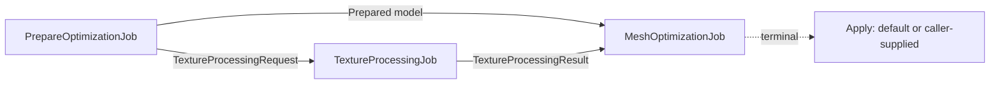
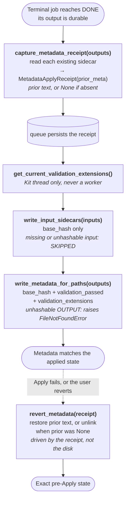

# lightspeed.trex.asset_pipeline.core

Remix-specific asset processing pipelines and queue jobs for RTX Remix model
and texture optimization.

The extension adds concrete Remix behavior to the generic Flux pipeline and
job queue frameworks. It contains no UI.

## Responsibilities

- Define the stable Remix domain types: `RemixAssetItem`, `TextureAsset`,
  `TextureBinding`, and `AssetKind`.
- Build the texture and mesh pipelines.
- Assemble standalone texture and asset optimization graphs. Add asset optimization
  jobs to an existing graph through `add_asset_optimization_jobs()`.
- Run each linear pipeline in a temporary workspace. Publish only its final
  outputs and matching metadata sidecars.
- Implement input standardization, texture discovery, normal and DDS
  conversion, material conversion, reference updates, root wrapping, and
  unit-scale normalization.
- Expose immutable texture, prepare, and mesh job requests and results.
- Persist queue values, codec contracts, Apply handlers, and Apply receipts
  so the job queue can reconstruct work after a process restart.
- Write and restore deterministic metadata sidecars through default Apply
  handlers built on a reusable capture/write/revert utility. A consumer
  supplies its own handler in place of the default.
- Lease isolated native USD contexts for model work.
- Derive each material target from authored shader identifiers without loading UI
  material-library modules.

## Non-Responsibilities

- Does not define the generic pipeline framework. That framework lives in
  `omni.flux.asset_pipeline.core`.
- Does not execute graphs, schedule dependencies, or provide queue storage.
  `omni.flux.job_queue.core` owns those operations.
- Does not create UI or assign ComfyUI outputs to live shader inputs. The
  product Apply handler owns live-stage assignment.
- Does not delete caller-owned source files. The runner deletes only its
  temporary workspace.
- Does not provide generic asset processing for all products. The steps are
  Remix-specific.
- Does not reverse lossy file conversion. Queue Apply/Revert covers metadata
  sidecars, not DDS decompression.
- Does not select shader variants from material names. Authored shader identifiers
  determine each material target.
- Does not offer a stable API to consumers outside this repository. The RTX
  Remix extensions in this repository are its only supported consumers, and
  they update with it in the same merge request.

## Architecture

The extension has four layers: domain records, linear pipeline steps, queue
jobs, and persistence or Apply integration.

### Key Types

- `RemixAssetItem` is the stable item that flows through every step. It
  represents either a texture or a model.
- `TextureAsset` tracks a texture's current path, original path, and semantic.
  `source_path` returns the original path when set, else the current path;
  steps key output naming and reuse checks on it. `TextureBinding` connects
  that record to one authored shader input.
- `RemixAssetPipelineConfig` supplies the output directory and any required
  texture semantic.
- `RemixAssetPipelineContext` owns the current items, workspace paths, output
  reservations, execution state, and one native USD context lease. `textures`
  yields every texture record across the items.
- `PrepareOptimizationJob`, `TextureProcessingJob`, and `MeshOptimizationJob`
  compose into the graphs that `build_texture_optimization_graph()` and
  `build_asset_optimization_graph()` assemble. `add_asset_optimization_jobs()` adds
  the prepare, texture, and mesh jobs to an existing graph.
- `SaveTextureMetadataHandler` and `SaveMeshMetadataHandler` are the default
  Apply/Revert boundary each builder binds to its terminal job. A consumer
  overrides either through the builder's `handler_type` parameter.
- The `metadata` module exposes `capture_metadata_receipt()`,
  `write_metadata_for_paths()`, `revert_metadata()`, and
  `write_input_sidecars()`, the utility both default handlers and a
  consumer's own handler build on. `constants` holds the matching sidecar
  keys.
- `persistence_codecs.py` serializes immutable job values, default Apply handlers,
  and the `MetadataApplyReceipt` that SQLite stores.
- `utils.py` contains `get_authoring_spec()`, `publish_remote_outputs()`, and
  the shared path helpers. The `pipeline` package does not re-export them.

### Pipeline Composition

The extension exposes two processing pipelines. The texture pipeline converts
standalone or discovered textures. The mesh pipeline consumes the processed
texture result and authors the final model.

The queue adds a prepare phase before those pipelines:

| Queue phase | Ordered work | Legacy parity rule |
| --- | --- | --- |
| Prepare | standardize/import → cleanup → materials → discover dependencies | Convert materials before discovering textures, as the legacy schema ran `MaterialShaders` before `ConvertToDDS`, so every source-shader texture is found under its AperturePBR input. |
| Texture pipeline | OTH normal → DDS | Convert shared sources once and retain legacy output names. |
| Mesh pipeline | standardize/import → cleanup → materials → emissive → textures → references → metadata | Clean materials before conversion. Apply references and root changes last. The legacy schema never triangulated, so neither does this pipeline. |

`ApplyProcessedTexturesStep` consumes a ledger keyed by
`(material_path, texture_type)`. This identity survives shader path changes
that occur during material conversion.

When a consumer connects the jobs into a graph, `MeshOptimizationJob`
validates every ledger entry against the texture-processing result before
this step runs. A missing or unresolved ledger entry fails model assembly
there; the pipeline does not publish a model that still refers to an
unprocessed discovered texture.

Direct, standalone use of `ApplyProcessedTexturesStep` skips that upstream
validation. A discovered binding with no matching processed-texture entry
falls back to the resolved source texture instead of failing.

An existing DDS is reused only when its sidecar `src_hash` equals the hash of
the current source texture, as the legacy plugin decided. The output filename
carries the texture semantic, so the same path with the same source hash is the
same conversion. A matching name alone is not sufficient.

Material conversion preserves authored AperturePBR variants. OmniGlass maps to
`AperturePBR_Translucent`. OmniPBR, OmniPBR_Opacity, and UsdPreviewSurface map to
`AperturePBR_Opacity`. An unsupported shader fails conversion. Callers create a
model item with `RemixAssetItem.from_model(path)`; they do not select one shader
variant for the whole model.

### Job Composition

`build_texture_optimization_graph()` and `build_asset_optimization_graph()`
assemble the two graph shapes below, bind Apply to the terminal job, and
return the graph and that job. Both take a `handler_type` and `target`, so a
product supplies its own handler without this extension importing that
product.

`add_asset_optimization_jobs(graph, source, ...)` adds the prepare, texture, and
mesh jobs to an existing graph. It returns the terminal `MeshOptimizationJob`.
`build_asset_optimization_graph()` creates a graph and calls that same function.
Both paths use one implementation of the asset graph.

A caller with an upstream image job adds a `TextureProcessingJob` to its graph
and connects the image request output to `SOURCE_TEXTURES`. A caller with an
upstream model job uses `add_asset_optimization_jobs()` instead.
`lightspeed.trex.comfyui.core` uses these paths for workflow outputs.



The prepare job discovers model textures and sub-USD dependencies. It sends
the texture request to the texture job and the prepared model to the mesh
job.

The mesh job waits for both inputs. It applies processed textures, publishes
the model, and preserves complete job lineage. Its inner texture job never
carries an Apply binding. `add_asset_optimization_jobs()` binds Apply only to the
terminal mesh job, so Apply cannot run before the complete model is ready.

A caller using the standalone builder submits the graph and reads the
terminal job's outputs; it never constructs `JobGraph`, `add_job`,
`connect`, or `ApplyBinding` directly:

```python
graph, mesh_job = build_asset_optimization_graph(request, handler_type=MyHandler, target=my_target)
queue_jobs = {job.job_id: job for job in get_job_queue().submit(graph)}
await queue_jobs[mesh_job.job_id].outputs(timeout=300)
```

`MeshOptimizationRequest.output_url` selects the final output directory. It
accepts a nonblank string or `None`. `None` keeps outputs in the durable queue
job directory. The prepare result retains the requested destination. The inner
texture job keeps its outputs local. The mesh job copies those textures beside
the model and publishes the model, textures, and dependency layers together.
`MeshOptimizationResult.asset_url` identifies the published model.

Queue request and result records are immutable. Persisted codec names and
tuple order define the persistence contract.

`TextureProcessingItem.key` is caller-defined and unique within one request.
The matching `ProcessedTexture` retains that key, so consumers do not depend
on output names or changed normal semantics.

### Runner and Publication

`run_remix_asset_pipeline()` validates the configured steps and runs each
source item in order. It reports per-step progress and per-item completion.

The runner creates one temporary workspace. Steps request collision-safe work
and output paths from `RemixAssetPipelineContext`; they do not invent path
suffixes.

Output reservations preserve each source path relative to its project or
import root. They include the processing semantic in derived names. A stable
source hash handles only a remaining collision.

A published model is `<source stem>.usd` with its converted textures beside it
in `textures/<stem>.<letter>.rtex.dds`, referenced as `./textures/...`. This is
the layout the retired validator produced. Model references never refer to
temporary workspace paths.

The runner publishes only paths that the final item records still reference.
It moves matching `.meta` sidecars with those files and removes all
intermediates. A DDS sidecar carries exactly the legacy keys: `src_hash`,
`base_hash`, `validation_passed`, `validation_extensions`. DDS reuse checks
`src_hash` alone, as the legacy plugin did, so a legacy-ingested texture is
reused rather than re-encoded.

`tests/e2e/test_legacy_fixtures.py` proves the contract against data the
retired validator produced and that the repository already ships: a fresh
conversion of the legacy source yields the legacy filename, the legacy sidecar
keys, and the same `src_hash`, and a validator-produced DDS that carries only
its legacy sidecar is reused untouched. These tests never import the validator
extensions; this extension replaces them and must not depend on them.

Local outputs remain durable when no remote publication URL exists.
`utils.publish_remote_outputs()` creates missing remote parent directories, stages
the complete output directory, and saves the prior destination as a backup. It
then replaces the destination with the new directory.

Cancellation or publication failure triggers rollback. The rollback restores
the prior destination and removes incomplete transaction data when possible.

### Apply Handlers

File conversion is forward-only and idempotent. It has no Apply/Revert
surface.

This extension ships two default Apply handlers, `SaveTextureMetadataHandler`
and `SaveMeshMetadataHandler`, built on the `metadata` module:
`capture_metadata_receipt()` records the prior sidecar contents in a
`MetadataApplyReceipt` before Apply writes a sidecar, `write_metadata_for_paths()`
writes validation metadata after a successful job, and `revert_metadata()`
restores each prior sidecar exactly, removing a sidecar that did not exist
before Apply. The utility accepts local `Path` values and remote URL strings.
Each handler captures all input and output sidecars before it writes. If a later
write fails, the handler restores every sidecar from that attempt.
Each graph builder binds its default handler; a product
overrides it through `handler_type`. The sidecar keys that utility writes
live in `constants`.

Two behaviours in that utility are deliberate. A missing or unhashable INPUT
is skipped, because Apply runs after processing and a consumed source may
already be gone. An unhashable OUTPUT raises, because this pipeline produced
it. Revert reads the durable receipt, never the current disk state.



Product-specific registration and live-stage changes stay outside this
extension. `lightspeed.trex.comfyui.core` is the worked example: its
`ComfyUIJobApplyHandler` calls this extension's `metadata` utility and adds
the product-specific Apply/Revert actions.

### Native USD Context Lifetime

> **Warning:** Each outer `async with RemixAssetPipelineContext(...)` scope
> leases one ingestion USD context exclusively. The scope exit closes the stage
> and returns the lease to the shared pool. The package never destroys a
> context.

The exclusive lease prevents parallel jobs from sharing mutable USD state. It
also prevents ingestion from replacing the interactive stage in the app's
default context.

Steps open, save, and close stages only through
`RemixAssetPipelineContext.open_stage()`, `save_stage()`, and `close_stage()`.
They do not call `Usd.Stage.Open()` or use the default USD context.

The context holds one stage at a time. A step that processes dependency layers
must close the stage between layers. Callers must not retain stage, prim, or
layer handles across an open of a different path.

The outermost scope exit closes the current stage before the runner removes
its workspace, then returns the still-live native context to the free list.

If close fails, the context returns to the free list with its stage. The next
`open_stage()` on that context replaces the leftover stage, the same way the
default context replaces the open project. The pool is therefore bounded by
the peak number of concurrent scopes in every case.

Never call `omni.usd.destroy_context()` for a leased context. The native
context can still hold queued `omni.kit.usd.layers` events, and destroying it
then crashes the process.

## Usage

Import the public pipeline types from the extension root. The runner opens and
closes the context scope for the run:

```python
import pathlib

from omni.flux.asset_importer.core.data_models import TextureTypes

from lightspeed.trex.asset_pipeline.core import (
    RemixAssetItem,
    RemixAssetPipelineConfig,
    RemixAssetPipelineContext,
    build_remix_texture_pipeline,
    run_remix_asset_pipeline,
)

item = RemixAssetItem.from_texture(
    pathlib.Path("/outputs/normal.png"),
    TextureTypes.NORMAL_DX,
)
config = RemixAssetPipelineConfig(
    output_dir=pathlib.Path("/project/processed_textures"),
    texture_type=TextureTypes.NORMAL_DX,
)
context = RemixAssetPipelineContext(items=[item])

await run_remix_asset_pipeline(
    config,
    context,
    steps=build_remix_texture_pipeline(),
)
processed_texture = item.textures[0].path
```
