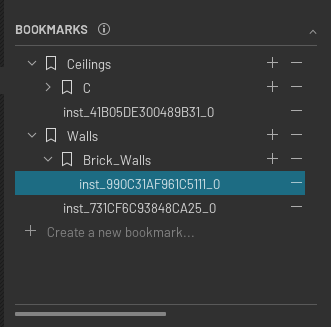

# Overview

This widget allows users to create bookmark collections and store items in these collections. Collections can also be
parented, meaning a collection's child can be either another collection or an item.

This widget relies on a listener found in the model to update its content.

In order to use this widget, you will need to use an implemented version of the model when creating the widget.

## Implementation

The widget uses multiple components:
- an item class
- a model class
- a delegate class

### Item class

the `ItemBase` class inherits directly from `ui.AbstractItem` but should not be used directly. Instead, the various children
classes should be used to display items in the tree:
- `CreateBookmarkItem`
- `TemporaryBookmarkItem`
- `BookmarkCollectionItem`
- `BookmarkItem`

These items are the structures that will be used in the delegate to display UI items on screen.

### Model class

This class inherits from `ui.AbstractItemModel` and should also not be used directly. Instead, an implemented version of
the model should be used. See: `omni.flux.bookmark_tree.model.usd`.

The `ui.TreeView` uses the model class to populate the tree. The class holds all the items of type `ItemBase` mentioned
in the "Item class" section.

The model is also the class that will take actions on your collections (edit USD, created folders in your OS, etc.)

### Delegate class

This class inherits from `ui.AbstractItemDelegate`. The delegate will define how the `ItemBase` items should be displayed in
terms of UI. The existing delegate can be overridden or replaced completely depending on your needs.

## Implementation example(s)

Please check:
- `omni.flux.bookmark_tree.model.usd`

For implementation examples.
