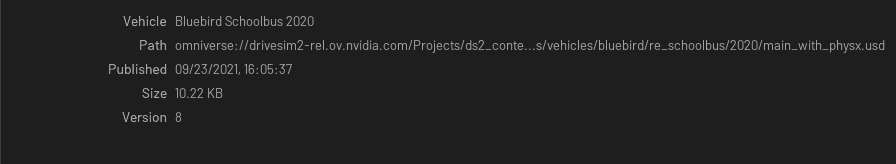

# Overview

This is the widget that let you create a property panel using a tree and delegate



## Usage

```python
from omni.flux.content_library.property.widget import ContentLibraryPropertyWidget as _ContentLibraryPropertyWidget

tree_widget = _ContentLibraryPropertyWidget(model=None, delegate=None)  # hold the widget in a variable or it will crash
```

## Implementation

### Model
You have to create a subclass of the model and implement `_set_items_from_data()`:

```python
from typing import Any, List

import omni.client
from omni.flux.content_library.property.widget.model import Item as _Item
from omni.flux.content_library.property.widget.model import Model as _Model


class MetadataModel(_Model):
    def _set_items_from_data(self, items: List[Any]) -> List[_Item]:
        if not items or (items and items[0].path is None):
            return []
        result, entry = omni.client.stat(items[0].path)
        if result == omni.client.Result.OK:
            data = [
                _Item("Vehicle", items[0].title),
                _Item("Path", items[0].path),
                _Item("Published", entry.created_time.strftime("%m/%d/%Y, %H:%M:%S")),
            ]
            result_list, entries = omni.client.list_checkpoints(items[0].path)
            if result_list == omni.client.Result.OK:
                data.append(_Item("Version", str(entries[-1].relative_path[1:])))
            return data
        return [_Item("Error", "Can't read the path"), _Item("Path", items[0].path)]
```
