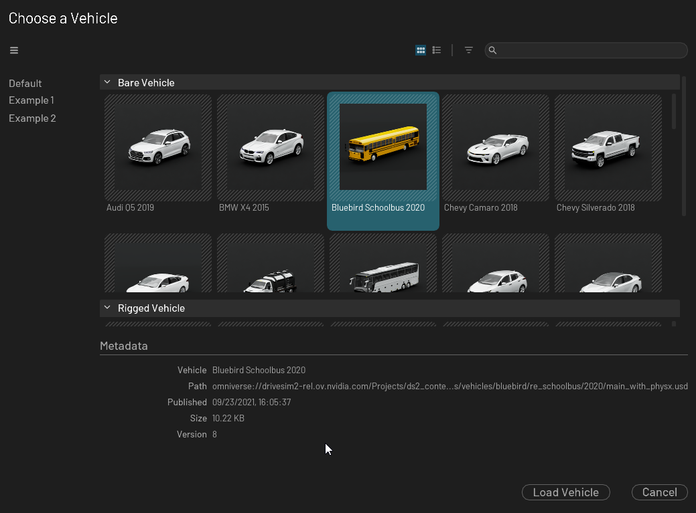

# Overview

This is the widget that let you create a content library, with a menu and metadata display.



## Usage

```python
from omni.flux.content_library.widget import ContentLibraryWidget
from omni.flux.content_viewer.widget.core import ContentViewerCore

content_viewer_core_dict = {
    "Default": [ContentViewerCore()],
    "Example 1": [],
    "Example 2": [],
}

content_library_widget = ContentLibraryWidget(
    content_viewer_core_dict,
    title="Choose a Vehicle",
    load_button_display="Load Vehicle"
)  # hold the widget in a variable or it will crash
```

## Implementation

### Icons
First you need to set some style in your global style (to have basic icons):
```python
import omni.ui as ui
from omni.flux.utils.widget.resources import get_fonts as _get_fonts
style = ui.Style.get_instance()
current_dict = style.default
current_dict.update(
    {
        # menu burger
        "Image::MenuBurger": {"image_url": "menu-burger.svg", "color": 0x99FFFFFF},
        # arrangement grid icon
        "Image::ArrangementGrid": {"image_url": "arrangement-grid.svg", "color": 0x99FFFFFF},
        # arrangement list icon
        "Image::ArrangementList": {"image_url": "arrangement-list.svg", "color": 0x99FFFFFF},
        # filter icon
        "Image::Filter": {"image_url": "filter.svg", "color": 0x99FFFFFF},
        # branch +/- icon
        "Image::TreeViewBranchCollapsed": {"image_url": "disclosure-collapsed.svg", "color": 0xFFFFFFFF},
        "Image::TreeViewBranchExpanded": {"image_url": "disclosure-expanded.svg", "color": 0xFFFFFFFF},
    }
)
style.default = current_dict
```

### Data
Please check the API documentation to see what you can pass to the widget (models, delegates, etc etc)
