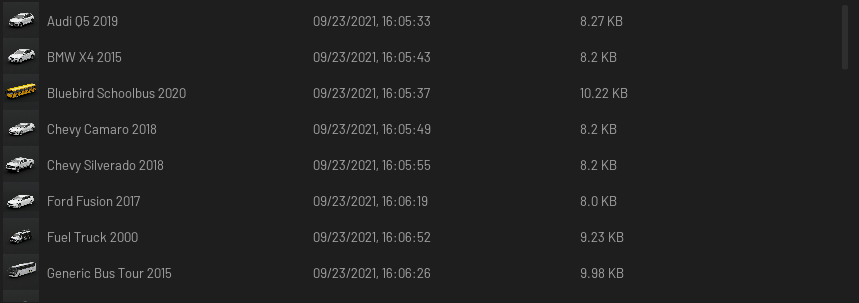
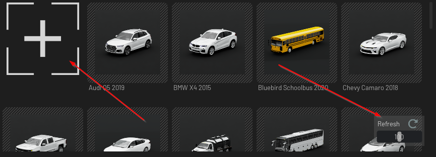
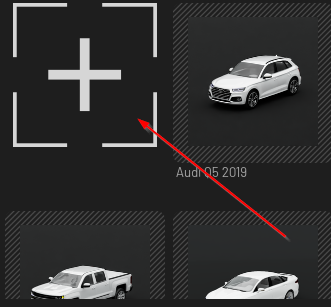
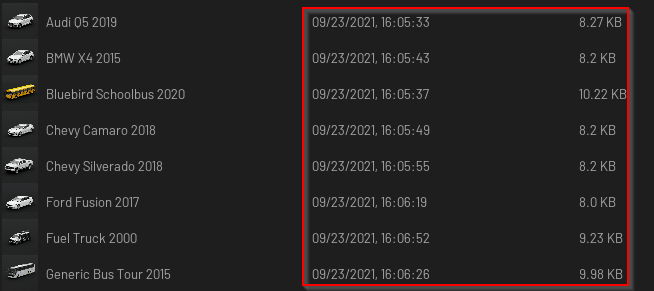

# Overview

This is the widget that let you create a view to see content/a library.

Grid view:


List view:



## Usage

```python
from omni.flux.content_viewer.widget import ContentViewerWidget as _ContentViewerWidget
from omni.flux.content_viewer.widget.core import ContentViewerCore as _ContentViewerCore

core = _ContentViewerCore()
viewer = _ContentViewerWidget(core)
```

## Implementation

### Icons
First you need to set some style in your global style (to have basic icons):
```python
import omni.ui as ui
from omni.flux.utils.widget.resources import get_fonts as _get_fonts
style = ui.Style.get_instance()
current_dict = style.default
current_dict.update(
    {
        # refresh
        "Image::ContentViewerWidgetRefresh": {"image_url": "refresh.svg", "color": 0xFF8A8777, "margin": 3},

        # add item
        "Image::ContentViewerWidgetItemAddAdd": {"image_url": "add.svg", "color": 0xFFDADADA},

        # item background grid
        "Image::ContentViewerWidgetItemGrid": {"image_url": "grid.svg", "color": 0x33FFFFFF, "border_radius": 8},
    }
)
style.default = current_dict
```

### Viewer

The view has some feature that you can enable/disable when you implement it. Some of those features can be changed dynamically at runtime (like the view from grid to list), some are not.

Example:
```python
from omni.flux.content_viewer.widget import ContentViewerWidget as _ContentViewerWidget
from omni.flux.content_viewer.widget.core import ContentViewerCore as _ContentViewerCore

class _EgoVehicleViewer(_ContentViewerWidget):

    SHOW_REFRESH_AND_SLIDER = True
    ENABLE_ADD_ITEM = True

core = _ContentViewerCore()
viewer = _EgoVehicleViewer(core)
```

This will create a view with the "zoom" slider enabled and the "Add item" enabled:



Please check all the feature in the API of the viewer documentation.


#### Filtering

You can override the filter function to add any type of filtering feature(s) that you want. By default

```python
from omni.flux.content_viewer.widget import ContentViewerWidget as _ContentViewerWidget
from omni.flux.content_viewer.widget.core import ContentViewerCore as _ContentViewerCore
from typing import Optional, Type

class _EgoVehicleViewer(_ContentViewerWidget):

    def _filter_fn(self, text: Optional[str], data: Type["BaseContentData"]) -> bool:
        """
        Default filter function

        Args:
            text: the input text that will be used to filter
            data: the item

        Returns:
            If the item should be shown or not
        """
        if text is not None and text.lower() not in data.title.lower():
            return False
        return True

core = _ContentViewerCore()
viewer = _EgoVehicleViewer(core)
```

You can change this function to filter the way you want (tags from the usd data.path, etc etc).

### Viewer item
The view will show "view items". Those view items can be customized. By default, there are already two default implementation
- `from omni.flux.content_viewer.widget import ContentItemAdd`.
- `from omni.flux.content_viewer.widget import ContentItem`.

`ContentItemAdd` is a basic viewer item with an "+" image:



`ContentItem` takes as an input a core `from omni.flux.content_viewer.widget.core import ContentData`, that represent a data with a path.
From the core `ContentData` data, the viewer item will show things (like the image).


You can customize those items, or create new one using `ContentItem` as example. The UI can be customized using the function `_deferred_create_ui()`.
Please check the API to see features of `ContentItem` (multi-selection, drag, etc etc).

To tell the view to use our custom item:
```python
from omni.flux.content_viewer.widget import ContentViewerWidget as _ContentViewerWidget
from omni.flux.content_viewer.widget.core import ContentViewerCore as _ContentViewerCore

class _EgoVehicleViewer(_ContentViewerWidget):

    SHOW_REFRESH_AND_SLIDER = True
    ENABLE_ADD_ITEM = True
    CONTENT_ITEM_TYPE = MyCustomItem  #<---- here

core = _ContentViewerCore()
viewer = _EgoVehicleViewer(core)
```

By default, the view use `ContentItem`.

### Core

You need to sub-class the core to feed the view with the data that you want to show. `_get_content_data()` needs to be implemented:

```python
import carb
from pydantic import ValidationError
from typing import List, Type
from omni.flux.content_viewer.widget.core import ContentData, ContentViewerCore

import typing
if typing.TYPE_CHECKING:
    from omni.flux.content_viewer.widget.core import BaseContentData

class BareVehicleCore(ContentViewerCore):

    @property
    def name(self) -> str:
        """Name of the core"""
        return "Bare Vehicle"

    def __get_image(self) -> str:
        return "image.png"

    def _get_content_data(self) -> List[Type["BaseContentData"]]:
        result = []
        for title, data in {"Hello01": "my_data", "Hello02": "my_data"}.items():
            try:
                result.append(
                    ContentData(
                        title=title,
                        path=data,
                        image_path_fn=self.__get_image,
                    )
                )
            except ValidationError as error:
                carb.log_error(error.json())
        return result
```

Please check the API of the core.


### Core item

As you can see, `_get_content_data()` need to return a list of items based of `BaseContentData`.
By default, because the viewer uses the viewer item `from omni.flux.content_viewer.widget import ContentItem` that takes data with a path and an image, a basic core item was implemented `from omni.flux.content_viewer.widget.core import ContentData`.

This is what we use in our previous example.

### Full custom example
You can, if you want, create a new type of core item (that takes different type of data, like a color):

```python
from omni.flux.content_viewer.widget.core import BaseContentData

class CustomContentData(BaseContentData):
    color: str
```

Use this core item into your core implementation that will grab the data:
```python
import carb
from pydantic import ValidationError
from typing import List, Type
from omni.flux.content_viewer.widget.core import ContentViewerCore

import typing
if typing.TYPE_CHECKING:
    from omni.flux.content_viewer.widget.core import BaseContentData

class ColorCore(ContentViewerCore):

    @property
    def name(self) -> str:
        """Name of the core"""
        return "Colors"


    def _get_content_data(self) -> List[Type["BaseContentData"]]:
        result = []
        for title, color in {"Color1": "red", "Color2": "blue"}.items():
            try:
                result.append(
                    CustomContentData(  # <--- here
                        title=title,
                        color=color,  # <-- here
                    )
                )
            except ValidationError as error:
                carb.log_error(error.json())
        return result
```

And create a custom viewer item to show this color:
```python
from omni.flux.content_viewer.widget.items import BaseContentItem
from typing import Type
import omni.ui as ui


class ContentItemColor(BaseContentItem):
    async def _deferred_create_ui(self):
        """Create the UI"""
        with ui.VStack():
            ui.Label(self.content_data.color)  # <---- here, or could be an image that show the color
            ui.Label(self.content_data.title)
```

And set this item type as a default item into a viewer:
```python
from omni.flux.content_viewer.widget import ContentViewerWidget as _ContentViewerWidget
from omni.flux.content_viewer.widget.core import ContentViewerCore as _ContentViewerCore

class _ColorViewer(_ContentViewerWidget):

    SHOW_REFRESH_AND_SLIDER = True
    ENABLE_ADD_ITEM = True
    CONTENT_ITEM_TYPE = ContentItemColor  #<---- here

core = _ContentViewerCore()
viewer = _ColorViewer(core)
```

### Customize the list view
You can add more column(s) into the list view:



To do that, you can pass a custom delegate:
```python
from omni.flux.content_viewer.widget import ContentViewerWidget as _ContentViewerWidget

class CustomViewer(_ContentViewerWidget):
    LIST_DELEGATE_TREE_VIEW = _CustomDelegate
```
And you can add new column(s) into your delegate:
```python
import omni.ui as ui
from omni.flux.content_viewer.widget.tree_delegate import Delegate as _DelegateTreeView
from omni.flux.content_viewer.widget.tree_model import HEADER_DICT

HEADER_DICT.update(
    {
        2: "Hello column",
    }
)

class Delegate(_DelegateTreeView):
    def build_widget(self, model, item, column_id, level, expanded):
        super().build_widget(model, item, column_id, level, expanded)
        with self._frames[item.content_data.title][self._widget_name]:
            if column_id == 2:
                label = ui.Label(
                    "Hello", name="ContentViewerWidgetItemListTitle", style=self._get_label_style(item)
                )

                if item.content_data.title in self._labels:
                    self._labels[item.content_data.title][self._widget_name] = label
                else:
                    self._labels[item.content_data.title] = {self._widget_name: label}
```
