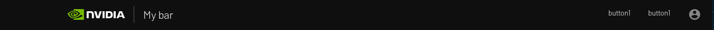

# Overview

This is the widget that let you create a header bar navigator.


## Usage

```python
from omni.flux.header_navigator.widget import setup_ui as header_navigator_ui
import omni.ui as ui

def _create_menu_text() -> ui.Widget:
    image_widget = ui.Label("button", alignment=ui.Alignment.LEFT, height=0)
    return image_widget

header_navigator = header_navigator_ui.create_instance("Flux")
header_navigator.register_button({"button": (_create_menu_text, 50)})
header_navigator.create_ui()
```

## Implementation

### Logo
First you need to set your logo in your global style:
```python
import omni.ui as ui
style = ui.Style.get_instance()
current_dict = style.default
current_dict.update(
    {
        "Image::HeaderNavigatorLogo": {"image_url": "Nvidia_logo.png", "color": 0xFFFFFFFF}
    }
)
style.default = current_dict
```

### Example
You can have multiples header bar navigators.

You can see the current created instances like this:
```python
from omni.flux.header_navigator.widget import setup_ui as header_navigator_ui
header_navigators = header_navigator_ui.get_instances()
```

But you can have multiple modules that would "feed" one instance (add buttons).
For example, image you have 2 Kit extensions that will need to add 1 button each, and those extensions start with no order.

You want the extensionA to add a button1 on the left, and an extensionB a button2 on the right.

To do this, extensionA will do:
```python
from omni.flux.header_navigator.widget import setup_ui as header_navigator_ui
import omni.ui as ui

def _create_menu_text() -> ui.Widget:
    image_widget = ui.Label("button1", alignment=ui.Alignment.LEFT, height=0)
    return image_widget

instance_name = "My bar"  # bar name that will appear next to the Nvidia logo
# because we don't know what extension starts before which one, we create the instance if needed
headers_navigator = header_navigator_ui.get_instances()
if headers_navigator.get(instance_name):
    header_navigator = headers_navigator.get(instance_name)
else:
    header_navigator = header_navigator_ui.create_instance(instance_name)
# now we register the button with a priority of 10
header_navigator.register_button({"button1": (_create_menu_text, 10)})
```

And extensionB will do:
```python
from omni.flux.header_navigator.widget import setup_ui as header_navigator_ui
import omni.ui as ui

def _create_menu_text() -> ui.Widget:
    image_widget = ui.Label("button2", alignment=ui.Alignment.LEFT, height=0)
    return image_widget

instance_name = "My bar"  # bar name that will appear next to the Nvidia logo
# because we don't know what extension starts before which one, we create the instance if needed
headers_navigator = header_navigator_ui.get_instances()
if headers_navigator.get(instance_name):
    header_navigator = headers_navigator.get(instance_name)
else:
    header_navigator = header_navigator_ui.create_instance(instance_name)
# now we register the button with a priority of 20, more on the right side than the other button
header_navigator.register_button({"button2": (_create_menu_text, 20)})
```

Finally in the extension that create your UI:
```python
from omni.flux.header_navigator.widget import setup_ui as header_navigator_ui
import omni.ui as ui

instance_name = "My bar"  # bar name that will appear next to the Nvidia logo
# because we don't know what extension starts before which one, we create the instance if needed
headers_navigator = header_navigator_ui.get_instances()
if headers_navigator.get(instance_name):
    header_navigator = headers_navigator.get(instance_name)
else:
    header_navigator = header_navigator_ui.create_instance(instance_name)
header_navigator.create_ui()
```


Result:




The widget contains some APIs where you can unregister a button, show or hide the logo, select a button, refresh, subscribe, etc etc.

Please check the API documentation.
