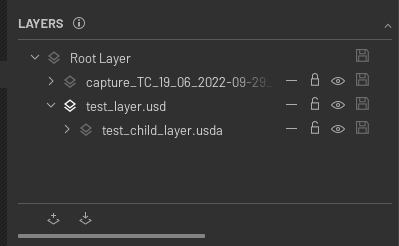

# Overview

This widget allows users to visualize and edit the different layers in the USD context.

## Implementation

The widget uses multiple components:
- an item class
- a model class
- a delegate class

### Item class

the `ItemBase` class inherits directly from `ui.AbstractItem` but should not be used directly. Instead, the children
classes should be used to display items in the tree:
- `LayerItem`

These items are the structures that will be used in the delegate to display UI items on screen.

### Model class

This class inherits from `ui.AbstractItemModel` and can be used directly as it implements all the important methods required to display the information.

The `ui.TreeView` uses the model class to populate the tree. The class holds all the items of type `ItemBase` mentioned
in the "Item class" section.

The model class listens to Layer events and will refresh the widget whenever a change occurs.

### Delegate class

This class inherits from `ui.AbstractItemDelegate`. The delegate will define how the `ItemBase` items should be displayed in
terms of UI. The existing delegate can be overridden or replaced completely depending on your needs.
