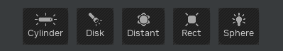

# Overview

This is the widget that will show buttons that will let you create light(s).



## Usage

```python
from omni.flux.light_creator.widget import LightCreatorWidget as _LightCreatorWidget

widget = _LightCreatorWidget(context_name)
```
