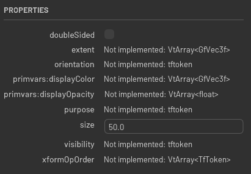

# Overview

This is the widget that let you create a panel that shows attributes of material USD prim(s)



## Usage

```python
from omni.flux.properties_pane.materials.usd.widget import PropertyWidget as _PropertyWidget

properties_create_ui = _PropertyWidget(self._context_name)  # hold the widget in a variable or it will crash
# usd_paths is a list of material prim sdf paths
properties_create_ui.refresh(usd_paths)
```
