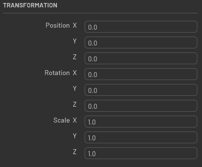

# Overview

This is the widget that let you create a panel that shows all transform (xform) of a USD prim(s)



## Usage

```python
from omni.flux.properties_pane.transformation.widget import TransformPropertyWidget as _TransformPropertyWidget

transformation_create_ui = _TransformPropertyWidget(self._context)  # hold the widget in a variable or it will crash
transformation_create_ui.refresh(usd_paths)
```
