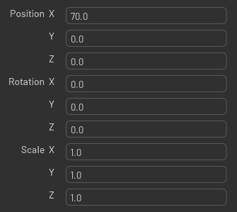

# Overview

This is the widget that let you build property widget(s) from USD attributes.

You can show custom names for attributes. For example here, `translateY` is just `Y`:




There is a listener that will update the widget properties in real time.

## Usage

```python
import omni.usd
import omni.ui as ui
from omni.flux.property_widget_builder.model.usd import USDAttributeItem as _USDAttributeItem
from omni.flux.property_widget_builder.model.usd import USDDelegate as _USDPropertyDelegate
from omni.flux.property_widget_builder.model.usd import USDModel as _USDPropertyModel
from omni.flux.property_widget_builder.model.usd import get_usd_listener_instance as _get_usd_listener_instance
from omni.flux.property_widget_builder.widget import PropertyWidget as _PropertyWidget

usd_listener_instance = _get_usd_listener_instance()

stage = omni.usd.get_context().get_stage()
prims = [stage.GetPrimAtPath(path) for path in ["/Root/my_prim"]]

valid_paths = []
items = []
# pre-pass to check valid prims with the attribute
for prim in prims:
    if not prim.IsValid():
        continue
    attrs = prim.GetAttributes()
    for attr in attrs:
        items.append(_USDAttributeItem(stage, [attr.GetPath()]))

property_model = _USDPropertyModel(stage, valid_paths)
property_model.set_items(items)
property_delegate = _USDPropertyDelegate()
usd_listener_instance.add_model(property_model)
with ui.Frame():
    property_widget = _PropertyWidget(property_model, property_delegate)
```
