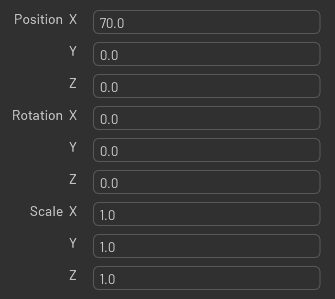

# USD Property Widget Model

Build property rows backed by USD attributes, with layer-aware writes, undo, and USD change listening.

## Responsibilities

- Read and edit scalar, vector, and virtual USD attributes across the selected prims.
- Keep property rows synchronized with USD and expose their reset and override state.
- Preview numeric drags live while preserving one undoable change on release.

## Non-Responsibilities

Numeric widget input and bounds belong to the shared property delegates and widget utilities. Stage Manager owns its
tree refreshes; this extension participates in the shared USD notice deferral used during property interactions.

## Architecture

`USDModel` owns property items and the interaction lifecycle. Attribute value models read and write USD through the
existing commands. `USDListener` routes USD changes back to the model. The delegate builds the corresponding controls.

You can show custom names for attributes. For example here, `translateY` is just `Y`:




There is a listener that will update the widget properties in real time.

### Numeric Drag Preview

During a numeric batch edit, value models coalesce input into one preview on the next Kit update. Preview commands run
with undo disabled. Command history still records these previews; tests must inspect the undo stack and exercise
Undo/Redo rather than count command-history entries. SDK `UsdLayerUndo` reservations are indexed by effective layer and
mapped property path, capturing each original property spec once per gesture, including related properties. Each
reservation is restored independently. Property and Stage Manager notifications stay deferred through the interaction.

On release, pending preview work is cancelled, the original specs are restored, and the final cached value is written
through the existing commands. An undo group opens only when a target actually changes, so cancellation and unchanged
gestures preserve redo history. Cancelling, replacing items, or destroying an item or model restores the original
authored state without a final write. Item teardown calls each value model's `destroy()` hook to cancel its preview.
Multi-selection and vector editing retain their existing value and targeting semantics.

Restoration attempts every reserved property, reports failures, and retains only unsuccessful reservations. While
restoration remains unresolved, new edits and repeated release attempts raise an error before changing cached values
or opening an undo group. Explicit cancellation or destruction retries the remaining reservations; successful recovery
refreshes cached values and allows editing again. Recovery state remains local to the owning value models.
Failed restoration aborts model destruction or item replacement, keeping the existing items and their reservations
reachable for an explicit retry.

Default virtual attributes support previews. Virtual attributes with custom creation callbacks keep release-only
writes because their callback may modify properties outside the model's reservation scope. Typed edits keep their
existing immediate-write behavior.

## Row-Owned Property State

USD property rows can represent one authored USD attribute or a logical group of companion attributes. The delegate asks each row for owned value models, owned attributes, row state, reset, and override deletion.

- Normal scalar rows use their own value models and USD attributes.
- Grouped rows, such as particle gradients, use suffix-based logical group definitions so `:times` and `:values` are handled as one row.
- Logical group outlets, such as particle curves, keep their display model inert but report the backing curve primvars through `get_owned_attributes()`.
- Active reset indicator tooltips show the default USD value when the row can resolve the value that reset will restore.
- Three-channel transform rows use synchronized link icons in both inter-field gaps. Their tooltips indicate whether multi-channel editing is on or off. Enabling them copies each represented object's X value to its Y and Z channels in one undoable edit, then activates a row-, label-, and links-highlighted grouped-edit state. The first field uses an inline text editor for immediate keyboard focus, and one validated field value is applied to every axis through a single USD write.
- Double-clicking any field while grouped editing remains active uses that field's native text editor without replacing the native drag behavior.
- Vector rows accept `tooltip_channel_names` when their components have semantic names instead of axis names.

## Usage

```python
import omni.usd
import omni.ui as ui
from omni.flux.property_widget_builder.model.usd import USDAttributeItem as _USDAttributeItem
from omni.flux.property_widget_builder.model.usd import USDDelegate as _USDPropertyDelegate
from omni.flux.property_widget_builder.model.usd import USDModel as _USDPropertyModel
from omni.flux.property_widget_builder.model.usd import get_usd_listener_instance as _get_usd_listener_instance
from omni.flux.property_widget_builder.widget import PropertyWidget as _PropertyWidget

usd_listener_instance = _get_usd_listener_instance()

stage = omni.usd.get_context().get_stage()
prims = [stage.GetPrimAtPath(path) for path in ["/Root/my_prim"]]

valid_paths = []
items = []
# pre-pass to check valid prims with the attribute
for prim in prims:
    if not prim.IsValid():
        continue
    attrs = prim.GetAttributes()
    for attr in attrs:
        items.append(_USDAttributeItem(stage, [attr.GetPath()]))

property_model = _USDPropertyModel(stage, valid_paths)
property_model.set_items(items)
property_delegate = _USDPropertyDelegate()
usd_listener_instance.add_model(property_model)
with ui.Frame():
    property_widget = _PropertyWidget(property_model, property_delegate)
```
