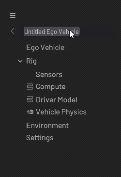

# Overview

This is the widget that let you create a tree view with some icons, a menu, and a title that you can change with a double click.




## Usage

```python
from omni.flux.tree_panel.widget import PanelOutlinerWidget

widget = PanelOutlinerWidget(tree_model=None, tree_delegate=None)  # hold the widget in a variable or it will crash
```

## Implementation

### Icons
First you need to set some style in your global style (to have basic icons):
```python
import omni.ui as ui
from omni.flux.utils.widget.resources import get_fonts as _get_fonts
style = ui.Style.get_instance()
current_dict = style.default
current_dict.update(
    {
        # menu burger
        "Image::MenuBurger": {"image_url": "menu-burger.svg", "color": 0x99FFFFFF},
        "Image::MenuBurger:hovered": {"image_url": "menu-burger.svg", "color": 0xCCFFFFFF},
        "Image::MenuBurger:selected": {"image_url": "menu-burger.svg", "color": 0xFFFFFFFF},

        # branch +/- icon
        "Image::TreeViewBranchCollapsed": {"image_url": "disclosure-collapsed.svg", "color": 0xFFFFFFFF},
        "Image::TreeViewBranchExpanded": {"image_url": "disclosure-expanded.svg", "color": 0xFFFFFFFF},

        # line background
        "Image::TreePanelLinesBackground": {"image_url": "you_image_line.png", "color": 0x40FFFFFF},

        # arrow back
        "Image::GoBack": {"image_url": "arrow.png", "color": 0x99FFFFFF},
    }
)
style.default = current_dict
```

Depending of the component type attribute (see [items](#items)), you will have to set some styles to show an icon in your tree.
The style has a prefix like: `f"TreeViewBranch{item.component_type}"`


```python
import omni.ui as ui
style = ui.Style.get_instance()
current_dict = style.default
current_dict.update(
    {
        "Image::TreeViewBranchDriverModel": {"image_url": "compute.svg", "color": 0x99FFFFFF},
        "Image::TreeViewBranchDriverModel:checked": {
            "image_url": "compute.svg",
            "color": 0xCCFFFFFF,
        },  # checked == hovered
        "Image::TreeViewBranchDriverModel:selected": {"image_url": "compute.svg", "color": 0xFFFFFFFF}
    }
)
style.default = current_dict
```

### Items
You will need to feed the widget with a model that contain some items.
For that you need to create some items, and set them into the model.

#### Creation of a basic item

```python
from omni.flux.tree_panel.widget.tree.model import Item as _Item

class BasicItem(_Item):
    """Item of the model"""

    @property
    def component_type(self):
        return None

    def can_item_have_children(self, item):
        return False

    def on_mouse_pressed(self):
        print("Mouse pressed")

    @property
    def title(self):
        return "Basic item"
```

#### Creation of an item with children
```python
from omni.flux.tree_panel.widget.tree.model import Item as _Item

class ChildAItem(_Item):
    """Child A"""

    @property
    def component_type(self):
        return "Compute"

    def can_item_have_children(self, item):
        return False

    def on_mouse_pressed(self):
        print("Mouse pressed")

    @property
    def title(self):
        return "Child A"

class ChildBItem(_Item):
    """Child B"""

    @property
    def component_type(self):
        return "Sensors"

    def can_item_have_children(self, item):
        return False

    def on_mouse_pressed(self):
        print("Mouse pressed")

    @property
    def title(self):
        return "Child B"

class ParentItem(_Item):
    """Parent"""

    def __init__(self):
        super().__init__()
        self.children_items = [
            ChildAItem(parent=self),
            ChildBItem(parent=self),
        ]

    @property
    def component_type(self):
        return None

    def can_item_have_children(self, item):
        return True

    def on_mouse_pressed(self):
        print("Mouse pressed")

    @property
    def title(self):
        return "Parent"
```

### Model

```python
from omni.flux.tree_panel.widget import PanelOutlinerWidget as _PanelOutlinerWidget
from omni.flux.tree_panel.widget.tree.model import Model as _Model
model = _Model()
model.set_items([BasicItem(), ParentItem()])

widget = _PanelOutlinerWidget(tree_model=model)  # hold or crash
```

### Tree title
You can set the default tree title like this:
```python
widget.set_title("My new title")
```
