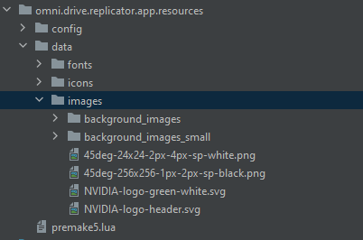

# Overview

Utilities to help to build Flux Widget(s)

## Implementation

This extension uses resources (icons, images, fonts, etc etc).
You need to set the setting `/exts/omni.flux.utils.widget/default_resources_ext` in your app, to let the module
find the resources.

Example:
```toml
[settings.exts."omni.flux.utils.widget"]
default_resources_ext = "omni.flux.app.resources"
```

Keep in mind that in your .kit file, your resource extension should starts first. Like:
```toml
"omni.flux.app.resources" = {order = -1000}  # should start first because of "default_resources_ext"
```

Your resource extension should have this type of architecture:




`data/fonts`

`data/icons`

`data/images`

`data/images/background_images`
