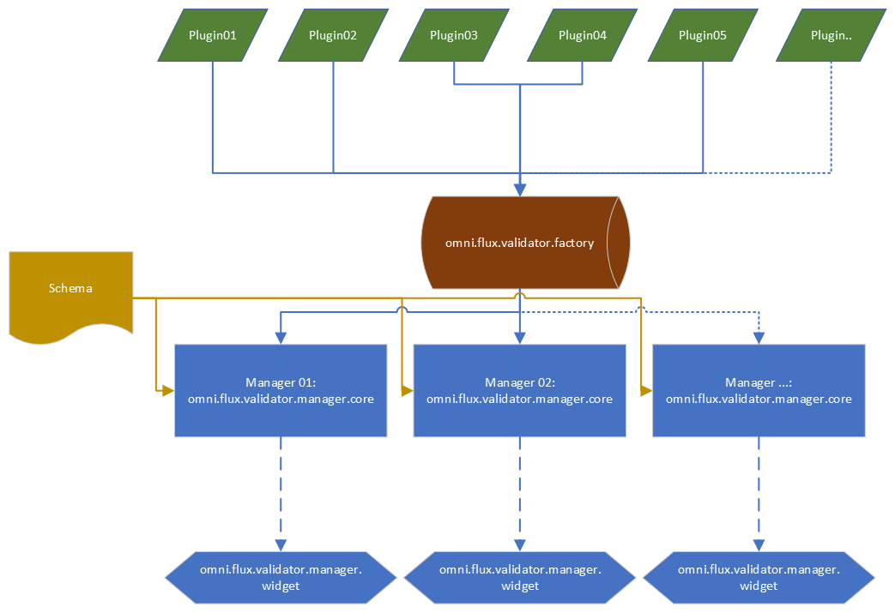

# Overview

Flux Validator is a framework that lets validate any type of data.

The framework uses a schema, plugins (leveraging the Kit dependency system), a factory, a manager and a widget:



## Plugins

There are 4 types of plugins:
- context
- selector
- check
- resultor (optional)

Each type of plugin has an "interface" (from `omni.flux.validator.factory`) that you can use to create/implement your plugin.

`omni.flux.validator.factory` is also used to register your plugin(s).

Each plugin will get some data from the [schema](#schema)

Each plugin can have a custom UI (to expose anything you want, to give an UI for the user to play with, etc etc).

Each plugin can "push" data using [DataFlow](#dataflow)

### Context plugin

A context plugin is a plugin that will setup the context of your validation.
Here 2 examples:
1. For example in Kit, you can have a context plugin that open a USD stage, or a context plugin that will use the current opened stage.
2. You can have a context that will define a working directory on a file system.

There are 2 types of context:
- the global context
- context by check plugin

The manager will set the context, and the context will run the validation process.

For context by check plugin, each context will run the check process.

A context plugin will do 2 things:
- check
- set
- exit

"Check" will check if your context can be setted up. For our first example, it will check if the USD file that you want to open exists.
For our second example, it will check if the working directory exists.

"Set" will set the context. For our first example, it will open the stage. For our second example it will `cd` into the working directory that we want.
"Set" needs to run the callback `await run_callback()` to run the check (inside the context itself).

"Exit" will exit the context. For example, if you need to save an USD stage on exit.

We can use the `Data` to read the folder path from the schema.

Here an implementation for the example 2:
Imagine a [schema](#schema) with a context plugin like this:
```python
{
    "context_plugin": {"name": "WorkingFolder", "data": {"folder_path": "C:\\Windows"}},
}
```

Here we will use the context plugin `WorkingFolder`. `WorkingFolder` needs the data `folder_path`, meaning it will check and set `folder_path` as working directory.

Implementation of the context plugin for the example 2:
```python
"""
* SPDX-FileCopyrightText: Copyright (c) 2024 NVIDIA CORPORATION & AFFILIATES. All rights reserved.
* SPDX-License-Identifier: Apache-2.0
*
* Licensed under the Apache License, Version 2.0 (the "License");
* you may not use this file except in compliance with the License.
* You may obtain a copy of the License at
*
* https://www.apache.org/licenses/LICENSE-2.0
*
* Unless required by applicable law or agreed to in writing, software
* distributed under the License is distributed on an "AS IS" BASIS,
* WITHOUT WARRANTIES OR CONDITIONS OF ANY KIND, either express or implied.
* See the License for the specific language governing permissions and
* limitations under the License.
"""
from typing import Any, Tuple
import os
import pathlib

import omni.usd
from omni.flux.validator.factory import ContextBase as _ContextBase


class WorkingFolderContext(_ContextBase):
    class Data(_ContextBase.Data):
        folder_path: str

    name = "WorkingFolder"   # the name of the plugin that we define in the schema
    tooltip = "This plugin will set the windows folder as working directory"
    data_type = Data  # schema for the data to use from 5 lines above

    @omni.usd.handle_exception
    async def _check(self, schema_data: Data) -> Tuple[bool, str]:
        """
        Function that will be called to execute the data.

        Args:
            schema_data: the USD file path to check

        Returns: True if the check passed, False if not
        """
        result = pathlib.Path(schema_data.folder_path).exists()
        return result, f"'{schema_data.folder_path}' exits!"

    async def _setup(self, schema_data: Data) -> Tuple[bool, str, Any]:
        """
        Function that will be executed to set the data. Here we will open the file path and give the stage

        Args:
            schema_data: the data that we should set. Same data than check()

        Returns: True if ok + message + data that need to be passed into another plugin
        """
        os.chdir(schema_data.folder_path)
        return True, f"'{schema_data.folder_path}' was set as current directory", schema_data.folder_path

    async def _on_exit(self, schema_data: Data) -> Tuple[bool, str]:
        """
        Function that will be called to after the check of the data. For example, save the input USD stage

        Args:
            schema_data: the data that should be checked

        Returns:
            bool: True if the on exit passed, False if not.
            str: the message you want to show, like "Succeeded to exit this context"
        """
        return True, "Exit ok"

    @omni.usd.handle_exception
    async def _build_ui(self, schema_data: Any) -> Any:
        """
        Build the UI for the plugin
        """
        pass
```

#### Flow
The core will run the context plugin first.

### Selector plugin

A selector plugin is a plugin that will select your data from your context.

A selector plugin is a plugin that a [check](#check-plugin) plugin will use.
You can have multiple selector plugin(s) "chained".

Here 2 examples:
1. For example in Kit, you can have a selector plugin that will select prim(s) in the stage, and chained selector plugin that will select a specific attribute for each prim.
2. You can have a selector plugin that will select/list all folders in the current working directory.

A selector plugin will do 1 thing:
- select

"Select" will select the data your need for the validation part that the [check](#check-plugin) need. For our first example, it will select all prims from the stage, and the second selector plugin will select the attribute "rotateX".
For our second example, it will list all folders from the current working directory.

Here an implementation for the example 2:
Imagine a [schema](#schema) with a selector plugin like this:
```python
{
    "context_plugin": {"name": "WorkingFolder", "data": {"folder_path": "C:\\Windows"}},
    "check_plugins": [
        {
            "name": "Example",
            "selector_plugins": [{"name": "GetAllFolders", "data": {}}],  # we set the selector plugin GetAllFolders to the check plugin Example
            "data": {},
            "context_plugin": {"name": "Nothing", "data": {}},
        },
    ],
}
```

Here we will use the context plugin `WorkingFolder`. `WorkingFolder` needs the data `folder_path`, meaning it will check and set `folder_path` as working directory.

Implementation of the context plugin for the example 2:
```python
"""
* SPDX-FileCopyrightText: Copyright (c) 2024 NVIDIA CORPORATION & AFFILIATES. All rights reserved.
* SPDX-License-Identifier: Apache-2.0
*
* Licensed under the Apache License, Version 2.0 (the "License");
* you may not use this file except in compliance with the License.
* You may obtain a copy of the License at
*
* https://www.apache.org/licenses/LICENSE-2.0
*
* Unless required by applicable law or agreed to in writing, software
* distributed under the License is distributed on an "AS IS" BASIS,
* WITHOUT WARRANTIES OR CONDITIONS OF ANY KIND, either express or implied.
* See the License for the specific language governing permissions and
* limitations under the License.
"""
import pathlib
from typing import Any, Tuple

import omni.usd
from omni.flux.validator.factory import SelectorBase as _SelectorBase
from omni.flux.validator.factory import SetupDataTypeVar as _SetupDataTypeVar


class GetAllFolders(_SelectorBase):
    class Data(_SelectorBase.Data):
        pass

    name = "GetAllFolders"
    tooltip = "This plugin will get all folder(s) from the current context"
    data_type = Data

    @omni.usd.handle_exception
    async def _select(
        self, schema_data: Data, context_plugin_data: _SetupDataTypeVar, selector_plugin_data: Any
    ) -> Tuple[bool, str, Any]:
        """
        Function that will be executed to select the data

        Args:
            schema_data: the data from the schema.
            context_plugin_data: the data from the context plugin
            selector_plugin_data: the data from the previous selector plugin

        Returns: True if ok + message + the selected data
        """
        # context_plugin_data is the data that the context plugin WorkingFolder returned
        # in our example: 'C:\\Windows'
        # from this folder will grab all sub folders
        return True, "Ok", [path.name for path in pathlib.Path(context_plugin_data).iterdir()]

    @omni.usd.handle_exception
    async def _build_ui(self, schema_data: Data) -> Any:
        """
        Build the UI for the plugin
        """
        pass
```

### Check plugin

A check plugin is a plugin that will check and (optional) auto fix your data. This is the validation part.
Here 2 examples:
1. For example in Kit, you can have a check plugin that will check if we have at least 1 prim in the stage
2. You can a check plugin that will check if a folder exist in the current working directory from the list of the selector.

A check plugin will do 2 things:
- check
- fix (optional)

"Check" will check your data (validation). For our first example, it will check the data from the selector plugin(s) and see if the resulting list is empty or not.
For our second example, it will check if the sub folder exists.

"Fix" will try to fix the validation is needed. For example for the example 1., the auto fix would create 1 prim in the stage.
For the example 2., it would create the sub folder.

A check plugin has some options by default in the schema to stop/pause the validation: `stop_if_fix_failed` or `pause_if_fix_failed`.
Please check the schema of check plugin to see all options.

Here an implementation for the example 2:
Imagine a [schema](#schema) with a context plugin like this:
```python
{
    "context_plugin": {"name": "WorkingFolder", "data": {"folder_path": "C:\\Windows"}},
    "check_plugins": [
        {
            "name": "SubFolderExist",
            "selector_plugins": [{"name": "GetAllFolders", "data": {}}],
            "data": {"sub_folder_name": "hello"},
            "context_plugin": {"name": "Nothing", "data": {}},
        },
    ],
}
```

Here, we will set `C:\\Windows` as working directory, run the selector that will list all folders from `C:\\Windows`, run the check plugin that checks if the sub folder `hello` exists.

Implementation of the check plugin for the example 2:

```python
"""
* SPDX-FileCopyrightText: Copyright (c) 2024 NVIDIA CORPORATION & AFFILIATES. All rights reserved.
* SPDX-License-Identifier: Apache-2.0
*
* Licensed under the Apache License, Version 2.0 (the "License");
* you may not use this file except in compliance with the License.
* You may obtain a copy of the License at
*
* https://www.apache.org/licenses/LICENSE-2.0
*
* Unless required by applicable law or agreed to in writing, software
* distributed under the License is distributed on an "AS IS" BASIS,
* WITHOUT WARRANTIES OR CONDITIONS OF ANY KIND, either express or implied.
* See the License for the specific language governing permissions and
* limitations under the License.
"""
import pathlib
from typing import Any, Tuple

import omni.usd
from omni.flux.validator.factory import CheckBase as _CheckBase
from omni.flux.validator.factory import SetupDataTypeVar as _SetupDataTypeVar


class SubFolderExist(_CheckBase):
    class Data(_CheckBase.Data):
        sub_folder_name: str

    name = "SubFolderExist"
    tooltip = "This plugin will check if a sub folder 'folder_name' from the data exists in the Windows folder. If not, it will create it."
    data_type = Data

    @omni.usd.handle_exception
    async def _check(
        self, schema_data: Data, context_plugin_data: _SetupDataTypeVar, selector_plugin_data: Any
    ) -> Tuple[bool, str, Any]:
        """
        Function that will be executed to check the data

        Args:
            schema_data: the data from the schema.
            context_plugin_data: the data from the context plugin
            selector_plugin_data: the data from the selector plugin

        Returns: True if the check passed, False if not
        """
        result = schema_data.sub_folder_name in selector_plugin_data
        return result, "Great" if result else "Not found", schema_data.sub_folder_name

    @omni.usd.handle_exception
    async def _fix(
        self, schema_data: Data, context_plugin_data: _SetupDataTypeVar, selector_plugin_data: Any
    ) -> Tuple[bool, str, Any]:
        """
        Function that will be executed to fix the data

        Args:
            schema_data: the data from the schema.
            context_plugin_data: the data from the context plugin
            selector_plugin_data: the data from the selector plugin

        Returns: True if the data where fixed, False if not
        """
        pathlib.Path(context_plugin_data).joinpath(schema_data.sub_folder_name).mkdir()
        return True, "Created", True

    @omni.usd.handle_exception
    async def _build_ui(self, schema_data: Data) -> Any:
        """
        Build the UI for the plugin
        """
        pass
```

### Resultor plugin

A resultor plugin is a plugin that will do what ever you want with the result of the validation.
Here 2 examples:
1. You can write the result into a json file
2. You can send the result into a web page

You can have multiple resultor plugins!

Here an implementation for the example 1:
Imagine a [schema](#schema) with a context plugin like this:
```python
{
    "context_plugin": {"name": "WorkingFolder", "data": {"folder_path": "C:\\Windows"}},
    "check_plugins": [
        {
            "name": "SubFolderExist",
            "selector_plugins": [{"name": "GetAllFolders", "data": {}}],
            "data": {"sub_folder_name": "hello"},
            "context_plugin": {"name": "Nothing", "data": {}},
        },
    ],
    # resultor plugin here
    "resultor_plugins": [{"name": "ToJson", "data": {"json_path": "C:\\result.json"}}],
}
```

Here, at the end of the validation, it will grab the result of the validation and write it into a json file here `C:\\result.json`.

Keep in mind that the result of the validation is inside the [schema](#schema) itself.

Implementation of the check plugin for the example 1:

```python
"""
* SPDX-FileCopyrightText: Copyright (c) 2024 NVIDIA CORPORATION & AFFILIATES. All rights reserved.
* SPDX-License-Identifier: Apache-2.0
*
* Licensed under the Apache License, Version 2.0 (the "License");
* you may not use this file except in compliance with the License.
* You may obtain a copy of the License at
*
* https://www.apache.org/licenses/LICENSE-2.0
*
* Unless required by applicable law or agreed to in writing, software
* distributed under the License is distributed on an "AS IS" BASIS,
* WITHOUT WARRANTIES OR CONDITIONS OF ANY KIND, either express or implied.
* See the License for the specific language governing permissions and
* limitations under the License.
"""
from typing import Any, Tuple
import json

import omni.client
import omni.ui as ui
import omni.usd
from omni.flux.validator.factory import ResultorBase as _ResultorBase
from pydantic import BaseModel, validator


class ToJson(_ResultorBase):
    class Data(_ResultorBase.Data):
        json_path: str

        @validator("json_path", allow_reuse=True)
        def json_path_empty(cls, v):  # noqa
            if not v.strip():
                raise ValueError("Path is empty")
            return v

    name = "ToJson"
    tooltip = "This plugin will write the result of the schema into a json file"
    data_type = Data

    @omni.usd.handle_exception
    async def _result(self, schema_data: Data, schema: BaseModel) -> Tuple[bool, str]:
        """
        Function that will be called to work on the result

        Args:
            schema_data: the data from the schema.
            schema: the whole schema ran by the manager

        Returns: True if ok + message
        """

        result = await omni.client.write_file_async(schema_data.json_path, json.dumps(schema.dict(), indent=4).encode('utf-8'))
        if result != omni.client.Result.OK:
            return False, f"Failed to write file {schema_data.json_path}"
        return True, f"Result written in {schema_data.json_path}, Ok"

    @omni.usd.handle_exception
    async def _build_ui(self, schema_data: Data) -> Any:
        """
        Build the UI for the plugin
        """
        ui.Label("None")
```

#### Flow
The plugin(s) will be run at the end of the validation (after the last checker plugin) one by one.


## Schema
A schema will define what plugins you want to use to do your validation.
It will define:
- the context plugin
- the selector plugin(s) for each check plugin(s)
- the check plugin(s)
- the resultor plugin(s)

From our example:
```python
{
    "context_plugin": {"name": "WorkingFolder", "data": {"folder_path": "C:\\Windows"}},
    "check_plugins": [
        {
            "name": "SubFolderExist",
            "selector_plugins": [{"name": "GetAllFolders", "data": {}}],
            "data": {"sub_folder_name": "hello"},
            "context_plugin": {"name": "Nothing", "data": {}},
        },
    ],
    "resultor_plugins": [{"name": "ToJson", "data": {"json_path": "C:\\result.json"}}],
}
```

Here it will use the context plugin `WorkingFolder`, that will set the working directory to `C:\\Windows`.

After, it will run the check plugin `SubFolderExist`. But first, the check plugin will run the selector plugin `GetAllFolders`.

`GetAllFolders` will get all the folder(s) from the current context that was set (`C:\\Windows`), it will pass the result to the check plugin `SubFolderExist`.

`SubFolderExist` will check is the folder `hello` exists in the list that the selector plugin `GetAllFolders` gave. If not, it will create the folder in the context (`C:\\Windows`).

So at the end we would have `C:\\Windows\\hello` folder.

To finish, it will write the current updated schema (with the results inside) into a json file `C:\\result.json`

## DataFlow

`DataFlow` are used to push/save any data into the schema. Those data can be used at any stage of the process.

Each plugin is responsible for the implementation of how they want to push the data into a `DataFlow` component.

First, we need to implement our `DataFlow` component. For this, we need to use the base `DataFlow` class from `omni.flux.validator.factory`
and define the name of the `DataFlow`, and other data we want to push/set.

Example:
```python
from typing import List, Optional

from .base_data_flow import DataFlow as _DataFlow


class OutDataFlow(_DataFlow):
    name: str = "OutData"
    output_data: Optional[List[str]] = None
    push_output_data: bool = False
```

Here we created a `DataFlow` component called `OutData`.

`OutData` will take `output_data`.

`output_data` will be pushed only if `push_output_data` is True.

That's it.

Now any plugin that want to use this `DataFlow` will need to implement it into the plugin.

First, the plugin will need to declare what compatible `DataFlow` that can be used, using the attribute `_compatible_data_flow_names`.

After, the plugin can define the typing of `data_flows` to be sure that we are getting the good `DataFlow` component.

Finally, the plugin can implement the `DataFlow`.

Example:

```python
"""
* SPDX-FileCopyrightText: Copyright (c) 2024 NVIDIA CORPORATION & AFFILIATES. All rights reserved.
* SPDX-License-Identifier: Apache-2.0
*
* Licensed under the Apache License, Version 2.0 (the "License");
* you may not use this file except in compliance with the License.
* You may obtain a copy of the License at
*
* https://www.apache.org/licenses/LICENSE-2.0
*
* Unless required by applicable law or agreed to in writing, software
* distributed under the License is distributed on an "AS IS" BASIS,
* WITHOUT WARRANTIES OR CONDITIONS OF ANY KIND, either express or implied.
* See the License for the specific language governing permissions and
* limitations under the License.
"""
import pathlib
from typing import Any, List, Optional, Tuple

import omni.usd
from omni.flux.validator.factory import CheckBase as _CheckBase
from omni.flux.validator.factory import OutDataFlow as _OutDataFlow
from omni.flux.validator.factory import SetupDataTypeVar as _SetupDataTypeVar


class SubFolderExist(_CheckBase):
    class Data(_CheckBase.Data):
        sub_folder_name: str

        _compatible_data_flow_names = ["OutData"]  # <------------- here
        data_flows: Optional[List[_OutDataFlow]] = None  # <------------- here

    name = "SubFolderExist"
    tooltip = "This plugin will check if a sub folder 'folder_name' from the data exists in the Windows folder. If not, it will create it."
    data_type = Data

    @omni.usd.handle_exception
    async def _check(
        self, schema_data: Data, context_plugin_data: _SetupDataTypeVar, selector_plugin_data: Any
    ) -> Tuple[bool, str, Any]:
        """
        Function that will be executed to check the data

        Args:
            schema_data: the data from the schema.
            context_plugin_data: the data from the context plugin
            selector_plugin_data: the data from the selector plugin

        Returns: True if the check passed, False if not
        """
        result = schema_data.sub_folder_name in selector_plugin_data

        # Implementation of the data flow InOutData
        for i_data_flow, data_flow in enumerate(schema_data.data_flows or []):
            if data_flow.name == "OutData" and data_flow.push_output_data:
                in_out_data_flow = _OutDataFlow(
                    output_data=[str(pathlib.Path(context_plugin_data).joinpath(schema_data.sub_folder_name))],
                    push_output_data=data_flow.push_output_data
                )
                schema_data.data_flows = [in_out_data_flow]

        return result, "Great" if result else "Not found", schema_data.sub_folder_name

    @omni.usd.handle_exception
    async def _fix(
        self, schema_data: Data, context_plugin_data: _SetupDataTypeVar, selector_plugin_data: Any
    ) -> Tuple[bool, str, Any]:
        """
        Function that will be executed to fix the data

        Args:
            schema_data: the data from the schema.
            context_plugin_data: the data from the context plugin
            selector_plugin_data: the data from the selector plugin

        Returns: True if the data where fixed, False if not
        """
        pathlib.Path(context_plugin_data).joinpath(schema_data.sub_folder_name).mkdir()
        return True, "Created", True

    @omni.usd.handle_exception
    async def _build_ui(self, schema_data: Data) -> Any:
        """
        Build the UI for the plugin
        """
        pass
```

A schema with one check plugin like that:

```json
{
    "name": "SubFolderExist",
    "selector_plugins": [{"name": "GetAllFolders", "data": {}}],
    "data": {"sub_folder_name": "hello", "data_flows": [{"name": "InOutData", "push_output_data": true}]},
    "context_plugin": {"name": "Nothing", "data": {}},
}
```

Here we can see that we pushed the output sub folder data.

At the end, this data can be read anywhere in the process like `schema.check_plugins[0].data.data_flows[0].output_data`


### Read the result

There are multiple ways to read the results:
- each plugin has some subscription(s). For example selector plugin(s) has `subscribe_select`. Please read the API.
- the schema that we give to the core will contain the result. For example selector plugin(s) has `last_select_result` and `last_select_message`. Please read the API.
```python
 'selector_plugins': [
    {'data': {'last_select_message': 'Ok',
              'last_select_result': True},
     'name': 'GetAllFolders'}
 ],
```
- we can run the process with `print_result=True`. The [CLI](#cli) does that. Please read the API.
- we can run the process with a resultor plugin. Please read the API.

## CLI
**In the extension** (not in the root of the app), there is a `bin` directory that you can use to run a CLI:
- `cli.bat`
- `cli.sh`

Please do `cli.bat -h` to see the help.
