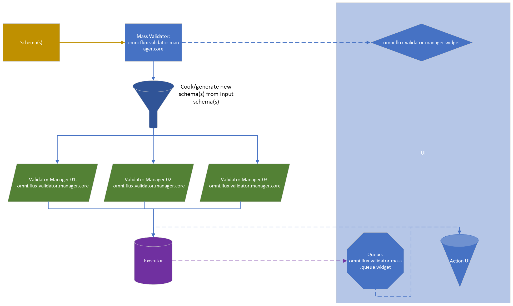

# Overview

Flux Mass Validator is a framework that lets you run and manage multiple validator(s).



## How does it work

The Mass Validator will take Validation schema(s) as inputs.
Plugin(s) from the schema(s) can "cook" the input template(s). It means that
any plugin can modify the current input schema(s) or generate new schema from those input schema(s).

After, the Mass Validation will run (execute) those schema(s) using an executor (for now we run everything locally).

We provide a widget with the Mass Validation. The widget lets us:
- see any UI that a plugin want to expose/promote
- see the queue of validation that are executed
- run "action" for each validation

## Cook

To have a plugin that will "cook" your input schema(s) you would need to enable the key
`cook_mass_template`.

Example:
```json
{
  "context_plugin": {
    "name": "AssetImporter",
    "data": {
      "context_name": "ingestcraft",
      "input_files": [],
      "output_directory": "",
      "cook_mass_template": true // <---------- here
    }
  }
}
```

Doing this, the core of the Mass Validation will execute the function `_mass_cook_template()` that the plugin implemented.

Example:
```python
@omni.usd.handle_exception
async def _mass_cook_template(self, schema_data_template: Data) -> Tuple[bool, Optional[str], List[Data]]:
    """
    Take a template as an input and the (previous) result, and edit the result for mass processing.
    Here, for each file input, we generate a list of schema

    Args:
        schema_data_template: the data of the plugin from the schema

    Returns:
        Anything from the implementation
    """
    result = []
    for file in schema_data_template.input_files:
        schema = self.Data(**schema_data_template.model_dump(serialize_as_any=True))
        schema.input_files = [str(file.path)]
        result.append(schema)
    return True, None, result
```

As we can see here, the implementation takes the input schema (Data) and return a list of schemas (list of data).
Here the plugin just split the schema to multiple schemas depending on the attribute `input_files`.

Because we can return multiple schemas, it means that for example, if I have 2 plugins that cooks the input schema, and each plugin return 3 schemas, we
would have 9 schemas at the end. 9 schemas that would be executed.

## Job name

When the Mass core will execute a job, you will want to set a name for your job (and the queue will show the list of jobs with the name(s)).
The job name is the name of the schema.

You can do that during the "cooking". Any plugin can set the name of the schema changing the value of `display_name_mass_template`.

Example:
```python
@omni.usd.handle_exception
async def _mass_cook_template(self, schema_data_template: Data) -> Tuple[bool, Optional[str], List[Data]]:
    """
    Take a template as an input and the (previous) result, and edit the result for mass processing.
    Here, for each file input, we generate a list of schema

    Args:
        schema_data_template: the data of the plugin from the schema

    Returns:
        Anything from the implementation
    """
    result = []
    for file in schema_data_template.input_files:
        schema = self.Data(**schema_data_template.model_dump(serialize_as_any=True))
        schema.input_files = [str(file.path)]
        schema.display_name_mass_template = str(file.path.stem)  # <-- here
        result.append(schema)
    return True, None, result
```

What will happen here is that because the plugin set a value on `display_name_mass_template`, `display_name_mass_template` will become the name of the schema:

```json
{
  "name": "Model(s)", // <---- here
  "context_plugin": {
    // ....
  }
}
```

will become:
```json
{
  "name": "The value of display_name_mass_template", // <---- here
  "context_plugin": {
    // ....
  }
}
```

The Mass queue will use the schema name as job name.

Setting `display_name_mass_template_tooltip` will set the tooltip on the label in the queue.


## Expose UI

Each plugin can "promote" an UI to the Mass Validation widget.

To do that, you would need to enable the key `expose_mass_ui` of the plugin.

Example:
```json
{
  "context_plugin": {
    "name": "AssetImporter",
    "data": {
      "context_name": "ingestcraft",
      "input_files": [],
      "output_directory": "",
      "expose_mass_ui": true // <---------- here
    }
  }
}
```

Doing that, the widget of the Mass Validation will execute the function `_mass_build_ui()` of the plugin.

Implementation example:
```python
@omni.usd.handle_exception
async def _mass_build_ui(self, schema_data: Data) -> Any:
    """
    Build the mass UI of a plugin. A mass UI is a UI that will expose some UI for mass processing. Mass processing
    will call multiple validation core. So this UI exposes controllers that will be passed to each schema.

    Args:
        schema_data: the data of the plugin from the schema

    Returns:
        Anything from the implementation
    """

    def example():
        schema_data.input_files.append("random_file.usd")

    ui.Button("Hello", clicked_fn=example)
```

For example here, it will expose a button into the Mass Validation UI.
Each time the user click on it, it will append a random file into the `input_files` attribute of the plugin.

## Action UI

Action UI are UI widget exposed into the queue of the Mass Validation UI.


Action UI are implemented into any plugin. Enable the key `expose_mass_queue_action_ui`.

Example:
```json
{
  "context_plugin": {
    "name": "AssetImporter",
    "data": {
      "context_name": "ingestcraft",
      "input_files": [],
      "output_directory": "",
      "expose_mass_queue_action_ui": true // <---------- here
    }
  }
}
```

Doing this will execute the function `_mass_build_queue_action_ui()` implemented in the plugin.

Example:
```python
def _mass_build_queue_action_ui(
    self, schema_data: Data, default_actions: List[Callable[[], Any]], callback: Callable[[str], Any]
) -> None:
    """
    Default exposed action for Mass validation. The UI will be built into the delegate of the mass queue.
    For example, you can add a button to open the asset into a USD viewport
    """

    def __print_file():
        # for mass ingestion, we only has 1 file
        file_path = self.__output_files[str(schema_data.input_files[0])]
        print(file_path)
        callback("print_input_file")

    # for mass, we only have one input.
    with ui.VStack(width=ui.Pixel(28), height=ui.Pixel(28)):
        ui.Spacer(height=ui.Pixel(2))
        with ui.ZStack():
            ui.Rectangle(name="BackgroundWithWhiteBorder")
            with ui.HStack():
                ui.Spacer(width=ui.Pixel(2))
                ui.Image(
                    "",
                    name="ShowInViewport",
                    tooltip="Show in viewport",
                    mouse_pressed_fn=lambda x, y, b, m: __print_file(),
                    width=ui.Pixel(24),
                    height=ui.Pixel(24),
                )
                ui.Spacer(width=ui.Pixel(2))
        ui.Spacer(height=ui.Pixel(2))
```

This example will add a button that will print the first `input_files`.

As we can see, we also call `callback()`. This is called to send an event called `print_input_file` to anything that subscribe
to the Mass action event(s).

## CLI
**In the extension** (not in the root of the app), there is a `bin` directory that you can use to run a CLI:
- `cli.bat`
- `cli.sh`

Please do `cli.bat -h` to see the help.
