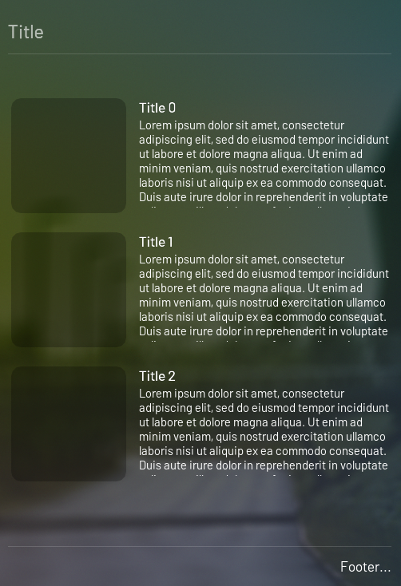

# Overview

This is the widget that let you create welcome pads

## Usage

```python
from omni.flux.welcome_pad.widget import WelcomePadWidget
pads = WelcomePadWidget(
    model = None,
    show_footer = True,
    footer = None,
    footer_callback = None,
    title = None
)
```

## Implementation

You can pass a model that will feed your pad.
To do this, first you need to create some item(s) like this:

```python
from omni.flux.welcome_pad.widget.model import Item


class MyItem(Item):
    """Item of the model"""
    def __init__(self, idt):
        super().__init__()
        self._idt = idt

    def get_image(self) -> str:
        """Image that will be showed on the left"""
        return "/path/image.png"

    def on_mouse_pressed(self):
        """Action that will be called when the item is clicked on"""
        print("Mouse pressed")

    @property
    def title(self):
        """Title of the item that will be shown"""
        return "Title " + self._idt

    @property
    def description(self):
        """Description of the item that will be shown"""
        return (
            "Lorem ipsum dolor sit amet, consectetur adipiscing elit, sed do eiusmod tempor incididunt "
            "ut labore et dolore magna aliqua. Ut enim ad minim veniam, quis nostrud exercitation ullamco "
            "laboris nisi ut aliquip ex ea commodo consequat. Duis aute irure dolor in reprehenderit in voluptate "
            "velit esse cillum dolore eu fugiat nulla pariatur. Excepteur sint occaecat cupidatat non proident, "
            "sunt in culpa qui officia deserunt mollit anim id est laborum." + self._idt
        )
```

After, you have to pass those item(s) into your model:

```python
from omni.flux.welcome_pad.widget.model import Model as WelcomePadModel
model = WelcomePadModel()
model.add_items(
    [MyItem("0"), MyItem("1"), MyItem("2")]
)
```

From here, you can pass your model to the widget:
```python
from omni.flux.welcome_pad.widget import WelcomePadWidget
pads = WelcomePadWidget(model=model)
```

Result:


